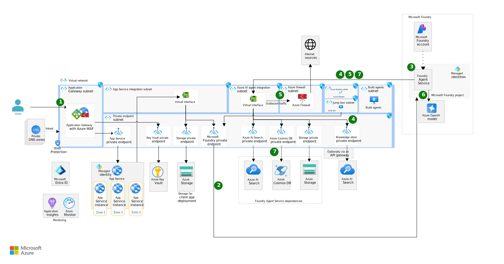
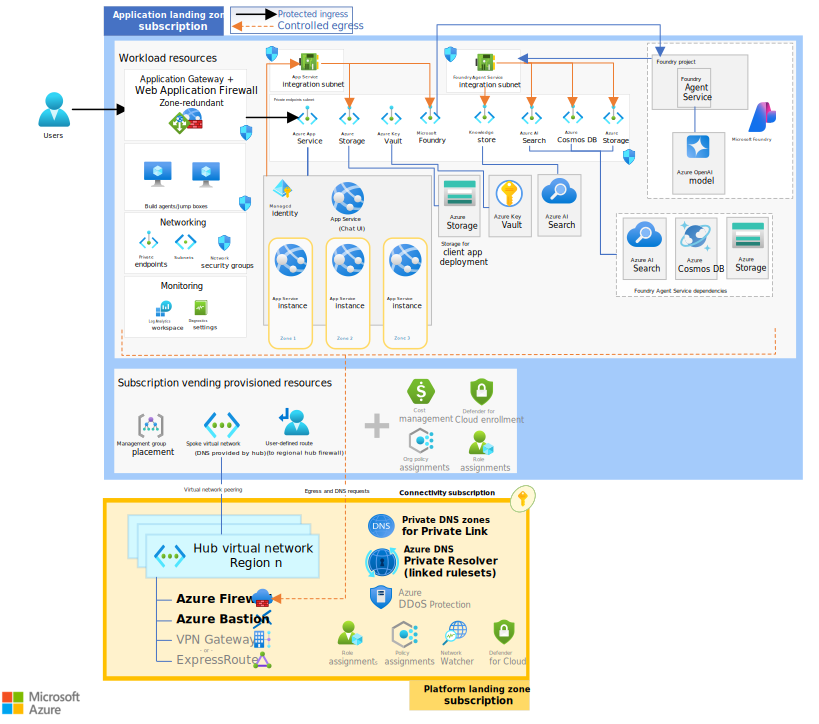

# Azure architecture pattern for AI workloads

This article provides architectural patterns and baseline reference architectures to help you design, deploy, and govern AI workloads on Azure. It covers the core components, interactions, and best practices for building secure, scalable, and well-governed AI systems.

Use this architecture pattern as a baseline when designing AI workloads. Start with the core components and interactions shown in the pattern, then adapt them to match your business goals, technical constraints, and risk posture.

For example, an organization might build an enterprise AI assistant that lets employees ask natural language questions about internal documents and operational data. Internal content is cleaned, enriched, and indexed so the assistant can retrieve trusted, up-to-date context. When a user asks a question, the application figures out what data is needed, retrieves relevant context, and calls the right model to generate a grounded response. Across the lifecycle, practices like responsible AI, testing, and safe deployment keep the assistant reliable, and underlying platform services enforce governance, security, and cost control.

While this AI assistant represents a specific business scenario, the architecture pattern that follows is generic enough to adapt to many AI use cases with similar characteristics.

## High-level AI workload architecture

This diagram shows the key components you could have in your AI workload design.

:::image type="content" source="./images/ai-workload-architecture-pattern.png" alt-text="Diagram of AI workload design with labeled components for AI practices and process, data processing and analytics, model training and fine-tuning, intelligent AI applications, and platform services and tools." lightbox="./images/ai-workload-architecture-pattern.png":::

|Component|Description|
|---|---|
|Data processing and analytics|Gather raw data from different sources, clean it, transform it, and organize it into datasets ready for model training, fine-tuning, and grounding. This layer doesn't interact with users directly but enables accurate, efficient AI interactions downstream.|
|Model training and fine-tuning|Train models on your data, track versions, and monitor performance through a repeatable process. Use MLOps practices to keep improving as new data comes in and maintain alignment with business needs.|
|Intelligent AI applications|This is where users interact with your AI. It combines pretrained models with application logic to find the right information, craft prompts, build interfaces, and learn from feedback.|
|AI practices and process|Keep your AI solution reliable by incorporating DevOps principles, version control, and automated pipelines into MLOps workflows. Deploy iteratively with safeguards, and continuously check for accuracy, performance, and bias.|
|Platform services and tools|Core cloud services that secure your resources, control costs, and monitor system health from development to deployment. Use CI/CD pipelines for reliable automation and specialized tools to scan AI outputs for compliance.|

## Workload breakdown

This section breaks down the architecture into two main workloads: the intelligent application workload and the training and fine-tuning workload. Each workload has its own design considerations for lifetime and state, reach and dependencies, scalability and availability, and security and responsible AI.

|Design characteristic|Description|
|---|---|
|Lifetime and state|**Lifetime** refers to the expected duration of a resource's existence and activeness within the workload.   **State** refers to the data or information that a resource maintains over time.|
|Reach and dependencies|**Reach** refers to the extent to which a resource needs to be accessible or distributed.   **Dependencies** refer to the relationships and reliance on other resources.|
|Scalability and availability|**Scalability** is the ability of a resource to handle increased load or demand.   **Availability** is the ability of a resource to remain operational and accessible.|
|Security and responsible AI|**Security** refers to the measures that protect data and ensure compliance with regulations.   **Responsible AI** refers to the practices that ensure ethical AI, including fairness, transparency, and accountability.|

### [**Intelligent application workload**](#tab/intelligentaiworkload)

This diagram shows the key components of the intelligent application workload to include in your design.

:::image type="content" source="./images/gen-ai-workload.png" alt-text="Diagram of intelligent application workload showing clients, intelligence layer, inferencing, knowledge, and tools components." lightbox="./images/gen-ai-workload.png":::

|Component|Description|
|---|---|
|Client layer|The client layer lets users and external systems connect with AI. This layer takes your requests and returns AI-generated responses, while making sure the experience is straightforward and easy to use.|
|Intelligence layer - API|The Intelligence layer API bridges clients and the intelligence features of the system through well-defined APIs. It's responsible for directing requests to the right agent or orchestration process, making sure interactions between users and services are smooth and consistent. This layer also handles how data is accessed, puts security measures in place, and sets limits to prevent the system from getting overloaded. If an app just needs a simple prediction, this layer can skip the complex orchestration steps and send the request directly to the inference engine for a fast response.|
|Intelligence layer - orchestration and agent compute|Orchestration and agent compute layer is responsible for coordinating how different AI components work together to get each task done. Depending on what's required, it can run tasks one after the other or let several agents work at the same time and then merge their results. It figures out user intent, checks responses to make sure they're safe, integrates with the knowledge layer for information, and uses tools to combine everything and give you the best answer.|
|Intelligence layer - conversation management|Conversation management layer is the system's memory and conversation manager. It lets the AI chat naturally by recalling previous messages, keeping track of ongoing topics, and storing important parts from the discussion, so conversations can flow smoothly even during long sessions. It also looks after how the conversation data is kept or deleted, ensuring your information is handled responsibly.|
|Inferencing layer - foundation or predictive models|Inferencing layer is where a trained model makes predictions, generates content, or provides decisions based on the information it receives. The process starts by loading your AI model, prepping the data, running the predictions, and then formatting the results so they're available immediately (real-time) or later on(batch processing).|
|Knowledge layer|Knowledge layer is where the system gets the information and context it needs to answer questions accurately. It makes sure data is accessed securely, using permissions and authorisation. The knowledge layer helps AI follow the RAG approach by searching through indexes or vector databases to find just the right content. It lets AI access various internal and external data sources in a consistent way, whether that's through MCP or REST protocols.|
|Tools layer|Tools layer is where business actions and external capabilities are made accessible. The intelligence layer can trigger these actions or connect with other systems by calling tools or agents in a standardised way, whether that's through MCP, A2A, or OpenAPI/REST. These capabilities are presented as actionable options, ready for the intelligence layer to use, and they might be handled directly by the workload or by external services.|

### Design considerations

When designing your intelligent application workload architecture, consider the following design characteristics to make informed decisions about component design and interactions.

#### Lifetime and state

The Intelligence API, orchestration, inference, and knowledge layers are all long-lived services that run for the lifetime of your workload. Invest in availability, monitoring, and operational excellence for each service. 

Each layer evolves at a different pace, so you need deliberate deployment coordination. The Intelligence API evolves slowly to stay stable and maintain backward compatibility. Orchestration and agent layers evolve more rapidly as you add new capabilities. The inference layer gets updated when you deploy new models. The knowledge layer evolves continuously as data changes.

Stateless components can be allocated or deallocated on demand, while stateful components manage data that persists across interactions. 

The Intelligence API, orchestration, and inference layers are stateless, which makes them easy to scale by adding more instances. The orchestration layer might hold ephemeral state during execution but doesn't persist it beyond request handling. Ephemeral state reduces operational complexity, but it limits failure recovery options, so design carefully for retries and idempotency. 

Conversation management session data can last from minutes to days. Longer sessions enable richer conversations but cost more and increase privacy risk. The knowledge layer stores data in indexes and databases that evolve as you add, update, or remove information.

> :::image type="icon" source="../_images/trade-off.svg"::: **Tradeoff.** Lifetime and state management decisions directly impact cost, reliability, and performance. Long‑lived, stateful components require greater investment in scaling and resilience, while stateless, ephemeral components are more cost‑effective but might introduce latency from cold starts or external state retrieval.

#### Reach and dependencies

The Intelligence API is the only publicly exposed endpoint in the architecture, everything else stays internal. You can deploy it in multiple regions to keep users close to an endpoint and improve resilience.

The orchestration layer sits at the center, operates within your network, and coordinates everything such as conversation state, model calls, knowledge retrieval, and tool invocation. Failures here block the entire system, so make it highly available. 

The inference layer runs internally without external dependencies. Deploy it close to the orchestrator to keep latency low. 

The knowledge and tools layers are internal but might depend on external systems. These external dependencies can introduce delays or availability issues that affect response quality.

> :::image type="icon" source="../_images/trade-off.svg"::: **Tradeoff.** Multiregion deployment improves performance and resilience but increases cost. Single-region deployment is more cost-effective but might result in higher latency for users far from the region.

#### Scalability and availability

Your intelligent application has two scaling patterns. Stateless layers like the API, orchestration, and inference scale by adding more instances. Data layers like conversation management and knowledge scale by spreading data across multiple stores through mechanisms like read replicas, partitioning, and sharding.

The Intelligence API scales out to handle more requests. Deploy it across multiple zones or regions for better availability and to keep users close to an endpoint.

Orchestration and agent compute sit at the center of your system, so failures here block everything. Add more instances, use load balancing, and have failover ready so the system keeps running when individual instances fail. 

The inference layer scales based on what your models need. Add more instances with GPUs as demand grows. Use infrastructure as code (IaC) to quickly recreate environments during recovery. 

Conversation management scales with the number of concurrent users. Use copies and backups to keep session data available. 

The knowledge layer scales based on how much data you have and how often it gets queried. Use efficient indexing and database tuning to keep responses fast. Set up copies in multiple locations for availability.

> :::image type="icon" source="../_images/trade-off.svg"::: **Tradeoff.** Stateless components can scale quickly but might introduce cold-start latency. Data components provide durability but require more planning for scaling. Balance these factors based on expected load and business requirements. 

#### Security and responsible AI 

Each layer in your intelligent application carries different risks and needs its own controls. Tools can trigger real-world actions, knowledge shapes what your AI knows, and inference produces outputs users see. Restrict access at every layer, monitor what's happening, and make sure you can explain how decisions get made.

The tools layer carries the highest risk because actions can have real-world consequences that are potentially irreversible. For high-risk operations, add human approval steps. Use strict authentication, least-privilege access, and data privacy enforcement to prevent unauthorized actions and PII exposure. Evaluate every tool before you integrate it so governance extends beyond your workload boundary.

The knowledge layer needs high-quality, unbiased data to produce trustworthy outputs. Keep data access secure with proper authentication, authorization, and compliance with data residency requirements. Read-only access and network isolation prevent corruption. Record which sources were retrieved for each response through audit trails, this process lets you explain decisions and investigate issues later. 

The inference layer should only be accessible to operations roles and the orchestration layer's identity. Monitor outputs through a validation service that checks for toxicity and other safety issues. Validate models before deployment to catch bias, and keep rollback mechanisms ready if problems show up in production.

### [**Training and fine-tuning workload**](#tab/trainingmodelworkload)

This diagram shows the key components of training and fine-tuning workload to include in your design.

:::image type="content" source="./images/model-training-workload.png" alt-text="Diagram of a machine learning workflow showing data sources, processing, model training, and inferencing steps." lightbox="./images/model-training-workload.png":::

|Component|Description|
|---|---|
|Data Sources|Data sources contain a wide range of data that help train and fine-tune the models. Typically, these sources include:   - Structured data from relational databases like SQL Server, which have clear schemas and relationships.   - Semi-structured data such as application logs and telemetry, often in JSON or XML formats.   - Unstructured data such as image files, videos, audio, and text documents like PDFs.   - Real-time streams from sensors, devices, or event sources.   Gather data from various sources such as proprietary sources owned by the organization, user-generated content from interactions, expert feedback and collaboration, and public sources like websites, research papers, and shared databases.|
|Data Aggregation Store|Think of a data aggregation store as the central hub for all the information you collect from various sources. It’s a place where your raw data is kept in its original form before any processing begins. Use tools like Azure Data Lake Storage or Microsoft Fabric for this kind of storage. As the data moves through different stages of processing, its structure gets refined, fields and columns are named consistently, values are checked for accuracy, and everything is organized to make reporting and analytics easier. You can always trace where the data came from, see what changes were made, and know which process transformed it. Versioning also ensures you have historical snapshots as your data evolves.|
|Data Processing Platform|At this stage, turn the raw data into a useful dataset for machine learning and analytics. The process starts by collecting data from multiple sources, cleaning, and enriching it, so you get high-quality datasets and features that are ready for model training and analysis. This layer supports ETL pipelines, follows a medallion architecture, and enables feature and data enrichment based on existing patterns. It typically uses tools such as  Azure Data Factory, Microsoft Fabric, and Spark.|
|Feature Store|A feature store is a central place for storing precomputed features, so teams can easily reuse them across different machine learning models. It keeps track of feature definitions, transformations, and metadata like ownership, update frequency, data sources, and versioning. This structure helps teams build models faster and ensures consistency, making model behavior more predictable. Azure Machine Learning's feature store also offers versioning and lineage, and organizations can choose to set it up centrally, in a distributed way, or as a hybrid.|
|Training Platform|A compute environment that you use to train and fine-tune machine learning models at scale. It lets you select algorithms to see which performs best, automatically tests different parameter values, manages retries and dependencies, and supports repeated training cycles for ongoing model improvement. It tracks every training run’s metrics, parameters, and artifacts. You can host the environment on Azure Machine Learning, Databricks, or Kubernetes.|
|Model Registry|A version-controlled repository that lets you store, manage, and track machine learning models as they progress from development to production. Tools like Azure Machine Learning Model Registry make this easy by keeping model binaries, metadata, training configurations, and lineage organized. You can compare different model versions and roll back to a previous one if required.|
|Inferencing Layer - Predictive Models|Use trained models to generate predictions or make decisions based on data. You can deploy them as real-time REST APIs for quick predictions or as batch endpoints for processing large datasets asynchronously. Besides client applications, models are also called during data processing such as to extract entities or sentiment for data enrichment, and to handle data normalization and transformation.|

### Design considerations

When you design your training and fine-tuning workload architecture, consider the following design characteristics to make informed decisions about component design and interactions.

#### Lifetime and state

Long-term persistent components enable historical analysis and model retraining on past data. Data aggregation store, feature store, and model registry are long-term, persistent stores that grow with new imports, features, and model versions.

Ephemeral components enable cost efficiency but require careful handling of failures and restarts. Data processing platform and training platform have a long-lived environment configuration, but their compute resources are ephemeral, created and scaled on demand for pipeline and training jobs. 

Inference layer is stateless and ephemeral. Deploy it on demand for occasional batch processing or as a long-running environment for frequent pipelines. The stateless design enables horizontal scaling and simple failure recovery. 

> :::image type="icon" source="../_images/trade-off.svg"::: **Tradeoff.** Long-term persistent components provide durability and historical context but require ongoing maintenance and storage costs. Ephemeral, stateless components are more cost-effective and scalable but require robust failure handling and might introduce latency from cold starts.

#### Reach and dependencies 

Keep your data stores, processing, training, and inference in the same region to minimize latency and cost. Only distribute when data residency requirements mandate it. Most components are internal only, which reduces your attack surface but requires secure access for developers and operators. 

You can distribute data sources across different environments and geographies. They're your core dependency for importing data needed for training, fine-tuning, or grounding.

The data aggregation store is the main dependency for the data processing platform, decoupling it from the data sources. 

The data processing platform accesses the feature store to store computed features, and the training platform accesses it during training. The inferencing component might also need read-only access depending on the type of model and specific requirements. 

The training platform depends on the feature store and aggregated data generated from processing. It writes trained models to the model registry, which becomes the dependency for inference.

The model registry is unique because it needs both internal access (for training to write models) and external access (for AI applications to deploy models to inference environments). Use push deployment models to minimize external reach of sensitive components.

#### Scalability and availability 

Your training components need to grow with your data and remain available when you need them. Data stores like the Data Aggregation Store, Feature Store, and Model Registry scale through partitioning, replication, and efficient indexing as more data, features, and models get added over time. Keep these components highly available with redundancy, backups, and failover strategies so your data and models are accessible whenever training platform or inference needs them.

Compute platforms like Data Processing and Training scale differently. They add more resources on demand as your processing and training jobs need them. Use IaC to automate environment recreation during disaster recovery, and add more compute resources like GPU nodes as demand increases.

Your inference layer typically handles batch processing in this context, so optimize it for throughput rather than low latency. You can scale horizontally with less expensive compute resources since you're processing large volumes of data without needing real-time responsiveness.

#### Security and responsible AI 

Address security and responsible AI at every layer. Use defense-in-depth with access controls, encryption, and auditing. Follow least privilege consistently: ETL gets read-only access to sources, training writes only to the model registry, and inference reads only. Map your data flows to keep regulated data in required regions, and track who accessed what, when, and why.

Data sources are your most important control point for bias prevention. Make sure your imported data represents all subject types fairly. If data can't leave its region, run your ETL pipeline there to maintain compliance.

Data aggregation store and feature store hold sensitive information. Control who can access which data subsets and follow data residency rules throughout the lifecycle. Track data lineage for every calculated attribute. It's your foundation for explainability and lets you trace model predictions back to source data.

Data processing platform is where you actively prevent bias. Restrict outbound connections to approved data stores and services. This is where you validate data quality, filter profanity, obfuscate sensitive information, and balance your data distribution by down-sampling overrepresented groups or augmenting underrepresented ones.

Training platform needs isolation to keep it separate from production. Log every training run by using frameworks like MLFlow, capturing what data was used, which hyperparameters you tried, and what the results were. Run bias, fairness, and explainability checks every time to catch problems before deployment.

Model registry is your governance gate. Use service principals and publish checksums so you can validate models. Attach metadata about training data, evaluations, and lineage to every model for transparency. Gate production deployment by using safety and responsible AI reviews.

Inference layer should only run approved models. Keep it isolated within your analytics environment and monitor all outputs for bias, toxicity, and other harmful patterns. 

---

## Baseline architectures for AI workloads
These baseline examples serve as the recommended architecture for AI workloads.

<ul class="columns is-multiline has-margin-left-none has-margin-bottom-none has-padding-top-medium">
    <li class="column is-one-third has-padding-top-small-mobile has-padding-bottom-small">
        <a class="is-undecorated is-full-height is-block" href="/azure/architecture/ai-ml/architecture/baseline-azure-ai-foundry-chat">
        <article class="card has-outline-hover is-relative is-fullheight">
            <figure class="image has-margin-right-none has-margin-left-none has-margin-top-none has-margin-bottom-none">
                
            </figure>
            

                

                  Baseline Microsoft Foundry chat reference architecture
                  
                      
                

                

                    
Use this architecture as a reference to build and deploy secure, scalable conversational AI solutions on Azure using Foundry, Azure OpenAI, and other related services. It emphasizes private networking, zone redundancy, and strict security controls to ensure compliance and enterprise readiness.

                

            

        </article>
        </a>
    </li>
    <li class="column is-one-third has-padding-top-small-mobile has-padding-bottom-small">
        <a class="is-undecorated is-full-height is-block" href="/azure/architecture/ai-ml/architecture/baseline-azure-ai-foundry-landing-zone">
        <article class="card has-outline-hover is-relative is-fullheight">
            <figure class="image has-margin-right-none has-margin-left-none has-margin-top-none has-margin-bottom-none">
                
            </figure>
            

                

                  Baseline Microsoft Foundry chat reference architecture in an Azure landing zone
                  
                      
                

                

                    
This architecture builds on the Microsoft Foundry Chat design and places it in a secure Azure landing zone. It brings together key components—Foundry Agent Service, Azure OpenAI, and App Service—inside a private, network-isolated environment. All services connect through private endpoints and are protected by Azure Firewall, with zone redundancy for high availability.

                

            

        </article>
        </a>
    </li>
    <li class="column is-one-third has-padding-top-small-mobile has-padding-bottom-small">
        <a class="is-undecorated is-full-height is-block" href="/azure/architecture/example-scenario/dataplate2e/data-platform-end-to-end">
        <article class="card has-outline-hover is-relative is-fullheight">
            <figure class="image has-margin-right-none has-margin-left-none has-margin-top-none has-margin-bottom-none">
                
            </figure>
            

                

                  Analytics end-to-end with Azure Synapse
                  
                      
                

                

                    
Use this architecture as reference when designing a unified data platform that streamlines full analytics lifecycle.

                

            

        </article>
        </a>
    </li>
</ul>

## Next step

Review the best practices for designing intelligent application scenarios.

> [!div class="nextstepaction"]
> [Application design](./application-design.md)