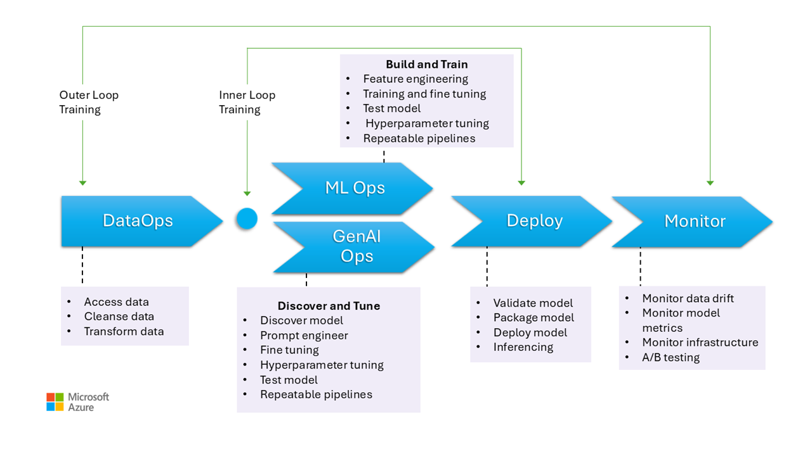

# MLOps and GenAIOps for AI workloads on Azure

AI workload operations are mainly centered around curation of data and consumption of that data. Operations ensure efficiency in achieving and maintaining the quality, reliability, security, ethical, and other standards that you prioritize for the workload. 

The workload tasks can be categorized into three main areas: application development, data handling, and AI model management. Each category should adopt industry-proven operational methodologies, such as **DevOps, DataOps, MLOps, and GenAIOps** practices.

DevOps activities cover the entire **application development lifecycle management** through automated CI/CD pipelines and monitoring. However, for AI workloads, data pipeline is one of the core components. DataOps, a specialization of DevOps, focuses on **managing the data lifecycle** by streamlining processes like data extraction, transformation, and loading (ETL/ELT). DataOps practitioners typically measure data flow performance, efficacy of data cleansing, and monitor the pipeline for anomalies. 

AI workloads are inherently non-deterministic. Many AI models are prone to producing different answers for the same inquiry during inference. These workloads need processes that can manage and adapt to the unpredictability of AI outputs. DataOps extends into MLOps, which **operationalizes machine learning workflows** for model training and testing. GenAIOps, a specialized subset of MLOps, targets generative AI solutions, involving tasks like **model discovery and refining pretrained models** with enriched data. 

Operational activities often overlap and vary in their level of involvement. For instance, in discriminative AI, DataOps play a major role, while DevOps activities are less prominent. Conversely, in generative AI, operational excellence relies more heavily on DevOps than DataOps.  

Regardless, the overall goal is capability delivery with efficient operations throughout the development lifecycle. The expected outcomes are:

- Repeatable processes with consistent results.
- Sustained accuracy of the models over time.
- Effective governance that minimize risks.
- Change management processes for adapting to model drifts.

Consider **automation and monitoring as your key operational strategy** to achieve those goals. 

You also need to **establish standardized processes for AI components**, whether it's for routine, ad hoc, and emergency operations, with proper tracking mechanism in place. Without those processes, you run the risk of:

- Repeated errors and non-reproducibility in data processing, model hosting, and grounding data management, and other tasks. 
- Low quality or stale data used for model training and refinement.
- Impacting end user confidence in the system, at worse, leading to legal, compliance, or security issues. 

Established processes must be implemented with the **right set of tools**. There are specialized tools available for managing AI/ML workflows across environments. 

This article focuses on the design strategy for operations and has recommendations on tooling choices.

## Workload operations lifecycle

This image illustrates the operational stages for AI models, including data gathering, cleaning to eliminate inconsistencies or errors, and transforming the data into an analyzable format. These stages are relevant for training both discriminative models and grounding data in generative models. However, the specific use case of training generative models is not depicted in this image and falls outside the scope of this article. 

Comparing MLOps to GenAIOps, the stages are similar. The main difference is that in the case of GenaAIOps, the focus shifts from training to selecting the right model, prompt engineering, and incorporating domain-specific knowledge through fine-tuning or implementing Retrieval Augmented Generation (RAG). 

Even other stages for deploying and monitoring are fairly similar.

The following sections describe the common operational practices covering every stage of the lifecycle from preproduction to production. 

#### DataOps

Data is aggregated from various production data sources, and then preprocessed to remove errors, inconsistencies, and handle missing values. Finally, it's transformed and normalized into a suitable format for training or enrichment purposes. The design aspects are described in the [Training data](./training-data-design.md) and [Grounding data](./grounding-data-design.md) articles.  

The data operations processes in this stage should be efficient because **handling large volumes of data** from multiple sources and complex data pipelines can be challenging. The approaches taken need to ensure that this phase **produces high quality data**. Monitor this stage to track progress towards the acceptable quality bar.
  
Also, data security should be ensured, given that this data from production. Make sure that lower environments, such as Dev/Test, are as secure as production to prevent any security issues.

> [!NOTE]
>   
> Address poor quality data by investing in extensive data cleaning during the initial phases. Take advantage of the well-known analytics patterns, such as medallion, data mesh, feature stores, to do upstream processing tasks. If the upstream phases are ineffective, quality must be improved in the downstream phases, leading to increased workload costs associated with data preparation at each stage.
>
> For information about data processing tasks, see these articles:
>   - [Data preprocessing for training data](./training-data-design.md#data-preprocessing)
>   - [Data preparion for grounding data](./grounding-data-design.md#data-preparation)

##### Tools

It's recommended that you standardize your workload's use of data orchestration tools. The tools should be able to provide a data pipeline that can group activities and has built-in automation.

[Azure Data Factory](/fabric/data-factory/data-factory-overview) pipeline can be an initial choice. It has the capability to connect and process many data sources with efficiency. You can also consider [Azure Synapse Analytics](/azure/synapse-analytics/overview-what-is) that combines big data and data warehousing, featuring Data Lake, Apache Spark, and Synapse T-SQL. It also integrates with Azure Data Factory for ETL capabilities.

For preparing training data, [Azure Maching Learning pipeline](/azure/machine-learning/concept-ml-pipelines) offers specialized features that can automate tasks such as data collection and processing. 

Certain open source software like Pandas (for data preparation) and Scrapy are popular choices.

#### MLOps

Model training involves selecting appropriate algorithms and providing them with preprocessed historical data and observations to learn patterns and make predictions.

Training the model (feature engineering) and hyperparameter tuning are iterative processes and expensive. In each iteration, data scientists track results with combinations of data, code, and parameters. **Use repeatable pipelines for tracking experiements** with minimum manual effort until the right level of accuracy is achieved. 

Another operational challenge is provisioning and scaling of **specialized compute resources** where experiments are conducted. Also **packaging and publishing models** should be done efficiently. 

Teams may start with UI-based development for ease, but as they become more confident, transition to a code-based approach.

##### Tools

We recommended that you use tools that can **track machine learning experiments** by capturing details such as code versions, environments, parameters, runs, and results. MLFlow is one such open-source framework. Consider using Azure Machine Learning (AML) Workspaces that are [MLFlow-compatible](/azure/machine-learning/concept-mlflow) and provide a streamlined workflow for data scientists, managing productivity and reproducibility in their projects. To manage code development with source control tracking, integrate the ML pipeline with source control like GitHub or use file shares.

The hosting compute can also influence the choice of a workflow orchestrator. If your application is hosted on Azure Kubernetes Solution (AKS), consider Kubeflow. 

If you're considering AML, we recommend starting with the [Azure Well-Architected Framework perspective on Azure Machine Learning](/azure/well-architected/service-guides/azure-machine-learning) to make sure you understand how this product can help the WAF quality concerns of the workload.

Part of the benefit of the process is to optimize personal time. Data scientists typically need specific tools and SDKs to effectively conduct exploratory data analysis (EDA) and experimentation from their workstations. Evaluate if prebuilt options in Azure Machine Learning are suitable, if not store workstation configuration or maintain approved VM images for this work. One example of such an image to take as a starting point would be offerings like the [Data Science Virtual Machine (DSVM)](/azure/machine-learning/data-science-virtual-machine/overview).

Note that in certain cases, use of VMs might be disallowed by policy. Look for alternatives such as adding Microsft DevBox and Azure Virtual Desktop. Also consider using Docker to bootstrap with machines with prebuilt images.

However, as this stages matures and extended experiements are needed, move to managed compute instance and prefer options that are integrated as part of the workflow. Evaluate if you can use [Azure Machine Learning compute instance](/azure/machine-learning/concept-compute-instance) for training and inferencing for development and testing purposes. The compute clusters are capable of handling large datasets and complex models.

AML provides both code-based solutions through the SDK and low-code options such as automated machine learning and the visual designer. The Python SDK offers multiple ways to train models, each with distinct features. Azure ML also supports advanced optimization and distributed computing technologies like ONNX Runtime Trainings ORTModule, DeepSpeed, and LoRA to speed up the training process.

#### GenAIOps

Key activities at this stage begin with **discovering and evaluating existing models** to identify one that is pretrained for the specific use case. This is an iterative process. After a suitable model is found, it might benefit from being refined for domain-specific grounding, which also involves iterative steps and requires a certain level of orchestration. 

Integrating and deploying models require specialized tools and practices that go beyond traditional MLOps capabilities. This includes orchestrating models, vector indexes, prompts, and code blocks.

##### Tools

To address the discovery aspect tasks, take advantage of model catalogs are available that feature several model providers. The [Model Catalog in AI Studio](/azure/ai-studio/how-to/model-catalog-overview) allows you to evaluate from curated collections, and deploy them efficiently. 

[Azure Machine Learning prompt flow](/azure/machine-learning/prompt-flow/overview-what-is-prompt-flow) helps in the development of orchestration code, enabling prototyping, experimenting, iterating, and prompt engineering. These flows can be deployed to Azure Machine Learning (AML) managed endpoints. Evaluate if you can run and deploy the flows with your existing CI/CD pipeline technology. 

#### Deployment

In this stage, the model is deployed to a hosting and inferencing platform or the  serve layer of AI workloads. The APIs need to be packaged as a scalable container. The container can be managed compute or custom hosting platforms. The operational practices should ensure safe deployment and rollbacks. 

Start with PaaS and serverless solutions like Azure OpenAI for ease of adoption and management and consider using Azure Machine Learning Serverless API for aggregating endpoint access. Managed compute clusters are a viable option for advanced needs. Self-hosting on AKS is also another option making sure you've right-sized your compute and maintain proper isolating from other workloads. Other options like fully hosting your model as IaaS can be considered, which gives you flexibility but can add operational burden. Those options are described in [Application platform](./application-platform.md#online-inferencing).

The stage is the last chance to catch issues before landing the model in production. The test processes should include validation steps to make sure that the model is configured correctly to predict as expected. 

Integration into the existing production environment should be done by following **proper progressive exposure processes with side-by-side deployments**. The canary model is a common way to roll out new models with gradual increase in user base. An alternate way is blue/green deployments.

##### Tools

You can use [Azure Machine Learning (AML) pipelines](/azure/machine-learning/concept-ml-pipelines) or [Azure Pipelines](/azure/devops/pipelines/get-started/what-is-azure-pipelines) to deploy your models for inference. AML has several features for simplified operations, including node provisioning, OS updates, autoscaling, monitoring, and isolated virtual networks.

AML also supports blue-green model allowing a single endpoint to contain multiple deployments.

If you're using other hosting platforms like Azure Container Apps (ACA), App Service, or others you are responsible for the operations, including provisioning and scaling. Use Azure DevOps, GitHub pipelines, or your choice of CI/CD technology in those cases.

#### Monitoring

Monitoring is a key strategy that is applied at all stages. It's an ongoing process and serves as input to quality gates ensuring AI workloads are rigorously tested, maintaining consistency and reliability throughout the development lifecycle. Models must be monitored from both operational and data science perspectives.

It's highly recommended that you have a DataOps inner loop monitoring process that measures proximity to acceptance quality bar and checks for anomalies. 

Post deployment, monitoring operations are necessary to address issues, such as model decay. Models can become stale due to changes in data and, or external changes that can make the model produce irrelevant results. As a proactive measure, have automated processes for continuous monitoring, evaluating, and retraining to maintain accuracy and relevance. Additionally, infrastructure and workload metrics must be monitored, similar to any other workload, to ensure optimal performance and reliability. For more information, see [Testing for model decay](./testing.md#model-decay). 

For pretrained models, it also important to monitor data drift and performance, with a primary focus on relevancy. Evaluate the inputs (prompts) and the outputs (completions) to ensure they are relevant and accurate. Additionally, be aware of security risks, such as attempts to manipulate the model's behavior through malicious prompts. Make sure there's thorough content moderation that inspects data in both directions and filters out inappropriate content. These considerations are described in the [ResponsibleAI design area](./userinput-ethics-security.md).

##### Tools

Invest in tools that make it easier to collect metrics from inference endpoints, such as AML data collector. 

You also want observability of model performance, data drift, and safety and quality for GenAI. 

For more information, see these articles: 

- [Data collection from models in production](/azure/machine-learning/concept-data-collection).

- [Model monitoring with Azure Machine Learning](/azure/machine-learning/concept-model-monitoring)

- [Content filtering in Azure AI Studio](/azure/ai-studio/concepts/content-filtering)

## Automation

AI workloads are complex because the overall lifecycle involves many roles, frequent changes, and interrelated steps. Manual processes can be prone to errors and inconsistencies. Automation in data processing model hosting ensures **repeatability and efficiency**. While automation isn't always required, it's highly effective in managing those complexities. Here are some use cases where automation can mitigate risks:

- Unlike traditional code deployment, nondeterministic models and solutions in AI/ML need iterative experimentation and training. When multiple teams collaborate, automation, as a way to enforce standardized processes, can help maintain consistency, reproducibility, and effective collaboration among data scientists, engineers, and operations teams.

  The model lifecycle involves two main types of training: 

  - Online training incorporates recent data into the model frequently, sometimes daily, to ensure decisions are based on the latest information. It's integrated into the workload so that the model is continuously updated as part of the regular process.

  - Offline training trains the model less frequently, allowing for a longer gap between updates. The training process is separate from the main workload and is done asynchronously. After the new model is ready, it is then integrated into the system.
 
  **Reliability can be compromised if updates are infrequent**. If an update is missed, it can be postponed without major issues. This concept also applies to grounding data. For example, when using retrieval-augmented generation (RAG), you must decide whether to use recent data or if slightly older data is sufficient. Both scenarios involve balancing the need for up-to-date information with the practicality of update frequency. Online training should be handled through automation due to the frequency and reliability required for the task. For offline training, because of the frequency automation must be justified through a cost-benefit analysis. Additionally, offline training can be done using cheaper resources, such as offline hardware unlike the first scenario which requires an online system.

- Traditional DevOps processes are typically affected by structural changes. However, in AI and ML, models are trained on production data. Model decay poses a significant risk, leading to decreased performance over time, if not monitored. Automated collection and analysis of performance metrics, alerts, and model retraining are needed to maintain model efficacy. Build automation in a way that can help **detect changes in the data and model dependencies**, providing a clear understanding of the current state at any given time.

- Models can be trained with two distinct approaches. In the first approach, **models are trained in the development environment with full production data** and only the artifact is promoted through environments. This approach can lower computational costs but requires tighter security to handle production data in the lower environments and may not be possible in all organizations. In an alternate approach, **the model is trained in each environment**. Code promotion may help with stability because training code is reviewed and tested in the lower environments, but increases the cost of compute. There are pros and cons to both approaches. The approach you choose must be factored in into your workload's SDLC practices. Regardless of the deployment approach, the model must be thoroughly tested and evaluated before being used for inference in production.

- Your automation code should **have data lineage to support auditability** by providing a clear record of data processing stages. This helps manage expectations and allows you to demonstrate how decisions were made, addressing any concerns about outcomes.

## Deployment pipelines

In AI/ML workloads, model development involves **creating, validating, and promoting models** to model hosting platforms. It's important to have deployment pipelines that streamline complex workflows related to data processing, feature engineering, model training or augmentation, and deployment to production. Given the non-deterministic nature making processes opaque, **have qualitative tests in release pipelines** and monitoring systems.

While MLOps and GenAIOps might have distinct AI activities and core technologies might differ, the underlying concepts remain similar to DevOps. We recommend applying best practices from your existing DevOps practices. **Integrate AI activities into your workload's exsiting pipelines**. 

Typically, AI workloads involve traditional code deployments. You can choose to handle model deployment alongside the code or separately with its own lifecycle. Of both approaches, the former is preferable. Be prepared to package models and inference endpoints with workload deployment, keeping AI operations primarily focus on data preparation, training/fine-tuning, grounding data management, and monitoring.

Re-evaluate how these assets can be tailored to cover the entire MLOps and GenAIOps lifecycle from pre-production to production:

- Infrastructure-as-Code (IaC) tools,
- Continuous integration and continuous deployment (CI/CD) pipelines, 
- Observability stack for tracking and identifying issues.

##### Tools

Azure DevOps Pipelines and GitHub Actions workflows popularly used for CI/CD and can be extended to machine learning models. They help deploy machine learning infrastructure, custom workload components, orchestration code, and models. Combine AML pipelines with Azure DevOps or GitHub pipelines. For more information, see [Use Azure Pipelines with Azure Machine Learning](/azure/machine-learning/how-to-devops-machine-learning).

There are two main influencing factors for choosing the right combination of tools: use case and capabilites. For example, AML pipelines are great for the Data Scientist role for orchestration. It has a rich feature set that supports reuse, caching, and others. For tooling choices, see [Which Azure pipeline technology should I use?](/azure/machine-learning/concept-ml-pipelines#which-azure-pipeline-technology-should-i-use).

## Model maintenance

The AI/ML landscape is competitive with ongoing innovation. New models emerge frequently, new use cases are discovered, and new data sources become available. As a result, data drift and model decay are common challenges. 

To prevent model performance degradation or drift over time, it's crucial to implement automated processes for continuous monitoring, evaluation, and retraining. For example, 

- **Maintain a model catalog**. Automate the process of discovering new models and updating the catalog.

- **Adapt to new use cases**. As new use cases are added to the workload requirements, anticipate the queries and adjust your data processing logic accordingly.

- **Incorporate new data sources**. If new data sources can potentially enhance the predictive power or relevance of the model, update your data ingestion pipeline to connect to and pull data from those sources.

- **Assess compliance with regulatory requirements**. When adapting to new capabilities, ensure that changes remain valid within the constraints of organizational or external compliance standards.

Implement a formal process for tracking continuous improvement, incorporating self-improvement as a sub-process within that cycle.

## Continuous evolution

Regularly review and improve operations and encourage innovation. 

The MLOps maturity model progresses from manual processes to full automation. Start with manual builds and monitoring, and incorporate automated application builds, training environments, deployment, in phases justified by comprehensive metrics. For more information, see [MLOps maturity model](/azure/architecture/ai-ml/guide/mlops-maturity-model).

The GenAIOps maturity levels move from basic models to structured deployment, progressively embracing automated optimization techniques. For more information, see [Advance your maturity level for Large Language Model Operations (GenAIOps)](/azure/machine-learning/prompt-flow/concept-llmops-maturity).
