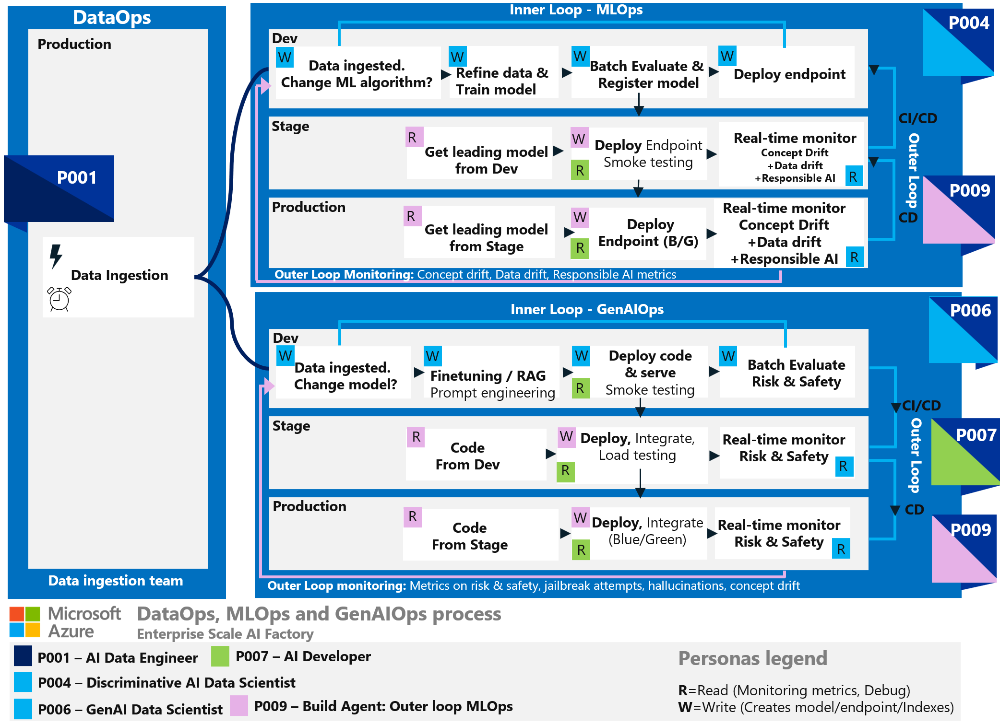
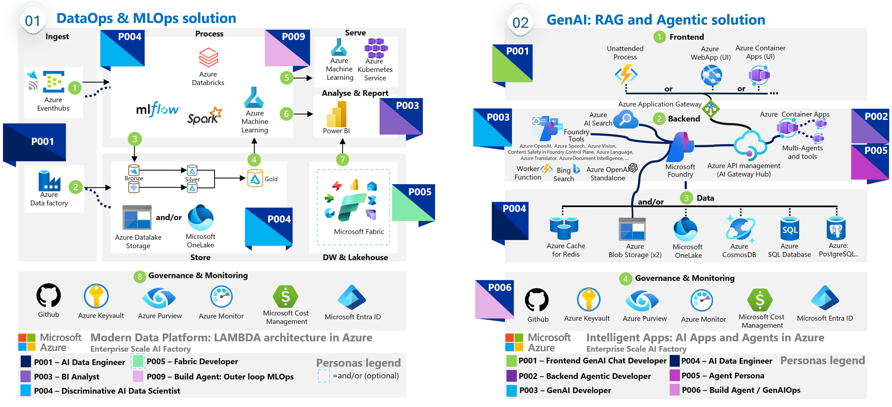

# Workload team personas involved in AI workloads

In the context of building AI workloads, unlike traditional code deployment, nondeterministic models require iterative experimentation and collaboration across multiple roles and teams. Early integration of operations, application development, and data teams is essential to foster mutual understanding. This collaboration demands diverse skills and continuous learning to keep pace with technological advancements.

Effective collaboration hinges on **integrating tools, processes, and people**, all driven by workload needs and specific goals. The recommended strategies include:

- Establishing clear roles and accountabilities.
- Leveraging your team's skill set for appropriate tasks.
- Standardizing processes and subprocesses, such as tracking work as part of a shared backlog.
- Relying on automation to achieve consistency and reproducibility.

Personas can be an effective tool in materializing those strategies and standardizing responsibilities. This article explores the concept of personas found in AI workloads, their benefits in workload design, and provides examples and tools for defining and utilizing these team-level personas effectively.

## What are personas?

Personas represent subsets of humans and processes involved in the creation and running of a workload, capturing not only their roles but also their real behaviors and accountabilities. An individual can embody one or multiple personas depending on the context. Interestingly, a persona doesn't have to be a person; it can also be an unattended process, such as an agent process within the architecture.

Your workload might have end-user personas that drive feature development, those personas aren't in scope for this article.

Unlike roles, which are typically more static functions or positions within an organization, personas are dynamic and goal-oriented. They can be used to map skill requirements to the processes and tools, such as architectural components. Personas primarily help define the scope of responsibility and set context within a project. They offer several other benefits, such as:

- **Identification of resource gaps**, which helps in deciding whether to recruit, train, or redesign the solution. If your workload team lacks individuals fitting a necessary persona, you might need to adjust the architecture, modify the process, or onboard new personnel. For example, if a senior data science persona is missing, the architecture can be redesigned by considering higher reliability on general purpose SaaS AI solutions or incorporating third-party AI solutions.

- **Enhanced skills**. Mapping personas to specific architectural components also facilitates educational opportunities, providing sessions and online courses to enhance skills.

- **Ensure the appropriate levels of access.** Personas should be used to define security and access needs by mapping them to processes, architectures, and services, ensuring appropriate access levels.

- **Project planning and communication** In project planning, personas help identify key interactions, facilitating the setup of sync meetings and overall planning. Typically, personas are integrated into the hierarchy of tracking user stories, features, and requirements, streamlining project management.

## How to define personas

Identify your team members' specializations and align them with the appropriate roles in your AI operations or design. Create a template to document the persona's skill expectations, team information, and the processes they'll be involved in.

Here's an example baseline template:

|Persona Template|
|---|
|&#128313; Persona Name: [Insert Persona Name] &#128313;Team: [Team responsible for this persona] &#128313;Primary Interaction: [Other teams this persona interacts with] &#128313;Components Access: [Security and access requirements for processes and system components] &#128313;Processes: [Processes the persona is responsible for or contributes to] &#128313;Skills: [Skills required to complete the tasks, including domain and technology specifics such as model training or search index optimization.]

### Tools

Using a table can help organize and visualize information for each persona. The advantage is you can create and link other tables for deeper information. For example, you can link architecture components to another table where identity-based access control is specified for each service and environment (Dev, Stage, Production).
>  **Tradeoff**. Having too few personas can make it difficult to implement role-based access control with least privileged access and to distribute work responsibilities effectively. Conversely, having too many personas adds management overhead. Starting with 5-10 personas is a good balance, and you should only add personas that are necessary for your operations.

Cards can also be used to define personas. These cards contain the same information as the table or a quick summary. You can create these cards using Microsoft PowerPoint or as a set of markdown files.

In certain cases, you can use a combined set of tools. For example, each architecture component in a persona card can open a markdown file with a table mapping security and role-based access control for each service and environment. For a reference example, see [MLOps accelerator: Identity RBAC](/azure/architecture/ai-ml/guide/machine-learning-operations-v2#identity-rbac).

### Example personas

Using cards, you can define the services a persona needs access to within a process and outline the prerequisite skills required for each persona (whether a person or an agent).

> [!IMPORTANT]
> While the personas defined here serve as baseline examples, it's recommended to create your own personas using tools like tables, persona template cards, and graphs.
>
> It's important that these personas align with your specific processes, organization, and users.

|AI Data Engineer (P001)|
|---|
| Team: Data Ingestion Team &#128313; Primary Interaction: AI Development Team &#128313; Components Access: Azure Data Factory, Azure Databricks, Azure SQL Database, Azure Storage  &#128313; Processes: DataOps, ETL, ELT &#128313; Skills: SQL, Python, PySpark

|BI Analyst (P003)|
|---|
| Team: Analytics Team &#128313; Primary Interaction: Data Ingestion Team &#128313; Components Access: Power BI, Azure Data Explorer, Azure Storage  &#128313; Processes: Data analysis, Data warehousing process &#128313; Skills: SQL, Python, PySpark

|Discriminative AI Data Scientist (P004)|
|---|
| Team: AI Team &#128313; Primary Interaction: Data Ingestion Team, DevOps Team &#128313; Components Access: Azure Machine Learning, Azure Databricks, Azure Storage, Azure Key Vault  &#128313; Processes: MLOps, MLflow &#128313; Skills: Azure Machine Learning, Python, Model training

|GenAI Data Scientist (P006)|
|---|
| Team: AI Team &#128313; Primary Interaction: Data Ingestion Team, DevOps Team &#128313; Components Access: Azure AI Studio, Azure OpenAI, Azure AI Search, Azure Storage, Azure Keyvault  &#128313; Processes: GenAIOps &#128313; Skills: Azure Machine Learning, Python, Model(LLM, SLM) knowledge, Fine tuning, RAG, Agentic concept

|GenAI Chat Developer (P007)|
|---|
| Team: Engineering Team &#128313; Primary Interaction: AI Team &#128313; Components Access: Azure WebApps, Azure API management, Cosmos DB, Azure Container Apps, Azure Functions  &#128313; Processes: DevOps, Event driven processing, Microservices &#128313; Skills: Web Application Architecture (frontend/backend), React, Node.js, HTML, CSS

|BuildAgent MLOps (P009)|
|---|
| Team:  Engineering Team &#128313; Primary Interaction: AI Team &#128313; Components Access: Azure Machine Learning, Azure Devops, GitHub  &#128313; Processes: Process/Serving of LAMBDA, OUTER Loop MLOps  &#128313; Skills: Python, Pyspark

## Use case: Personas for AI processes

The main processes related to AI workloads are:

- DataOps focuses on data ingestion and preparation.
- MLOps involves operationalizing machine learning models.
- GenAIOps pertains to discovering and evaluating existing models and then refining them to your workload context.
- Inner loop refines solutions in the development environment, either during research or triggered by outer loop monitoring.
- Outer loop moves solutions from development to production, using continuous monitoring and evaluation to identify necessary improvements.

Mapping personas to those processes provides context for each persona. This helps identify the processes where a persona might need upskilling.

The image shows the workflow for DataOps, MLOps, and GenAIOps within a production environment. Data flows from ingestion to model deployment and evaluation, using continuous integration/continuous deployment (CI/CD) practices. Key tasks include refining data models, batch evaluation, deploying endpoints, real-time model evaluation, and fine-tuning models. The example personas participate in the entire workflow.

## Use case: Personas for architecture design

Connecting processes to the supporting architecture helps you to identify the services a persona needs to interact with, highlighting areas for potential upskilling.

To visualize this connection, create a graphical image showing how architecture components are connected. This can illustrate data flow and interactions between services and how flows are automated in deployment. This visual aid helps stakeholders understand the architecture and the roles of different personas within it.

The image below shows a LAMBDA architecture for modern analytics on Azure:

## Next step

Now proceed to the assessment tool to evaluate your design.

> [!div class="nextstepaction"]
> [AI Workload Assessment](./assessment.md)