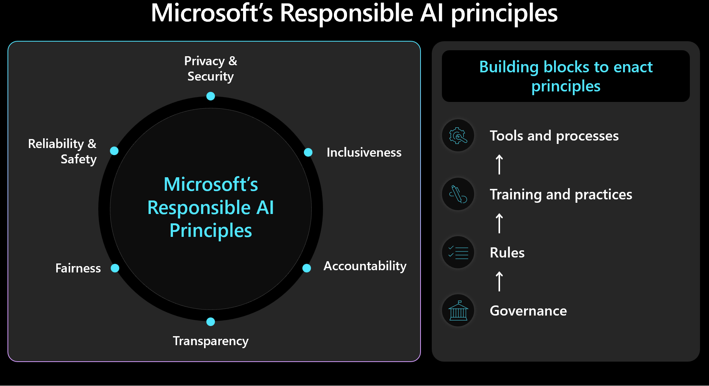
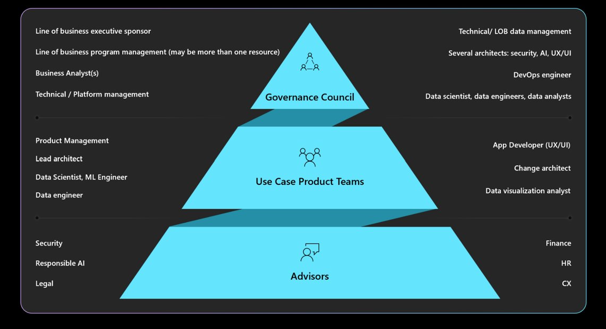

# Responsible AI in Azure workloads

The objective of Responsible AI in workload design is to ensure that the use of AI algorithms is **fair, transparent, and inclusive**. Well-Architected Security principles are interrelated with a focus on **confidentiality and integrity**. Security measures must be in place to maintain user privacy, protect data, and safeguard the integrity of the design, which shouldn't be misused for unintended purposes.

In AI workloads, decisions are made by models that often use opaque logic. **The users should trust the system's functionality and feel confident that decisions are made responsibly**. Unethical behaviors, such as manipulation, content toxicity, IP infringement, and fabricated responses, must be avoided.

Consider a use case where a media entertainment company wants to provide recommendations by using AI models. Failing to implement responsible AI and proper security can lead to a bad actor taking control of the models. The model can potentially recommend media content that can lead to harmful outcomes. For the organization, this behavior can lead to brand damage, unsafe environments, and legal issues. Therefore, maintaining ethical vigilance throughout the system's lifecycle is essential and non-negotiable.

Ethical decisions should prioritize security and workload management with human outcomes in mind. Familiarize yourself with [Microsoft's Responsible AI framework](https://www.microsoft.com/ai/responsible-ai) and make sure the principles are reflected and measured in your design. This image shows the core concepts of the framework.

> [!IMPORTANT]
>
> Accuracy of prediction and Responsible AI metrics are often interconnected. Improving a model's accuracy can enhance its fairness and alignment with reality. However, while ethical AI frequently aligns with accuracy, accuracy alone doesn't include all ethical considerations. It's crucial to validate these ethical principles responsibly.

This article provides recommendations on ethical decision-making, validating user input, and ensuring a safe user experience. It also provides guidance on data security to make sure user data is protected.

## Recommendations

Here's the summary of recommendations provided in this article.

|Recommendation|Description|
|---|---|
|**Develop policies that enforce ethical practices at each stage of the life cycle**. |Include checklist items that explicitly state ethical requirements, tailored to the workload context. Examples include, user data transparency, consent configuration, and procedures for handling the "Right to be Forgotten."  &#9642; [Develop your Responsible AI policies](#develop-responsible-ai-policies) &#9642; [Enforce governance on Responsible AI policies](#enforce-governance-on-responsible-ai-policies)|
|**Protect user data with the goal to maximize privacy**. |Collect only what's necessary and with proper user consent. Apply technical controls to protect user profiles, their data, and access to that data.   &#9642; [Handle user data ethically](#handle-user-data-ethically) &#9642; [Inspect incoming and outgoing data](#inspect-incoming-and-outgoing-data)|
|**Keep AI decisions clear and understandable**. |Maintain clear explanations of how recommendation algorithms work and offer users insights into data usage and algorithmic decision-making to ensure they understand and trust the process.   &#9642; [Make the user experience safe](#make-the-user-experience-safe)|

## Develop Responsible AI policies

**Document your approach to ethical and responsible AI usage**. Explicitly state policies applied at each stage of the lifecycle so that the workload team understands their responsibilities. While Microsoft's Responsible AI standards provide guidelines, you must define what these mean specifically for your context.

For example, the policies should include checklist items for mechanisms around user data transparency and consent configuration, ideally allowing users to opt out of data inclusion. Data pipelines, analysis, model training, and other stages all must respect that choice. Another example is procedures for handling the "Right to be Forgotten." Consult your organization's ethics department and legal team to make informed decisions.

Create transparent policies around data usage and algorithmic decision-making to ensure users understand and trust the process. Document these decisions to maintain a clear history for potential future litigation.

Implementing ethical AI involves three key roles: the research team, the policy team, and the engineering team. Collaboration among these teams should be operationalized. If your organization has an existing team, take advantage of their work; otherwise, establish these practices yourself.

Have accountabilities on separation of duties:

- **Research team conducts risk discovery** by consulting organizational guidelines, industry standards, laws, regulations, and known red team tactics.

- **Policy team develops policies specific to the workload**, incorporating guidelines from the parent organization and government regulations.

- **Engineering team implements the policies** into their processes and deliverables, ensuring they validate and test for adherence.

Each team formalizes its guidelines, but the **workload team must be accountable for its own documented practices**. The team should clearly document any additional steps or intentional deviations, making sure there's no ambiguity about what is allowed. Also, be transparent about any potential shortcomings or unexpected results in the solution.

## Enforce governance on Responsible AI policies

Design your workload to **comply with organizational and regulatory governance**. For example, if transparency is an organizational requirement, determine how it applies to your workload. Identify areas in your design, lifecycle, code, or other components, where transparency features should be introduced to meet that standard.

Understand the required governance, accountability, review boards, and reporting mandates. Ensure **workload designs are approved and signed off** by your governance council to avoid redesigns and mitigate ethical or privacy concerns. You might need to go through multiple layers of approval. Here's a typical structure for governance.

For information about organizational policies and approvers, see [Cloud Adoption Framework: Define a responsible AI strategy](/azure/cloud-adoption-framework/scenarios/ai/strategy#define-a-responsible-ai-strategy).

## Make the user experience safe

User experiences should be based on industry guidelines. Take advantage of the [Microsoft Human-AI experiences Design Library](https://www.microsoft.com/en-us/haxtoolkit/library/) that includes principles and provides implementation do's and don'ts, with examples from Microsoft products and other industry sources.

There are workload responsibilities throughout the lifecycle of user interaction starting from user's intent to use the system, during a session, and disruptions due to system errors. Here are some practices to consider:

- **Build transparency**. Make users aware of how the system generated the response to their query.

    Include links to data sources consulted by the model for predictions to enhance user confidence by showing the origins of the information. Data design should ensure these sources are included in the metadata. When the orchestrator in a retrieval augmented application performs a search, it retrieves, for example, 20 document chunks, and sends the top 10 chunks, belonging to three different documents, to the model as context. The UI can then reference these three source documents when displaying the model's response, enhancing transparency and user trust.

    Transparency becomes more important when using agents, which act as intermediaries between front-end interfaces and back-end systems. For example, in a ticketing system, the orchestration code interprets user intent and makes API calls to agents to retrieve necessary information. Exposing these interactions can make the user aware of the system's actions.

    For automated workflows with multiple agents involved, create log files that record each step. This capability helps in identifying and correcting errors. Additionally, it can provide users with explanations for decisions, which operationalizes transparency.

    > [!CAUTION]
    >
    > When implementing transparency recommendations, avoid overwhelming the user with too much information. Use a gradual approach, where you start with minimally disruptive UI methods.
    >
    > For example, display a tooltip with a confidence score from the model. You can incorporate a link that users can click to get more details, such as links to source documents. This user-initiated method keeps the UI non-disruptive and lets users seek additional information only if they choose to.

- **Collect feedback**. Implement feedback mechanisms.

    Avoid overwhelming users with extensive questionnaires after each response. Instead, use simple, quick feedback mechanisms like thumbs up/down, or rating systems for specific aspects of the answer on a scale of 1 to 5. This method allows for granular feedback without being intrusive, helping improve the system over time. Be mindful of potential biases in feedback, as there may be secondary reasons behind user responses.

    Implementing a feedback mechanism affects architecture due to the need for data storage. Treat this as user data and apply levels of privacy control, as needed.

    In addition to response feedback, collect feedback about the efficacy of the user experience. This can be done by collecting engagement metrics through your monitoring stack of the system.

## Operationalize content safety measures

Integrate content safety into every stage of the AI lifecycle by using custom solution code, appropriate tools, and effective security practices. Here are some strategies.

- **Data anonymization**. As data moves from ingestion to training or evaluation, have checks along the way to minimize the risk of leaking personal information and avoiding exposure of raw user data.

- **Content moderation**. Use the content safety API that evaluates requests and responses in real-time, and ensure these APIs are reachable.

- **Identify and mitigate threats**. Apply well known security practices to your AI scenarios. For example, conduct threat modeling and document threats and their mitigation. Common security practices such as Red Team exercises are applicable to AI workloads. Red teams can test if models can be manipulated to generate harmful content. These activities should be integrated into AI operations.

    For information about conducting red team testing, see [Planning red teaming for large language models (LLMs) and their applications](/azure/ai-services/openai/concepts/red-teaming).

- **Use the right metrics**. Use appropriate metrics that are effective in measuring the ethical behavior of the model. **Metrics vary depending on the type of AI model**. Measurement of generative models may not apply to regression models. Consider a model that predicts life expectancy and the results impact insurance rates. Bias in this model can lead to ethical issues but that problem stems from deviation in core metric testing. Improving accuracy can reduce ethical problems, as ethical and accuracy metrics are often interconnected.

- **Add ethical instrumentation**. AI model results must be explainable. **You need to justify and trace how inferences are made**, including the data used for training, the features calculated, and the grounding data. In discriminative AI, you can justify decisions step by step. However, for generative models, explaining outcomes can be complex. **Document the decision-making process** to address potential legal implications and provide transparency.

    This explainability aspect should be implemented throughout the entire AI lifecycle. Data cleaning, lineage, selection criteria, and processing are critical stages where decisions should be tracked.

##### Tools

 Tools for content safety and data traceability, like [Microsoft Purview](/purview/purview), should be integrated. [Azure AI Content Safety](/azure/ai-services/content-safety/overview) APIs can be called from your testing to facilitate content safety testing.

 Azure AI Foundry provides metrics that evaluate the behavior of the model. For more information, see [Evaluation and monitoring metrics for generative AI](/azure/ai-studio/concepts/evaluation-metrics-built-in).

 For training models, we recommend reviewing the [metrics provided by Azure Machine Learning](/azure/machine-learning/component-reference/evaluate-model).

## Inspect incoming and outgoing data

Prompt injection attacks, such as jailbreaking, are a common concern for AI workloads. In this case, some users may attempt to misuse the model for unintended purposes. To ensure safety, **inspect data to prevent attacks and filter out inappropriate content**. This analysis should be applied to both the user's input and the system's responses to make sure there's thorough content moderation in both incoming and outgoing flows.

In scenarios where you're making multiple model invocations, such as through Azure OpenAI, to serve a single client request, applying content safety checks to every invocation can be costly and unnecessary. Consider **centralizing that work in the architecture while keeping security as a server-side responsibility**. Suppose an architecture has a gateway in front of the model inference endpoint to offload certain backend capabilities. That gateway can be designed to handle content safety checks for both requests and responses that the backend may not support natively. While a gateway is a common solution, an orchestration layer can handle these tasks effectively in simpler architectures. In both cases, you can selectively apply these checks when needed, optimizing performance and cost.

**Inspections should be multimodal**, covering various formats. When using multimodal input, such as images, it's important to analyze them for hidden messages that may be harmful or violent. These messages might not be immediately visible, similar to invisible ink, and require careful inspection. Use tools like Content Safety APIs for this purpose.

To enforce privacy and data security policies, inspect user data and grounding data for compliance with privacy regulations. Make sure the data is sanitized or filtered as it flows through the system. For example, data from prior customer support conversations could serve as grounding data. It should be sanitized before reuse.

## Handle user data ethically

Ethical practices involve careful handling of user data management. This includes knowing when to use data and when to avoid relying on user data.

- **Inference without sharing user data**. To securely share user data with other organizations for insights, **use a clearinghouse model**. In this scenario, organizations provide data to a trusted third party, which trains a model using the aggregated data. This model can then be used by all institutions, allowing shared insights without exposing individual data sets. The goal is to use the model's inference capabilities without sharing detailed training data.

- **Promote diversity and inclusivity**. When user data is necessary, use a diverse range of data, including underrepresented genres and creators, to minimize bias. Implement features that encourage users to explore new and varied content. Have ongoing monitoring of usage and adjust recommendations to avoid over-representing any single content type.

- **Respect the "Right to be Forgotten"**. Avoid using user data, whenever possible. Ensure compliance with "Right to be Forgotten" by having necessary measures in place to make sure user data is deleted diligently.

    To ensure compliance, there might be requests to remove user data from the system. For smaller models, this can be achieved by retraining with data that excludes personal information. For larger models, which can consist of several smaller, independently trained models, the process is more complex and the cost and effort is significant. Seek legal and ethical guidance about handling these situations and make sure this is included in your Responsible AI policy, described in [Develop Responsible AI policies](#develop-responsible-ai-policies).

- **Retain responsibly**. When data deletion isn't possible, **obtain explicit user consent for data collection** and provide clear privacy policies. **Collect and retain data only when absolutely necessary**. Have operations in place to remove data aggressively when no longer needed. For example, clear chat history as soon as practical, and anonymize sensitive data before retention. Make sure advanced encryption methods are used for this data at rest.

- **Support explainability**. Trace decisions in the system to support explainability requirements. Develop clear explanations of how recommendation algorithms work, offering users insights into why specific content is recommended to them. The goal is to ensure that AI workloads and their results are transparent and justifiable, detailing how decisions are made, what data was used, and how models were trained.

- **Encrypt user data**. Input data must be encrypted at every stage in the data processing pipeline from the moment the user enters data. This includes data as it moves from one point to another, where it's stored, and during inferencing, if necessary. Balance security and functionality but aim to **keep data private throughout its lifecycle**.

    For information about encryption techniques, see [Application Design](./application-design.md).

- **Provide robust access controls**. Several types of identities can potentially access user data. Implement Role-Based Access Control (RBAC) for both the control plane and data plane, covering user and system-to-system communication.

    Also maintain proper user segmentation to protect privacy. For example, Copilot for Microsoft 365 can search and provide answers based on a user's specific documents and emails, ensuring only content relevant to that user is accessed.

    For information about enforcing access controls, see [Application Design](./application-design.md).

- **Reduce surface area**. A fundamental strategy of the Well-Architected Framework Security pillar is minimizing the attack surface and hardening resources. This strategy should be applied to standard endpoint security practices by tightly controlling API endpoints, exposing only essential data, and avoiding extraneous information in responses. The design choice should be balanced between flexibility and control.

    Make sure there aren't any anonymous endpoints. In general, avoid giving clients more control than necessary. In most scenarios, clients don't need to adjust hyperparameters except in experimental environments. For typical use cases, such as interacting with a virtual agent, clients should only control essential aspects to ensure security by limiting unnecessary control.

    For information, see [Application Design](./application-design.md).

## Next steps

> [!div class="nextstepaction"]
> [Workload Team Personas Involved in AI Workloads](./personas.md)
