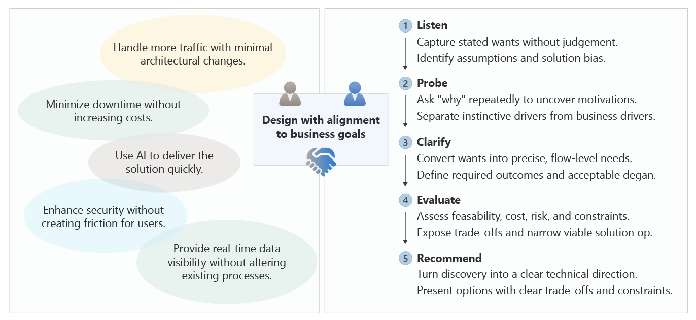

# Align technical strategy with business requirements

As a cloud architect, your first task is to create clarity. Before you can make meaningful architectural decisions, you need to understand what the system must achieve, who it serves, and which constraints you must operate within. You need a clear view of expected outcomes and the boundaries set by the business.

Every decision is shaped by real pressures: budgets, delivery timelines, compliance rules, performance expectations, and service-level commitments. These aren't optional considerations. They're the conditions your design has to meet.

If you don't understand these factors, the systems has high chances of failure. Requirements sometimes start out as assumptions rather than true needs. Like, there might a list of requested features, but none about the traffic patterns that will stress the system. What about growth over the next year? What commitments were already made to customers?

This is where your role helps bring clarity. You need to listen carefully, ask why the request exists, and separate actual needs from early assumptions. You guide conversations back to goals, not implementation. And when a request is unrealistic or misaligned, you need to propose alternatives that still achieve the desired outcome.

This article shows you how to do that by following a 5-step process. It uses an example to illustrate how to gather the right context, ask the right questions, and build shared understanding before you design anything. This way, you create architectures that aren't just technically sound but also aligned with real motivations, business pressures, and long-term goals.

## Listen: Capture stakeholder requests

By the time a cloud architect joins a new initiative, the business stakeholders usually have a vision for what they want and often budget constraints. Product owners, business analysts, and domain experts may have documented requirements, and some of these insights can be valuable. Treat them as requests rather than requirements. It's not uncommon that the business team jumps into solution mode, request features, tools, or technology decisions long before the underlying motivations are understood.

Every architectural engagement begins with listening. At this stage, your job isn't to critique or solve. It's to absorb desired outcomes and get early indications of motivations. You'll likely find yourself saying "tell me more." Capture the stated requests, the assumptions behind them, and any embedded solution bias, which often appears as statements like "we need to build X." 

Consider this common scenario. A business team says, "We need 100% uptime." At first, it sounds like a straightforward requirement. However, they might be equating high availability with high quality, or reacting to a recent outage, or following a trend adopted by a competitor.

In this step, it's important that you respect business perspectives and aren't dismissing concerns of the business stakeholders. Listening well builds trust and sets the foundation for uncovering what's really driving the request.

## Probe: Understand the motivation

After you have a basic understanding of what the business is asking for, the next step is to ask "why?" and do that repeatedly. The goal is to probe until the real needs surface. Understand the pressures, constraints, and incentives behind the ask:

- Is this addressing a production issue?
- Is it driven by competition or market shifts?
- Is it needed for compliance?
- Is it part of a broader strategic direction?

Motivation matters because two similar requests can represent very different intentions. A feature needed to meet a regulatory deadline requires a different architectural approach than one meant to unlock a new growth opportunity. Without understanding the motivation, you risk aiming at the wrong target.

Returning to the example, probing reveals that a recent outage caused lost orders. A competitor now advertises real-time ordering availability and executives fear brand damage from another failure. Also, customer support is overloaded when checkout goes down.

At this point, "100% uptime" takes on a different meaning. The real driver isn't perfection, it's business continuity for revenue-critical flows, especially checkout.

In this step, you're not deciding on solutions. You're uncovering the forces behind the request so you can anchor the architecture in the right business context.

## Clarify: Translate requests to requirements

Once motivations are clear, the next step is clarifying what the business actually needs. This is where you translate the business's motivations or requests into concrete outcomes and measurable requirements. 

In the example, dive deeper and get consensus on impact to users, such as:

- Which user flows must always be available?
- What happens if a secondary flow is temporarily down?
- Which functions are revenue-impacting?
- What are acceptable degradation modes?

In this step, "100% uptime" breaks apart into flow-level requirements:

- Order placement. Must be highly available. Downtime has direct revenue impact.
- Catalog browsing. Can degrade briefly without critical harm.
- Order history. Can tolerate planned maintenance.

Note that those are still business outcomes, not yet architecture choices. Clarifying needs reframes the requirement from "Make everything always available" to "Ensure continuity of the flows that generate value."

## Evaluate: Test feasibility, constraints, and trade-offs

With requirements defined, the next step is to evaluate how those needs can be met in practice and within fixed and flexible constraints. This step is about technical and operational feasibility, cost implications, risks, and alignment with your organization's standards. It's where you bring engineering judgment and architectural experience. Start by extracting constraints and defining success. Focus on what really matters, avoid over-engineering, and know when a simpler solution is sufficient.

Continuing with the high availability example, lay out the tradeoffs, like: 

- Cost: Multi-region active-active architecture doubles infrastructure spend.
- Engineering complexity: Cross-region state replication isn't trivial.
- Security and compliance: Multiple regions introduce data residency concerns.
- Operational effort: 24/7 on-call rotations and sophisticated failover processes.

This is the point where every answer inevitably begins with "it depends." Evaluation often exposes mismatches between what the business wants and what is practical. It helps the business understand what "100% uptime" actually demands. You may find that only the checkout flow justifies multi-region deployment, while catalog and order history do not. You might also uncover risks, such as immature team capabilities, overestimated benefits, or underestimated costs.

You're still not choosing technology yet. This step is about defining boundaries. That includes mapping constraints, highlighting trade-offs, and narrowing the solution space to approaches that can meet the clarified requirements under real-world conditions. Bring a collaborative approach to unify perspectives and agree on a path forward.

## Recommend: Propose the technical strategy

Once feasibility and trade-offs are understood, the next step is to recommend technology choices and other decisions that align with real business needs. This means turning information captured during discovery into a clear, actionable direction that closes the loop between what the business asked for, what they actually need, and what you propose to build. Every recommendation is a negotiation, a compromise, and an opportunity to make it better over time.

Your recommendation should be documented and cover these aspects:

- Address the clarified requirements
- Reflect the constraints and trade-offs identified during evaluation
- Communicate options and their implications clearly to stakeholders

Returning to the uptime example, a recommendation might look like this:

"Checkout should run in a multi-region active-active configuration to protect revenue. Catalog services can run in a single region with read replicas for resilience. Order history can remain single-region with planned maintenance windows. This approach will meet the requirement of continuity while avoiding unnecessary duplication and cost."

Although this may sound like a final step, it's actually iterative and marks the beginning of the design process, where decisions are refined through stakeholder feedback, trade-off discussions, and agreement at each design milestone.   

Architecture is never a one-and-done activity. Considering multiple time horizons: Day 1, near-term growth, and long-term scale. Strive to build systems that evolve gracefully as needs change. It's acceptable that initial designs capture minimal reliable capabilities, but each subsequent cycle refines the architecture based on observed usage, shifting priorities, and new business goals. 

## Next steps

Now that you've gained consensus on the business requirements, start writing a detailed specification that describes design choices and is accompanied by diagrams.

> [!div class="nextstepaction"]
> [Develop an architecture design specification](./architecture-design-specification.md)

