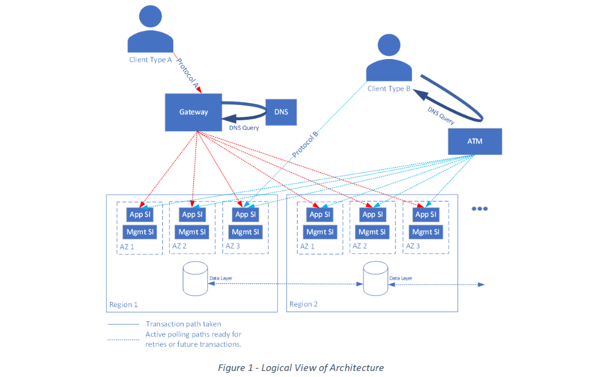

# Architecture pattern for carrier-grade workloads on Azure

This section provides design considerations and recommendations across architecturally significant topics that are relevant for a carrier-grade workload. The design areas are interrelated and decisions made within one area can impact or influence decisions across the entire design.

> [!IMPORTANT]
> This article is part of the [Azure Well-Architected carrier-grade workload](index.yml) series. If you aren't familiar with this series, we recommend you start with [What is a carrier-grade workload](carrier-grade-get-started.md#what-is-a-carrier-grade-workload).
>
> There are [reference implementations](carrier-grade-get-started.md#illustrative-examples) available.

## Reference architecture

A carrier-grade workload architecture is presented from three different viewpoints:

- **Logical**&mdash;The set of generic building blocks and how they relate to each other.
- **Physical**&mdash;How those generic building blocks are realized in the Azure cloud.
- **Operational**&mdash;How the application is deployed and managed.

This article will focus on the Logical view of the architecture. For brevity, the generic architecture is presented as a combination of various design patterns.

The following image represents the Logical View of Architecture for carrier-grade workloads on Azure. The overall solution is separated into two distinct layers, with different expected lifetimes:

### High-level structure

The overall solution is separated into two distinct layers, with different expected lifetimes:

- **First layer**&mdash;Responsible for delivering the application function. Each incarnation is relatively short-lived.
- **Second layer**&mdash;Provides the management and monitoring functions for the application. These functions can be separated into two distinct layers. The key is they're separate from the application function with longer lifetimes.

Each layer is composed of individual service instances (SIs). Each SI is an immutable, interchangeable element that fully meets the functional requirements placed on it. Any SI can service any request. Immutability applies to the software version and most of the configuration. SIs are a design simplification that avoids the need for in-place upgrades.

SIs are:

- Active/active resilient
- Deployed in multiple Availability Zones (AZs) and multiple regions
- A combination of [geode](/azure/architecture/patterns/geodes) and [bulkhead](/azure/architecture/patterns/bulkhead) patterns

An application achieves scale through a combination of individual SI capacity and the total number of SIs. Any single region can fail and the remaining regions can still service the expected traffic load.

### SI architecture

SIs are implemented using a containerized, microservice architecture with `N+k` redundant clusters of each microservice element. These clusters use DNS and an internal load balancer for connectivity and reachability.

Within each SI, there's strong separation of processing elements and long-lived state. This long-lived state is stored in platform database services that results in stateless SIs, which are a fundamental part of cloud-native design, in line with the [12-factor model processes requirement](https://12factor.net/processes).

SI capacity is adjusted as needed to handle predictable load variations, such as busy hour and weekdays/weekends. This capacity adjustment provides efficiencies in the platform resource costs.

Internally, SIs use a *fate-sharing model*, which simplifies logic flows and connection paths. This model removes the need for special case code to handle partial failure conditions. Fate-sharing models include the following characteristics:

- The microservice clusters have resiliency to allow for local issues.
- If any part of the SI function is degraded, the SI will class itself as *non-functional* and stop responding to polling from the external traffic management layer.

  > [!IMPORTANT]
  > If the SI stops responding, it's removed from the pool and relies on other sufficient SIs for availability.
  > Decision criteria must ensure that the SI can no longer continue to offer meaningful service.

- A given primary application SI and its associated management and monitoring SIs are *always* deployed in the same AZ. An AZ failure terminates all related SIs.

### Traffic management

Although any SI can service an incoming request, the traffic management layer fronts an application and provides load balancing.

Incoming traffic uses two types of network protocols/clients:

- **[Gateway routing pattern](/azure/architecture/patterns/gateway-routing)**&mdash;Incoming traffic accesses the application through a gateway element outside of the cloud. This gateway element receives the prioritized list of SI access points from a DNS server and uses active polling to determine SI liveness.

- **DNS steering using a traffic manager element**&mdash;The traffic manager has its own active polling and maintains health lists to minimize the chance of including an unresponsive SI in a DNS response.

### Data model

Data is stored using a variant of the [claim-check pattern](/azure/architecture/patterns/claim-check), as follows:

- A minimal meta-record is stored in a data store, which ensures full redundancy/resiliency and replication to every region containing an SI.

- A much larger data payload is stored in cheaper blob storage and only replicated to two regions. This option is a compromise between resiliency and storage costs.

- The core payload databases and the subscriber database are both implemented for eventual consistency, prioritizing availability and partition tolerance.

- The system user database is mastered centrally, prioritizing write consistency, but allowing local read access if there's a partition.

### Configuration

Configuration is declarative and is stored separately. It's subject to strong Role Based Access Controls (RBAC) for audit and roll-forward/back, all in line with the [configuration requirement](https://12factor.net/config) of the 12-factor model.

The configuration store is responsible for ensuring availability in each of the locations where it's needed. For more information, reference the [External Configuration Store pattern](/azure/architecture/patterns/external-configuration-store).

### Requirements on Azure

 > [!IMPORTANT]
 > The Azure community is in the process of socializing these requirements.

Potential requirements on the Azure platform include:

- **Minimal correlated failure modes between regions**&mdash;To understand the basis for the importance of correlated failures across regions, consider a workload using simple Infrastructure as a Service (IaaS), plus Azure storage. To be operational, the workload requires availability for both the Virtual Machine (VM) and the storage resources.

  This requirement has the following impacts on dependent services:

  - Failure of dependent services through exposure of existing defects.
  - Regressions in dependent services due to simultaneous changes or operational updates.

- **Published commitments on the potential duration and frequency of outages (per-region and cross-region correlated) for each platform service**&mdash;A carrier-grade application will have high-level requirements for the acceptable outage duration at both global and regional scope, which may be contractually binding or regulated.

The significance of correlated failures affecting multiple regions leads to the following classification of Azure services, starting from those services with the greatest potential blast radius:

- **Glue services**&mdash;The small set of services that exist outside of any single Azure region and binds the regions together, which includes:

  - [Azure Global DNS](/azure/dns/)
  - [Azure Traffic Manager](/azure/traffic-manager/)
  - [Azure Front Door](/azure/frontdoor/)
  - [Azure Active Directory](https://azure.microsoft.com/services/active-directory/)
  - [Azure Networking](/azure/networking/fundamentals/) services external to a single region

- **Cross-regional services**&mdash;The service maintains some form of functional consistency across regions, such as shared state stores and databases. The key example is [Cosmos DB](/azure/cosmos-db/).

- **Core regional services**&mdash;Services that are critical for a given region to be considered *available*. These services are instantiated in one or more regions, but the application has no expectation of regional synchronization, such as:

  - [Azure Container Registry](/azure/container-registry/)
  - [Azure Kubernetes Service](/azure/aks/)
  - [Virtual Machines](/azure/virtual-machines/)
  - [Virtual Machine Scale Sets](/azure/virtual-machine-scale-sets/)

- **Non-core regional services**&mdash;Services that are regional in scope and not critical for most applications deployed.

## Design areas

We recommend that you use the provided design guidance to navigate the key design decisions to reach an optimal solution:

|Design area|Summary|
|-----------|-------|
|[Fault tolerance](carrier-grade-design-area-fault-tolerance.md)|Implement applications that meet and even exceed carrier-grade availability requirements, while running on top of relatively unreliable elements through fault tolerance.|
|[Data model](carrier-grade-design-area-data-model.md)|For applications deployed across multiple regions, consider what tradeoffs you can make to achieve two out of the three possible properties: consistency, availability, and partition tolerance.|
|[Health modeling](carrier-grade-design-area-health-modeling.md)|Include clear metrics in your design to monitor true service availability. Generate metrics from failure-rate analysis and general health modeling of the application.|
|[Testing and validation](carrier-grade-design-area-testing.md)|Use a chaos-testing framework that simulates failures of all dependent elements. Robust and regular testing should prove the design and validate the original failure mode analysis.|

## Azure landing zone integration (TBD)

[Azure landing zones](/azure/cloud-adoption-framework/ready/landing-zone/) provide prescriptive architectural guidance to define a reliable and scalable shared-service platform for enterprise Azure deployments with requisite centralized governance.

This carrier-grade workload series provides prescriptive architectural guidance to define a highly reliable application for carrier-grade workloads that could be deployed within an Azure landing zone.

## Next step

Review the fault tolerance design area for carrier-grade workloads.

> [!div class="nextstepaction"]
> [Design area: Fault tolerance](./carrier-grade-design-area-fault-tolerance.md)

