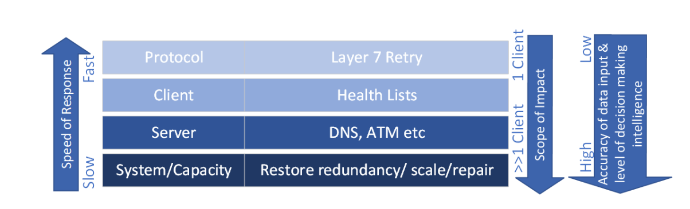

# Design area: Fault tolerance for carrier-grade workloads

Telecommunication companies have shown that it's possible to implement applications that meet and exceed carrier-grade availability requirements, while it runs on top of unreliable elements. Companies exceed these requirements through *fault tolerance*, which includes the following aspects:

- Combination of independent, non-highly available elements.
- Traffic management failure response mechanisms.
- Repair and capacity-recovery and failure response mechanisms.
- Use of highly available cross-element databases.

## High availability through combination

To reach high availability, take independent elements, which aren't highly available, and combine them so that they remain independent entities. The probability of multiple elements failing together is much lower than the probability of failure of any single element. We define this process as the *Share Nothing* architectural style.

## Traffic management failure response

When individual elements fail, or there are connectivity issues, the system's traffic management layer has various ways it can respond to maintain overall service. The solution should implement as many of the following mechanisms as possible or necessary to achieve availability. The first two mechanisms rely on specific behavior in the client, which may not always be an option:

1. **Instantaneous client retry to alternate target**&mdash;On failure, or after no response from a retry, the client can instantly retry the request with an alternative element that's considered likely to succeed, as opposed to submitting a new DNS query to identify an alternative.

1. **Client-based health lists**&mdash;Maintains lists of elements, which are *known-healthy* and *known-unhealthy*. Requests are always sent to a known-healthy element, unless that list is empty. If empty, the known-unhealthy elements are tried.

1. **Server-based polling**&mdash;System-based distribution mechanisms, such as DNS or [Azure Traffic Manager (ATM)](/azure/traffic-manager/), implement their own liveness detection and monitoring to enable routing around unhealthy elements.

## Repair and recovery failure response

Traffic management responses can work around failures, but where the failure is long-lived or permanent, the defective element must be repaired or replaced. Two modes of failure response include the following solutions:

1. **Restoring redundancy**&mdash;Failure of an element reduces overall system capacity. System design should allow for this capacity reduction through provisioning redundant capacity; however, multiple overlapping failures will lead to true outages. There must be an automated process that detects the failure and adds capacity to restore redundancy to its normal levels. The impact can be determined from the failure rate analysis. In many cases, automatically restoring the redundancy level can increase the acceptable downtime of any individual element.

1. **(Optional) Repairing the failed element**&mdash;The solution may need to include a mechanism that detects the failure and attempts to repair the failed element in place. This solution may not apply for cases where the process of restoring redundancy instantiates a new element to replace the failed one, and terminates and decommissions the failed element.

The following diagram shows how the two modes of failure response cooperate to provide service-level fault tolerance:

## Failure rate analysis

No amount of effort leads to a perfect system, so start with the assumption that everything can and will fail. Consider how the solution, as a whole, will behave. Failure rate analysis starts with the lower-level individual systems and combines the results together to model the full solution.

The analysis is typically done using Markov modeling, which considers all possible failure modes. For each failure mode, consider the following factors:

- Rate
- Duration and resolution time
- Probability of correlated failure (what is the chance that a failure in service X causes a failure in service Y)

The outcome is an estimate of the system availability and informs consideration of the *blast radius*. The blast radius is the set of things that won't work given a particular failure. Good design aims to limit the scope and severity of that set, since failure is going to happen. For example, a failure that blocks creation of new users, but doesn't impact existing ones is less concerning than a failure that stops service for all users.

Failure rate analysis provides an estimate of the overall system-level availability. The analysis identifies the critical dependencies on which that availability relies. Where failure rate analysis falls short, it also provides specific, quantitative insights on where improvements are needed and to what extent.

For more details on failure mode analysis in Azure, reference [Failure mode analysis for Azure applications](/azure/architecture/resiliency/failure-mode-analysis).

## Cascading failures and overload

Carrier-grade application design must pay careful attention to the risks of cascading failures, where failure of one element leads to failure of other elements, often due to overload. Cascading failures aren't unique to carrier-grade applications, but the reliability and the response time demand graceful degradation and automated recovery.

## Next step

Review the considered data model design area for carrier-grade workloads.

> [!div class="nextstepaction"]
> [Design area: Data model](./carrier-grade-design-area-data-model.md)

