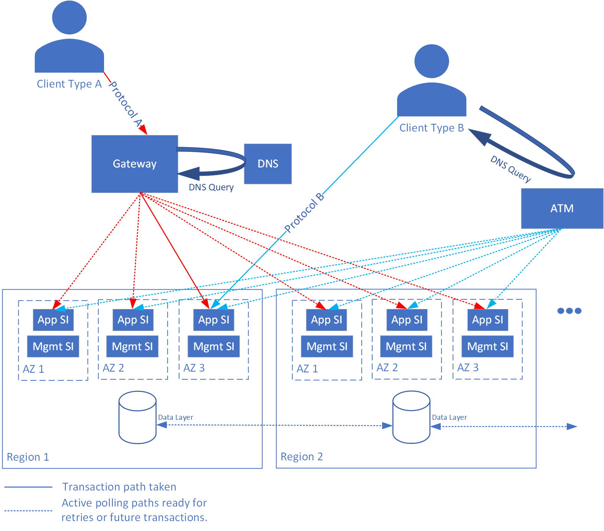

# Design principles of a carrier-grade workload on Azure

Carrier grade workload must be designed as per the guiding principles of the Well-Architected Framework quality pillars:

- [Reliability](/azure/well-architected/#reliability)
- [Performance Efficiency](/azure/well-architected/scalability/)
- [Operational Excellence](/azure/well-architected/devops/)
- [Security](/azure/well-architected/security/)
- [Cost Optimization](/azure/well-architected/cost-optimization/)

This article describes the carrier-grade design principles that resonate and extend the [mission-critical design principles](/azure/well-architected/mission-critical/mission-critical-design-principles). These collective principles serve as a road map for subsequent design decisions across the critical design areas. We highly recommend that you get to know these principles to better understand their effects and the trade-offs associated with non-adherence.

There are obvious [cost tradeoffs](/azure/well-architected/mission-critical/mission-critical-design-principles#cost-optimization) associated with introducing greater reliability, which should be carefully considered in the context of workload requirements.

> [!IMPORTANT]
> This article is part of the [Azure Well-Architected carrier-grade workload](index.yml) series. If you aren't familiar with this series, we recommend you start with [What is a carrier-grade workload](carrier-grade-get-started.md#what-is-a-carrier-grade-workload)?

Keep this high-level architecture model in mind when considering these points.

## Assume failure

Start from the assumption that everything can, and will fail. Application design must allow for these failures with fault tolerance so that an application can continue to operate at some level.

- Minimize single points of failure and implement a [federated approach](carrier-grade-design-area-health-modeling.md#federated-model).

- Deploy the application across multiple regions with proper data management across those regions, allowing for the impacts of [CAP theorem](carrier-grade-design-area-data-model.md#cap-theorem).

- Detect issues automatically and respond within seconds. For more information, see [health monitoring](carrier-grade-design-area-health-modeling.md).

- Test the full solution including the application implementation, platform integration, and deployment. This testing should include [chaos testing](carrier-grade-design-area-testing.md) on production systems to avoid testing bias.

## Share nothing 

_Share nothing_ is a common and straightforward approach to achieve high availability. Use this approach when an application can be serviced by multiple, distinct elements, which are interchangeable. The individual elements must have a well-understood availability metric, but it doesn't need to be high. However, the elements must be combined in a way to remain independent, with no shared infrastructure or dependencies.

To share nothing is often impossible. To start from the position that nothing _should_ be shared, and only add in the smallest possible set of shared dependencies, should result in an optimal solution.

**Example**

Given a single system that has six hours of downtime per year (around 3.5*9s), a solution that combines four systems where the periods of downtime are uncorrelated will experience less than 30s of downtime per year. As soon as those four systems rely on a common service, such as global DNS, their downtime is no longer uncorrelated. The resulting downtime will be higher.

## Next step

Review the fault tolerance design area for carrier-grade workloads.

> [!div class="nextstepaction"]
> [Design area: Fault tolerance](./carrier-grade-design-area-fault-tolerance.md)

