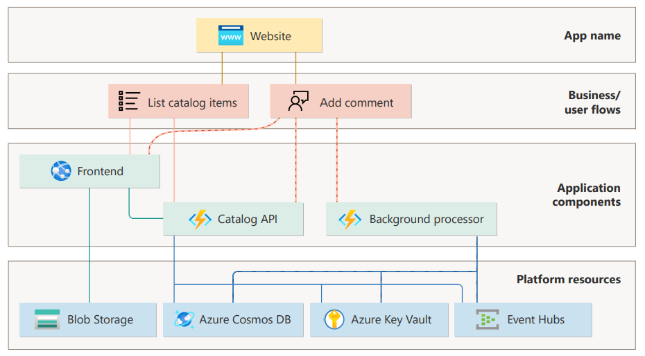
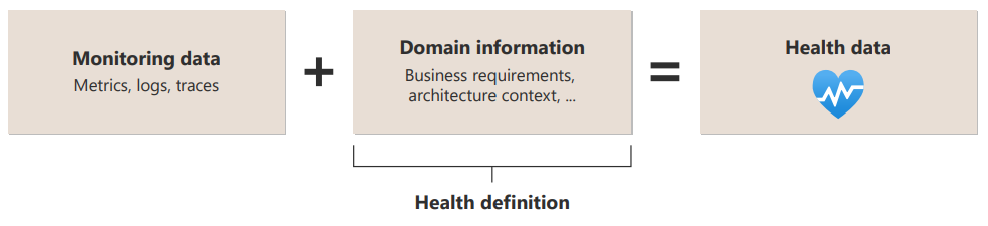

# Health modeling for workloads

Cloud applications generate high volumes of operational data, making it challenging to pinpoint remediation and resolve issues quickly. One common reason for this challenge is the absence of a health baseline that's customized to the functionality of the workload, and the ability to detect drift from that baseline. 

Health modeling is an **observability exercise that combines business context with raw monitoring data to quantify the overall health of a workload**. It helps set a baseline against which the workload is monitored. The data considered should include telemetry from both infrastructure and application components. Additionally, it may incorporate other information necessary to achieve the quality targets of the workload.

Modeling the health of a workload enables you to **identify drift from an expected operational state** and **make informed operational decisions** considering business impact. These deviations can be due to performance issues or operational degradation. Health modeling bridges the gap between tribal operational knowledge and actionable insights, enabling effective management of critical issues. It's an essential concept to maximize reliability and operational effectiveness. 

This guide offers practical guidance about modeling health, including how to build a model which assesses the runtime health of a workload and all its subsystems.

|Terminology|Definition|
|---|---|
|Health modeling|An observability exercise that uses business context to interpret monitoring data as health states.|
|Health model|A graphical representation of logical entities and their relationships for a given scope. Each node has a health state definition to rationalize monitoring data across the model.|
|Health entity|A logical component representing either an individual unit of a system, a logical combination of multiple related entities, or the overall system.|
|Health state|A defined and measurable status providing meaningful operational insights about the health of an entity.|
|Health signal|Individual data streams that provide insights into the operational behavior of an entity.|
|Model of models|An aggregated modeling scope where entities represent distinct health models for component systems.|

We recommend that you watch this video to get a high level understanding of health modeling.

> [!VIDEO https://learn-video.azurefd.net/vod/player?id=fd8c4e50-9d7f-4df0-97cb-d0474b581398&embedUrl=/azure/well-architected/mission-critical/mission-critical-health-modeling]

## What is health, health modeling, and a health model?

The term _health_ refers to the operational status of an entity and its dependencies. That entity could be an individual unit of a system, a logical combination of multiple related entities, or the overall system. 

We recommend that you represent health in one of three states: 

- **Healthy**: Operates optimally and meets quality expectations.

- **Degraded**: Exhibits less than healthy behavior, indicating potential issues.

- **Unhealthy**: In a critical state, requiring immediate attention.

> [!NOTE]
> Health can also be represented through a score rather than states to provide additional data granularity.

Health states are derived by combining monitoring data with domain information. Each state **must be defined** and **must be measurable**. They're calculated using _health signals_, which are individual data streams providing insights into the operational behavior of an entity. Signals can include metrics, logs, traces, or additional quality characteristics. For example, a health signal for a virtual machine entity might track the CPU utilization metric. Other signals for this entity could include memory usage, network latency, or error rates.

As you define health signals, factor in the nonfunctional requirements for the workload. In the example of CPU utilization, include the expected thresholds for each health state. If utilization exceeds the tolerated threshold (per the workload requirements), the system transitions from 'Healthy' to 'Degraded' or 'Unhealthy'. These state changes trigger appropriate alerts or actions. 

Health modeling requires entities have well-defined states derived from **multiple health signals** that are **contextualized** for the workload. For example, the health definition for virtual machine could be:

- **Healthy**. Key nonfunctional requirements and targets are fully satisfied, such as response time, resource utilization, and overall system performance. For example, 95% of requests are processed within 500 milliseconds. Virtual machine resources (such as CPU, memory, and storage) are used optimally, maintaining a balance between workload demands and available capacity. User experience is at expected levels.

- **Degraded**. Resources aren't performing optimally but are still operational. For example, the storage disk is experiencing throttling issues. Users might be experiencing slow responses.

- **Unhealthy**. Degradation is beyond tolerated limits. Resources are no longer responsive or available, and the system is no longer meeting acceptable performance levels. User experience is severely impacted. 

The outcome of health modeling is a _model_ or a graphical representation of logical entities and their relationships for a given workload architecture. Each node has a health state definition. 

> [!IMPORTANT]
> _Health modeling_ is an abstract concept that can be implemented with a good understanding of business scenarios and applied at different scopes.

In the image, 

-  _Entities_ are logical components of the workload that represent aspects of the system. They can be infrastructure components, such as servers, databases, networks, and others. They can also be specific application modules, pods, services, or microservices. Or, entities can capture user interactions and system flows within the workload.

   > [!NOTE]
   > User and system flows summarize nonfunctional requirements across business scenarios involving both application and infrastructure components. This reflects business value for the application.

- _Relationships_ between entities mirror the dependency chains within the system. For example, an application module may call specific infrastructure components, forming a relationship.

Consider a scenario where an ecommerce workload experiences a spike in failed messages on an Azure Service Bus queue, which is causing payments to fail. This issue is critical for the organization due to the implied revenue loss. While an application developer might understand the impact of this metric spike on payments, this tribal knowledge is often not shared across the operations team.

A health model can give operators immediate visibility into the issue and its impact. The payment flow depends on Azure Service Bus, one of the workload components. The visual representation reveals the degraded state of the Service Bus instance and its impact on the payments flow, allowing operators to understand the importance of the issue and focus their remediation efforts on that specific component.

Here's how health modeling helped the preceding scenario:

- Improved Time To Detect (TTD) and Time To Mitigate (TTM) by **enabling faster problem isolation**, leading to quicker detection of issues and potential fixes.

- Alerts were sent based on health states, which **reduced unnecessary noise**. Operators received notification with specific health context related to the business impact on payments.

- The extent of operational issues because of the dependency chains. This **accelerated impact assessments** and led to prioritized responses. Also, cascading or correlated issues were easily identified.

- Post-incident activities were conducted with accuracy because the health model provided **insights into the root causes of anomalies** and the specific health signals which were involved.

- Monitoring **data was meaningful for all team members**. It bridged the gap between tribal knowledge and shared insights.

- The company used the health model as **a baseline for future investments** in AI-driven operations (AIOps) to derive intelligent insights.

## Health model schema

Health models provide a distinct data schema optimized for observability use cases. This schema takes health modeling from an abstract concept to a measurable solution. By modeling your specific requirements, objectives, and architectural context, you can tailor health data to your unique scenario. 

Health is a relative data concept. Each model represents health data that's unique and prioritized to its contextual scope, even when using the same set of entities. What constitutes Healthy in a particular scenario may differ significantly from other contexts.

For example, consider Azure resources of the same type within your workload. 

- Virtual machine A running a CPU-sensitive application.
- Virtual machine B handing a memory-intensive service.

The health definitions for these machines will be different. Virtual machine A's health status will likely be influenced by CPU utilization metrics, while virtual machine B may prioritize memory-related metrics. 

> [!IMPORTANT]
> A health model shouldn't treat all failures the same. It should clearly distinguish between expected-transient but recoverable failures and a true disaster state.

## Build a health model

The initial process to build a health model is a logical design exercise, which typically involves the activities described in the following sections.

:::image type="content" source="./_images/health-model-activities.png" alt-text="Diagram that shows health modeling activities." lightbox="./_images/health-model-activities.png":::

#### Evaluate your workload design

- Infrastructure components like compute clusters and databases.

- Application components that run on compute and its relevant components.

- Logical or physical dependencies between components.

- [User and system flows](../reliability/identify-flows.md). For example, the health model for an ecommerce application should be able to represent the current state of critical processes like user sign-in, checkout, process payment, and so on.

#### Contextualize with business requirements

Evaluate the [relative importance and overall impact ](/azure/well-architected/reliability/identify-flows#identify-business-impact-of-each-flow) of each flow on your business. Consider factors such as user experience, security, and operational efficiency. For example, in most scenarios the failure of a payment process is likely to be more significant than the failure of a reporting process. 

Identify escalation paths for handling issues related to each flow. For more information, see [Optimize workload design using flows](./optimize-workload-using-flows.md).

> [!NOTE]
> The value of health modeling is only realized when you incorporate your business scenarios and context. This enables you to rationalize the business impact from operational issues.

#### Map to reliability metrics

Look for relevant [reliability metrics](../reliability/metrics.md) across the application design. 

Consider defining Service Level Indicators (SLIs) and Service Level Objectives (SLOs) for both the entire application and its individual business processes. These SLIs and SLOs should align with specific health signals considered for your health model. By doing so, you create a comprehensive definition of health that accurately reflects the achievement of an acceptable service level for the application.

> [!IMPORTANT]
> Service Level Indicators (SLIs) and Service Level Objectives (SLOs) are critical health signals. They are key to creating a meaningful definition of health that reflects a desired level of service along with other quality attributes. 
> Service Health Objectives (SHOs) can also be defined to capture a desired attainment of health over an aggregated time range.

#### Identify health signals

To build a comprehensive health model, correlate various types of monitoring data, including metrics, logs, and traces. By doing so, you ensure that the concept of health accurately reflects the runtime state of a specific entity or the entire workload.

##### Use platform metrics and logs

In the context of health modeling, it's essential to gather platform-level metrics and logs from underlying Azure resources. These metrics include CPU percentage, network in/out, and disk operations/sec. This data can be used in your health model to detect and predict potential issues, maintaining a reliable environment.

Moreover, this approach allows you to differentiate between transient faults (temporary disruptions) and nontransient faults (persistent issues).

> [!NOTE]
> As a best practice, all application resources should be configured to direct diagnostic logs and metrics to the chosen log aggregation technology. Build guardrails using [Azure Policy](/azure/governance/policy) to ensure consistent diagnostic settings across the application, enforcing the desired configuration for each Azure service.

##### Add application logs

Application logs are an important source of diagnostics data for your health model. Here are some best practices for application logging:

- **Use semantic or structured logging**. Structured logs facilitate automated consumption and analysis of log data at scale.
Consider storing Azure resource metrics and diagnostics data in an Azure Monitor Logs workspace rather than a storage account. This enables you to create health signals using [Kusto queries](/azure/data-explorer/kusto/concepts/#kusto-queries) for efficient evaluation.

- **Log data in the production environment**. Capture comprehensive data while the application operates in the production environment. Sufficient information is essential for health assessment and diagnosing any detected production issues.

- **Log events at service boundaries**. Include a correlation ID that traverses service boundaries. When a transaction involves multiple services and one of them fails, the correlation ID helps track requests throughout your application, pinpointing the cause of failure.

- **Use asynchronous logging**. Avoid synchronous logging operations that may block application code. Asynchronous logging ensures availability by preventing request backlogs during log writes.

- **Separate application logging from auditing**. Maintain audit logs separately from diagnostic logs. While audit records serve compliance or regulatory requirements, keeping them distinct prevents dropped transactions.

##### Implement distributed tracing

Implement distributed tracing by [correlating telemetry](/azure/azure-monitor/app/distributed-tracing-telemetry-correlation) across critical system flows. This provides insights into end-to-end transactions and is essential for effective root cause analysis (RCA) when failures occur.

##### Use health probes

Implement and run health probes outside the application to explicitly check the health and response of your application. Use probe responses as signals within your health model.

The implementation can be a measure of the response time from the application as a whole or its individual components. Probes can run processes to measure latency and check availability, or to extract information from the application. For more information, see [Health Endpoint Monitoring pattern](/azure/architecture/patterns/health-endpoint-monitoring).

Most load balancers support running health probes that ping application endpoints at configured intervals. Alternately, you can invoke them from an external watchdog service. A watchdog service aggregates health checks from across multiple components in the workload. Watchdogs can also host code that can perform immediate remediation for known health conditions.

#### Adopt white-box and black-box monitoring techniques 

White-box monitoring involves instrumenting the application with semantic logs and metrics. These metrics are collected directly from the application. Examples include monitoring current memory consumption, request latency, and other relevant application-level data. 

Strengthen that approach with black-box monitoring. This approach focuses on measuring platform services and their impact on the overall user experience. Unlike white-box monitoring, black-box monitoring doesn't require detailed knowledge of the system. It tests the externally visible behavior of the application. This approach is particularly useful for assessing SLOs and SLIs.

#### Model the design

Represent the identified application design as entities and relationships. Map health signals to specific components to quantify health states at an entity level. Consider the criticality of components to determine how health states should propagate through the model. For example, reporting components may not be as critical as other components, resulting in different impacts on overall workload health.

#### Set actionable alerts

Use evaluated health states to trigger alerts and automated action. Health should be integrated within existing operational runbooks as a core observability data tenet.

Typically, there's a one-to-one mapping between monitoring data and alert rules, which can lead to undesirable situations, such as alert storms and ambient alert noise. For example, in a compute cluster, high volumes of VM-level alerts based on CPU utilization and error count can overwhelm operators during failures causing delays in resolution. Similarly, when there's a high number of configured alerts, ambient alert noise often results in alerts being overlooked or ignored.

A health model introduces separation between monitoring data and alert rules. A health definition aggregates many signals into a single health state. The number of alerts consequently decreases allowing operators to focus on only high-value alerts that are critical for the business. Consider the ecommerce scenario, an alert can be defined to notify changes in the health of the process payments flow rather than underlying resources such as the Service Bus queue.

> [!NOTE]
> The ability to alert across all layers of the health model provides flexibility for the different workload personas. Application owners and product managers could be alerted to health state changes in key business scenarios or the entire workload. Operators could be alerted based on the health of infrastructure or application components.

#### Visualize the model

Create visual representations, such as tables or graphs, to convey the current state and history of the health model effectively. Ensure that the visualization aligns with the business context and provides actionable insights. 

When visualizing your health model, consider adopting a _traffic light_ approach to make health states immediately insightful across dependency chains. 

Assign green for healthy, amber for degraded, and red for unhealthy. By quickly identifying the color-coded states, you can efficiently locate the root cause of any application degradation.

:::image type="content" source="_images/health-impact.png" alt-text="The diagram shows a health model using a traffic light approach." border="false":::

> [!NOTE]
> ​It's also recommended to consider accessibility requirements for the visually impaired when dashboarding your health model. For diagramming best practices, see [Architecture design diagrams](/azure/well-architected/architect-role/design-diagrams).

## Adopt your health model

After building a health model consider these use cases to drive detection and interpretation of failures or operational issues.

#### Applicability to various roles

Health modeling can provide information specific to job functions or roles within the same context of the workload. For example, a DevOps role might need operational health information. A security officer maybe more concerned with intrusion signals and security exposure. A database administrator is likely only interested in a subset of the application model through the database resources only.

Tailor health insights for different stakeholders. Consider creating separate models from overlapping data sets.

#### Continuous validation

Use your health model to optimize testing and validation processes, such as load testing and chaos testing. By incorporating health models into your engineering lifecycle, you can not only validate the runtime operational state during testing but also assess the effectiveness of your model under scale and failure scenarios.

#### Organizational health

While health modeling is commonly associated with quantifying health states for individual applications, its applicability extends beyond that scope. 

At an individual workload level, health models provide a foundation for application observability and operational insights. Each application can have its own health model, capturing what health states mean within its context.

It's possible to combine multiple health models into a higher level construct by building a _model of models_. For example, you can build the observability footprint of a business unit or an entire cloud estate, by using health models as component entities within a larger model. Workloads within the estate are represented by their health models as nodes within the top level graph. Relationships in this model are then used to capture inter-application dependencies that may include data flows, service interactions, or shared infrastructure.

Consider a retail company with various applications for ecommerce, payments, and order processing. Each of these applications would be defined as an independent health model to quantify what health means for that particular workload. A parent model could then be used to map all of these component health models as entities, capturing inter-application operational impact through dependency chains. For example, if the ecommerce application were to become unhealthy, it would have a cascading impact on the payment application.

#### Health trends and AIOps

Health modeling provides a quantified operational baseline tuned to a specific business context. AIOps capabilities are becoming popular to enhance operational efficiency. Health data becomes a foundational input for machine learning models to analyze health trends. For example, 

- Extracting additional insights from state changes and recommending actions.

- Analyzing health trends over time, driving issue prediction, and model refinement.

## Maintain your health model

​Maintaining a heath model is a continuous engineering activity aligned to both development and operations. As your application evolves, make sure that your health model evolves in parallel. 

Also, treat health models as workload artifacts that should be integrated as part of your development lifecycle. Adopt Infrastructure as Code (IaC) for consistent, version-controlled management of your health model. Use automation so that as infrastructure and application components are added or removed from the workload the model is kept up-to-date. 

Health data gradually diminishes in value over time. To optimize operational efficiency and minimize costs, avoid retaining health data beyond 30 days. Archiving can be performed if necessary to satisfy audit requirements or in AIOps scenarios involving long term pattern analysis.

> [!NOTE]
> When archiving health data, ensure it remains coupled with the configuration state of the model. Without this context, interpreting state changes becomes challenging.

## Related links

- For implementing health probes in ASP.NET, see [Health checks in ASP.NET Core](/aspnet/core/host-and-deploy/health-checks).
- For information on monitoring metrics, see [Azure Monitor Metrics overview](/azure/azure-monitor/essentials/data-platform-metrics).
- For information on using Application Insights, see [Application Insights](/azure/azure-monitor/app/app-insights-overview).
- For design considerations and recommendations about [health modeling and observability for mission-critical workloads](/azure/well-architected/mission-critical/mission-critical-health-modeling) on Azure.
- For hands-on experience [designing a health model for your mission critical workload](/training/modules/design-health-model-mission-critical-workload/).

## Next steps

> [!div class="nextstepaction"]
> [Recommendations for designing a reliable monitoring and alerting strategy](../reliability/monitoring-alerting-strategy.md)
