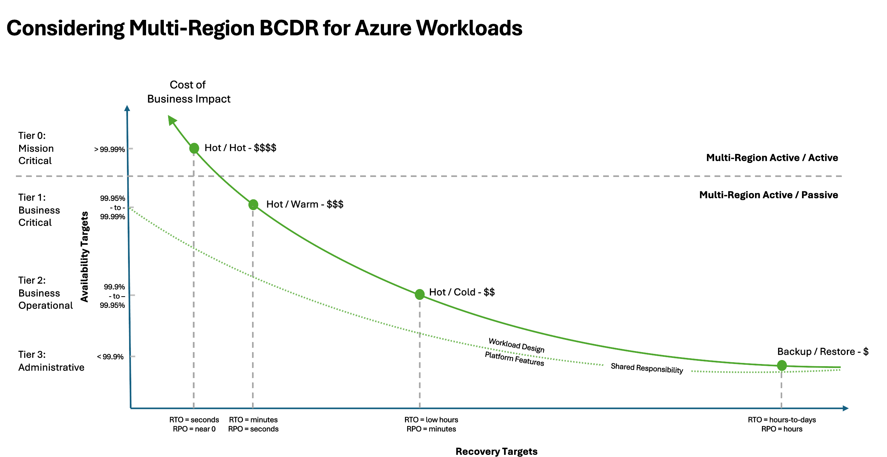

# Develop a disaster recovery plan

As a cloud solution architect, your job is to ensure that recovery from wide-scope failures isn't reactive but intentionally designed and documented as a disaster recovery (DR) plan. In case of failure, the effectiveness of that plan is what determines whether that failure is a temporary setback, or a reputational and financial crisis to the organization.

The plan is based stratgies guided by business priorities and governed by measurable objectives. This article guides you through the process of developing a practical DR plan, starting with the foundational practices of restoring services to mindset shift that defends business continuity under pressure.

## Terminology

Before you start developing your plan, familiarize yourself with a common vocabulary. Establish these terms as shared language to enable clear communication and coordinated decision-making when activating the DR plan. 

| Term | Definition |
|------|------------|
|**Active-active**| Two or more environments fully operational and serving live traffic simultaneously across multiple regions. If one environment fails, others continue handling the load with zero or near-zero disruption. |
|**Active-passive**| One primary environment handles all live traffic while a secondary environment remains on standby. The passive environment is kept updated through data replication and takes over when the primary fails. |
| **Active-passive (cold standby)** | Environment that is not running and requires provisioning and data restoration when activated. Lowest cost, longest recovery time. |
| **Active-passive (hot standby)** | Fully provisioned, running environment ready for immediate takeover. Continuously synchronized with active site, enabling near-instant failover. |
| **Active-passive (warm standby)** | Partially provisioned environment running minimal services that can scale up quickly during failures. |
| **Business continuity** | Comprehensive strategy ensuring critical operations continue during and after disruptions, encompassing DR, personnel, communication, and processes. |
|**Disaster recovery (DR) plan**| Detailed, executable procedures for recovering specific systems, including step-by-step actions, roles, responsibilities, failover sequences, and communication workflows. |
|**Disaster recovery (DR) strategy**| High-level approach defining goals, principles, and recovery posture for responding to catastrophic failures across workloads. |
| **DR activation** | Formal decision to initiate disaster recovery procedures, typically requiring executive authorization. |
| **Failback** | Process of returning workloads to the original primary environment after incident resolution. |
| **Failover** | Process of shifting workloads from primary to standby environment during a disaster. |
| **Graceful degradation** | Maintaining core functionality while less-critical components fail, preserving essential business capabilities. |
| **Recovery point objective (RPO)** | Maximum acceptable data loss measured in time during a failure event. |
| **Recovery time objective (RTO)** | Maximum acceptable downtime before business impact becomes unacceptable. |

## What is disaster recovery?

Disaster recovery (DR) is a strategic and methodical approach to restoring systems or critical parts of them, after a major failure event.

In cloud environments, temporary failures are normal. These brief disruptions, often referred to as _blips_, might result in availability of isolated components, unexpected drop in  performance. They're typically resolved through built-in self-healing mechanisms without human intervention, such as graceful degradation.

_Disasters_, however, are a different class of event. They are broad in scope, affect multiple systems or services simultaneously, and can bring the system to a halt. These events require external intervention, guided by a well-defined DR plan that can be activated when the system's built-in self-healing resilience isn't enough. Some examples include:

- Complete regional outages

- Loss of control plane access or service management capabilities

- Corrupted production environments due to malicious activity or critical misconfiguration

- Severe infrastructure failures affecting multiple tiers of the system

- Natural disasters or geopolitical events causing extended service unavailability

Unattended blips can escalate into full-scale disasters if left unchecked. While advanced monitoring and health modeling can help detect and mitigate these issues early, that topic is beyond the scope of this article. For more information, see [Health Modeling].

Ultimate goal of DR is business continuity within defined quantitative metrics. Think of the plan as a coordinated effort that requires predefined procedures, clear communication protocols, and executive-level decision-making. 

## Select your criticality tier

Not every workload needs a heroic recovery plan. Recovery should reflect the criticality of the workload or parts of it. 

Criticality is a business call and it's your responsibility to help guide that decision. It depends on what your workload does, who relies on it, and what happens if it goes down. Azure doesn't decide what's mission critical, _you do_. If an outage would hit your revenue, damage customer trust, or put you out of compliance, then that's a critical system. Own that decision, and design with it in mind.

Over-engineering low-impact services wastes resources; under-preparing high-impact ones risks serious consequences. The key is right-sizing your recovery strategy based on business impact. Use the following classification tiers as a starting point to assess criticality and align your disaster recovery investments appropriately.

A common way to quantify tiers is through Service Level Objectives (SLOs), often expressed as 'five nines' (99.999%), 'four nines' (99.99%), and so on. These percentiles broadly represent the level of availability expected for a given workload. 

Most important metrics in DR strategy are Recovery Time Objective (RTO) and Recovery Point Objective (RPO), both quantified as time units. RTO defines how quickly a system must be restored after a disruption, it's about downtime tolerance. RPO defines how much data loss is acceptable, it reflects how frequently data must be backed up.

This article assumes that your SLOs and recovery metrics have already been defined and will not cover how to calculate them. If you need guidance on establishing meaningful SLOs, refer to [Reliability metrics](../reliability/metrics.md).

#### Tier 0: Mission Critical

The mission-critical tier includes entire workloads or specific components where downtime is not an option and cost saving is secondary to continuity. These systems form the core of the organization, directly driving revenue, safeguarding customer trust, or impacting lives. Common examples include financial platforms, healthcare systems, and security infrastructure.

This tier demands SLOs above 99.99%, with RTO measured in seconds and RPO approaching zero. To meet these requirements, an active-active, multi-region deployment is typically necessary, enabling instant recovery with no interruption to users.

When mission-critical systems fail, the consequences are immediate and significant: lost revenue, reputational damage, or regulatory exposure. 

#### Tier 1: Business Critical

Business-critical systems are essential to day-to-day operations and customer experience, but unlike mission-critical systems, they can tolerate brief periods of disruption, as long as recovery is fast and data loss is minimal. These systems are often driven by revenue incentive, such as e-commerce platforms, customer-facing applications, and partner portals.

They typically require SLOs around 99.95%, with RTO and RPO measured in minutes. A mix of active-active or warm standby deployments is often used to balance resiliency with cost.

While short outages may be survivable, extended downtime in this tier directly affects revenue, user satisfaction, and brand credibility. Predictability of recovery is critical.

#### Tier 2: Business Operational

Business-operational systems support internal teams and processes. While not directly customer-facing, they are essential for productivity and operational continuity. Typical examples include reporting platforms, internal dashboards, and administrative tools.

These systems generally target SLOs around 99.9%, with RTO and RPO measured in hours. An acitve-passive with warm/cold deployment strategy is common, where secondary environments remain inactive until needed, optimizing for cost over speed.

Outages in this tier may not immediately impact customers, but longer disruptions can slow down the business. Timely recovery important, even if it's not immediate.

#### Tier 3: Administrative

Administrative systems are non-critical workloads that support background operations or serve low-urgency use cases. These typically include archival platforms, sandbox environments, training portals, or batch-processing tools where availability is not time-sensitive.

With SLOs below 99.9%, these systems tolerate longer recovery windows, with RTO ranging from hours to days and RPO measured in hours. The most cost-effective approach here is typically backup and restore, minimizing ongoing infrastructure costs while still preserving recoverability.

While delays in this tier are generally acceptable, data integrity must still be protected. These systems may not stop the business if they go down, but losing them entirely could still create compliance risks or knowledge gaps over time.

## Classify your workload

Before you start your DR strategy, classify your workloads based on actual business impact and recovery requirements. 

Start by listing every user flow in your workload. Document what it does, who relies on it, and what happens if it goes down.

Get your business stakeholders to sign off on these classifications. Confirm RTO and RPO targets based on real business consequences, not just technical opinions. Their commitment sets the foundation and your DR strategy builds on that. Without alignment on business risk, a technical response lacks direction. 

Review these classifications regularly. Business needs evolve, and your DR plan should too.

## Do cost modeling on recovery infrastructure and operations

The cost of disaster recovery scales with the criticality of the workload. 

- **Tier 0 (Mission Critical)** comes with the highest cost, and that's expected. Active-active deployments and redundant infrastructure significantly increase your spend in exchange for near-zero downtime. When it comes to cost optimization, your best options are standard practices like reserved instances or Azure Hybrid Benefit where applicable.

    Strive for simplicity in your design. Over-engineering beyond well-defined requirements is where hidden costs quietly build up. Keep in mind, foundational practices like infrastructure as code, automated deployments, and testing introduce upfront engineering effort. While that effort might compete with delivering new features in other tiers, for Tier 0, cutting corners is just not an option. 

- **Tier 1 (Business Critical)** offers a balance, typically using warm standby environments that reduce cost. 

    Lower baseline capacity in the warm standby by deploying compute resources in the secondary region at partial scale and enabling auto-scaling to ramp up only when needed. This approach avoids paying for full capacity 24/7.
    
    Using manually triggered failover process with an orchestrated runbook to reduce complexity and ongoing operational costs compared to fully automated failover. Regular failover testing helps identify inefficiencies,

- **Tier 2 (Business Operational)** focuses on cutting costs by using cold standby setups and pay-as-you-go options like spot instances and consumption pricing. Automate provisioning of PaaS compute in the secondary region only when needed to avoid paying for idle resources. Define clear disaster criteria and failover processes to prevent unnecessary failovers. Regular testing ensures recovery targets are met and highlights areas to trim costs.

- **Tier 3 (Administrative)** prioritizes cost savings by relying on backup and archival storage with longer recovery windows. Use replicated Azure Backup vaults in a secondary region to protect persistent data without running standby infrastructure. Regularly test restore processes to ensure reliability while keeping expenses to a minimum.

Whatever your tier might be, use the right tooling to review costs. Azure Cost Management and Azure Advisor provide tools to monitor, forecast, and optimize spending across all tiers. Tagging resources and setting budget thresholds are essential for accountability and chargeback models.

## Recovery strategy for active-active deployments 

Active-active deployments maximize service availability by running multiple workload instances across regions, with each instance actively handling production traffic (hot standby). This design eliminates downtime and enables instant failover but it also demands precise planning to manage consistency, routing, and cost across distributed systems.

Choose one of two deployment approaches:

- **Active-active (at capacity)**: Mirrored deployment stamps in two or more regions, where each region handles a share of the production load and can scale up to absorb full load during regional failure.

-  **Active-active (overprovisioned)**: Mirrored deployment stamps in two or more regions, Each region is at full scale at all times to independently handle 100% of traffic.

#### Suggested actions

> Use this as a foundation for your workload's disaster recovery strategy. Extend it as necessary, but keep the structure action-oriented and focused. Each step should include a clear objective and a way to validate its effectiveness.

| Actions | Configuration | Validation |
|---------|---------------|------------|
| **Configure traffic management for instant failover** | • [Azure Front Door](../service-guides/azure-front-door.md) or [Traffic Manager](../service-guides/azure-traffic-manager.md) with latency-based or weighted routing • Health probes configured per endpoint • Automatic rerouting of traffic upon failure detection | • Test failover scenarios across regions • Verify health probe accuracy and response times • Validate traffic routing during simulated outages |
| **Set up data replication and maintain consistency** | • Set up multi-region read/write with configurable consistency levels, like for [Azure Cosmos DB](../service-guides/cosmos-db.md). • Readable geo-replicas for relational databases with read-only connections • CQRS • Dual-writes with idempotent handling • Define and enforce data consistency levels (strong, eventual, bounded staleness) | • Test data synchronization lag and consistency • Verify failover data integrity • Validate read/write operations during regional failures |
| **Define and document recovery objectives** | • RTO: Typically measured in seconds • RPO: As close to zero as architecture allows | • Conduct regular failover testing to validate against these metrics and surface gaps • Measure actual recovery times during drills • Document performance gaps and remediation plans |
| **Monitor load behavior** | • Document load threshold each region handles during normal operation • Expected performance and scale-up behavior if peer region fails • Define system behavior under single-region failure, partial service disruption, network partitioning | • Test regional failure scenarios under load • Validate auto-scaling behavior during failover • Verify performance degradation limits • Test network partition handling |
| **Prepare operations** | • Infrastructure as Code: Bicep, Terraform, ARM templates • Deployment automation: CI/CD pipelines for both regions • Runbooks: Automated and manual steps for invoking DR procedures | • Scheduled chaos testing or failure injection to validate readiness • Test IaC deployment consistency across regions • Validate runbook execution and timing • Verify CI/CD pipeline resilience |
| **Secure DR environment and maintain compliance** | • Validate data residency across all regions • Maintain identity and access parity between regions • Test for audit trail continuity during and after failover | • Audit security configurations across regions • Test identity failover scenarios • Verify compliance during DR events • Validate audit log continuity |
| **Create communication plans and protocols** | • Establish clear chain of command for DR activation • Establish stakeholder notification methods for internal and external communication • Configure communication tools and create predefined messaging templates  •  Document escalation procedures | • Test communication channels during DR drills • Verify notification delivery and escalation paths • Validate external communication effectiveness • Test messaging template accuracy |

## Recovery strategy for active-passive (warm standby)

Active-passive warm standby deployments balance cost and resilience by maintaining a minimally provisioned secondary environment that can scale quickly during failure events. This approach reduces downtime while avoiding the full cost of always-on redundancy across regions.

The primary region handles all production traffic under normal conditions, while the secondary region runs with minimal resources and scales up only when activated for disaster recovery.

#### Suggested actions

> Use this as a foundation for your workload's disaster recovery strategy. Extend it as necessary, but keep the structure action-oriented and focused. Each step should include a clear objective and a way to validate its effectiveness.

| Actions | Configuration | Validation |
|---------|---------------|------------|
| **Set up primary and secondary regions** | • Deploy full-scale workload in primary region • Deploy minimal viable footprint in secondary region • Pre-provision critical infrastructure components in secondary region | • Verify secondary region infrastructure readiness • Test minimal footprint startup times • Validate dependency availability across regions |
| **Configure priority-based traffic routing** | • [Azure Traffic Manager](../service-guides/azure-traffic-manager.md) or [Azure Front Door](../service-guides/azure-front-door.md) with priority-based routing • Primary region handles all traffic during normal operations • Secondary region receives traffic only upon failover | • Test traffic failover scenarios • Verify routing priority configurations • Validate DNS propagation times |
| **Enable auto-scaling in secondary region** | • Configure auto-scale rules to increase compute resources post-failover • Set appropriate scaling thresholds and limits • Define startup sequences for dependent services | • Test scaling behavior during failover drills • Validate startup times meet RTO targets • Verify resource availability during scale-up |
| **Set up continuous data replication** | • Geo-replication for critical data stores • Configure replication lag monitoring • Establish data consistency validation processes | • Test data synchronization lag against RPO targets • Verify replication status monitoring • Validate data integrity during failover scenarios |
| **Configure failover procedures** | • Enable auto-failover where supported • Document manual failover procedures for other services • Create orchestrated failover runbooks with step-by-step processes | • Test automated failover mechanisms • Validate manual failover procedures • Verify runbook execution timing and accuracy |
| **Monitor readiness and health** | • Implement health checks for replication status • Configure alerts for auto-scale events and traffic routing • Ensure observability tools cover both regions | • Test monitoring and alerting systems • Verify health check accuracy • Validate observability coverage |
| **Secure DR environment and maintain compliance** | • Validate data residency across all regions • Maintain identity and access parity between regions • Test for audit trail continuity during and after failover | • Audit security configurations across regions • Test identity failover scenarios • Verify compliance during DR events • Validate audit log continuity |
| **Create communication plans and protocols** | • Establish clear chain of command for DR activation • Establish stakeholder notification methods for internal and external communication • Configure communication tools and create predefined messaging templates  •  Document escalation procedures | • Test communication channels during DR drills • Verify notification delivery and escalation paths • Validate external communication effectiveness • Test messaging template accuracy |

## Recovery strategy for active-passive (cold standby)

Active-passive cold standby deployments keeps the secondary region's compute resources stopped until needed. This approach is ideal for Tier 2 or Tier 3 workloads, where RTOs can tolerate longer delays but recovery must still be reliable and repeatable.

The primary region handles all production traffic while the secondary region maintains infrastructure readiness with minimal running resources, requiring manual activation during disaster scenarios.

#### Suggested actions

> Use this as a foundation for your workload's disaster recovery strategy. Extend it as necessary, but keep the structure action-oriented and focused. Each step should include a clear objective and a way to validate its effectiveness.

| Actions | Configuration | Validation |
|---------|---------------|------------|
| **Extend active to secondary region** | • Duplicate network topology, policies, and configurations from primary • Ensure RBAC, security baselines, monitoring agents, and policies are consistent • Deploy infrastructure as code with compute resources stopped | • Verify secondary region infrastructure readiness • Test policy consistency across regions • Validate network connectivity and routing |
| **Configure priority-based traffic routing** | • [Azure Front Door](../service-guides/azure-front-door.md) or [Traffic Manager](../service-guides/azure-traffic-manager.md) with priority-based routing • Route all production traffic to primary region under normal conditions • Configure automated traffic redirection upon failover | • Test traffic failover scenarios • Verify routing priority configurations • Validate DNS propagation and cutover times |
| **Set up cross-region data replication** | • Enable built-in replication, like for Azure SQL Database, PostgreSQL, MySQL, Cosmos DB • Enable GZRS or RA-GZRS for paired-region storage replication • Configure object replication for Blob Storage in non-paired regions | • Test data synchronization lag against RPO targets • Verify replication health and latency metrics • Validate data consistency between regions |
| **Automate compute provisioning** | • Define IaC templates for provisioning PaaS services when activated • Include service configurations, scaling parameters, and dependencies • Pre-define scale targets to meet full load when activated | • Test automated provisioning procedures • Verify compute startup times meet RTO targets • Validate service dependency activation sequences |
| **Enable Azure Site Recovery for IaaS** | • Protect critical VMs with ASR for cross-region failover • Define recovery plans and failover groups within ASR • Configure replication policies and retention settings | • Test ASR failover scenarios • Verify VM recovery plan execution • Validate application consistency during failover |
| **Define failover runbook and criteria** | • Establish clear failover triggers and activation criteria • Document manual activation steps including compute startup and DNS updates • Include rollback procedures for failed or temporary activations | • Test failover runbook execution • Verify manual activation procedures • Validate rollback processes and timing |
| **Monitor readiness and health** | • Set alerts on replication health and latency metrics • Monitor secondary region infrastructure status • Track activation readiness across all components | • Test monitoring and alerting systems • Verify infrastructure health checks • Validate readiness indicators accuracy |
| **Create communication plans and protocols** | • Establish clear chain of command for DR activation • Establish stakeholder notification methods for internal and external communication • Configure communication tools and create predefined messaging templates  •  Document escalation procedures | • Test communication channels during DR drills • Verify notification delivery and escalation paths • Validate external communication effectiveness • Test messaging template accuracy |

## Recovery strategy for backup and restore

Backup and restore strategies are designed for Tier 3 administrative workloads that are non-critical to daily business operations. These systems can tolerate longer recovery windows measured in hours to days, making cost-effective backup solutions the appropriate choice.

#### Suggested actions

> Use this as a foundation for your workload's disaster recovery strategy. Extend it as necessary, but keep the structure action-oriented and focused. Each step should include a clear objective and a way to validate its effectiveness.

| Actions | Configuration | Validation |
|---------|---------------|------------|
| **Configure backup policies and retention** | • Use [Azure Backup](../service-guides/azure-backup.md) for VMs, Azure Files, and Blob Storage • Store backups in Geo-Redundant Backup Vault in secondary region • Define backup frequency and retention aligned with RPO requirements | • Test backup policy execution • Verify backup completion and integrity • Validate retention policy enforcement |
| **Implement cost-effective storage tiers** | • Use Archive or Cool storage tiers for infrequently accessed data • Apply backup tiering policies to transition older backups to lower-cost options • Configure compression and deduplication to minimize storage costs | • Review storage cost optimization reports • Verify tiering policy execution • Test data retrieval from different storage tiers |
| **Document restore procedures** | • Maintain runbooks with detailed recovery steps • Define target environments for restoration • Include contact lists for approvals and escalations | • Test restore procedure documentation accuracy • Verify contact information currency • Validate approval processes |
| **Test restore processes regularly** | • Schedule periodic restore drills to validate backup integrity • Include restoration to staging environments • Log time taken and compare against RTO targets | • Execute quarterly restore drills • Verify data consistency post-restore • Document performance against RTO targets |
| **Monitor backup costs and compliance** | • Enable Azure Cost Management with backup-specific tags • Set budget thresholds for backup-related resource groups • Ensure retention meets regulatory compliance requirements | • Review backup cost reports monthly • Verify budget threshold effectiveness • Audit compliance with retention policies |
| **Maintain and audit backup systems** | • Perform quarterly audits of backup requirements • Retire obsolete systems and adjust policies • Review and update RPO/RTO requirements based on business changes | • Execute quarterly backup audits • Verify system retirement procedures • Validate requirement changes with stakeholders |
| **Create communication plans and protocols** | • Establish clear chain of command for restore activation • Document stakeholder notification procedures • Create predefined messaging templates for restore events | • Test communication channels during restore drills • Verify notification delivery mechanisms • Validate escalation procedures |

## Document your DR plan as a runbook

A strong runbook replaces abstract strategies with structure and allows the team respond under pressure. Make it clear, make it practical, and make sure it works. Start with a simple outline and build gradually. Collaborate with business, security, and operations to ensure full coverage.

- **Activation criteria and approvals**. Establish what qualifies as a DR event. Identify who has authority to trigger the DR process. Document escalation paths and decision checkpoints.

- **Create contact matrix and communication plan**. List key personnel, roles, and backup contacts. Assign clear ownership of internal and external communication. Prepare pre-approved messaging templates for email, status page, and incident channels.

- **Document failover and failback procedures**. Write step-by-step technical instructions for initiating failover. Reference tools and scripts to execute with links or references. Establish criteria for initiating failback and coordinated cut-back steps.

- **Establish health validation and readiness checks**. Define how you verify service functionality post-failover. Include application-level, infrastructure, and data integrity checks.

- **Plan post-recovery and review**. Outline actions to clean up temporary environments. Document data reconciliation if applicable. Schedule root cause analysis and DR debrief.

> [!IMPORTANT]
> Treat your DR runbook like production code: version it and make it accessible. Use version control tools like Git or a versioned wiki to track updates and ensure accuracy over time. Just as important, make sure the runbook is always reachable, even during an outage. Store it in multiple formats, including offline or printable versions, so teams can access it when it matters most.

## Test regularly and improve the plan

Disaster recovery is an operational discipline. A DR plan that's never tested stays theoretical and unproven.

* Rehearse the runbook to simulate scenarios and clarify team roles.
* Schedule full or partial failover drills to validate actual recovery steps and timings.
* Capture any gaps or issues discovered, then update your architecture and runbooks promptly.

## Watch out for these friction points

Here are some key friction points that you should be cautious, otherwise DR planning can turn into a costly exercise without the right outcomes.

- **Mismatch between expectations and budget**. Set expectations properly so that  stakeholders don't expect hot standby performance on a cold standby budget. The gap between RTO/RPO promises and budgest can lead to risk and disappointment.

- **Shared service dependencies can break your chain**. Your DR plan is only as effective as its weakest component. If your workloads depend on shared or third-party resources, which lack proper failover strategies, it can create vulnerabilities during a disaster.

- **DR activation criteria must be crystal clear**. Everyone listed in the accountability list must be clear on the criteria. Without this, there might be hesitatation to initiate recovery, which can cause unnecessary delays.

- **Failback is just as important as failover**. While many focus on treating failover as a cutover, sometimes failback might be a viable option. However, returning operations to the primary site often involves more complexity. Make sure to plan and test failback procedures. A good guideline is to automate failover while managing failback through a controlled process.

## Next steps

- [RE:09 Architecture strategies for designing a disaster recovery strategy](../reliability/disaster-recovery.md)

- [RE:05 Architecture strategies for designing for redundancy](../reliability/redundancy.md)

------

## Dump zone

### Understand your part in the shared responsibility model with Azure

In cloud computing, shared responsibility defines the clear division of operational and security duties between the Azure platform and your organization. Azure guarantees the reliability, security, and availability of the underlying physical infrastructure, networking, and core platform services. Meanwhile, your organization is responsible for securing your data, managing identity and access controls, configuring workloads, and ensuring compliance. This collaborative model is essential for building resilient and reliable disaster recovery (DR) strategies.

//TODO: The above is no good. Needs more. What does that have to do with recovery. what's shared responsibility in terms of recoverability look like.
* Confirm recovery priority is appropriately categorized as Tier 3

---

## Understand your part in the shared responsibility model with Azure

In cloud computing, shared responsibility defines the clear division of operational and security duties between the Azure platform and your organization. Azure guarantees the reliability, security, and availability of the underlying physical infrastructure, networking, and core platform services. Meanwhile, your organization is responsible for securing your data, managing identity and access controls, configuring workloads, and ensuring compliance. This collaborative model is essential for building resilient and reliable disaster recovery (DR) strategies.

//TODO: The above is no good. Needs more. What does that have to do with recovery. what's shared responsibility in terms of recoverability look like.
* Confirm recovery priority is appropriately categorized as Tier 3

