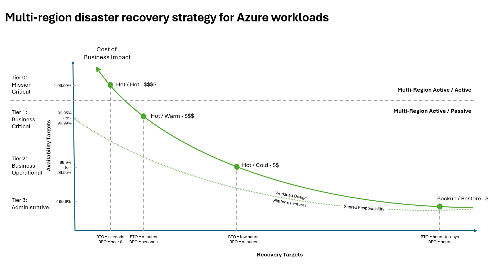

# Develop a disaster recovery plan

As a cloud solution architect, your job is to ensure that recovery from wide-scope failures isn't reactive but intentionally designed and documented as a disaster recovery (DR) plan. In case of failure, the effectiveness of that plan is what determines whether that failure is a temporary setback, or a reputational and financial crisis to the organization.

The design of the plan is based stratgies guided by business priorities and governed by measurable objectives. Without a proper plan, failure can turn into liability.

This article guides you through the process of developing a practical DR plan, starting with the foundational practices of restoring services to mindset shift that defends business continuity under pressure.

## Terminology

Before you start developing your plan, familiarize yourself with a common vocabulary. Establish these terms as shared language to enable clear communication and coordinated decision-making when activating the DR plan. 

| Term | Definition |
|------|------------|
|**Active-active**| Two or more environments fully operational and serving live traffic simultaneously across multiple regions. If one environment fails, others continue handling the load with zero or near-zero disruption. |
|**Active-passive**| One primary environment handles all live traffic while a secondary environment remains on standby. The passive environment is kept updated through data replication and takes over when the primary fails. |
| **Active-passive (cold standby)** | Environment that is not running and requires provisioning and data restoration when activated. Lowest cost, longest recovery time. |
| **Active-passive (hot standby)** | Fully provisioned, running environment ready for immediate takeover. Continuously synchronized with active site, enabling near-instant failover. |
| **Active-passive (warm standby)** | Partially provisioned environment running minimal services that can scale up quickly during failures. |
| **Business continuity** | Comprehensive strategy ensuring critical operations continue during and after disruptions, encompassing DR, personnel, communication, and processes. |
| **Business impact analysis (BIA)** | Assessment process quantifying financial and operational impacts of service disruptions across different timeframes to prioritize recovery efforts. |
|**Disaster recovery (DR) plan**| Detailed, executable procedures for recovering specific systems, including step-by-step actions, roles, responsibilities, failover sequences, and communication workflows. |
|**Disaster recovery (DR) strategy**| High-level approach defining goals, principles, and recovery posture for responding to catastrophic failures across workloads. |
| **DR activation** | Formal decision to initiate disaster recovery procedures, typically requiring executive authorization. |
| **Failback** | Process of returning workloads to the original primary environment after incident resolution. |
| **Failover** | Process of shifting workloads from primary to standby environment during a disaster. |
| **Graceful degradation** | Maintaining core functionality while less-critical components fail, preserving essential business capabilities. |
| **Maximum tolerable downtime (MTD)** | Absolute limit for service unavailability before irreversible business damage occurs, typically 2–4× the RTO. |
| **Recovery point objective (RPO)** | Maximum acceptable data loss measured in time during a failure event. |
| **Recovery time objective (RTO)** | Maximum acceptable downtime before business impact becomes unacceptable. |

## What is disaster recovery?

Disaster recovery (DR) is a strategic and methodical approach to restoring systems or critical parts of them, after a major failure event.

In cloud environments, temporary failures are normal. These brief disruptions, often referred to as _blips_, might impact isolated components or degrade performance but are typically resolved through built-in self-healing mechanisms without human intervention.

_Disasters_, however, are a different class of event. They are broad in scope, affect multiple systems or services simultaneously, and can bring the system to a halt. These events require external intervention, guided by a well-defined DR plan that can be activated when the system's built-in self-healing resilience isn't enough. Some examples include:

- Complete regional outages

- Loss of control plane access or service management capabilities

- Corrupted production environments due to malicious activity or critical misconfiguration

- Severe infrastructure failures affecting multiple tiers of the system

- Natural disasters or geopolitical events causing extended service unavailability

Unattended blips can escalate into full-scale disasters if left unchecked. While advanced monitoring and health modeling can help detect and mitigate these issues early, that topic is beyond the scope of this article. For more information, see [Health Modeling].

Ultimate goal of DR is business continuity within defined quantitative metrics. Think of the plan as a coordinated effort that requires predefined procedures, clear communication protocols, and executive-level decision-making. 

## Select your criticality tier

Not every workload needs a heroic recovery plan. Recovery should reflect the criticality of the workload or parts of it. 

Criticality is a business call and it's your responsibility to help guide that decision. It depends on what your workload does, who relies on it, and what happens if it goes down. Azure doesn't decide what's mission critical, _you do_. If an outage would hit your revenue, damage customer trust, or put you out of compliance, then that's a critical system. Own that decision, and design with it in mind.

Over-engineering low-impact services wastes resources; under-preparing high-impact ones risks serious consequences. The key is right-sizing your recovery strategy based on business impact. Use the following classification tiers as a starting point to assess criticality and align your disaster recovery investments appropriately.

A common way to quantify tiers is through Service Level Objectives (SLOs), often expressed as 'five nines' (99.999%), 'four nines' (99.99%), and so on. These percentiles broadly represent the level of availability expected for a given workload. 

From most important metrics in disaster recovery planning are Recovery Time Objective (RTO) and Recovery Point Objective (RPO), both quantified as time units. RTO defines how quickly a system must be restored after a disruption, it's about downtime tolerance. RPO defines how much data loss is acceptable, it reflects how frequently data must be backed up.

This article assumes that your SLOs and recovery metrics have already been defined and will not cover how to calculate them. If you need guidance on establishing meaningful SLOs, refer to [link].

#### Tier 0: Mission Critical

The mission-critical tier includes entire workloads or specific components where downtime is not an option and cost saving is secondary to continuity. These systems form the core of the organization, directly driving revenue, safeguarding customer trust, or impacting lives. Common examples include financial platforms, healthcare systems, and security infrastructure.

This tier demands SLOs above 99.99%, with RTO measured in seconds and RPO approaching zero. To meet these requirements, an active-active, multi-region deployment is typically necessary, enabling instant recovery with no interruption to users.

When mission-critical systems fail, the consequences are immediate and significant: lost revenue, reputational damage, or regulatory exposure. 

#### Tier 1: Business Critical

Business-critical systems are essential to day-to-day operations and customer experience, but unlike mission-critical systems, they can tolerate brief periods of disruption, as long as recovery is fast and data loss is minimal. These systems are often driven by revenue incentive, such as e-commerce platforms, customer-facing applications, and partner portals.

They typically require SLOs around 99.95%, with RTO and RPO measured in minutes. A mix of active-active or warm standby deployments is often used to balance resiliency with cost.

While short outages may be survivable, extended downtime in this tier directly affects revenue, user satisfaction, and brand credibility. Predictability of recovery is critical.

#### Tier 2: Business Operational

Business-operational systems support internal teams and processes. While not directly customer-facing, they are essential for productivity and operational continuity. Typical examples include reporting platforms, internal dashboards, and administrative tools.

These systems generally target SLOs around 99.9%, with RTO and RPO measured in hours. An acitve-passive with warm/cold deployment strategy is common, where secondary environments remain inactive until needed, optimizing for cost over speed.

Outages in this tier may not immediately impact customers, but longer disruptions can slow down the business. Timely recovery important, even if it's not immediate.

#### Tier 3: Administrative

Administrative systems are non-critical workloads that support background operations or serve low-urgency use cases. These typically include archival platforms, sandbox environments, training portals, or batch-processing tools where availability is not time-sensitive.

With SLOs below 99.9%, these systems tolerate longer recovery windows, with RTO ranging from hours to days and RPO measured in hours. The most cost-effective approach here is typically backup and restore, minimizing ongoing infrastructure costs while still preserving recoverability.

While delays in this tier are generally acceptable, data integrity must still be protected. These systems may not stop the business if they go down, but losing them entirely could still create compliance risks or knowledge gaps over time.

## Understand your part in the shared responsibility model with Azure

In cloud computing, shared responsibility defines the clear division of operational and security duties between the Azure platform and your organization. Azure guarantees the reliability, security, and availability of the underlying physical infrastructure, networking, and core platform services. Meanwhile, your organization is responsible for securing your data, managing identity and access controls, configuring workloads, and ensuring compliance. This collaborative model is essential for building resilient and reliable disaster recovery (DR) strategies.

//TODO: Needs more.

## Analyze the costs of recovery infrastructure and operations

TBD