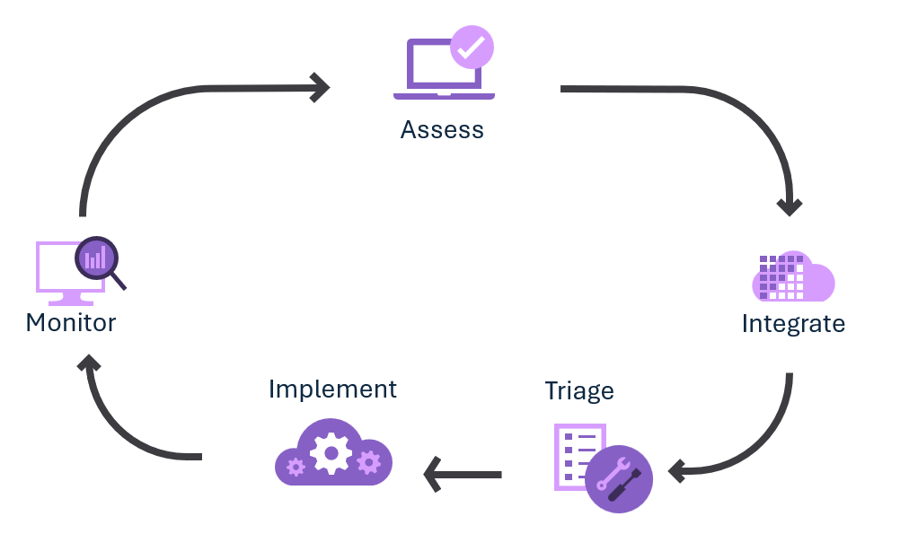

# Complete an Azure Well-Architected Review assessment

[Azure Well-Architected Review](/assessments/azure-architecture-review/) is a self-assessment that helps a workload team examine a workload from the perspective of the Azure Well-Architected Framework. The assessment consists of approximately 60 questions based on the key recommendations from the Well-Architected Framework pillars. The tool can also integrate [Azure Advisor](/azure/advisor/) recommendations for your workload's Azure subscription or resource group.

Before starting the assessment, it is essential to prioritize the pillars according to your specific business needs. This approach helps you allocate your efforts more effectively and efficiently. Upon completion, you receive recommendations with links to supporting materials that help improve your workload's design. You can export these recommendations to integrate them into your operational processes for continuous workload improvement.

> [!TIP]
> The Azure Well-Architected Review assessment contains multiple sub assessments, be sure to select "Core Well-Architected Review" when prompted. This will allow you to evaluate your full workload, not just a specific technology.

## When to take the assessment

For greenfield workloads, we recommend that you perform the assessment during the initial design process, entering the proposed decisions. The guidance then acts as a baseline and starts a feedback loop that you can use to refine the workload design as you make additional design decisions and periodically capture them in additional assessment milestones.

Brownfield workloads should be examined as well, as part of the workload's continuous improvement cycle. Set a cadence, for example every four months, and use milestones to track how the workload design can continue to improve.

## Receive and integrate recommendations

After completing the assessment, the recommendations for your current milestone are available on the assessment's guidance page. Export these recommendations by selecting the **Export to CSV** button. You can use the offline copy to share the recommendations and start prioritizing them. Although some teams might consider the CSV file sufficient, we recommend adding the recommendations to the workload's backlog so they can be integrated into the workload's software development lifecycle (SDLC).

> [!TIP]
> [DevOps Tooling for Well-Architected Recommendation Process](https://github.com/Azure/WellArchitected-Tools/tree/main/WARP/devops#readme) provides example scripts that can help you create automation for backlog integration. These scripts show one way to import the recommendations from the Well-Architected Review CSV file into an existing Azure DevOps or GitHub organization.

## Prioritize and implement recommendations

Workload owners and key stakeholders should prioritize the recommendations in accordance with the team's standard work prioritization process, factoring in the applicability of the recommendations and any tradeoffs associated with a specific design decision. For example, recommendations might be assigned to a specific owner, or a recommendation might be postponed or dismissed. Like all planned work, the recommendation should be tracked until it's resolved, as part of the workload's SDLC.

## Monitor improvements

Over time, the workload will evolve due to functionality changes, eliminating or accruing technical debt, and making tradeoffs. Use the milestone feature of the assessment to track this change over time, using the prior milestone as a baseline. You'll see the change over time in the [Azure Well-Architected Review](/assessments/azure-architecture-review/). The workload's component of the subscription's [Azure Advisor](/azure/advisor/) score will likely improve as well.

## Tips

- The assessment is a collaborative effort that requires the active and honest participation of multiple experts and stakeholders within a workload. It is essential that all participants feel comfortable discussing shortcomings openly, without fear of repercussions, so the team avoids obscuring workload risks or misses opportunities for improvement.

- You should always sign in when you take assessments so that the tool can generate milestones.

  > [!WARNING]
  > Assessments are tied to a Microsoft Learn profile. They can't be transferred to or accessed by other profiles.

- Select the Azure subscription or resource group that contains the biggest portion of your workload. Doing so helps ensure that only relevant Advisor recommendations are included in exported CSV files. It's not possible to include more than one subscription or to exclude resource groups.

- Choose a meaningful name for the assessment, not the default value. The assessment's name should include the workload's name.

- Use meaningful milestone names to indicate when you're evaluating the workload.

- Use the notes feature on questions and on recommendations to capture any specifics that you want to discuss with the workload team.

- Rather than answering the 60 questions across all five pillars in one assessment, consider taking the assessment one pillar at a time, staggered by month. Be sure to include the name of the pillar in the assessment's name.

## Get personalized support

Work with your [Microsoft partner](https://appsource.microsoft.com/marketplace/partner-dir) or your account team to learn how they can help you perform an assessment as a formal engagement. As part of that engagement, they can provide further details on the recommendations. These details can help you determine the applicability of recommendations and how to prioritize them for remediation.

## Specialized Well-Architected reviews

The Microsoft Assessments platform has multiple assessments that apply the Well-Architected Framework perspective to a narrower scope such as a specific technology or workload classification. You use these assessments as you are fine-tuning your design decisions for that specific technology or workload. Take these assessments in addition to the "Core Well-Architected Review" for a more complete evaluation of your design.

Examples of other Well-Architected review assessments:

- [AI workload](/assessments/ea306cce-c7fa-4a2b-89a6-bfefba6a9cf4/)
- [Analytics](/assessments/5eaa8702-ebdb-44cf-8b40-17c3f3b63330/)
- [Azure AI Search](/assessments/783533b2-403a-4985-8c60-97db4910f741/)
- [Azure Virtual Desktop workload](/assessments/1ef67c4e-b8d1-4193-b850-d192089ae33d/)
- [Data Services](/assessments/azure-architecture-review-data/)
- [SaaS workload](/assessments/d349c8c3-fe9c-4829-afdd-a5228e72a570/)

To see all of the Well-Architected review assessments, use the [Microsoft Assessments browser](/assessments/browse/?page=1&pagesize=30&searchterm=well-architected).

## Next step

> [!div class="nextstepaction"]
> [Complete an Azure Well-Architected Review](/assessments/azure-architecture-review/)

 <!-- Updated: August 13, 2025 for a full review -->
