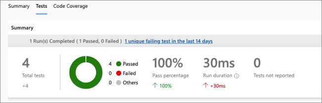

# Modernize your software development with continuous integration

As code is developed, updated, or even removed, having an intuitive and safe method to integrate these changes into the main code branch enables developers to provide value.

As a developer, you can make small code changes, push these changes to a code repository, and get almost instantaneous feedback on the quality, test coverage, and introduced bugs. This process lets you work faster and with more confidence and less risk.

Continuous integration (CI) is a practice where source control systems and software deployment pipelines are integrated to provide automated build, test, and feedback mechanisms for software development teams.

The continuous integration process starts when an engineer creates a GitHub pull request to signal to the CI system that code changes are ready to be integrated. Ideally, the integration process validates the code against several baselines and tests. It then provides feedback to the requesting engineer on the status of these tests.

If baseline checks and testing go well, the integration process produces and stages assets that will deploy the updated software. These assets include compiled code and container images.

Continuous integration can help you deliver high-quality software more quickly by performing the following actions:

- Run automated tests against the code to provide early detection of breaking changes.
- Run code analysis to ensure code standards, quality, and configuration.
- Run compliance and security checks to ensure that the software has no known vulnerabilities.
- Run acceptance or functional tests to ensure that the software operates as expected.
- Provide quick feedback on detected problems.
- Where applicable, produce deployable assets or packages that include the updated code.

## Automate continuous integration with pipelines

To achieve continuous integration, use software solutions to manage, integrate, and automate the process. A common practice is to use a continuous integration pipeline.

A continuous integration pipeline involves a piece of software (often cloud hosted) that provides:

- A platform for running automated tests.
- Compliance scans.
- Reporting.
- All other components that make up the continuous integration process.

In most cases, the pipeline software is attached to source control such that when pull requests are created or software is merged into a specific branch, the continuous integration pipeline is run. Source control integration also provides the opportunity to give CI feedback directly on pull requests.

Many solutions, like Azure Pipelines or GitHub Actions, provide the capabilities of continuous integration pipelines.

## Integrate pipelines with source control

The integration of your continuous integration pipeline with your source control system is key to enabling fast, self-service code contributions.

The CI pipeline runs on a newly created pull request. The pipeline includes all tests, security assessments, and other checks. CI test results appear directly in the pull request to allow for almost real-time feedback on quality.

Another popular practice is building small reports or badges that can be presented in source control to make the current build states visible.

The following image shows the integration between GitHub and an Azure DevOps pipeline. In this example, the creation of a pull request triggers an Azure DevOps pipeline. The pipeline status appears in the pull request.


## Incorporate automated tests

A key element of continuous integration is the continual building and testing of code as developers make code contributions. Testing pull requests as they're created gives quick feedback that the commit hasn't introduced breaking changes. The advantage is that the tests in the continuous integration pipeline can be the same tests that run during test-driven development.

The following code snippet shows a test step from an Azure DevOps pipeline. The step has two tasks:

- The first task uses a popular Python testing framework to run CI tests. These tests reside in source control alongside the Python code. The test results go to a file named *test-results.xml*.
- The second task consumes the test results and publishes them to the Azure DevOps pipeline as an integrated report.

```yaml
- script: |
    pip3 install pytest
    pytest azure-vote/azure-vote/tests/ --junitxml=junit/test-results.xml
    continueOnError: true

- task: PublishTestResults@2
    displayName: 'Publish Test Results'
    inputs:
    testResultsFormat: 'JUnit'
    testResultsFiles: '**/test-results.xml'
    failTaskOnFailedTests: true
    testRunTitle: 'Python $(python.version)'
```

The following image shows test results that appear in the Azure DevOps portal.



#### Failed tests

Failed tests should temporarily block a deployment and lead to a deeper analysis of what happened. Failed tests should also lead to either a refinement of the tests or an improvement in the change that caused the tests to fail.

### Publish build status

Many developers show that their code quality is high by displaying a status badge in their repository. The following image shows an Azure Pipelines badge displayed on the readme file for an open-source project in GitHub.


## Optimize build times

To perform faster builds, you can:

- **Choose agents that meet your performance requirements**: Speed up your builds by selecting the right build machines. Fast machines can make the difference between hours and minutes. If your pipelines are in Azure Pipelines, you can run your jobs by using a Microsoft-hosted agent. When you use Microsoft-hosted agents, maintenance and upgrades are taken care of for you. For more information, see [Microsoft-hosted agents](/azure/devops/pipelines/agents/hosted?view=azure-devops&preserve-view=true).

- **Optimize the build server location**: When you're building your code, data is sent across the wire. Inputs to the builds are fetched from a source control repository and the artifact repository. The output from the build process needs to be copied, including the compiled artifacts, test reports, code coverage results, and debug symbols. It's important that these copy actions are run quickly. If you use your own build server, ensure that the build server is located near the sources and a target location. Fast uploads and downloads can reduce the overall build time.

- **Scale out build servers**: A single build server might be sufficient for a small product. As the size and scope of the product and the number of teams working on the product increases, a single server might not be enough. Scale your infrastructure horizontally over multiple machines when you reach the limit. For more information, see [Create and manage agent pools](/azure/devops/pipelines/agents/pools-queues?tabs=yaml&view=azure-devops&preserve-view=true).

- **Optimize the build**:

  - Add parallel jobs to speed up the build process. For more information, see [Configure and pay for parallel jobs](/azure/devops/pipelines/licensing/concurrent-jobs?view=azure-devops&preserve-view=true).

  - Enable parallel test suite runs, which often save a large amount of time, especially when running integration and UI tests. For more information, see [Run tests in parallel for any test runner](/azure/devops/pipelines/test/parallel-testing-any-test-runner?view=azure-devops&preserve-view=true).

  - Use the notion of a multiplier, where you can scale out your builds over multiple build agents. For more information, see [Specify jobs in your pipeline](/azure/devops/pipelines/process/phases?tabs=yaml&view=azure-devops&preserve-view=true).

  - Consider moving integration, UI, and smoke tests to a release pipeline. Moving to a release pipeline improves the build speed and the speed of the build feedback loop.

  - Publish the build artifacts to a package management solution, such as NuGet or Maven. Publishing to a package management solution lets you reuse your build artifact more easily.

## Implement build types to fit your workflows

Your organization might choose to create several different kinds of builds to optimize build times. Possible builds include:

- **Continuous integration (CI) build**: The purpose of this build is to ensure code is compiled and unit tests are run. This build gets triggered at each commit. It serves as the heartbeat of the project and provides quality feedback to the team immediately. For more information, see [Specify events that trigger pipelines](/azure/devops/pipelines/build/triggers?tabs=yaml&view=azure-devops&preserve-view=true).

- **Nightly build**: The purpose of a nightly build isn't only to compile the code, but also to ensure any larger test suites that are inefficient run on a regular cadence for each build. Usually, these tests include integration, UI, or smoke tests. For more information, see [Configure schedules for pipelines](/azure/devops/pipelines/process/scheduled-triggers).

- **Release build**: In addition to compiling and running tests, this build also compiles the API documentation, compliance reports, code signing, and other steps that aren't required every time the code is built. This build provides the golden copy that's pushed to the release pipeline to finally deploy in the production environment.

The types of builds needed by your organization depend on factors including your team's and organization's maturity, the kind of product you're working on, and your deployment strategy.

## Related links

Learn how to create a continuous integration pipeline by using either GitHub or Azure DevOps:

- [Create your first pipeline](/azure/devops/pipelines/create-first-pipeline?preserve-view=true&view=azure-devops)
- [Use starter workflows](https://docs.github.com/free-pro-team@latest/actions/guides/setting-up-continuous-integration-using-workflow-templates)

Learn how to display badges in your repositories:

- [Add an Azure Pipelines status badge to your repository](/azure/devops/pipelines/create-first-pipeline?preserve-view=true&tabs=java%2ctfs-2018-2%2cbrowser&view=azure-devops#add-a-status-badge-to-your-repository)
- [Add a GitHub workflow status badge to your repository](https://docs.github.com/free-pro-team@latest/actions/managing-workflow-runs/adding-a-workflow-status-badge)
