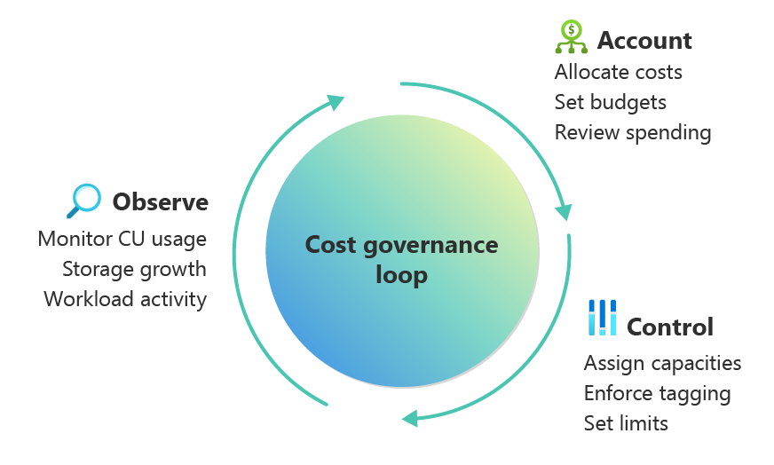

# Cost considerations for Microsoft Fabric workloads

Managing costs in Microsoft Fabric requires architectural foresight, operational discipline, and smart automation. Have a clear understanding of how capacities, storage, and data movement drive expenses, to enforcing effective governance.

This article provides architects and engineers with a practical framework to control costs without compromising performance or reliability. You'll learn how to estimate costs, forecast total ownership, and apply optimization strategies through automation, environment management, and governance, ensuring cost control scales alongside your workloads.

## Identify key cost drivers

Cost optimization in Microsoft Fabric begins with understanding how the platform is priced and which architectural decisions influence spending. Fabric uses a capacity-based pricing model, where compute resources are provisioned as capacities measured in **Capacity Units (CUs)**. These capacities power all Fabric workloads, including queries, pipelines, Spark jobs, data ingestion, and analytics operations.

Organizations can purchase Fabric compute in two primary ways:

- Pay-as-you-go (PAYG) - capacities are billed per minute while active.
- Reserved capacity - discounted pricing for one- or three-year commitments.

These options can be combined to support different usage patterns. For example, a reservation can cover predictable baseline workloads while pay-as-you-go capacity supports temporary spikes. Storage costs are billed separately based on the amount of data stored in OneLake.

Once the pricing model is understood, the next step is identifying what actually drives costs in a Fabric environment.

| Cost driver                  | How it impacts cost                                     | Considerations                                              |
| ---------------------------- | ------------------------------------------------------- | ----------------------------------------------------------- |
| **Compute (capacity units)** | Primary cost driver for Fabric workloads                | Larger capacities and longer active durations increase cost |
| **Storage (OneLake)**        | Charged per GB stored                                   | Includes datasets, historical data, and cached results      |
| **Data processing**          | Ingestion, transformations, and queries consume compute | Complex queries and heavy pipelines increase CU usage       |
| **Data transfer**            | Cross-region or external data movement                  | Egress charges may apply depending on architecture          |
| **Retention and caching**    | Long-term storage policies                              | Larger retention windows increase monthly storage cost      |

Because compute capacity is provisioned ahead of time, costs are tied to the size of the capacity available, not the actual workload utilization. This means underutilized capacities can still generate significant cost.

#### Recognize hidden and indirect costs

Some costs are not immediately visible during initial deployment but can grow over time if not managed carefully.

For example, storage continues to accumulate charges even if compute capacities are paused. Long data retention periods, cached query results, or soft-deleted data can increase storage consumption. Certain workloads may also require additional licensing, for instance, **Power BI Pro licenses** for report authors and publishers in environments using specific Fabric SKUs.

Consider indirect costs related to inefficient capacity utilization. Because Fabric billing depends on provisioned capacity rather than workload volume, oversizing capacities or leaving them active unnecessarily can quickly increase operational expenses.

## Model costs effectively

Different workload patterns can significantly affect long-term costs. Fabric includes several platform capabilities that help organizations optimize cost for varying workloads.

For example, [smoothing and bursting mechanisms](/fabric/enterprise/throttling#smoothing) help handle spiky workloads. Interactive operations are smoothed over short intervals, while background workloads are smoothed over longer periods. This allows organizations to size capacities closer to average usage rather than peak demand. However, sustained overutilization may trigger staged throttling policies.

Pooling multiple workloads onto a shared capacity can also improve utilization efficiency and reduce cost. When usage patterns are predictable and steady, reservation pricing typically provides the lowest cost. Highly variable workloads may benefit from pay-as-you-go billing or autoscale options.

Effective cost modeling should also account for future growth. When forecasting long-term costs, consider scenarios such as:

- Increasing ingestion volumes or data pipeline activity
- Higher query concurrency or more complex analytics workloads
- Longer data retention requirements
- Expansion to multi-region or multi-capacity architectures
- Additional workloads being consolidated onto existing capacities

Modeling both scale-up scenarios (larger capacities) and scale-out architectures (multiple capacities) helps organizations plan budgets and avoid unexpected cost increases as adoption grows.

> [!IMPORTANT] 
>
> Design decisions directly affect cost. Evaluate query patterns, data movement, and retention policies early, because they influence both compute and storage consumption. Before committing to a capacity size, run a small proof-of-concept or load test with representative workloads to observe utilization and validate your SKU choice. Also consider architectural patterns that reduce cost, such as using shortcuts for in-place data sharing, minimizing unnecessary data movement, and designing workloads to align with Fabric's [smoothing mechanisms](/fabric/enterprise/throttling#smoothing).

#### Use cost estimation tools

Before deploying large workloads, use available tools to estimate and validate projected costs:

-  [Microsoft Fabric Capacity Estimator](https://www.microsoft.com/microsoft-fabric/capacity-estimator) - estimates required capacity for expected workloads.
- [Azure Pricing Calculator](https://azure.microsoft.com/pricing/calculator/) - models compute and storage costs across scenarios.
- [Microsoft Cost Management and Billing](/azure/cost-management-billing/) - monitors and analyzes actual spending after deployment.
- [Fabric cost analysis tools](https://github.com/microsoft/fabric-toolbox/tree/main/monitoring/fabric-cost-analysis) from the Microsoft Fabric Toolbox

## Monitor costs and implement governance

Cost optimization requires continuous visibility into how Fabric resources are used. Without clear monitoring, it becomes difficult to answer questions like: Which workspace is driving compute spikes? Which workloads are consuming the most storage? Are costs increasing because of legitimate growth or inefficient queries?

A practical way to manage Fabric spending is to treat cost governance as a simple loop:

| Step        | Goal                         | Examples                                                     |
| ----------- | ---------------------------- | ------------------------------------------------------------ |
| **Observe** | Understand usage patterns    | Monitor CU usage, storage growth, workload activity          |
| **Control** | Apply governance policies    | Assign workspaces to capacities, enforce tagging, set limits |
| **Account** | Ensure teams own their usage | Allocate costs, set budgets, review spending                 |

Start by making capacity usage visible. Fabric workloads often run on shared capacities, which can make it difficult to determine which teams or workloads are driving costs. Monitoring tools help attribute consumption and provide transparency.

| Capability           | Purpose                          | Tooling                                                       |
| -------------------- | -------------------------------- | ------------------------------------------------------------- |
| Cost tracking        | Monitor actual spending          | [Azure Cost Management](/azure/cost-management-billing/)     |
| Capacity utilization | Identify compute-heavy workloads | [Fabric Capacity Metrics App](/fabric/enterprise/metrics-app) |
| Cost allocation      | Attribute usage to teams         | [Fabric Chargeback App](/fabric/enterprise/chargeback-app)   |
| Custom reporting     | Build dashboards and forecasts   | [Fabric Cost Analysis solution accelerator](https://github.com/microsoft/fabric-toolbox/tree/main/monitoring/fabric-cost-analysis) |

Effective cost reporting should provide both operational insight and financial transparency. Useful dashboards typically include capacity utilization trends, storage growth patterns, cost breakdown by workspace or team, and forecasted spending based on historical usage. These insights help architects understand how workloads evolve over time and determine whether capacity sizing and architecture decisions remain appropriate.

Governance policies should guide how resources are used. Common practices include assigning workspaces to specific capacities, pausing development environments when idle, separating dev/test/prod workloads, and investigating sudden spikes in capacity usage. Storage governance is equally important; review retention policies and cached datasets periodically to prevent unnecessary storage growth.

To prevent runaway costs, set clear guardrails on workloads that support autoscaling. Define reasonable scaling limits to prevent compute usage from growing unchecked, and leverage [Fabric's surge protection](/fabric/enterprise/surge-protection) for background operations to smooth demand spikes. These controls let workloads scale as needed while keeping costs predictable and under control.

Establish clear ownership and responsibility for Fabric resources. In shared environments, costs can be distributed across teams using tools like the [Fabric Chargeback App](/fabric/enterprise/chargeback-app). Tag capacities and workspaces with owner information and review spending regularly to maintain accountability.

Ensure that every workspace, capacity, and workload has an identifiable owner and appropriate usage monitoring in place to keep costs predictable.

## Optimize environment costs

Different environments, development, testing, and production, have very different usage patterns. Optimizing Fabric costs often starts with aligning capacity sizing and runtime behavior to the needs of each environment.

But first, monitor usage at the environment-level and identify issues such as continuously running dev capacities, unexpected storage growth in test environments, or production workloads exceeding expected compute usage.

Microsoft Fabric doesn't provide separate feature tiers for dev, test, or production. All [SKUs](/fabric/enterprise/licenses#capacity) offer the same capabilities. Therefore, optimization comes from how capacities are sized, scheduled, and managed across environments, rather than from different product tiers.

A common approach is to spin up environments according to their purpose.

| Environment  | Typical configuration                        | Cost optimization approach                        |
| ------------ | -------------------------------------------- | ------------------------------------------------- |
| Development  | Small capacities or shared capacity          | Pause when idle, scale up temporarily for testing |
| Testing / QA | Small to medium capacities                   | Run during validation windows only                |
| Production   | Dedicated capacity sized for workload demand | Consider reserved capacity for predictable usage  |

Another strategy is to create temporary environments for testing or validation. Rather than keeping infrastructure always on, these environments can be spun up only during testing and removed when complete. This approach works especially well for CI/CD pipelines or large integration tests, where environments are needed only briefly.

> [!IMPORTANT]
>
> Pre-production environments can drive up costs if left unmanaged. Implement governance without blocking productivity. For example, use scheduled pause/resume policies, set budget alerts, enforce capacity size limits, and apply tagging standards to track ownership.

#### Consider multi-tenant environment factors

Some Fabric solutions support multiple tenants or customers. In these cases, environment design also affects cost allocation. Common isolation models include:

| Isolation model                        | Description                                 | Cost implication                                 |
| -------------------------------------- | ------------------------------------------- | ------------------------------------------------ |
| Shared workspace on shared capacity    | Multiple tenants share the same environment | Lowest cost but limited isolation                |
| Separate workspaces on shared capacity | Logical separation with shared compute      | Balanced cost and isolation                      |
| Dedicated capacity per tenant          | Full workload isolation                     | Highest cost but strongest performance isolation |

## Reduce costs through automation

Automation can be a powerful lever for reducing Fabric costs. Consider these strategies: 

- Pause or scale capacities during off-hours: Non-production workloads can be paused or downsized automatically using Azure Resource Manager APIs, Bicep, Terraform, Logic Apps, Power Automate, Fabric Pipelines, or PowerShell. Autoscale billing for Spark and Data Warehousing workloads further reduces costs by charging for actual work performed.
- Optimize workload and storage operations: Automate tasks such as delta table optimization, purging obsolete data, archiving datasets, or reducing log retention to prevent waste.
- Monitor and right-size capacities: Use Fabric Activator or custom scripts to track capacity utilization, identify idle resources, and recommend smaller SKUs when appropriate.
- Lifecycle management: Automatically provision, scale, or delete environments and capacities based on usage schedules, expiration dates, or workload priorities.

Automation must respect the pricing model in use. For instance, pausing a capacity under a **reserved SKU** may not lower costs, so planning automation around your billing model is essential.

## Consolidate costs effectively

Consolidation is about maximizing resource efficiency by sharing capacities and workloads where possible, without compromising reliability, security, or compliance. Thoughtful consolidation can significantly reduce TCO, especially for development, test, or non-critical workloads.

- **Shared compute:** Fabric capacities can host multiple workspaces and diverse workloads. Pooling workloads allows teams to share compute resources instead of provisioning separate capacities for each workload.
- **Shared data storage.** In-place data sharing across teams reduces duplication and storage costs. Multiple solutions or environments can be colocated on the same capacity to increase utilization.
- **Environment-specific pooling:** Dev/test workloads with similar requirements can share a single capacity, which can be paused or downsized outside of working hours to save costs.

> :::image type="icon" source="../_images/risk.svg"::: **Risk**: Sharing capacities lowers costs but can impact performance: spikes in one workload may slow others (noisy neighbor issues). Highly variable or mission-critical workloads may need dedicated capacities. Fixed-capacity scaling can create large jumps in resources, so scaling out is often smoother. Consolidation also adds monitoring and governance complexity, especially when teams need clear visibility into their own usage.

## Next steps

Review the best practices, organized by pillars. Follow the guidance in [Operational Excellence](./operational-excellence.md).