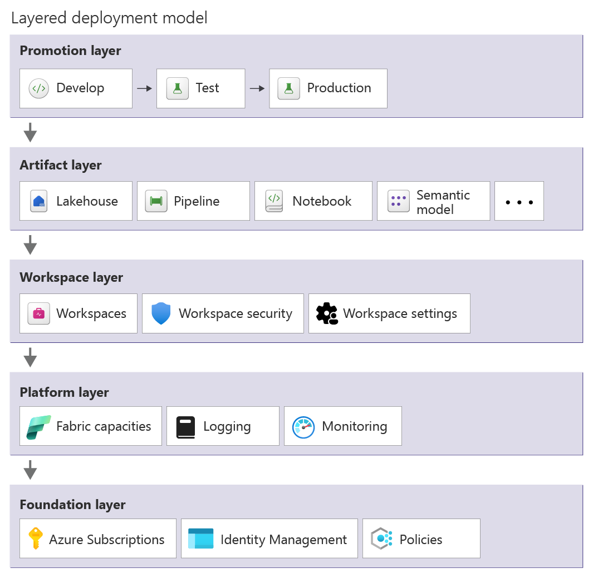

# Microsoft Fabric workload operations

Because Microsoft Fabric is a SaaS platform, Microsoft handles most of the operations. You still have a responsibility for running workloads that actually meet business expectations though. Operational excellence is about making deliberate choices, understanding trade-offs, and ensuring that your teams can operate, scale, and recover workloads confidently.

This article provides practical guidance on team readiness, safe deployment practices, monitoring, incident response, and testing strategies so that architects and engineers can operate Fabric with confidence and predictability.

## Prepare your team

Your first task as an architect is to understand the people and skills around you. Fabric may automate infrastructure management, but operating it effectively still requires a combination of technical, operational, and collaborative skills. 

Data engineers need to be fluent in Spark transformations, Lakehouse design, Power BI semantic models (or other workloads included in your solution). Capacity admins must understand capacity units, storage, and workspace boundaries. DevOps skills including shared ownership, CI/CD pipelines, and incident response aren't optional.

Take the time to map roles and responsibilities. Who owns capacity monitoring? Who can approve a production deployment? Who is on call when a critical pipeline fails? Document these boundaries clearly. 

Formalize skills through certifications like Microsoft Certified: Fabric Analytics Engineer Associate (DP-600) or Microsoft Certified: Fabric Data Engineer Associate (DP-700). Also, learn through Microsoft Official guidance on Fabric. Pay attention to Microsoft Entra ID and networking knowledge because it's essential for governance, identity management and integration.

## Deploy changes safely

Match your deployment approach to the complexity and impact of your solution. Small ad-hoc analytics can be deployed with minimal ceremony, but mission-critical workloads deserve rigor.

A good starting point is to compartmentalize your work. Keep separate workspaces for dev, test, and production, so changes in one environment don't ripple across others. Use Fabric Deployment Pipelines for structured deployments, and complement them with GitHub Actions or Azure DevOps if you need more customization.

Testing before promotion is non-negotiable. Unit tests, integration checks, data validation, and business verification are all part of ensuring that what you deploy will perform reliably. Fabric may absorb failures gracefully at the platform level, but only you can guarantee the correctness of your architecture and its functionality.

> [!IMPORTANT]
>
> Manual checks are often needed for interactive elements like reports or dashboards. Approval processes should also scale with risk: automated approvals work well for non-production, but production releases benefit from code reviews, testing, and manual sign-offs.

Monitoring and progressive exposure make deployments a controlled operation. Capture logs, configure alerts for failures, and roll out changes gradually. Fabric doesn't provide a one-click rollback. When you need to restore a previous version, your safety net is redeploying from Git or your pipelines. Also keep in mind,  when rolling back, data consistency is your real risk, not just code. Multiple data stores, pipelines, or models may require careful reconciliation to ensure everything lines up.

## Automate operations

Focus on automating repetitive or high-touch tasks so your team can spend time on building and optimizing solutions. Examples that commonly benefit from automation include:

- Workspace provisioning and assignment to capacities
- Deployment operations and CI/CD pipelines
- Capacity monitoring, scaling, and utilization alerts
- Job monitoring, scheduling, retries, and failure notifications
- Access management and security assignments
- Maintenance activities like detecting obsolete artifacts or underutilized capacities

Fabric includes native automation features for the preceding tasks. For example, the Fabric CI/CD platform is built on the Fabric REST APIs and brings source control, delivery, configuration, and developer tooling together into a single, integrated experience. For more information, see [What is CI/CD in Microsoft Fabric?](/fabric/cicd/cicd-overview)

You can also use external tools like REST APIs and CLI, Terraform, and Git integration to orchestrate more complex or custom automation.

Automation also supports architecture-wide consistency. For example, deployments can be validated against Git or templates to detect accidental or unauthorized changes. Even small but practical automations, like pausing dev capacities overnight, triggering dataset updates, or Delta table compaction, quickly add up to significant operational efficiency gains.

### Drive deployment through code

Managing Microsoft Fabric through code ensures consistent and repeatable deployments. Use Infrastructure as Code (IaC) to define capacities, workspaces, and artifacts, reducing manual errors and preventing configuration drift.

Templates should account for dependencies and should be designed in layers. 

1. Establish the core environment: Azure subscription with identity configuration, monitoring, and governance policies.
2. Provision Fabric platform resources such as capacities and integrate logging with monitoring.
3. Create workspaces and configure security assignments with Git integration.
4. Deploy solution components like Lakehouses and pipelines, notebooks, and semantic models.
5. Promote artifacts across environments using deployment pipelines.

Parameterize settings like capacity SKUs and environment-specific endpoints along with security roles and refresh schedules. Use Git as the source of truth to detect drift and maintain version control.

Deployment pipelines orchestrate these IaC assets and Fabric solutions across environments. Use GitHub Actions, Azure DevOps, or Fabric Deployment Pipelines to promote content from development to test to production. Validate deployments with pre/post-deployment checks along with unit and integration tests and environment-specific validations. Pipelines should enforce approvals for production deployments and capture logs while triggering alerts on failures.

Automation within pipelines also manages configuration differences across environments. Variable libraries and parameterization adjust item settings, while auxiliary logic or the Fabric-CICD library handles more complex configuration changes across environments.

## Monitor your environment

You need visibility at multiple layers: tenant-wide signals for admins, capacity health for operations, and workspace-level insights for workload owners. Workspace Monitoring can capture logs and metrics for supported workloads and store them in an Eventhouse within the workspace. 

Focus monitoring on signals that reveal issues or trends:

- Capacity utilization and throttling events
- Storage usage and growth trends
- User activity and operational logs
- Job execution metrics such as failures and retries or excessive duration
- Deployment success or failure events from CI/CD pipelines

Correlate logs across systems to understand not just what failed, but why. Several specialized tools provide deeper operational insight:

| Tool                                       | Purpose                                       | Typical use                                                                                         |
| ------------------------------------------ | --------------------------------------------- | --------------------------------------------------------------------------------------------------- |
| [Microsoft Fabric Capacity Metrics App](/fabric/enterprise/metrics-app) | Monitor capacity health and compute usage     | Track CU consumption, throttling events, autoscale behavior, and storage usage over a 14-day window |
| [Workspace Monitoring](/fabric/data-factory/workspace-monitoring) | Provide workload-level observability          | Capture logs and metrics for supported Fabric workloads within a workspace                          |
| [OneLake Diagnostics](/fabric/onelake/onelake-diagnostics-overview) | Monitor data access activity                  | Analyze how data is accessed within a workspace and investigate storage-related issues              |
| [Fabric Activator](/fabric/real-time-intelligence/data-activator/activator-introduction)                      | Event-driven monitoring and automation        | Trigger alerts or automated actions when Fabric events or capacity signals occur                    |
| [Fabric Unified Admin Monitoring (FUAM)](https://github.com/microsoft/fabric-toolbox/tree/main/monitoring/fabric-unified-admin-monitoring) | Consolidated tenant-wide monitoring           | Aggregate monitoring data across the Fabric tenant for centralized operational insights             |
| [Azure Monitor / Log Analytics](/azure/azure-monitor/overview) | External monitoring and long-term analysis    | Store, query, and visualize exported Fabric logs and metrics                                        |
| [Microsoft 365 Audit Logs](/fabric/admin/service-admin-portal-audit-logs) | Track user activity and administrative events | Capture Fabric audit logs and forward them to external monitoring systems                           |

#### Manage monitoring data

Monitoring data retention in Fabric is limited by default:

- Fabric activity logs retain data for 30 days.
- Capacity Metrics App data is available for 14 days.

If longer historical analysis is required, logs should be exported and stored externally. Tools like FUAM can help retain and analyze monitoring data across longer periods.

Workspace Monitoring and OneLake Diagnostics can produce highly detailed logs. Because these logs can grow rapidly in busy workspaces, enable them selectively or temporarily when investigating performance issues.

#### Create dashboards and alerts

Fabric provides built-in dashboards and alert capabilities for common operational signals.

- The Fabric Capacity Metrics App provides dashboards for compute and storage usage.
- Fabric Activator can monitor Fabric events and trigger alerts or automated actions.

Administrators can enable the option to receive email notifications for service outages and incidents. Fabric also provides built-in notifications for job failures, such as semantic model refresh failures or pipeline execution errors. For more advanced scenarios, Fabric Activator can monitor Fabric capacity events and trigger alerts or automated actions.

Alerts must be meaningful, actionable, and escalated properly. False alarms are as dangerous as no alarms because they erode trust and slow response. Configure them with multi-channel notifications such as email or Teams messages. Make sure there are escalation paths so higher severity alerts reach the appropriate support teams quickly.

## Have an incident response plan

Incident response in Fabric focuses on preparing operational procedures for service disruptions and platform failures along with workload incidents. 

#### Understand failover capabilities

Fabric provides several platform resiliency mechanisms. Zone redundancy protects against failures within an Azure availability zone in a region, although support may vary by region and workload. Fabric also offers Business Continuity and Disaster Recovery (BCDR) capabilities that replicate OneLake data to a secondary region when enabled on capacities.

If a regional failure occurs, failover is initiated by Microsoft. Afterward, your recovery operations must restore  capacity by:

- Creating new capacities in an alternate region
- Re-deploying Fabric items and workspaces
- Rehydrating data stores from replicated OneLake data
- Restoring solution functionality and validating workloads

Even if Fabric does not support user-initiated failover, make sure you maintain documented disaster recovery plans for critical workloads. You should validate recovery procedures by simulating failure scenarios.

A common approach for critical workloads is to run parallel deployments in multiple regions. Teams can then simulate a failure by pausing a capacity in one region, forcing workloads to operate from the alternate environment. Periodic drills in non-production environments help ensure recovery procedures are well understood.

#### Execute failback procedures

After the primary region becomes available again, returning to normal operations requires careful validation. The failback process typically involves reconciling data changes and verifying the integrity of affected data stores.

In some scenarios, failback may require re-deploying workspaces or restoring data to ensure systems are fully synchronized. Maintaining versioned artifacts and Git history helps teams safely roll forward or re-promote stable versions of solutions.

#### Detect failures

Fabric relies primarily on Microsoft's internal monitoring systems to detect infrastructure-level failures and trigger failover events. Because you can't directly initiate platform failover, operational monitoring should focus on detecting solution-level failures, such as pipeline errors and workload disruptions or deployment issues. Some failures may impact specific Fabric experiences or dependencies, requiring targeted recovery actions. For example, workspace-level or item-level corruption

A good strategy is to complement your health monitoring approach with CI/CD pipeline monitoring and error detection, which can stop deployment promotions when failures occur.

## Don't assume everything works

Validate every layer: artifact, pipeline, data quality, and user experience. 

| Test Level              | Purpose                         | Example                                                 |
| ----------------------- | ------------------------------- | ------------------------------------------------------- |
| Artifact tests          | Validate individual components  | Test a notebook transformation or pipeline logic        |
| Integration tests       | Validate the full data workflow | Ensure ingestion → transformation → model refresh works |
| Data quality validation | Detect data issues early        | Validate schema changes or missing values               |
| Load testing            | Understand performance limits   | Run pipelines or queries with production-scale data                |
| User acceptance testing | Confirm business requirements   | Business users validate reports and outputs             |

Have dedicated test workspaces and capacities that represent production. Test environments should use sample or anonymized data sources to avoid impacting production systems. To control costs, test capacities are often smaller than production and temporarily scaled up during load tests.

Fabric supports a wide range of testing tools:

- Notebook testing: pytest and nutter
- Data validation: Great Expectations
- CI/CD validation: Azure DevOps and GitHub Actions
- Automation testing: Fabric REST APIs
- Custom integration tests: Python and PowerShell scripts

## Next steps

Review the best practices, organized by pillars. Follow the guidance in [Performance Efficiency](./performance-efficiency.md).
