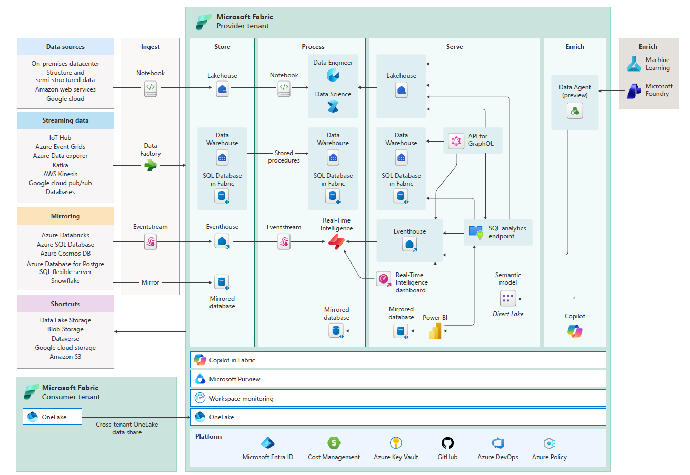

# Microsoft Fabric workloads

Microsoft Fabric is a unified analytics platform that brings together data movement, ingestion, transformation, real-time processing, and reporting in a single environment. Teams can build complete analytics solutions from raw data to business insights on a shared platform and storage layer.

Because Fabric combines many analytics capabilities in one place, architectural decisions have wide impact. Capacity sizing affects both pipelines and queries. Data design influences refresh times and report performance. Security configuration determines how teams collaborate and how data is governed.

Across these workloads, architects face the same challenge: building solutions that remain reliable, secure, performant, and cost-efficient while operating smoothly at scale.

This guidance applies the Azure Well-Architected Framework to Microsoft Fabric workloads. The framework organizes architectural best practices into five pillars that help architects design balanced, production-ready systems.

## Architecture pattern

| Pillar | Focus |
|---|---|
| [**Reliability**](./reliability.md) | Design workloads in Fabric that recover gracefully from platform or workload failures, leverage capacities, multi-region replication, and failover strategies, and maintain predictable availability for users. |
| [**Security**](./security.md) | Protect data, identities, and workloads in Fabric through workspace isolation, role-based access, managed identities, encryption, secure networking, and continuous monitoring. |
| [**Cost Optimization**](./cost-optimization.md) | Control Fabric spending by aligning capacity sizing to workloads, sharing resources strategically, automating scaling and pauses, monitoring utilization, and governing retention and workloads across environments. |
| [**Operational Excellence**](./operational-excellence.md) | Deploy and operate Fabric workloads with confidence by combining Deployment Pipelines, version control, automated testing, progressive rollouts, logging, and proactive monitoring. |
| [**Performance Efficiency**](./performance-efficiency.md) | Ensure Fabric workloads scale and respond efficiently by right-sizing capacities, isolating heavy workloads, optimizing queries and pipelines, and leveraging caching, incremental refresh, and bursting. |

## Common architectural challenges

TBD

## Design methodology

Designing analytics solutions on Microsoft Fabric involves more than selecting services or configuring workloads. Architects must understand how data flows through the platform, how compute resources are shared, and how design decisions affect reliability, performance, security, and cost.

To manage this complexity, use a simple design methodology that keeps decisions aligned with business requirements and the Well-Architected pillars. When architectural choices become difficult, returning to this approach helps keep the design focused.

#### Focus on critical workflows

Begin by identifying the main workflows in the system. In analytics platforms, these typically include data ingestion, transformation pipelines, semantic model refreshes, and interactive queries.

Understanding these flows helps determine where latency matters, where failures have the greatest impact, and where compute demand will concentrate.

#### Design for shared capacity

Fabric workloads run on shared capacity resources. Spark jobs, pipelines, queries, and refresh operations all consume compute from the same pool.

Architectures should prevent heavy workloads from starving interactive operations. Isolation, scheduling, and workload separation across workspaces or capacities help maintain predictable performance.

#### Keep workloads modular

Break large solutions into smaller components such as independent pipelines, datasets, and processing stages. Modular workloads reduce the impact of failures, simplify scaling, and allow teams to evolve parts of the solution without affecting the whole system.

#### Observe and adapt

Workloads evolve as data volumes and usage grow. Monitoring capacity utilization, query performance, and operational signals helps identify when the architecture needs optimization or scaling.