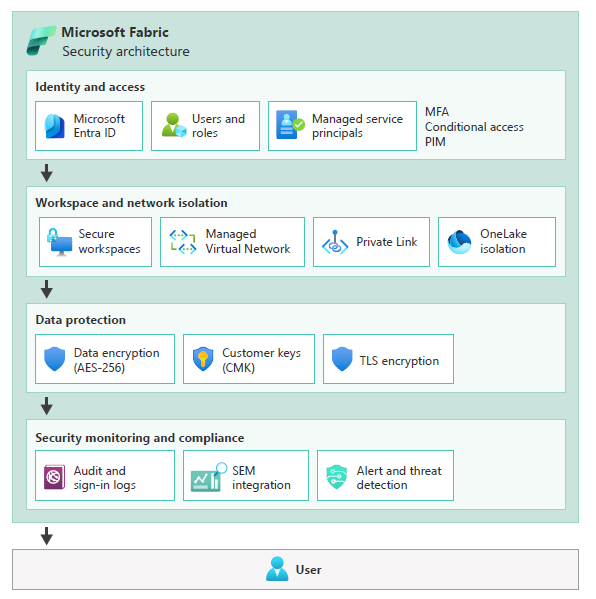

# Security considerations for Microsoft Fabric workloads

As a cloud solution architect, make intentional decisions about security in Microsoft Fabric. Think how  your workloads operate, who can access them, and how you contain risks. As an architect, your role is to build security resilience.

This article describes how to apply practical, actionable security controls within Fabric, using its built-in features like workspaces, workspace identities, managed virtual networks, and customer-managed keys. 

## Start with a baseline

Before you dive into network rules or encryption settings, define a security baseline for your Fabric environment. Think of it as a blueprint that outlines how data should be protected, who can touch it, and what compliance requirements must be met.

**Use the Azure security baseline for Fabric**, aligned with the Microsoft cloud security benchmark (MCSB), as a reference when defining security controls. Use it, but don't treat it as a checklist but treat it as a starting point for conversations about your environment, governance policies, and risk tolerance.

Compare your current tenant configuration against the baseline. Are identity policies strict enough? Are monitoring and logging pipelines in place to detect unusual activity? If gaps exist, mitigate them early.

> Refer to: [Microsoft Fabric baseline](/security/benchmark/azure/baselines/fabric-security-baseline)

## Design isolation boundaries

One of the most powerful levers for protecting your workloads is segmentation. In Fabric, workspaces are your first line of defense. Map them to teams, projects, or environments. For example, create separate workspaces for Finance and HR. Finance analysts collaborate in the Finance workspace without visibility into HR datasets. HR users work only within the HR workspace.

Within those boundaries, item-level permissions let you control access to tables, pipelines, or reports, so no one sees more than they need to.

Capacities can be another isolation tool. Dedicated capacities for sensitive workloads reduce the risk that a noisy neighbor consumes resources or introduces failure. Tenancy isolation in OneLake ensures that even if someone misconfigures access, your data isn't exposed outside intended boundaries.

> :::image type="icon" source="../_images/trade-off.svg"::: **Tradeoff**: The trade-off is operational complexity. More workspaces and dedicated capacities mean more management overhead. But the payoff is localized failures, predictable access, and clear accountability.

There are identity and networking capabilities that ensure segmentation. They are described in the sections below. 

> Refer to: [Manage workspaces in Microsoft Fabric](/fabric/fundamentals/workspaces)

## Use identity as the primary security perimeter

Everything in Fabric flows through Microsoft Entra ID. Users, services, and automation all authenticate through it. Your job is to enforce least privilege everywhere.  There are built-in roles to support that. Viewers only read reports. Contributors modify content. Admins manage settings and assignments.

When workloads need to access external resources or APIs, use Fabric _workspace identity_. It's a managed service principal created for a workspace that can securely authenticate to external resources without embedding credentials. Service principals can also be used when external applications or automation interact with Fabric APIs.

Examine who's accessing what. For example, review control plane operations like, creating workspaces, assigning roles, and provisioning capacity. Those should be restricted to administrators or authorized service principals. Similarly, data plane permissions should also be granted to individuals who need them. These typically include running queries, editing notebooks, and executing pipelines.

Use conditional access policies to enforce security requirements such as multi-factor authentication, compliant devices, or location restrictions. Administrative roles should require privileged identity management (PIM) so elevated privileges are activated only when needed.

Identity and access activity appears in Fabric audit logs and Entra ID sign-in logs. Export these logs to a monitoring platform so that authentication events, permission changes, and role assignments can be reviewed or correlated with other security telemetry.

Tenant and capacity roles (Fabric Admin, Capacity Admin, Capacity Contributor) separate management of compute/storage from content access. For example, a Capacity Admin can manage scaling but cannot read sensitive finance datasets unless explicitly granted.

> Refer to: [Role-based access control (RBAC) in Microsoft Fabric](/fabric/security/permission-model)

## Secure network communications

Identity is critical, but network boundaries matter too. Network security in Microsoft Fabric protects both **how users access the service** and **how workloads communicate with data sources**. These controls work together with identity management and workspace boundaries to reduce exposure and limit the blast radius.

All client connections use HTTPS endpoints secured with TLS 1.2 or higher. These endpoints are protected by Microsoft's edge infrastructure. Azure Front Door and the web application firewall (WAF) filter incoming traffic, while platform-level DDoS protection absorbs large-scale attacks. You can further limit exposure by using **Conditional Access** policies, IP allow lists, and other network controls. 

Many Fabric workloads access external data sources such as Azure SQL databases or storage accounts. Design connectivity so these interactions occur through private network paths whenever possible.

Fabric supports managed virtual networks (VNets). When enabled, compute resources operate in an isolated network segment. Connections to Azure services use managed private endpoints, keeping traffic inside Azure's private address space. You can't directly manage subnets or NSGs inside the managed VNet, Microsoft ensures that the network is dedicated to the workspace, preventing accidental cross-workspace exposure.

Fabric also supports private link, which exposes the service through a private endpoint inside your virtual network. You can apply network security groups (NSGs) or Azure firewall rules to restrict which networks can access Fabric and to inspect traffic flows.

Workspace-level IP firewall rules can restrict which client IP addresses are allowed to connect to Fabric.

If workloads require access to on-premises systems, use the on-premises data gateway, which establishes an encrypted outbound connection between Fabric and on-premises data sources.

Monitor network-related activity through private link logs and on-premises data gateway logs. These logs record connection attempts, successes, failures, and throughput, which can help identify unexpected connection patterns or misconfigured access paths.

> Refer to these articles: 

- [Secure your network with Azure VNets](/azure/virtual-network/virtual-networks-overview)
- [Private Link and VNet integration](/azure/private-link/)
- [Network security groups (NSGs)](/azure/virtual-network/network-security-groups-overview)
- [Azure Firewall documentation](/azure/firewall/)

## Data encryption

Fabric encrypts data at rest and in transit by default. Network communication between clients and services uses HTTPS with TLS 1.2 or higher.

Microsoft manages TLS certificates for Fabric endpoints, including certificate renewal and validation. Data stored in **OneLake or associated analytical stores** is encrypted using **AES-256 with Microsoft-managed keys**. 

For organizations with stricter requirements, Customer-Managed Keys (CMK) can provide additional control over key rotation and revocation. Note that not all Fabric artifacts currently support CMK, so you may need workspace segmentation to separate supported and unsupported items. Double encryption is also supported where data is encrypted with the platform's key, and that key is itself encrypted using your Azure Key Vault key.

> :::image type="icon" source="../_images/trade-off.svg"::: **Tradeoff**: Using CMK introduces operational dependencies. The key vault must remain available and accessible. If the key is disabled or deleted, workspace data becomes inaccessible until the key is restored. Key rotation, access policies, and audit controls also become your responsibility.

Fabric does not provide built-in encryption for data being processed in memory. If encryption-in-use is required, use extra encryption techniques. For example, sensitive values could be encrypted by your application before ingestion, so Fabric processes only encrypted data that your application can decrypt. This approach is user-managed and requires careful design to maintain usability and performance.

> Refer to these articles: 
>
> [Encryption in Microsoft Fabric](/fabric/security/security-overview#secure‑data)
> [OneLake encryption and storage security](/fabric/onelake/security/get-started-security)
> [Azure Key Vault documentation](/azure/key-vault/)
> [Customer-managed keys (CMK) in Azure](/security/benchmark/azure/baselines/fabric-security-baseline)

## Harden workload assets

Fabric's attack surface is primarily web endpoints, APIs, and loaded content.

Because Fabric is a SaaS platform, infrastructure components cannot be modified directly. Hardening focuses on configuration and governance.

Disable features that are not required. For example, disable external sharing if collaboration with external users is not needed. Disable "anyone with the link" permissions to prevent unintended data exposure. Use private link instead of public endpoints when possible.

Default settings favor usability over strict security. Key hardening steps include:

- Restrict workspace creation to admins to prevent sprawl and misconfigurations.
- Enforce the use of sensitivity labels on all content, potentially blocking exports for sensitive data. 
- Disable basic authentication for data sources when alternatives exist. Prefer OAuth, managed identity, or service principals for authentication.

Fabric enforces TLS 1.2+ and modern authentication, but extra caution is needed when connecting to legacy data sources; always prefer secure protocols and identities.

Administrative operations should also be restricted. Limit workspace administrator and tenant administrator assignments. Use privileged identity management (PIM) so administrative privileges are activated only when required.

Track configuration settings through Fabric admin APIs or automation scripts and compare them with internal security baselines. This helps detect configuration drift or newly introduced settings that may expand access beyond intended policies.

## Secret management

Workloads often need to access databases, APIs, or storage. Do not store secrets in notebooks, scripts, or pipelines. Use Azure Key Vault, with dynamic retrieval at runtime. Rotate secrets in a controlled fashion, coordinating with dependent workloads. Where possible, rely on workspace identity or service principals, avoiding static credentials entirely.

> Refer to: [Key Vault secrets integration ](/azure/key-vault/secrets/)

## Security Monitoring 

Fabric records user and administrative activities through audit logs. They show who accessed what, when, and from where. Combine them with Purview data loss prevention (DLP), on-premises gateway logs, or Microsoft Defender for Cloud Apps telemetry to get a full picture. Centralize all this in a SIEM like Microsoft Sentinel.

Configure alerts for events that may indicate security risks, such as:

- Multiple failed sign-in attempts or risky sign-ins
- Unexpected role assignments or elevation to workspace administrator
- Large dataset exports or bulk downloads from OneLake
- Reports or datasets shared with external users
- Repeated DLP policy violations
- Unusual administrative activity such as deleting workspaces or artifacts

Correlation across services can reveal suspicious patterns. For example, a risky sign-in followed by large data exports may indicate a compromised account.

> Refer to these articles: 

- [Audit log search in Microsoft 365](/microsoft-365/compliance/search-the-audit-log-in-security-and-compliance)
- [Sentinel data connectors for Microsoft 365](/azure/sentinel/connect-data-sources)
- [Microsoft Entra ID authentication events](/entra/identity/monitoring-health/concept-sign-ins)
- [Microsoft Defender for Cloud Apps documentation](/defender-cloud-apps/)

## Security Testing

Security testing verifies that security controls behave as expected.

Validate access controls by confirming that only intended users can access specific workspaces or artifacts.

If private link is enabled, confirm that Fabric cannot be accessed from unauthorized networks.

If customer-managed keys are used, periodically test key rotation and revocation scenarios.

Test data loss prevention (DLP) policies by attempting controlled exports of labeled data to confirm that enforcement and alerting work as expected.

Microsoft secures and tests the underlying Fabric infrastructure. Your responsibility is to validate the security of workloads running on the platform, including notebooks, pipelines, dependencies, and data access configurations.

Security controls can also be validated through automated checks. Scripts can retrieve workspace settings or role assignments using Fabric APIs and compare them against approved configuration baselines. Alerting can notify administrators when deviations occur.

Penetration testing should follow Microsoft cloud penetration testing rules of engagement to ensure tests do not disrupt service availability.

> Refer to these articles: 
>
> [Microsoft Cloud Penetration Testing Rules of Engagement](https://www.microsoft.com/msrc/pentest-rules-of-engagement)
> [Fabric REST APIs](/rest/api/fabric/)

## Secure Development Lifecycle (SDL)

Version control and CI/CD pipelines are your security partners. Connect workspaces to Git (Azure DevOps or GitHub) to track changes in notebooks, pipelines, and reports. Branch before merging, use pull requests, and enforce code reviews. 

Fabric also supports deployment pipelines that promote artifacts across development, test, and production stages. Use pipeline approvals and stage checks to ensure validation occurs before deployment.

Security validation should be integrated into development workflows. Static analysis, secret detection, and dependency scanning can run as part of pull request validation or CI pipelines.

Handle sensitive configuration values through Azure key vault references or parameterization rules rather than embedding secrets in pipeline definitions.

Separate development workspaces from production environments. Conditional access policies can restrict development activities to managed devices or trusted networks.

> Refer to these articles: 
>
> [Git integration in Microsoft Fabric](/fabric/cicd/git-integration/intro-to-git-integration)
> [Deployment pipelines in Microsoft Fabric](/fabric/cicd/deployment-pipelines/intro-to-deployment-pipelines)
