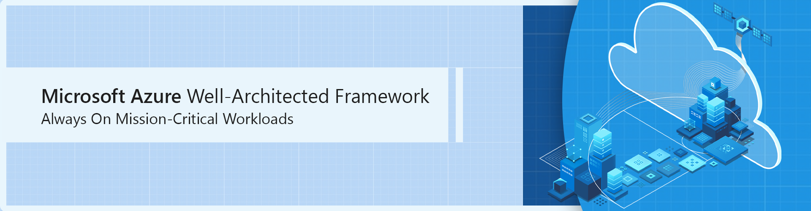

# Overview

Getting started on Microsoft Azure is now easier than ever, however, building mission-critical solutions that are highly reliable on the platform remains a challenge for three main reasons:

- Designing a reliable application at scale is complex and requires extensive platform knowledge to select the right technologies and optimally configure them as an end-to-end solution.

- Failure is inevitable in any complex distributed system, and the solution must therefore be architected to handle failures and correlated or cascading impact, which is a change in mindset for many developers and architects entering the cloud from an on-premises environment; reliability engineering is no longer an infrastructure topic, but should be a first-class concern within the application development process.

- Operationalizing mission-critical applications requires a high degree of engineering rigor and maturity throughout the end-to-end engineering lifecycle as well as the ability to learn from failure.

This section of the [Microsoft Azure Well-Architected Framework](/azure/architecture/framework) strives to address the challenge of building mission-critical applications on Azure, leveraging lessons from numerous customer applications and first-party solutions, such as Xbox Live, to provide actionable and authoritative guidance that applies Well-Architected best practices as the technical foundation for building and operating a highly reliable solution on Azure at-scale.

More specifically, this section extends the [AlwaysOn open source project](http://github.com/azure/alwayson) to provide a design methodology that guides readers through the process of building a highly reliable cloud-native application on Azure, articulating key design considerations and recommendations to inform requisite design decisions.

## What is the AlwaysOn project?

AlwaysOn is an open source architectural approach to building highly-reliable cloud-native applications on Microsoft Azure for mission-critical applications. The 'AlwaysOn' project name refers to the highly-reliable and mission-critical nature of the architectural pattern it represents, where for given set of business requirements, an application should always be operational and available. 

The AlwaysOn project is comprised of:

- **Architectural guidelines**: cloud-native design methodology within this section of the Azure Architecture Center, to guide readers through the architectural process of building a mature mission-critical application on Microsoft Azure.

- **Fully functional reference implementations**: end-to-end reference implementations intended to provide a solution orientated basis to showcase mission-critical application development on Microsoft Azure, leveraging Azure-native platform capabilities to maximize reliability and operational effectiveness.

> The AlwaysOn project provides two foundational production-ready reference implementations representing [online](https://github.com/azure/alwayson-foundational-online) and [connected](https://github.com/azure/alwayson-foundational-connected) workload scenarios. These foundational reference implementations serve as a basis for further solution development, and underpin the Azure Architecture Center reference architectures for common mission-critical industry scenarios.

## What problem does AlwaysOn solve?

Building mission-critical applications on any hyper-scale cloud platform requires significant technical expertise and engineering investment to appropriately select and piece together services and features. This complexity often leads to a sub-optimal solution, particularly given the typical prioritization of business needs over platform fundamentals and the struggle of aligning with evolving best practices.

The AlwaysOn project strives to address this complex consumption experience for Microsoft Azure, by applying [Well-Architected](/azure/architecture/framework/) best practices to mission-critical application scenarios, providing prescriptive and opinionated technical guidance alongside streamlined consumption mechanisms for common industry patterns through reference implementations; turn-key solutions that are implicitly aligned with Well-Architected best practices.

Because of the focus on reliability, the AlwaysOn design methodology presented within this section of Azure Architecture Center adopts a globally distributed and highly scalable approach to building applications on Azure. However, this globally distributed approach to achieve high reliability comes at a development cost which may not be justifiable for every workload scenario. It is therefore strongly advocated that design decisions are driven by business requirements but informed by the opinionated guidance provided within this section.

## Next steps

- Review the AlwaysOn [Design Methodology](./alwayson-design-methodology.md) for mission-critical application scenarios.

### Reference implementation

- Use the foundational reference implementations to construct a synthetic application environment that can be used to validate key design decisions. 
  - [Foundational-Online reference implementation](https://github.com/azure/alwayson-foundational-online) on GitHub.
  - [Foundational-Connected reference implementation](https://github.com/azure/alwayson-foundational-connected) on GitHub.
