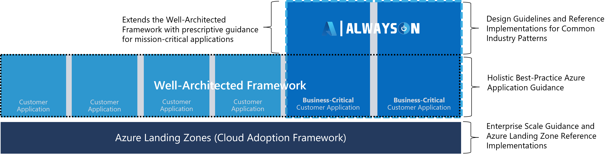

# Overview

Getting started on Microsoft Azure is now easier than ever, however, building mission-critical solutions that are highly reliable on the platform remains a challenge for three main reasons:

- Designing a reliable application at scale is complex and requires extensive platform knowledge to select the right technologies and optimally configure them as an end-to-end solution.

- Failure is inevitable in any complex distributed system, and the solution must therefore be architected to handle failures and correlated or cascading impact, which is a change in mindset for many developers and architects entering the cloud from an on-premises environment; reliability engineering is no longer an infrastructure topic, but should be a first-class concern within the application development process.

- Operationalizing mission-critical workloads requires a high degree of engineering rigor and maturity throughout the end-to-end engineering lifecycle as well as the ability to learn from failure.

This mission-critical section of the [Well-Architected Framework](/azure/architecture/framework/) strives to address the challenge of building highly reliable applications on Azure, leveraging lessons from numerous customer applications and first-party solutions, such as Xbox Live, to provide actionable and authoritative guidance. It therefore extends Well-Architected best practices to provide the technical foundation for building and operating a highly reliable mission-critical solution on Azure at-scale.

More specifically, the [AlwaysOn open source project](http://github.com/azure/alwayson) is applied as a design methodology to guide readers through the process of building a highly reliable cloud-native application on Azure, providing key considerations and recommendations to inform requisite design decisions. Additionally, the AlwaysOn project provides a gallery of fully functional production-ready reference implementations, which can serve as a basis for further solution development.

## What is AlwaysOn?

The 'AlwaysOn' project name refers to the highly-reliable and mission-critical nature of the architectural pattern it represents, where for given set of business requirements, the application should always be operational and available. Because of this focus on reliability, the AlwaysOn design methodology adopts a globally distributed and highly scalable approach to building applications on Azure.

However, this globally distributed approach to achieve high reliability comes at a development cost which may not be justifiable for every workload scenario. We therefore strongly advocate that design decisions are driven by business requirements but informed by the opinionated guidance provided within this repository.

## What Problem Does AlwaysOn Solve?

Building mission-critical applications on Azure requires significant technical expertise and engineering investment to appropriately select and piece together Azure services and features. This complexity often leads to a sub-optimal solution, particularly given the typical prioritization of business needs over platform fundamentals and the struggle of aligning with evolving best practices.

AlwaysOn addresses this complex consumption experience by expanding the [Well-Architected Framework](/azure/architecture/framework/) within the context of mission-critical application scenarios, providing prescriptive and opinionated technical guidance alongside streamlined consumption mechanisms for common industry patterns through  reference implementations; turn-key AlwaysOn solutions that are implicitly aligned with Microsoft Well-Architected best practices.

---

## Next steps

> [!div class="nextstepaction"]
> [Design Methodology](./alwayson-design-methodology.md)