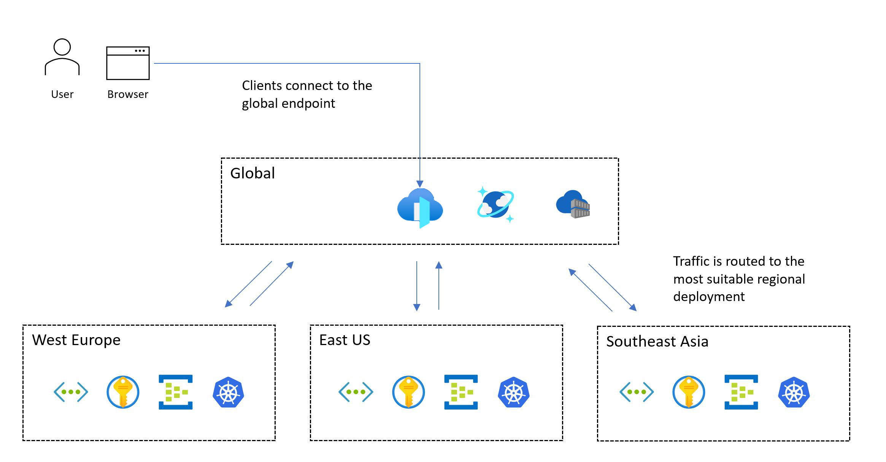

# Application platform considerations for mission-critical workloads on Azure

Azure provides many compute services for hosting highly available applications. The services differ in capability and complexity. We recommend that you choose services based on:

- Non-functional requirements for reliability, availability, performance, and security.
- Decision factors like scalability, cost, operability, and complexity.

The choice of an application hosting platform is a critical decision that affects all other design areas. For example, legacy or proprietary development software might not run in PaaS services or containerized applications. This limitation would influence your choice of compute platform. 

A mission-critical application can use more than one compute service to support multiple composite workloads and microservices, each with distinct requirements.

This design area provides recommendations related to compute selection, design, and configuration options. We also recommend that you familiarize yourself with the [Compute decision tree](/azure/architecture/guide/technology-choices/compute-decision-tree).

> [!IMPORTANT]
> This article is part of the [Azure Well-Architected Framework mission-critical workload](index.yml) series. If you aren't familiar with this series, we recommend that you start with [What is a mission-critical workload?](mission-critical-overview.md#what-is-a-mission-critical-workload).

## Global distribution of platform resources

A typical pattern for a mission-critical workload includes global resources and regional resources.

Plan global and regional platform resources around deployment stamps and scale units. For details, see [Scale-unit architecture](/azure/well-architected/mission-critical/mission-critical-application-design#scale-unit-architecture).

The following image shows the high-level design. A user accesses the application via a central global entry point that then redirects requests to a suitable regional deployment stamp:

For mission-critical workloads, strongly prefer an active/active multi-region model. For details, see [Global distribution](/azure/well-architected/mission-critical/mission-critical-application-design#global-distribution).

Use [Availability zones](/azure/reliability/availability-zones-overview) for regional fault tolerance where supported. For details, see the [Regions and availability zones design guide](/azure/well-architected/design-guides/regions-availability-zones) and [Inter-zone and inter-region connectivity](/azure/well-architected/mission-critical/mission-critical-networking-connectivity#inter-zone-and-inter-region-connectivity).

### Design considerations

- **Regional and zone capabilities**. Not all services and capabilities are available in every Azure region. This consideration could affect the regions you choose. Also, [availability zones](/azure/reliability/availability-zones-region-support) aren't available in every region.

- **Regional pairs**. Azure regions are grouped into [regional pairs](/azure/best-practices-availability-paired-regions) that consist of two regions in a single geography. Some Azure services use paired regions to ensure business continuity and to provide a level of protection against data loss. For example, Azure geo-redundant storage (GRS) replicates data to a secondary paired region automatically, ensuring that data is durable if the primary region isn't recoverable. If an outage affects multiple Azure regions, at least one region in each pair is prioritized for recovery.

- **Data consistency**. For consistency challenges, consider using a globally distributed data store, a stamped regional architecture, and a partially active/active deployment. In a partial deployment, some components are active across all regions while others are located centrally within the primary region.

- **Safe deployment**. The [Azure safe deployment practice (SDP) framework](https://azure.microsoft.com/blog/advancing-safe-deployment-practices) ensures that all code and configuration changes (planned maintenance) to the Azure platform undergo a phased rollout. Health is analyzed for degradation during the release. After canary and pilot phases complete successfully, platform updates are serialized across regional pairs, so only one region in each pair is updated at a given time.

- **Platform capacity**. Like any cloud provider, Azure has finite resources. Unavailability can be the result of capacity limitations in regions. If there's a regional outage, there's an increase in demand for resources as the workload attempts to recover within the paired region. The outage might create a capacity problem, where supply temporarily doesn't meet demand.

### Design recommendations

- Deploy your solution in at least two Azure regions to help protect against regional outages. Deploy it in regions that have the capabilities and characteristics that the workload requires. The capabilities should meet performance and availability targets while fulfilling data residency and retention requirements.

  For example, some data compliance requirements might constrain the number of available regions and potentially force design compromises. In such cases, we strongly recommend that you add extra investment in operational wrappers to predict, detect, and respond to failures. Suppose you're constrained to a geography with two regions, and only one of those regions supports availability zones (3 + 1 datacenter model). Create a secondary deployment pattern using fault domain isolation to allow both regions to be deployed in an active configuration, and ensure that the primary region houses multiple deployment stamps.

  If suitable Azure regions don't all offer capabilities that you need, be prepared to compromise on the consistency of regional deployment stamps to prioritize geographical distribution and maximize reliability. If only a single Azure region is suitable, deploy multiple deployment stamps (regional scale units) in the selected region to mitigate some risk, and use availability zones to provide datacenter-level fault tolerance. However, such a significant compromise in geographical distribution dramatically constrains the attainable composite SLO and overall reliability.

  > [!IMPORTANT]
  > For scenarios that target an SLO that's greater than or equal to 99.99%, we recommend a minimum of three deployment regions. Calculate the [composite SLO](../reliability/metrics.md#define-composite-slo-targets) for all user flows. Ensure that those targets are aligned with business targets.

- For high-scale application scenarios that have significant volumes of traffic, design the solution to scale across multiple regions to navigate potential capacity constraints within a single region. Additional regional deployment stamps can achieve a higher composite SLO. For more information, see how to [implement multiregion targets](../reliability/metrics.md#implement-multiregion-targets).
- Define and validate your recovery point objectives (RPO) and recovery time objectives (RTO).

- Within a single geography, prioritize the use of regional pairs to benefit from SDP serialized rollouts for planned maintenance and regional prioritization for unplanned maintenance.

- Geographically colocate Azure resources with users to minimize network latency and maximize end-to-end performance.

  - You can also use solutions like a Content Delivery Network (CDN) or edge caching to drive optimal network latency for distributed user bases. For more information, see [Global traffic routing](./mission-critical-networking-connectivity.md#global-traffic-routing), [Application delivery services](./mission-critical-networking-connectivity.md#application-delivery-services), and [Caching and static content delivery](./mission-critical-networking-connectivity.md#caching-and-static-content-delivery).

- Align current service availability with product roadmaps when you choose deployment regions. Some services might not be immediately available in every region.

## Containerization

A container includes application code and the related configuration files, libraries, and dependencies that the application needs to run. Containerization provides an abstraction layer for application code and its dependencies and creates separation from the underlying hosting platform. The single software package is highly portable and can run consistently across various infrastructure platforms and cloud providers. Developers don't need to rewrite code and can deploy applications faster and more reliably. 

> [!IMPORTANT]
> We recommend that you use containers for mission-critical application packages. They improve infrastructure utilization because you can host multiple containers on the same virtualized infrastructure. Also, because all software is included in the container, you can move the application across various operating systems, regardless of runtimes or library versions. Management is also easier with containers than it is with traditional virtualized hosting.
>
> Mission-critical applications need to scale fast to avoid performance bottlenecks. Because container images are pre-built, you can limit startup to occur only during bootstrapping of the application, which provides rapid scalability.

### Design considerations
  
- **Monitoring**. Azure supports modern container monitoring with Azure Managed Prometheus and Azure Monitor for containers. For detailed monitoring guidance, see the [monitoring design guide](/azure/well-architected/design-guides/monitoring#phase-2---telemetry-data-collection-and-storage). The most prominent application telemetry approach is OpenTelemetry.

- **Security**. The hosting platform OS kernel is shared across multiple containers, creating a single point of attack. However, the risk of host virtual machine (VM) access is limited because containers are isolated from the underlying operating system.

- **State**. Although it's possible to store data in a running container's file system, the data won't persist when the container is re-created. Instead, persist data by mounting external storage or using an external database.

### Design recommendations

- Containerize all application components. Use container images as the primary model for application deployment packages.

- Prioritize Linux-based container runtimes when possible. The images are more lightweight, and new features for Linux nodes/containers are released frequently.

- Make containers immutable and replaceable, with short lifecycles.

- Be sure to gather all relevant logs and metrics from the container, container host, and underlying cluster. Send the gathered logs and metrics to a [unified data sink](../design-guides/monitoring.md) for further processing and analysis.

- Store container images in Azure Container Registry. For geo-replication and registry resilience details, see [Container registry](/azure/well-architected/mission-critical/mission-critical-application-platform#container-registry).

## Container hosting and orchestration

Several Azure application platforms can effectively host containers.
There are advantages and disadvantages associated with each of these platforms. Compare the options in the context of your business requirements. However, always optimize reliability, scalability, and performance. For more information, see these articles:

- [Compute decision tree](/azure/architecture/guide/technology-choices/compute-decision-tree)
- [Container option comparisons](/azure/container-apps/compare-options#container-option-comparisons)

> [!IMPORTANT]
> [Azure Kubernetes Service (AKS)](/azure/well-architected/service-guides/azure-kubernetes-service) and [Azure Container Apps](/azure/container-apps/overview) should be among your first choices for container management depending on your requirements.  Although [Azure App Service](/azure/well-architected/service-guides/app-service-web-apps) isn't an orchestrator, as a low-friction container platform, it's still a feasible alternative to AKS.

#### Design considerations and recommendations for Azure Kubernetes Service

AKS is the recommended application platform for mission-critical workloads because Kubernetes is natively built to handle failure at scale, AKS provides a managed control plane with built-in availability zone support, and the ecosystem offers mature patterns for self-healing, automated scaling, and blue/green deployments that align well with the Mission Critical principles. For a complete set of recommendations, see the [Azure Kubernetes Service service guide](/azure/well-architected/service-guides/azure-kubernetes-service).

###### Reliability

Kubernetes is natively built to handle failure at scale across large deployments. With AKS, Azure manages the native Kubernetes control plane and is designed to keep workloads running even with temporary outtage of the control plane. 

- Deploy [AKS clusters across different Azure regions](/azure/aks/reliability-multi-region-deployment-models) as a scale unit to maximize reliability and availability. Use [availability zones](/azure/aks/availability-zones) to maximize resilience within an Azure region by distributing AKS control plane and agent nodes across physically separate datacenters. However, if colocation latency is a problem, you can do AKS deployment within a single zone or use [proximity placement groups](/azure/aks/reduce-latency-ppg) to minimize internode latency.

###### Scalability

Take into account AKS [scale limits](/azure/azure-resource-manager/management/azure-subscription-service-limits#azure-kubernetes-service-limits), like the number of nodes, node pools per cluster, and clusters per subscription.

- If scale limits are a constraint, take advantage of the [scale-unit strategy](mission-critical-application-design.md#scale-unit-architecture), and deploy more units with clusters.

- With the avaialability of the [Node Autoprovisioner (NAP)](/azure/aks/node-autoprovision), [KEDA](/azure/aks/keda-about), [Horizontal Pod Autoscaler (HPA)](/azure/aks/concepts-scale#horizontal-pod-autoscaler) and [Vertical Pod Autoscaler (VPA)](/azure/aks/vertical-pod-autoscaler) you can achieve a high application density and fast scale without losing stability for workloads that don't take disruptions well.

For deeper insights into Isolation, Security, Upgrades, Networking and  Monitoring for AKS, see the [Azure Kubernetes Service service guide](/azure/well-architected/service-guides/azure-kubernetes-service).

#### Design considerations and recommendations for Azure Container Apps

[Azure Container Apps](/azure/well-architected/service-guides/azure-container-apps) is a serverless container platform that's a strong alternative to AKS when you don't need direct Kubernetes API access. It removes most cluster operations while preserving the features mission-critical workloads rely on:

- Built-in [KEDA-based event-driven autoscaling](/azure/container-apps/scale-app), including scale-to-zero for non-critical flows.
- [Availability zone redundancy](/azure/container-apps/disaster-recovery) and [revision-based blue/green deployments](/azure/container-apps/revisions) for safe rollouts.
- Native [Dapr integration](/azure/container-apps/dapr-overview) for service invocation, state, and pub/sub across microservices.
- [VNet integration with private endpoints](/azure/container-apps/networking) and managed identity for end-to-end private, passwordless connectivity.

## Container registry

Use [Azure Container Registry](/azure/container-registry/container-registry-intro) as a global, long-living resource. 

- Use the [Premium tier](/azure/container-registry/container-registry-skus) and enable [geo-replication](/azure/container-registry/container-registry-geo-replication) to every deployment region for redundancy and low-latency pulls.
- Enable [zone redundancy](/azure/container-registry/zone-redundancy) where availability zones are supported, and restrict access via [private endpoints](/azure/container-registry/container-registry-private-link).
- Use [Microsoft Entra authentication](/azure/container-registry/container-registry-authentication) and disable the admin account; protect the registry with [resource locks](/azure/azure-resource-manager/management/lock-resources).
- Avoid mutable tags in production and use [image and repository locks](/azure/container-registry/container-registry-image-lock) to prevent accidental deletion or overwrite.
- Replicate critical public images (for example, from Docker Hub) into your private registry to avoid throttling and external availability risks.

## Serverless compute

Serverless computing provides resources on demand and eliminates the need to manage infrastructure. The cloud provider automatically provisions, scales, and manages the resources required to run deployed application code. Azure provides several serverless compute platforms:

- [Azure Functions](/azure/well-architected/service-guides/azure-functions). When you use Azure Functions, application logic is implemented as distinct blocks of code, or *functions*, that run in response to events, like an HTTP request or queue message. Each function scales as necessary to meet demand.

- [Azure Logic Apps](/azure/logic-apps/logic-apps-overview). Logic Apps is best suited for creating and running automated workflows that integrate various apps, data sources, services, and systems. Like Azure Functions, Logic Apps uses built-in triggers for event-driven processing. However, instead of deploying application code, you can create logic apps by using a graphical user interface that  supports code blocks like conditionals and loops.

- [Azure API Management](/azure/well-architected/service-guides/azure-api-management). You can use API Management to publish, transform, maintain, and monitor enhanced-security APIs by using the Consumption tier.

- [Power Apps and Power Automate](/powerapps/powerapps-overview). These tools provide a low-code or no-code development experience, with simple workflow logic and integrations that are configurable through connections in a user interface.

For mission-critical applications, serverless technologies provide simplified development and operations, which can be valuable for simple business use cases. However, this simplicity comes at the cost of flexibility in terms of scalability, reliability, and performance, and that's not viable for most mission-critical application scenarios.

The following sections provide design considerations and recommendations for using Azure Functions and Logic Apps as alternative platforms for non-critical workflow scenarios.

#### Design considerations and recommendations for Azure Functions

Mission-critical workloads have critical and non-critical system flows. Azure Functions is a viable choice for non-critical, event-driven flows with short-lived executions. For full guidance, see the [Functions service guide](/azure/well-architected/service-guides/azure-functions).

- Prefer the [Flex Consumption plan](/azure/azure-functions/flex-consumption-plan) for serverless scale with per-instance concurrency control, always-ready instances to mitigate cold starts, and native [VNet integration](/azure/azure-functions/functions-networking-options). See [Performance Efficiency](/azure/well-architected/service-guides/azure-functions#performance-efficiency) in the service guide.
- Use [managed identity with identity-based connections](/azure/azure-functions/functions-identity-based-connections-tutorial) for triggers and bindings; avoid storing secrets in app settings. See [Security](/azure/well-architected/service-guides/azure-functions#security) in the service guide.

#### Design considerations and recommendations for Azure Logic Apps

Like Azure Functions, Logic Apps uses built-in triggers for event-driven processing. However, instead of deploying application code, you can create logic apps by using a graphical user interface that supports blocks like conditionals, loops, and other constructs.

Multiple [deployment modes](/azure/logic-apps/single-tenant-overview-compare) are available. We recommend the Standard mode to ensure a single-tenant deployment and mitigate noisy neighbor scenarios. This mode uses the containerized single-tenant Logic Apps runtime, which is based on Azure Functions. In this mode, the logic app can have multiple stateful and stateless workflows. You should be aware of the configuration limits.

## Constrained migrations via IaaS
Many applications that have existing on-premises deployments use virtualization technologies and redundant hardware to provide mission-critical levels of reliability. Modernization is often hindered by business constraints that prevent full alignment with the cloud-native baseline [north star design approach](/azure/well-architected/mission-critical/mission-critical-architecture-pattern) that's recommended for mission-critical workloads. That's why many applications adopt a phased approach, with initial cloud deployments using virtualization and Azure Virtual Machines as the primary application hosting model. The use of infrastructure as a service (IaaS) VMs might be required in certain scenarios:

- Available PaaS services don't provide the required performance or level of control.
- The workload requires operating system access, specific drivers, or network and system configurations.
- The workload doesn't support running in containers.
- There's no vendor support for third-party workloads.

This section focuses on the best ways to use Virtual Machines and associated services to maximize the reliability of the application platform. It highlights key aspects of the mission-critical design methodology that transpose cloud-native and IaaS migration scenarios.

### Design considerations

- The operational costs of using IaaS VMs are significantly higher than the costs of using PaaS services because of the management requirements of the VMs and the operating systems. Managing VMs necessitates the frequent rollout of software packages and updates.

- Azure provides capabilities to increase the availability of VMs:
  - [Availability zones](/azure/reliability/availability-zones-overview) can help you achieve even higher levels of reliability by distributing VMs across physically separated datacenters within a region.
  - [Azure virtual machine scale sets](/azure/virtual-machine-scale-sets/overview) provide functionality for automatically scaling the number of VMs in a group. They also provide capabilities for monitoring instance health and automatically repairing [unhealthy instances](/azure/virtual-machine-scale-sets/virtual-machine-scale-sets-automatic-instance-repairs).
  - [Scale sets with flexible orchestration](/azure/virtual-machine-scale-sets/virtual-machine-scale-sets-orchestration-modes#scale-sets-with-flexible-orchestration-recommended) can help protect against network, disk, and power failures by automatically distributing VMs across fault domains.
 
For detailed Azure Virtual Machines configuration guidance, see the [Virtual Machines service guide](/azure/well-architected/service-guides/virtual-machines).

### Design recommendations

> [!IMPORTANT]
> Use PaaS services and containers when possible to reduce operational complexity and cost. Use IaaS VMs only when you need to.

- [Right-size VM SKU sizes](/azure/virtual-machines/sizes) to ensure effective resource utilization.

- Deploy three or more VMs across [availability zones](/azure/reliability/availability-zones-overview) to achieve datacenter-level fault tolerance.
  - If you're deploying commercial off-the-shelf software, consult the software vendor and test adequately before deploying the software into production.

- For workloads that you can't deploy across availability zones, use [flexible virtual machine scale sets](/azure/virtual-machine-scale-sets/virtual-machine-scale-sets-orchestration-modes#scale-sets-with-flexible-orchestration-recommended) that contain three or more VMs. For more information about how to configure the correct number of fault domains, see [Manage fault domains in scale sets](/azure/virtual-machine-scale-sets/virtual-machine-scale-sets-manage-fault-domains).

- Prioritize the use of Virtual Machine Scale Sets for scalability and zone redundancy. This point is particularly important for workloads that have varying loads. For example, if the number of active users or requests per second is a varying load.
  
- Don't access individual VMs directly. Use load balancers in front of them when possible.

- Protect against regional outages by deploying application VMs across multiple Azure regions. For details about chaos validation, see [Continuous validation and testing](/azure/well-architected/mission-critical/mission-critical-deployment-testing#continuous-validation-and-testing). For guidance on routing traffic between active regions, see [Networking and connectivity](/azure/well-architected/mission-critical/mission-critical-networking-connectivity#global-traffic-routing).

- For workloads that don't support multi-region active/active deployments, consider implementing active/passive deployments by using hot/warm standby VMs for regional failover.

- Use standard images from Azure Marketplace rather than custom images that need to be maintained.

- Implement automated processes to deploy and roll out changes to VMs, avoiding any manual intervention. For more information, see [IaaS considerations](./mission-critical-operational-procedures.md#iaas-specific-considerations-when-using-vms) in the [Operational procedures](./mission-critical-operational-procedures.md) design area.

- Implement chaos experiments to inject application faults into VM components, and observe the mitigation of faults. For more information, see [Continuous validation and testing](./mission-critical-deployment-testing.md#continuous-validation-and-testing).

- Monitor VMs and ensure that diagnostic logs and metrics are ingested into a [unified data sink](../design-guides/monitoring.md).

- Implement security practices for mission-critical application scenarios, when applicable, and the [Security best practices for IaaS workloads in Azure](/azure/security/fundamentals/iaas).

## Next step

Review the considerations for the data platform.
> [!div class="nextstepaction"]
> [Data platform](./mission-critical-data-platform.md)
