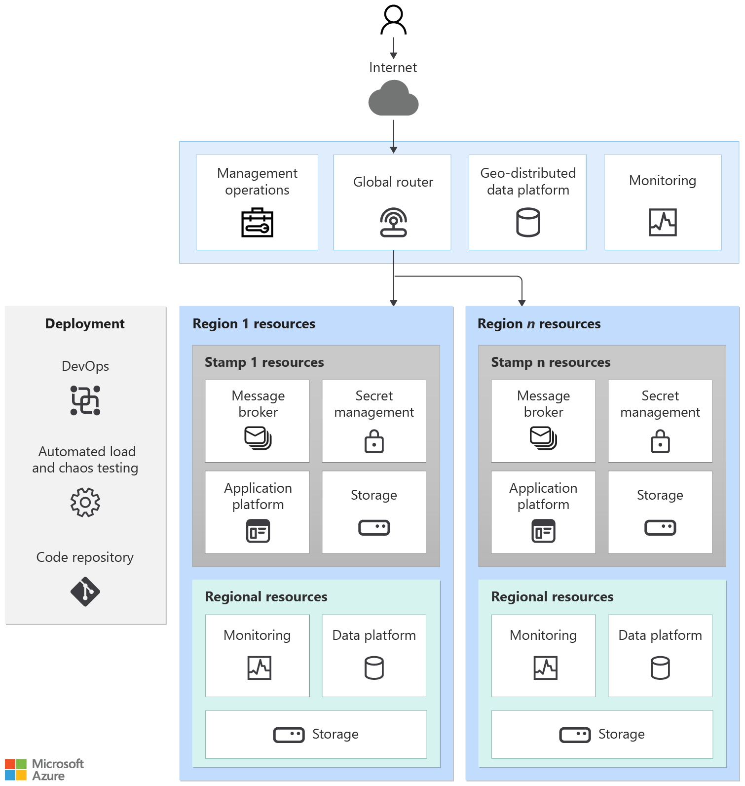

# Architecture pattern for mission-critical workloads on Azure

This article presents a common pattern for mission-critical architecture. As you start the design process, start with this pattern, and then choose components that are best suited for your business requirements. 

The pattern has three layers and resources in them have distinct characteristics:

|Characteristics|Considerations|
|---|---|
|Lifetime|What is the expected lifetime of resource, relative to other resources in the solution? Should the resource outlive or share the lifetime with the entire system or region, or should it be temporary?|
|State|What impact will the persisted state at this layer have on reliability or manageability? |
|Reach|Is the resource required to be globally distributed? Can the resource communicate with other resources, globally or in regions?|
|Dependencies|What's the dependency on other resources, globally or in other regions?|
|Scale limits|What is the expected throughput for that resource at that layer? How much scale is provided by the resource to fit that demand? |
|Availability/disaster recovery|What's the impact on availability or disaster at this layer? Would it cause a systemic outage or only localized capacity or availability issue?|

We recommend that you evaluate [**the key design areas**](/azure/architecture/framework/mission-critical/mission-critical-overview#what-are-the-key-design-areas) and develop a matrix of Azure resources and their configuration while keeping in mind the preceding characteristics. 

> [!IMPORTANT]
> This article is part of the [Azure Well-Architected mission-critical workload](index.yml) series. If you aren't familiar with this series, we recommend you start with [what is a mission-critical workload?](mission-critical-overview.md#what-is-a-mission-critical-workload)
>

## Mission-critical pattern

### Global resources 
Certain resources in this architecture are shared by resources deployed in regions. Common examples are resources that are used to distribute traffic across multiple regions, store permanent state for the whole application, and monitor resources for them.

|Characteristics|Layer Considerations|
|---|---|
|Lifetime|These resources are expected to be long living. Their lifetime spans the life of the system or longer. Often the resources are managed with in-place data and control plane updates, assuming they support zero-downtime update operations.|
|State| Because these resources exist for at least the lifetime of the system, this layer is often responsible for storing global, geo-replicated state.|
|Reach|The resources should be globally distributed. It’s recommended that these resources communicate with regional or other resources with low latency and the desired consistency.|
|Dependencies|The resources should avoid dependencies on regional resources because their unavailability can be a cause of global failure. For example, certificates or secrets kept in a single vault could have global impact if there's a regional failure where the vault is located.|
|Scale limits|Often these resources are singleton instances in the system, and as such they should be able to scale such that they can handle throughput of the system as a whole.|
|Availability/disaster recovery|Because regional and stamp resources can consume global resources or are fronted by them, it's critical that global resources are configured with high availability and disaster recovery for the health of the whole system.|

### Regional resources 

A system can have resources that are deployed in region but outlive the stamp resources. For example, observability resources that monitor resources at the regional level, including the stamps.

|Characteristics|Consideration|
|---|---|
|Lifetime|The resources share the lifetime of the region and out live the stamp resources.|
|State| State stored in a region can't live beyond the lifetime of the region. If state needs to be shared across regions, consider using a global data store.|
|Reach|The resources don't need to be globally distributed. Direct communication with other regions should be avoided at all cost. |
|Dependencies| The resources can have dependencies on global resources, but not on stamp resources because stamps are meant to be short lived. |
|Scale limits|Determine the scale limit of regional resources by combining all stamps within the region.|

### Regional stamp resources
The stamp contains the application and resources that participate in completing business transactions. A stamp typically corresponds to a deployment to an Azure region. Although a region can have more than one stamp.

|Characteristics|Considerations|
|---|---|
|Lifetime|The resources are expected to have a short life span (ephemeral) with the intent that they can get added and removed dynamically while regional resources outside the stamp continue to persist. The ephemeral nature is needed to provide more resiliency, scale, and proximity to users. |
|State| Because stamps are ephemeral and can be destroyed at any time, a stamp should be stateless as much as possible.|
|Reach|Can communicate with regional and global resources. However, communication with other regions or other stamps should be avoided. In this architecture, there isn't a need for these resources to be globally distributed.|
|Dependencies| The stamp resources must be independent. That is, they shouldn't rely on other stamps or components in other regions. They're expected to have regional and global dependencies.  The main shared component is the database layer and container registry. This component requires synchronization at runtime.|
|Scale limits|Throughput is established through testing. The throughput of the overall stamp is limited to the least performant resource. Stamp throughput needs to take into account the estimated high-level of demand and any failover as the result of another stamp in the region becoming unavailable.|
|Availability/disaster recovery|Because of the temporary nature of stamps, disaster recovery is done by redeploying the stamp. If resources are in an unhealthy state, the stamp, as a whole, can be destroyed and redeployed. 

## Pattern examples

These examples outline a few of the common ways that mission-critical solutions are built.

<ul class="columns is-multiline has-margin-left-none has-margin-bottom-none has-padding-top-medium">
    <li class="column is-one-third has-padding-top-small-mobile has-padding-bottom-small">
        <article class="card has-outline-hover is-relative is-fullheight">
            <figure class="image has-margin-right-none has-margin-left-none has-margin-top-none has-margin-bottom-none">
                
             </figure>
             

                 

                    
Baseline architecture

                 

                    

                        
The workload is accessed over a public endpoint and doesn't require private network connectivity to other company resources.

                    

                

            </article>
    </li>
    <li class="column is-one-third has-padding-top-small-mobile has-padding-bottom-small">
        <article class="card has-outline-hover is-relative is-fullheight">
            <figure class="image has-margin-right-none has-margin-left-none has-margin-top-none has-margin-bottom-none">
               
                </figure>
                

                    

                      
Baseline with network controls

                    

                    

                        
The workload has strict network controls in place to prevent unauthorized public access from the internet to any of the workload resources.

                    

                

            </article>
    </li>
    <li class="column is-one-third has-padding-top-small-mobile has-padding-bottom-small">
        <article class="card has-outline-hover is-relative is-fullheight">
          <figure class="image has-margin-right-none has-margin-left-none has-margin-top-none has-margin-bottom-none">
              
          </figure>
          

             

              
Baseline in Azure landing zones

             

             

                   
The workload uses centralized shared services, needs on-premises connectivity, and integrates with other workloads of an enterprise.

             

          

       </article>
    </li>
    <li class="column is-one-third has-padding-top-small-mobile has-padding-bottom-small">
        <article class="card has-outline-hover is-relative is-fullheight">
          <figure class="image has-margin-right-none has-margin-left-none has-margin-top-none has-margin-bottom-none">
              
          </figure>
          

             

              
Carrier-grade voicemail solution

             

             

                   
Within the telecommunications industry, mission-critical applications are referred to as carrier-grade systems. This example shows a voice mail solution.

             

          

       </article>
    </li>         
</ul>

## Azure landing zone integration

[Azure landing zones](/azure/cloud-adoption-framework/ready/landing-zone/) provides prescriptive architectural guidance to define a reliable and scalable shared-service platform for enterprise Azure deployments with requisite centralized governance. 

This mission-critical workload series provides prescriptive architectural guidance to define a highly reliable application for mission-critical workloads that could be deployed within an Azure landing zone.

The mission-critical [reference implementations](mission-critical-overview.md#illustrative-examples) can integrate seamlessly within an Azure landing zone, and is deployable within both the *Online* or *Corp. Connected* Landing Zone formats as demonstrated within the image below.

It's crucial to understand and identify in which connectivity scenario a mission-critical application requires since Azure landing zones support different workload agnostic landing zones archetypes separated into different Management Group scopes.

> The mission-critical reference implementations are fully aligned with the Azure landing zones architectural approach and are immediately deployable within an *Online* or *Connected* Landing Zone subscription.

- In the context of an *Online* landing zone archetype, a mission-critical workload operates as a completely independent solution, without any direct corporate network connectivity to the rest of the Azure landing zone architecture. The application will, however, be further safeguarded through the [*policy-driven management*](/azure/cloud-adoption-framework/ready/enterprise-scale/dine-guidance) approach which is foundational to Azure landing zones, and will automatically integrate with centralized platform logging through policy.

  An *Online* deployment can only really consider a public application deployment since there no private corporate connectivity provided.

- When deployed in a *Corp. Connected* Landing Zone context, the mission-critical workload takes a dependency on the Azure landing zone to provide connectivity resources which allow for integration with other applications and shared services. This necessitates some transformation on-top of the *Online* integration approach, because some foundational resources are expected to exist up-front as part of the shared-service platform. More specifically, the regional deployment stamp shouldn't longer encompass an ephemeral Virtual Network or Azure Private DNS Zone since these will exist within the Azure landing zones *connectivity* subscription. 

  A *Corp. Connected* deployment can consider both a public or private application deployment.

## Next step

Review the best practices for architecting mission-critical application scenarios.

> [!div class="nextstepaction"]
> [Application design](./mission-critical-application-design.md)

