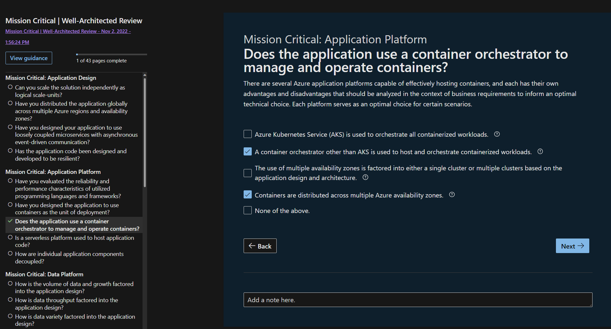
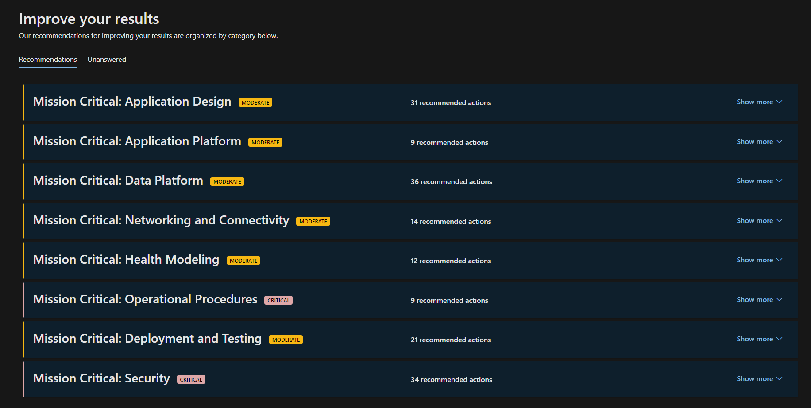

# Well-Architected assessment for mission-critical workloads

The [Assessment](/assessments/?mode=pre-assessment&id=23513bdb-e8a2-4f0b-8b6b-191ee1f52d34) is a review tool for self-assessing the readiness of your mission-critical workload in production. Working towards building a resilient mission critical architecture can be a complex process. The assessment is organized in a way that you'll be able to methodically check the alignment to the best practices for resiliency, reliability, and availability.

The assessment is a set of questions based on the [mission-critical design methodology](/azure/architecture/framework/mission-critical/mission-critical-design-principles?branch=main) as a way of checking the foundational design choices of a workload’s architecture and the end-to-end operational approach.

These questions are designed to help benchmark a workload’s maturity and alignment to the recommended approach for operating a mission-critical workload. The outcome of the assessment is the delivery of technical recommendations and documentation that provide guidance on how to implement a highly reliable solution on Azure. 

We recommend that the team doing the assessment is well versed in the architecture of the specific workload and has a strong understanding of cloud principles and patterns. These roles include, but aren't limited to, cloud architect, security engineer, and product manager. 

Working towards building a mission-critical architecture can be a complex process, however, the assessment is organized to help methodically check that workloads remain aligned with the best practices for resiliency, reliability, and availability.
 
> [!div class="nextstepaction"]
> [Mission-critical review tool](/assessments/?mode=pre-assessment&id=23513bdb-e8a2-4f0b-8b6b-191ee1f52d34)

 
