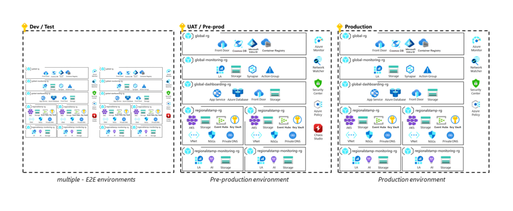

# Deployment and testing for mission-critical workloads on Azure

Failed deployments or erroneous releases are common causes for application outages. How you approach deployment and testing plays a critical role in the overall reliability of a mission-critical application.
Deployment and testing should form the basis for _all_ application and infrastructure operations to ensure consistent outcomes for mission-critical workloads. Be prepared to deploy weekly, daily, or more often. Design your Continuous Integration and Continuous Deployment (CI/CD) pipelines to support those goals.

The strategy should aspire for:

- **Rigorous pre-release testing**. Updates shouldn't introduce defects, vulnerabilities, or other factors that might jeopardize application health.

- **Transparent deployments**. Updates should be rolled out at any time without impacting users. The users should be able to continue their interaction with the application interaction without interruption.

- **Highly available operations**. Deployment and testing processes and tools must be highly available to support overall application reliability.

- **Consistent deployment process**. Same application artifacts and processes are used to deploy the infrastructure and application code across different environments. End-to-end automation is mandatory. Manual interventions must be avoided because they can be a significant reliability risk.

This design area provides recommendations on how to optimize deployment and testing processes with the goal of minimizing downtime and maintaining application health and availability.

> [!IMPORTANT]
> This article is part of the [Azure Well-Architected mission-critical workload](index.yml) series. If you aren't familiar with this series, we recommend you start with [what is a mission-critical workload?](mission-critical-overview.md#what-is-a-mission-critical-workload)

##  Zero-downtime deployment

> [!VIDEO 1d3846c0-f301-4a25-a49a-94f5be3f6605]

Achieving zero-downtime deployments is a fundamental goal of a mission-critical application. It’s critical for workloads that need to be available 24x7 or need to roll out new releases during business hours. Invest your efforts up-front to define and plan deployment processes, to drive key design decisions such as whether to treat resources as ephemeral.

A zero-downtime deployment aims to reduce the user-facing downtime of a deployment, such as rollout of a newer version to zero. To achieve this, deploy new infrastructure next to the existing infrastructure, test it thoroughly, transition end user traffic, and only then decommission the existing (now old) infrastructure. Other practices like the scale-unit architecture are key for the implementation.

The [Mission-Critical Online](https://github.com/Azure/Mission-Critical-Online) and [Azure Mission-Critical Connected](https://github.com/Azure/Mission-Critical-Connected) reference implementations illustrate an optimized zero-downtime deployment approach as shown in this image.

## Application environments

> [!VIDEO 7e6e6390-9f32-4c9e-88da-497a604db319]

You’ll need various types of environments to validate and stage deployment operations. The types will differ in capabilities and lifecycle. Some environments might reflect production and are long lived while others may be short lived with lower capabilities than production. Setting up these environments early in the development cycle will ensure agility, separation of production and preproduction assets, and thorough testing of operations before releasing to the production environment. All environments reflect the production environment as much as possible, with simplifications applied for lower environments as necessary. 

There are some common considerations. 

- Different environments shouldn’t share components between environments. Possible exceptions are downstream security appliances like firewalls, or source locations for synthetic test data.

- All types of environments should use Infrastructure-as-Code (IaC) artifacts such as Terraform or Azure Resource Manager (ARM) templates.

### Development environments

Ephemeral dev environments and automated feature validation
> [!VIDEO https://www.microsoft.com/en-us/videoplayer/embed/RE50Gm9]

#### Design Considerations

- **Capabilities**. Lower requirements for reliability, capacity, and security are acceptable for these environments. 

- **Lifecycle**. These environments should be created when required and only exist for short periods. Shorter lifecycle will prevent configuration drift from the code base and lower costs. Also, development environments often share the lifecycle of a feature branch.

- **Density**. Teams will need multiple environments to support parallel feature development. They can coexist within a single subscription.

#### Design recommendations
- Keep the environment in a dedicated subscription with context set of development purposes.

- Use an automated process to deploy code from a feature branch to a development environment.

### Test or staging environments

#### Design Considerations

- **Capabilities** The focus is testing and validation with many test cycles to ensure bug-free deployment to production. That’s why this environment should reflect the production environment for reliability, capacity, and security. In absence of a production load, use synthetic user load to provide realistic metrics and valuable health modeling input.
- **Lifecycle**. These environments are short-lived and should be destroyed after validation tests are completed.

- **Density**. You can run many independent environments in one subscription, however, having multiple environments in dedicated subscriptions is recommended. 

> [!NOTE]
> Mission-critical applications should be subject to rigorous testing. 
> Different test functions can be performed within the same environment, and in some cases this will be required.For example, for chaos testing to provide meaningful results, the application must first be placed under load to be able to understand how the application responds to injected faults. Chaos testing and load testing are therefore typically performed in parallel.

The various tests are described in the Continuous validation and testing section. 

#### Design recommendations
- Ensure at least one staging environment is fully reflective of production to enable production-like testing and validation. Capacity within this environment can flex based on the execution of test activities.

- Generate synthetic user load to provide a realistic test case for changes on one of the environments.
  > [!NOTE]
  > The [Mission Critical Online](https://github.com/Azure/Mission-Critical-Online) reference implementation provides an example [user load generator](https://github.com/Azure/Mission-Critical-Online/blob/main/src/testing/userload-generator/README.md).

- Define the number of staging environments and their purpose within the development and release cycle.

### Production environments

#### Design Considerations

- **Capabilities** Highest level of reliability, capacity, and security functionality needed for the application.

- **Lifecycle** While the lifecycle of the workload and the infrastructure remains the same needs all data including monitoring and logging data special treatment including considerations around backup and recovery.

- **Density** Some applications may consider multiple different production environments to cater to different clients, users, or business functionality.

#### Design recommendations

Have a clear governance boundary for production and lower environments. Place each environment type in their dedicated subscription to achieve that goal. This segmentation will make sure resource utilization in lower environments won’t impact production quotas. Dedicated subscriptions will also set access boundaries. 

## Ephemeral blue/green deployments

A blue/green deployment model requires a minimum of two identical deployments. Blue is the active deployment that serves user traffic in production. Green is the new deployment that’s prepared and tested to receive traffic.
After the green deployment is completed and tested, traffic is gradually directed from blue to green. If the load transfer is successful, the green deployment becomes the new active deployment. The old blue deployment can then be decommissioned through a phased process. However, if there are issues in the new deployment, it can be aborted, and traffic can either remain in the old blue deployment or be redirected to it.

Azure Mission-Critical emphasizes a **blue/green deployment approach where infrastructure _and applications_ are deployed together** as part of a deployment stamp. This means, rolling out a change to the infrastructure or application will always result in green deployment that contains both layers. The benefit is the ability to fully test and validate the impact of the change against the infrastructure and application end-to-end before user traffic is redirected to it. This approach increases confidence in releasing changes and enables zero-downtime upgrades because compatibilities with downstream dependencies such as Azure platform, resource providers or Infrastructure-as-Code modules can be validated.

### Design Considerations

- **Technology capabilities**. Take advantage of the built-in deployment features in Azure services. For example, Azure App Service provides secondary deployment slots that can be swapped after the deployment. For Azure Kubernetes Service (AKS), you can use separate pod deployment on each node and update service definition. 

- **Deployment duration**. The entire deployment might take longer to complete because the stamp contains the infrastructure and application than just the changed component. This, however, is acceptable because the risk of all components not working as expected is greater than the time taken to roll out the changes. 

- **Cost impact** There's an additional cost because two deployments, which contain infrastructure and application, coexist until the deployment is fully complete.

- **Traffic transition**. After the new deployment is validated, traffic must be transitioned from blue to green environments. This requires orchestration of user traffic between the environments. This transition should be fully automated.

- **Lifecycle**. Mission-critical deployment stamps should be considered as ephemeral to ensure a fresh start each time, before provisioning resources.

### Design recommendations
- Adopt a blue/green deployment approach to release all production changes. Deploy all infrastructure and application, for any type of change, each time to achieve a consistent state and zero downtime. While environments can be reused, it isn’t recommended for mission-critical workloads. Treat each regional deployment stamp as ephemeral with a lifecycle tied to that of a single release.

- Use a global load balancer, such as Azure Front Door, to orchestrate the automated transition of user traffic between the blue and green environments.

- For transitioning traffic, add a green backend endpoint using a low traffic volume/weight, such as 10%. After verifying that the low traffic volume on green working with the expected application health, gradually increase the traffic. While doing so, apply a short ramp-up period to catch faults that may not become known immediately.

  After 100% of traffic has transitioned, remove the blue backend from existing connections. For instance, remove the backend from global load balancer service, drain queues, and detach other associations. You’ll optimize the cost of maintaining secondary production infrastructure while making sure new environments are free of configuration drift.

  At this point, decommission the old and now inactive blue environment. Repeat the process for the next deployment with blue and green reversed.

## Subscription-scoped deployment
Depending on the scale requirements of the application, multiple production subscriptions might be needed to serve as scale units.

> [!VIDEO https://learn-video.azurefd.net/vod/player?id=013a2a82-dc85-4282-98ed-b1afe50afd41&embedUrl=/azure/architecture/framework/mission-critical/mission-critical-application-design]

### Design considerations

- **Scalability**. For high-scale application scenarios with significant volumes of traffic, design the solution to scale across multiple Azure subscriptions so that scale limits of a single subscription don't constrain scalability.
  
  > [!IMPORTANT]
  > The use of multiple subscriptions necessitates additional CI/CD complexity, which must be appropriately managed. Therefore, it's only recommended in extreme scale scenarios, where the limits of a single subscription are likely to become a limitation.

- **Environment boundaries**. Deploy production, development, or test environments, into separate subscriptions. This practice ensures that lower environments don't contribute towards scale limits. Also, it reduces the risk of lower environment updates polluting production, by providing a clear management and identity boundary.

- **Governance**. Where multiple production subscriptions are needed, consider using a dedicated application management group to simplify policy assignment through a policy aggregation boundary.

### Design recommendations

- Deploy each regional deployment stamp within a dedicated subscription to ensure the subscription limits only apply within the context of a single deployment stamp and not across the application as a whole. Where appropriate, multiple deployment stamps can be considered within a single region, but you should deploy them across independent subscriptions.

- Separate the global shared resources within a dedicated subscription to allow for consistent regional subscription deployment. Avoid using a specialized deployment for a primary region.

### Example - Subscription scale-unit approach
This image demonstrates how the single subscription reference deployment model can be expanded across multiple subscriptions, in an extreme scale scenario, to navigate subscription scale-limits.

## Continuous validation and testing

Testing is a fundamental activity to fully validate the health of both the application code and infrastructure. More specifically, to meet the desired standards for reliability, performance, availability, security, quality, and scale. Testing must be well defined and applied as part of application design and DevOps strategy. 
Testing is a key concern for both the local developer experience ("[Inner Loop](/dotnet/architecture/containerized-lifecycle/design-develop-containerized-apps/docker-apps-inner-loop-workflow)") and the complete DevOps lifecycle ("[Outer Loop](/dotnet/architecture/containerized-lifecycle/docker-devops-workflow/docker-application-outer-loop-devops-workflow)"), which captures when code starts its journey from release pipeline processes a production environment.

> [!VIDEO fc7842c3-7c7a-44dc-ad87-838aa51d0000]

This section focuses on testing the outer loop for a product release using different types of tests. 

|Test|Description|
|---|---|
|**Unit testing**|Confirms that the application business logic works as expected and validates the overall effect of the code changes.| 
|**Smoke testing**|Identifies whether infrastructure and application components are available and function as expected. Typically, only a single virtual user session is tested. The outcome should be that the system responds with expected values and behavior.   Common smoke testing scenarios include reaching the HTTPS endpoint of a web application, querying a database, and simulating a user flow in the application.|
|**UI testing**|Validates that application user interfaces are deployed and user interface interactions function as expected. UI automation tools can and should be used to drive automation. During a UI test, a script should mimic a realistic user scenario and follow a series of steps to execute actions and achieve an intended outcome.|
|**Load testing**|Validates scalability and application operation by increasing load rapidly and/or gradually until a predetermined threshold reached. Load tests are typically designed around a particular user flow to verify that application requirements are satisfied under a defined load.|
|**Stress testing**|Applies activities that overload existing resources to understand where solution limits exist, and to ensure the system’s ability to recover gracefully. The main goal is to identify potential performance bottlenecks and scale limits. Conversely, scale down the computing resources of the system and monitor how it behaves under load and whether it's able to recover.|
|**Performance testing**|Combines aspects of *load* and *stress testing* to validate performance under load and establish benchmark behaviors for application operation.|
|**Chaos testing**|Injects artificial failures to the system to validate how the system reacts and the effectiveness of resiliency measures, operational procedures, and mitigations. Shutting down infrastructure components, purposely degrading performance, or introducing application faults are examples of test scenarios, which can be used to verify that the application is going to react as expected in situations when they occur for real.
|**Penetration testing**|Ensures that an application and its environment satisfy an expected security posture. The goal is to identify security vulnerabilities. Security testing can include end-to-end software supply chain and package dependencies, with scanning and monitoring for known Common Vulnerabilities and Exposures (CVE).|

### Design considerations

- **Automation**. With high degrees of deployment automation, automated testing is essential to validate application or infrastructure changes in a timely and repeatable manner.

- **Test order**. The order of conducted tests is also a critical consideration because of various dependencies, such as the need to have a running application environment. Order is also determined by test duration.  Tests with shorter execution times should run earlier in the cycle where possible to increase testing efficiency.

- **Scalability limits**. Azure services have different soft and hard limits. Consider load testing to know whether a system faces a risk of exceeding them during the expected production load. Load testing can be useful in setting appropriate thresholds for autoscaling. For services that don’t support autoscaling, load testing can help fine tune the automated operational procedures. 
Inability of system components, such as active/passive network components or databases, to appropriately scale can be restrictive. Stress testing can help identify limitations.

- **Failure mode analysis**. Introducing faults in the application and underlying infrastructure and evaluating the impact is essential in achieving confidence in the solutions redundancy mechanisms. During this exercise, identify the risk, impact, and breadth of impact (partial or full outage). To see an example analysis done for rhe [Mission Critical Online](https://github.com/Azure/Mission-Critical-Online) reference implementation, see [Outage risks of individual components](https://github.com/Azure/Mission-Critical-Connected/blob/main/docs/reference-implementation/Health-Failure-Analysis.md).

- **Monitoring**. Test results should be captured and analyzed as both individual test results and aggregated for assessing trends over time. Test results should be continually evaluated for accuracy and coverage.

 ### Design recommendations

- Ensure consistency by automating all testing efforts on both infrastructure and application components. Integrate the tests in Continuous Integration and Continuous Deployment (CI/CD) pipelines to orchestrate and execute tests where applicable. For options, [DevOps tooling choices](#devops-tooling-choices). 

- Treat all test artifacts as code. They should be maintained and version controlled along with other application code artifacts.

- Align SLA of the test infrastructure with the SLA for deployment and testing cycles.

- Execute smoke tests as part of every deployment. Also run extensive load tests along with stress and chaos testing to validate application performance and operability is maintained.
  - Use load profiles that are reflective of real peak usage patterns.
  - Run chaos experiments and failure injection tests at the same time as load tests. 
  > [!TIP]
  > [Azure Chaos Studio](https://azure.microsoft.com/services/chaos-studio/) is a native chaos experimentation suite of tools that make it easy to chaos experiments and inject faults within Azure services and application components.
  >
  > It provides built-in chaos experiments for common fault scenarios and supports custom experiments targeting infrastructure and application components.

- If database interactions are required for load or smoke tests, such as create records, use test accounts with reduced privileges and make test data separable from real user content.

- Scan and monitor the end-to-end software supply chain and package dependencies for known CVEs.
  - Use [Dependabot](https://docs.github.com/en/code-security/supply-chain-security/keeping-your-dependencies-updated-automatically/about-dependabot-version-updates) for GitHub repositories to ensure the repository is automatically up to date with the latest releases of packages and applications it depends on.

### Demo video: Continuous validation with Azure Load Test and Azure Chaos Studio

> [!VIDEO https://www.microsoft.com/en-us/videoplayer/embed/RE4Y50k]

## Infrastructure-as-Code deployments
Infrastructure-as-Code (IaC) treats infrastructure definitions as source code that is version controlled with other application artifacts. Using IaC ensures code consistency across environments and eliminates the risk of human error during automated deployments and provides traceability and rollback. So, for blue/green deployments, using IaC with fully automated deployments is non-negotiable.

A mission-critical IaC repository has two distinct definitions that are mapped to global and regional resources. For information about those types of resources, see the [core architecture pattern](mission-critical-architecture-pattern.md#core-architecture-pattern).

### Design Considerations

- **Repeatable infrastructure** Mission-critical workloads must be deployed in a way that generates the same environment every time. IaC should be the primary model.

- **Automation** All deployments must be fully automated. Human processes are error prone.

### Design Recommendations
- Apply the concept of IaC and ensure all Azure resources are defined in declarative templates and maintained in a source control repository. From there, templates are deployed and resources are provisioned automatically using CI/CD pipelines. Use of imperative scripts is not recommended.

- Prohibit manual operations against all environments. The only exception should be fully independent developer environments.

## DevOps tooling choices
The appropriate and effective use of deployment tooling is critical to ensure overall reliability because DevOps processes impact the overall function and application design. For example, failover and scale operations may depend on automation provided by DevOps tooling. Engineering teams must understand the impact of unavailability of a deployment service with respect to the overall workload. 
Deployment tooling must be reliable and highly available. 

Microsoft provides two Azure-native toolsets through GitHub Actions and Azure Pipelines that can effectively deploy and manage a mission-critical application.

### Design considerations

- **Technology capabilities**. The capabilities of GitHub  and Azure DevOps (ADO) services are overlapping. To get the best of both, they can be used simultaneously. A common approach is store code repositories in GitHub.com or [GitHub AE](https://docs.github.com/en/github-ae@latest/admin/overview/about-github-ae) while using the Azure Pipelines for deployment.

  Be aware of complexity that’s added when using multiple technologies. A rich feature set should always be evaluated against overall reliability. 

- **Regional availability**. For maximum reliability, the dependency on a single Azure region represents an operational risk. 

  For example, traffic is spread over two regions: Region 1 and Region 2. Region 2 hosts the DevOps tooling instance. Suppose Region 2 experiences an outage and the instance isn’t available. Region 1 automatically handles all traffic and needs to deploy extra scale units to provide consistent failover experience. It won’t be able to because of DevOps dependency in Region 2. 

- **Data replication**. Data including metadata, pipelines, and source code should be replicated across regions. 

### Design recommendations

- Both technologies are hosted in a single Azure region, which might make your disaster recovery strategy restrictive.  

  GitHub Actions is well-suited for build tasks (Continuous Integration) but maybe lacking features for complex deployment tasks (Continuous Deployment). Given the rich feature set of ADO, it’s recommended for mission-critical deployments. However, the choice should be made after assessing the tradeoffs.

- Define an availability Service Level Agreement (SLA) for deployment tooling and ensure alignment with broader application reliability requirements.

- For multi-region scenarios with active-passive or active-active deployment configuration, make sure that failover orchestration and scaling operations can continue to function even if the primary region hosting deployment toolsets becomes unavailable.

## Branching strategy

There are many valid approaches for branching, the chosen strategy should ensure maximum reliability. A good strategy should enable parallel development, provide a clear path from development to production, support fast releases.

### Design considerations

- **Minimize access**. Developers should do their work in _feature/*_ and _fix/*_ branches and these become entry points for changes. Role-based restrictions should be applied to branches as part of the branching strategy. For instance, only allow administrators to create release branches or enforce naming conventions for branches.

- **Accelerated process for emergencies**. The branching strategy should allow for hotfixes to get merged into _main_ as soon as practical. That way, future releases will contain the fix and reoccurrence of the issue will be avoided. This process must only be used for minor changes addressing urgent issues and with restraint.

### Design recommendations

- Prioritize the use of [GitHub for source control](https://docs.github.com/en/code-security/supply-chain-security/understanding-your-software-supply-chain/about-supply-chain-security).
  > [!IMPORTANT]
  > Create a branching strategy that details _feature_ work and _releases_ as a minimum, using branch policies and permissions to ensure the strategy is appropriately enforced.

- Trigger an automated testing process to validate code changes contributions before any change is accepted. Team members must also review changes. 

- Treat the _main_ branch as a continuously forward moving and stable branch, primarily used for integration testing.
  - Ensure changes are only made to _main_ via PRs, using a branch policy to prohibit direct commits.
  - Every time a PR is merged into _main_, it should automatically kick off a deployment against an integration environment.
  - _main_ should be considered stable and safe to create a release from at any given time.
- Use dedicated _release/*_ branches, created from the _main_ branch and used to deploy to Production environments. - _release/*_ branches should remain in the repository and can be used to patch a release.

- Document a hotfix process and use it only when needed. Create hotfixes in a _fix/*_ branch for subsequent merging into the release branch and deployment to production.

## AI for DevOps
AIOps methodologies can be applied within CI/CD pipelines to supplement traditional testing approaches, providing capabilities to detect potential regressions or degradations, and allowing deployments to be preemptively stopped to prevent potential negative impact.

### Design considerations

- **Volume of telemetry data**. CI/CD pipelines and DevOps processes will emit a wide variety of telemetry for machine learning models. The telemetry spans from various test results and deployment outcomes to operational data of test components from composite deployment stages.

- **Scalability**. Traditional data processing approaches such as Extract, Transform, and Load (ETL) may not be able to scale throughput to keep up with growth of deployment telemetry and application observability data. Modern analytics approaches that do not require ETL and data movement, such as data virtualization, can be used to enable ongoing analysis by AIOps models.
- **Deployment changes**. Changes in deployment will need to be stored for automated analysis and correlation to deployment outcomes.

### Design recommendations

- Define what DevOps process data will be collected and how it will be analyzed. Telemetry, such as test execution metrics and time series data of changes within each deployment, is important.
  - Expose application observability data from staging, test, and production environments for analysis and correlation within AIOps models.

- Adopt the [MLOps Workflow](https://azure.microsoft.com/services/machine-learning/mlops/).

- Develop analytical models that are context-aware and dependency-aware to provide predictions with automated feature engineering to address schema and behavior changes.

- Operationalize models by registering and deploying the best trained models within deployment pipelines.

## Next step

Review the security considerations.

> [!div class="nextstepaction"]
> [Security](./mission-critical-Security.md)

