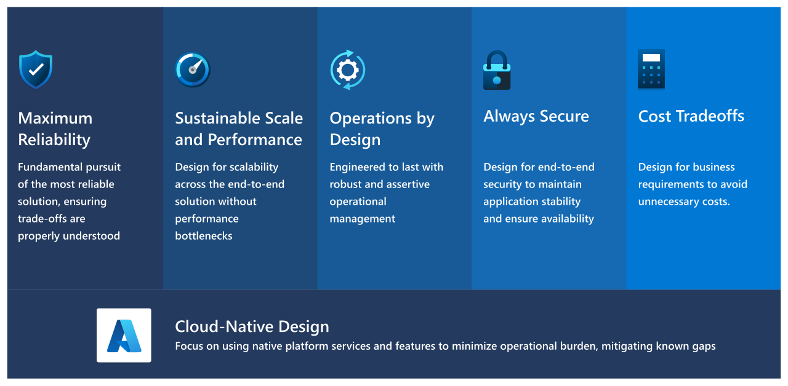

# Design principles of a mission-critical workload

The mission-critical design methodology is underpinned by five key design principles which serve as a compass for subsequent design decisions across the critical design areas. We highly recommend that you familiarize yourselves with these principles to better understand their impact and the trade-offs associated with non-adherence.

> [!IMPORTANT]
> This article is part of the [Azure Well-Architected mission-critical workload](index.yml) series. If you aren't familiar with this series, we recommend you start with [what is a mission-critical workload?](mission-critical-overview.md#what-is-a-mission-critical-workload)
>

These mission-critical design principles resonate and extend the quality pillars of the Azure Well-Architected Framework&mdash;[Reliability](/azure/well-architected/#reliability), [Security](/azure/well-architected/security/), [Cost Optimization](/azure/well-architected/cost-optimization/), [Operational Excellence](/azure/well-architected/devops/), and [Performance Efficiency](/azure/well-architected/scalability/). 

## Reliability

**_Maximum reliability_** - Fundamental pursuit of the most reliable solution, ensuring trade-offs are properly understood.

|Design principle|Considerations|
|---|---|
|**Active/Active design**|To maximize availability and achieve regional fault tolerance, solution components should be distributed across multiple Availability Zones and Azure regions using an active/active deployment model where possible.|
|[**Blast radius reduction and fault isolation**](/azure/well-architected/resiliency/principles#design-for-failure)|Failure is impossible to avoid in a highly distributed multi-tenant cloud environment like Azure. By anticipating failures and correlated impact, from individual components to entire Azure regions, a solution can be designed and developed in a resilient manner.|
|[**Observe application health**](/azure/well-architected/resiliency/principles#observe-application-health)|Before issues impacting application reliability can be mitigated, they must first be detected and understood. By monitoring the operation of an application relative to a known healthy state it becomes possible to detect or even predict reliability issues, allowing for swift remedial action to be taken.|
|[**Drive automation**](/azure/well-architected/resiliency/principles#drive-automation)|One of the leading causes of application downtime is human error, whether that is due to the deployment of insufficiently tested software or misconfiguration. To minimize the possibility and impact of human errors, it's vital to strive for automation in all aspects of a cloud solution to improve reliability; automated testing, deployment, and management.|
|[**Design for self-healing**](/azure/well-architected/resiliency/principles#design-for-self-healing)|Self healing describes a system's ability to deal with failures automatically through pre-defined remediation protocols connected to failure modes within the solution. It's an advanced concept that requires a high level of system maturity with monitoring and automation, but should be an aspiration from inception to maximize reliability.|
|**Complexity avoidance**|Avoid unnecessary complexity when designing the solution and all operational processes to drive reliability and management efficiencies, minimizing the likelihood of failures.|

## Performance Efficiency

**_Sustainable performance and scalability_** - Design for scalability across the end-to-end solution without performance bottlenecks.

|Design principle|Considerations|
|---|---|
|[**Design for scale-out**](/azure/well-architected/resiliency/principles#design-for-scale-out)|Scale-out is a concept that focuses on a system's ability to respond to demand through horizontal growth. This means that as traffic grows, more resource units are added in parallel instead of increasing the size of the existing resources. A systems ability to handle expected and unexpected traffic increases through scale-units is essential to overall performance and reliability by further reducing the impact of a single resource failure.|
|**Automation for hyperscale**|Scale operations throughout the solution should be fully automated to minimize the performance and availability impact from unexpected or expected increases in traffic, ensuring the time it takes to conduct scale operations is understood and aligned with a model for application health.|
|[**Continuous validation and testing**](/azure/well-architected/scalability/performance-test)|Automated testing should be performed within CI/CD processes to drive continuous validation for each application change. Load testing against a performance baseline with synchronized chaos experimentation should be included to validate existing thresholds, targets, and assumptions, as well as helping to quickly identify risks to resiliency and availability. Such testing should be conducted within staging and testing environments, but also optionally within development environments. It can also be beneficial to run a subset of tests against the production environment, particularly in conjunction with a blue/green deployment model to validate new deployment stamps before receiving production traffic.|
|[**Reduce overhead with managed compute services**](/azure/architecture/guide/design-principles/managed-services)|Using managed compute services and containerized architectures significantly reduces the ongoing administrative and operational overhead of designing, operating, and scaling applications by shifting infrastructure deployment and maintenance to the managed service provider.|
|[**Baseline performance and identify bottlenecks**](/azure/well-architected/scalability/test-tools#identify-baselines-and-goals-for-performance)|Performance testing with detailed telemetry from every system component allows for the identification of bottlenecks within the system, including components that need to be scaled in relation to other components, and this information should be incorporated into a capacity model.|
|[**Model capacity**](/azure/well-architected/scalability/test-checklist)|A capacity model enables planning of resource scale levels for a given load profile, and additionally exposes how system components perform in relation to each other, therefore enabling system-wide capacity allocation planning.|

## Operational Excellence

**_Operations by design_** - Engineered to last with robust and assertive operational management.

|Design principle|Considerations|
|---|---|
|[**Loosely coupled components**](/azure/well-architected/devops/principles#use-loosely-coupled-architecture)|Loose coupling enables independent and on-demand testing, deployments, and updates to components of the application while minimizing inter-team dependencies for support, services, resources, or approvals.|
|[**Automate build and release processes**](/azure/well-architected/devops/principles#optimize-build-and-release-processes)|Fully automated build and release processes reduce the friction and increase the velocity of deploying updates, bringing repeatability and consistency across environments. Automation shortens the feedback loop from developers pushing changes to getting insights on code quality, test coverage, resiliency, security, and performance, which increases developer productivity.|
|**Developer agility**|Continuous Integration and Continuous Deployment (CI/CD) automation enables the use of short-lived development environments with lifecycles tied to that of an associated feature branch, which promotes developer agility and drives validation as early as possible within the engineering cycle to minimize the engineering cost of bugs.
|[**Quantify operational health**](/azure/well-architected/devops/principles#understand-operational-health)|Full diagnostic instrumentation of all components and resources enables ongoing observability of logs, metrics and traces, but also facilitates health modeling to quantify application health in the context to availability and performance requirements.|
|[**Rehearse recovery and practice failure**](/azure/well-architected/devops/principles#rehearse-recovery-and-practice-failure)|Business Continuity (BC) and Disaster Recovery (DR) planning and practice drills are essential and should be conducted frequently, since learnings can iteratively improve plans and procedures to maximize resiliency in the event of unplanned downtime.|
|[**Embrace continuous operational improvement**](/azure/well-architected/devops/principles#embrace-continuous-operational-improvement)|Prioritize routine improvement of the system and user experience, using a health model to understand and measure operational efficiency with feedback mechanisms to enable application teams to understand and address gaps in an iterative manner.|

## Security

**_Always secure_** - Design for end-to-end security to maintain application stability and ensure availability.

|Design principle|Considerations|
|---|---|
|[**Monitor the security of the entire solution and plan incident responses**](/azure/well-architected/security/security-principles#monitor-system-security-plan-incident-response)|Correlate security and audit events to model application health and identify active threats. Establish automated and manual procedures to respond to incidents using Security Information and Event Management (SIEM) tooling for tracking.|
|[**Model and test against potential threats**](/azure/well-architected/devops/principles#optimize-build-and-release-processes)|Ensure appropriate resource hardening and establish procedures to identify and mitigate known threats, using penetration testing to verify threat mitigation, as well as static code analysis and code scanning.|
|[**Identify and protect endpoints**](/azure/well-architected/devops/principles#understand-operational-health)|Monitor and protect the network integrity of internal and external endpoints through security capabilities and appliances, such as firewalls or web application firewalls. Use industry standard approaches to protect against common attack vectors like Distributed Denial-Of-Service (DDoS) attacks, such as SlowLoris.|
|[**Protect against code level vulnerabilities**](/azure/well-architected/devops/principles#rehearse-recovery-and-practice-failure)|Identify and mitigate code-level vulnerabilities, such as cross-site scripting or SQL injection, and incorporate security patching into operational lifecycles for all parts of the codebase, including dependencies.|
|[**Automate and use least privilege**](/azure/well-architected/devops/principles#embrace-continuous-operational-improvement)|Drive automation to minimize the need for human interaction and implement least privilege across both the application and control plane to protect against data exfiltration and malicious actor scenarios.|
|[**Classify and encrypt data**](/azure/well-architected/security/security-principles#classify-and-encrypt-data)|Classify data according to risk and apply industry standard encryption at rest and in transit, ensuring keys and certificates are stored securely and managed properly.|

## Cost Optimization

There are obvious cost tradeoffs associated with introducing greater reliability, which should be carefully considered in the context of workload requirements.

Maximizing reliability can impact the overall financial cost of the solution. For example, the duplication of resources and the distribution of resources across regions to achieve high availability has clear cost implications. To avoid excess costs, don't over-engineer or over-provision beyond the relevant business requirements.

Also, there is added cost associated with engineering investment in fundamental reliability concepts, such as embracing infrastructure as code, deployment automation, and chaos engineering. This comes at a cost in terms of both time and effort, which could be invested elsewhere to deliver new application functionality and features.

## Cloud native design

- [**Azure-native managed services**](/azure/architecture/guide/design-principles/managed-services) - Azure-native managed services are prioritized due to their lower administrative and operational overhead as well as tight integration with consistent configuration and instrumentation across the application stack.

- [**Roadmap alignment**](/azure/architecture/guide/design-principles/design-for-evolution) - Incorporate upcoming new and improved Azure service capabilities as they become Generally Available (GA) to stay close to the leading edge of Azure.

- **Embrace preview capabilities and mitigate known gaps** - While Generally Available (GA) services are prioritized for supportability, Azure service previews are actively explored for rapid incorporation, providing technical and actionable feedback to Azure product groups to address gaps.

- **Azure landing zone alignment** - Deployable within an [Azure landing zone](/azure/cloud-adoption-framework/ready/landing-zone) and aligned to the Azure landing zone design methodology, but also fully functional and deployable in a bare environment outside of a landing zone.

## Next step

Review cross-cutting concerns associated with mission-critical workloads.

> [!div class="nextstepaction"]
> [Cross-cutting concerns](mission-critical-cross-cutting-issues.md)
