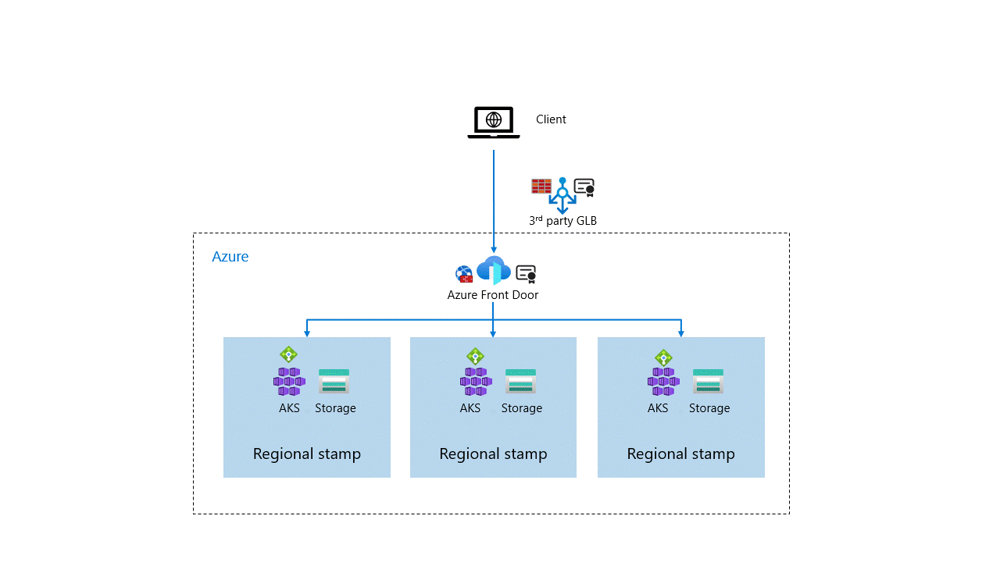

# Networking and connectivity for mission-critical workloads on Azure

Networking is a fundamental area for a mission-critical application, given the recommended globally distributed active-active design approach.

This design area explores various network topology topics at an application level, considering requisite connectivity and redundant traffic management. More specifically, it highlights critical considerations and recommendations intended to inform the design of a secure and scalable global network topology for a mission-critical application.

> [!IMPORTANT]
> This article is part of the [Azure Well-Architected mission-critical workload](index.yml) series. If you aren't familiar with this series, we recommend you start with [what is a mission-critical workload?](mission-critical-overview.md#what-is-a-mission-critical-workload)
>

## Global traffic routing

> [!NOTE]
> For detailed Azure Load Balancer configuration guidance, see the [Load Balancer service guide](../service-guides/azure-load-balancer.md).

> [!NOTE]
> For detailed Azure Front Door configuration guidance, see the [Front Door service guide](../service-guides/azure-front-door.md).

The use of multiple active regional deployment stamps requires a global routing service to distribute traffic to each active stamp.

[Azure Front Door](../service-guides/azure-front-door.md), [Azure Traffic Manager](../service-guides/azure-traffic-manager.md), and [Azure Standard Load Balancer](../service-guides/azure-load-balancer.md) provide the needed routing capabilities to manage global traffic across a multi-region application.

Alternatively, third-party globally routing technologies can be considered. These options can almost seamlessly be swapped in to replace or extend the use of Azure-native global routing services. Popular choices include routing technologies by CDN providers.

This section explores the key differences Azure routing services to define how each can be used to optimize different scenarios.

### Design considerations

- A routing service bound to a single region represents a single-point-of-failure and a significant risk to regional outages.

- If the application workload encompasses client control, such as with mobile or desktop client applications, it's possible to provide service redundancy within client routing logic.
  - Multiple global routing technologies, such as Azure Front Door and Azure Traffic Manager, can be considered in parallel for redundancy, with clients configured to fail over to an alternative technology when certain failure conditions are met. The introduction of multiple global routing services introduces significant complexities around edge caching and Web Application Firewall capabilities, and certificate management for SSL offload and application validation for ingress paths.
  - Third-party technologies can also be considered, providing global routing resiliency to all levels of Azure platform failures.

- If Azure Front Door and Traffic Manager are used together for redundancy, a different ingress path or design changes would be required to ensure a consistent and acceptable level of service.

- Azure Front Door and Azure Traffic Manager are globally distributed services with built-in multi-region redundancy and availability.
  - Hypothetical failure scenarios of a scale large enough to threaten the global availability of these resilient routing services presents a broader risk to the application in terms of cascading and correlated failures.
    - Failure scenarios of this scale are only feasibly caused by shared foundational services, such as Azure DNS or Microsoft Entra ID, which serve as global platform dependencies for almost all Azure services. If a redundant Azure technology is applied, it's likely that the secondary service will also be experiencing unavailability or a degraded service.
    - Global routing service failure scenarios are highly likely to significantly impact many other services used for key application components through interservice dependencies. Even if a third-party technology is used, the application is likely in an unhealthy state due to the broader impact of the underlying issue, meaning that routing to application endpoints on Azure provides little value.

- Global routing service redundancy provides mitigation for an extremely small number of hypothetical failure scenarios, where the impact of a global outage is constrained to the routing service itself.

  To provide broader redundancy to global outage scenarios, a multicloud active-active deployment approach can be considered. A multicloud active-active deployment approach introduces significant operational complexities, which pose significant resiliency risks, likely far outweighing the hypothetical risks of a global outage.

- For scenarios where client control isn't possible, a dependency must be taken on a single global routing service to provide a unified entry point for all active deployment regions.
  - When used in isolation they represent a single-point-of-failure at a service level due to global dependencies, even though built-in multi-region redundancy and availability are provided.
  - The SLA provided by the selected global routing service represents the maximum attainable composite SLO, regardless of how many deployment regions are considered.

- When client control isn't possible, operational mitigations can be considered to define a process for migrating to a secondary global routing service if a global outage disables the primary service. Migrating from one global routing service to another is typically a lengthy process lasting several hours, particularly where DNS propagation is considered.

- Some third-party global routing services provide a 100% SLA. However, the historic and attainable SLA provided by these services is typically lower than 100%.
  - While these services provide financial reparations for unavailability, it comes of little significance when the impact of unavailability is significant, such as with safety-critical scenarios where human life is ultimately at stake. Technology redundancy or sufficient operational mitigations should therefore still be considered even when the advertised legal SLA is 100%.

**Azure Front Door**

For detailed configuration guidance, see the [Azure Front Door service guide](../service-guides/azure-front-door.md).

Azure Front Door provides global HTTP/S load balancing using the Anycast protocol with split TCP over the Microsoft global backbone network. For mission-critical workloads, key capabilities include:

- Built-in edge caching, WAF, and DDoS protection at the network edge.
- Azure Front Door Premium supports private endpoints, enabling traffic to flow from the internet directly onto Azure virtual networks without public IPs.
- Health probes that transparently remove unhealthy backends from traffic circulation without delay.
- Multiple [load distribution configurations](/azure/frontdoor/front-door-routing-methods) including latency-based, priority-based, and weighted routing for canary deployments.
- A fully managed certificate service that removes the need to manage the TLS certificate lifecycle.

**Azure Traffic Manager**

For detailed configuration guidance, see the [Azure Traffic Manager service guide](../service-guides/azure-traffic-manager.md).

Azure Traffic Manager is a DNS-based routing service. Unlike Azure Front Door, Traffic Manager doesn't process request payloads. Instead, it returns a DNS name that the client resolves and connects to directly. This supports any protocol but means unhealthy backend removal depends on DNS TTL expiration, which can cause delays.

**Azure Standard Load Balancer**

For detailed configuration guidance, see the [Azure Load Balancer service guide](../service-guides/azure-load-balancer.md).

> [!IMPORTANT]
> [Cross-Region Standard Load Balancer](/azure/load-balancer/cross-region-overview) is generally available with technical limitations.

### Design recommendations

- Use Azure Front Door as the primary global traffic routing service for HTTP/S scenarios. Azure Front Door is strongly advocated for HTTP/S workloads as it provides optimized traffic routing, transparent failover, private backend endpoints (with the Premium SKU), edge caching, and integration with Web Application Firewall (WAF).

- For application scenarios where client control is possible, apply client side routing logic to consider failover scenarios where the primary global routing technology fails. Two or more global routing technologies should be positioned in parallel for added redundancy, if single service SLA isn't sufficient. Client logic is required to route to the redundant technology if a global service failure occurs.
  - Two distinct URLs should be used, with one applied to each of the different global routing services to simplify the overall certificate management experience and routing logic for a failover.
  - Prioritize the use of third-party routing technologies as the secondary failover service, since this will mitigate the largest number of global failure scenarios and the capabilities offered by industry leading CDN providers will allow for a consistent design approach.
  - Consideration should also be given to directly routing to a single regional stamp rather than a separate routing service. While this will result in a degraded level of service, it represents a far simpler design approach.

This image shows a redundant global load balancer configuration with client failover using Azure Front Door as primary global load balancer.

>[!IMPORTANT]
> To truly mitigate the risk of global failures within the Azure platform, a multicloud active-active deployment approach should be considered, with active deployment stamps hosted across two or more cloud providers and redundant third-party routing technologies used for global routing.
>
> Azure can effectively be integrated with other cloud platforms. However, it's strongly recommended not to apply a multicloud approach because it introduces significant operational complexity, with different deployment stamp definitions and representations of operational health across the different cloud platforms. This complexity in-turn introduces numerous resiliency risks within the normal operation of the application, which far outweigh the hypothetical risks of a global platform outage.

- Although not recommended, for HTTP(s) workloads using Azure Traffic Manager for global routing redundancy to Azure Front Door, consider offloading Web Application Firewall (WAF) to Application Gateway for acceptable traffic flowing through Azure Front Door.
  - This introduces an additional failure point to the standard ingress path, an additional critical-path component to manage and scale, and also incurs additional costs to ensure global high-availability. It does, however, greatly simplify the failure scenario by providing consistency between the acceptable and not acceptable ingress paths through Azure Front Door and Azure Traffic Manager, both in terms of WAF execution but also private application endpoints.
  - The loss of edge caching in a failure scenario impacts overall performance, and this must be aligned with an acceptable level of service or mitigating design approach. To ensure a consistent level of service, consider offloading edge caching to a third-party CDN provider for both paths.

It's recommended to consider a third-party global routing service in place of two Azure global routing services. This provides the maximum level of fault mitigation and a more simple design approach since most industry leading CDN providers offer edge capabilities largely consistent with that offered by Azure Front Door.

**Azure Front Door**

- Use the Azure Front Door managed certificate service to enable TLS connections, and remove the need to manage certificate lifecycles.

- Use the Azure Front Door Web Application Firewall (WAF) to provide protection at the edge from common web exploits and vulnerabilities, such as SQL injection.

- Use the Azure Front Door built-in cache to serve static content from edge nodes.
  - In most cases this also eliminates the need for a dedicated Content Delivery Network (CDN).

- Configure the application platform ingress points to [validate incoming requests through header based filtering](/azure/frontdoor/front-door-faq#how-do-i-lock-down-the-access-to-my-backend-to-only-azure-front-door-) using the *X-Azure-FDID* to ensure all traffic is flowing through the configured Front Door instance. Consider also configuring IP ACLing using Front Door Service Tags to validate traffic originates from the Azure Front Door backend IP address space and Azure infrastructure services. This will ensure traffic flows through Azure Front Door at a service level, but header based filtering will still be required to ensure the use of a configured Front Door instance.

- Define a [custom TCP health endpoint](../design-guides/health-modeling.md#use-health-probes) to validate critical downstream dependencies within a regional deployment stamp, including data platform replicas, such as Azure Cosmos DB in the example provided by the foundational reference implementation. If one or more dependencies becomes unhealthy, the health probe should reflect this in the response returned so that the entire regional stamp can be taken out of circulation.

- Ensure health probe responses are logged and ingest all operational data exposed by Azure Front Door into the global Log Analytics workspace to facilitate a unified data sink and single operational view across the entire application. For configuration details, see the [Azure Front Door service guide](../service-guides/azure-front-door.md).

- Unless the workload is extremely latency sensitive, spread traffic evenly across all considered regional stamps to most effectively use deployed resources.
  - To achieve this, set the ["Latency Sensitivity (Additional Latency)"](/azure/frontdoor/front-door-backend-pool#load-balancing-settings) parameter to a value that is high enough to cater for latency differences between the different regions of the backends. Ensure a tolerance that is acceptable to the application workload regarding overall client request latency.

- Don't enable Session Affinity unless it's required by the application, since it can have a negative impact the balance of traffic distribution. With a fully stateless application, if the recommended mission-critical application design approach is followed, any request could be handled by any of the regional deployments.

**Azure Traffic Manager**

- Use Traffic Manager for non HTTP/S scenarios as a replacement to Azure Front Door. Capability differences drive different design decisions for cache and WAF capabilities, and TLS certificate management.

- WAF capabilities should be considered within each region for the Traffic Manager ingress path, using Azure Application Gateway.

- Configure a suitably low TTL value to optimize the time required to remove an unhealthy backend endpoint from circulation in the event that backend becomes unhealthy.

- Similar to with Azure Front Door, a [custom TCP health endpoint](../design-guides/health-modeling.md#use-health-probes) should be defined to validate critical downstream dependencies within a regional deployment stamp, which should be reflected in the response provided by health endpoints.

  However, for Traffic Manager additional consideration should be given to service level regional failover. such as 'dog legging', to mitigate the potential delay associated with the removal of an unhealthy backend due to dependency failures, particularly if it's not possible to set a low TTL for DNS records.

- Consideration should be given to third-party CDN providers in order to achieve edge caching when using Azure Traffic Manager as a primary global routing service. Where edge WAF capabilities are also offered by the third-party service, consideration should be given to simplify the ingress path and potentially remove the need for Application Gateway.

## Application delivery services

The network ingress path for a mission-critical application must also consider application delivery services to ensure secure, reliable, and scalable ingress traffic.

This section builds on [global routing recommendations](#design-recommendations) by exploring key application delivery capabilities, considering relevant services such as Azure Standard Load Balancer, Azure Application Gateway, and Azure API Management.

### Design considerations

- TLS encryption is critical to ensure the integrity of inbound user traffic to a mission-critical application, with **TLS Offloading** applied only at the point of a stamp's ingress to decrypt incoming traffic. TLS Offloading Requires the private key of the TLS certificate to decrypt traffic.

- A **Web Application Firewall** provides protection against common web exploits and vulnerabilities, such as SQL injection or cross site scripting, and is essential to achieve the maximum reliability aspirations of a mission-critical application.

- Azure WAF can be enabled within [Azure Front Door](../service-guides/azure-front-door.md) or [Azure Application Gateway](../service-guides/azure-application-gateway.md). For detailed WAF, DDoS, TLS, and certificate management capabilities, see the respective service guides and [Networking security guidance](../security/networking.md).

- Third-party WAF technologies such as NVAs and advanced ingress controllers within Kubernetes can also be considered to provide requisite vulnerability protection.

- Optimal WAF configuration typically requires fine tuning, regardless of the technology used.

### Design recommendations

- Perform TLS Offloading in as few places as possible in order to maintain security while simplifying the certificate management lifecycle.

- Use encrypted connections (for example, HTTPS) from the point where TLS offloading occurs to the actual application backends. Application endpoints won't be visible to end users, so Azure-managed domains, such as `azurewebsites.net` or `cloudapp.net`, can be used with managed certificates.

- For HTTP(S) traffic, ensure WAF capabilities are applied within the ingress path for all publicly exposed endpoints.

- Enable WAF capabilities at a single service location, either globally with Azure Front Door or regionally with Azure Application Gateway, since this simplifies configuration fine tuning and optimizes performance and cost.

  Configure WAF in Prevention mode to directly block attacks. Only use WAF in Detection mode (that is, only logging but not blocking suspicious requests) when the performance penalty of Prevention mode is too high.  The implied additional risk must be fully understood and aligned to the specific requirements of the workload scenario.

- Prioritize the use of Azure Front Door WAF since it provides the richest Azure-native feature set and applies protections at the global edge, which simplifies the overall design and drives further efficiencies.

- Use Azure API Management only when exposing a large number of APIs to external clients or different application teams.

- Use the Azure Standard Load Balancer SKU for any internal traffic distribution scenario within micros-service workloads.
  - Provides an SLA of 99.99% when deployed across Availability Zones.
  - Provides critical capabilities such as diagnostics or outbound rules.

- Use Azure DDoS Network Protection to help protect public endpoints hosted within each application virtual network.

## Caching and static content delivery

Special treatment of static content like images, JavaScript, CSS and other files can have a significant impact on the overall user experience and on the overall cost of the solution. Caching static content at the edge can speed up the client load times, which results in a better user experience and can also reduce the cost for traffic, read operations, and computing power on backend services involved.

### Design considerations

- Not all content that a solution makes available over the Internet is generated dynamically. Applications serve both static assets (images, JavaScript, CSS, localization files, etc.) and dynamic content.
- Workloads with frequently accessed static content benefit greatly from caching since it reduces the load on backend services and reduces content access latency for end users.
- Caching can be implemented natively within Azure using either Azure Front Door or Azure Content Delivery Network (CDN).
  - [Azure Front Door](/azure/frontdoor/front-door-caching) provides Azure-native edge caching capabilities and routing features to divide static and dynamic content.
    - By creating the appropriate routing rules in Azure Front Door, `/static/*` traffic can be transparently redirected to static content.
  - More complex caching scenarios can be implemented using the [Azure CDN](/azure/cdn/cdn-overview) service to establish a full-fledged content delivery network for significant static content volumes.
    - The Azure CDN service will likely be more cost effective, but doesn't provide the same advanced routing and Web Application Firewall (WAF) capabilities which are recommended for other areas of an application design. It does, however, offer further flexibility to integrate with similar services from third-party solutions, such as Akamai and Verizon.
  - When comparing the Azure Front Door and Azure CDN services, the following decision factors should be explored:
    - Can required caching rules be accomplished using the rules engine?
    - Size of the stored content and the associated cost.
    - Price per month for the execution of the rules engine (charged per request on Azure Front Door).
    - Outbound traffic requirements (price differs by destination).

### Design recommendations

- Generated, static content like sized copies of image files that never or only rarely change can benefit from caching as well. Caching can be configured based on URL parameters and with varying caching duration.
- Separate the delivery of static and dynamic content to users and deliver relevant content from a cache to reduce load on backend services optimize performance for end-users.
- Given the strong recommendation ([Network and connectivity](./mission-critical-networking-connectivity.md) design area) to use Azure Front Door for global routing and Web Application Firewall (WAF) purposes, it's recommended to prioritize the use of Azure Front Door caching capabilities unless gaps exist.

## Virtual network integration

> [!NOTE]
> For detailed Azure Kubernetes Service configuration guidance, see the [Kubernetes Service service guide](../service-guides/azure-kubernetes-service.md).

For general virtual network guidance, see the [Virtual Network service guide](../service-guides/virtual-network.md) and [Networking security guidance](../security/networking.md).

A mission-critical application typically requires integration with other applications or dependent systems. The method by which application integration is achieved has a significant impact on the security, performance, and reliability of the solution.

Mission-critical workloads should be deployed within Azure virtual networks wherever possible to remove unnecessary public endpoints and limit the attack surface. Use Private Endpoints for connectivity to Azure platform services.

### Design Considerations

- When deploying within an [Azure landing zone](/azure/cloud-adoption-framework/ready/landing-zone/design-area/network-topology-and-connectivity), public applications without corporate connectivity should use an Online Landing Zone, while applications with corporate connectivity should use a Corp. Connected Landing Zone.

- The use of application virtual networks introduces deployment complexities in CI/CD pipelines, since both data plane and control plane access to resources on private networks is required. Private build agents can be deployed within application virtual networks to proxy access.

- For scenarios with external network integration requirements, application virtual networks can be connected to other networks using ExpressRoute (up to 100 Gbps) or VPN (up to 20 Gbps in Azure Virtual WAN). The application network design must align with the broader network architecture, particularly concerning addressing and routing.

> [!NOTE]
> When deploying within an Azure landing zone, be aware that any required connectivity to on-premises networks should be provided by the landing zone implementation. The design can use ExpressRoute and other virtual networks in Azure using either Virtual WAN or a hub-and-spoke network design.

- The inclusion of additional network paths and resources introduces additional reliability and operational considerations for the application to ensure health is maintained. For configuration details, see the [ExpressRoute service guide](../service-guides/azure-expressroute.md).

### Design recommendations

- It's recommended that mission-critical solutions are deployed within Azure virtual networks where possible to remove unnecessary public endpoints, limiting the application attack surface to maximize security and reliability.
  - Use Private Endpoints for connectivity to Azure platform services. Service Endpoints can be considered for services that don support Private Link, provided data exfiltration risks are acceptable or mitigated through alternative controls.

- For application scenarios that don't require corporate network connectivity, treat all virtual networks as ephemeral resources that are replaced when a new regional deployment is conducted.

- When connecting to other Azure or on-premises networks, application virtual networks shouldn't be treated as ephemeral since it creates significant complications where virtual network peering and virtual network gateway resources are concerned. All relevant application resources within the virtual network should continue to be ephemeral, with parallel subnets used to facilitate blue-green deployments of updated regional deployment stamps.

- In scenarios where corporate network connectivity is required to facilitate application integration over private networks, ensure that the IPv4 address space used for regional application virtual networks doesn't overlap with other connected networks and is properly sized to facilitate required scale without needing to update the virtual network resource and incur downtime.
  - It's strongly recommended to only use IP addresses from the address allocation for private internet (RFC 1918).
    - For environments with a limited availability of private IP addresses (RFC 1918), consider using IPv6.
    - If the use of public IP address is required, ensure that only owned address blocks are used.
  - Align with organization plans for IP addressing in Azure to ensure that application network IP address space doesn't overlap with other networks across on-premises locations or Azure regions.
  - Don't create unnecessarily large application virtual networks to ensure that IP address space isn't wasted.

- Prioritize the use Azure CNI for AKS network integration, since it [supports a richer feature set](/azure/aks/concepts-network#compare-network-models).
  - Consider Kubenet for scenarios with a limited rage available IP addresses to fit the application within a constrained address space. See [Micro-segmentation and kubernetes network policies](#micro-segmentation-and-kubernetes-network-policies) for more details.

- For scenarios requiring on-premises network integration, prioritize the use Express Route to ensure secure and scalable connectivity.
  - Ensure the reliability level applied to the Express Route or VPN fully satisfies application requirements.
  - Multiple network paths should be considered to provide additional redundancy when required, such as cross connected ExpressRoute circuits or the use of VPN as a failover connectivity mechanism.

- Ensure all components on critical network paths are in line with the reliability and availability requirements of associated user flows, regardless of whether the management of these paths and associated component is delivered by the application team of central IT teams.

  > [!NOTE]
  > When deploying within an Azure landing zone and integrating with a broader organizational network topology, consider the [network guidance](/azure/cloud-adoption-framework/ready/enterprise-scale/network-topology-and-connectivity) to ensure the foundational network is aligned with Microsoft best-practices.

- Use [Azure Bastion](/azure/bastion/bastion-overview) or proxied private connections to access the data plane of Azure resources or perform management operations.

## Internet egress

> [!NOTE]
> For general ingress, egress, and edge networking guidance, see [Networking security guidance](../security/networking.md). For detailed Azure Firewall configuration guidance, see the [Firewall service guide](../service-guides/azure-firewall.md).

Internet egress is a foundational network requirement for a mission-critical application. For mission-critical workloads, the key concerns are SNAT port exhaustion at scale and the reliability of the egress path itself.

### Design Considerations

- At mission-critical scale, SNAT port exhaustion is a key risk. When a large number of outbound requests occur, 'Source NAT (or SNAT) port exhaustion' can prevent new outbound connections. Use a scalable NAT solution such as [Azure NAT Gateway](/azure/virtual-network/nat-gateway/nat-overview) to mitigate this risk.

- In addition to NAT limitations, outbound traffic may also be subject to requisite security inspections.
  - Azure Firewall provides appropriate security capabilities to secure network egress.

  - [Azure Firewall](/azure/firewall/protect-azure-kubernetes-service) (or an equivalent NVA) can be used to secure Kubernetes egress requirements by providing granular control over outbound traffic flows.

- Large volumes of internet egress will incur [data transfer charges](https://azure.microsoft.com/pricing/details/bandwidth/).

### Design recommendations

- Minimize the number of outgoing Internet connections as this will impact NAT performance.
  - If large numbers of internet-bound connections are required, consider using [Azure NAT Gateway](/azure/virtual-network/nat-gateway/nat-overview) to abstract outbound traffic flows.

- Use Azure Firewall where requirements to control and inspect outbound internet traffic exist.
  - Ensure Azure Firewall isn't used to inspect traffic between Azure services.

> [!NOTE]
> When deploying within an Azure landing zone, consider using the foundational platform Azure Firewall resource (or equivalent NVA).
> If a dependency is taken on a central platform resource for internet egress, then the reliability level of that resource and associated network path should be closely aligned with application requirements. Operational data from the resource should also be made available to the application in order to inform potential operational action in failure scenarios.

If there are high-scale requirements associated with outbound traffic, consideration should be given to a dedicated Azure Firewall resource for a mission-critical application, to mitigate risks associated with using a centrally shared resource, such as noisy neighbor scenarios.

- When deployed within a Virtual WAN environment, consideration should be given to Firewall Manager to provide centralized management of dedicated application Azure Firewall instances to ensure organizational security postures are observed through global firewall policies.
- Ensure incremental firewall policies are delegated to application security teams via role-based access control to allow for application policy autonomy.

## Inter-zone and inter-region Connectivity

While the application design strongly advocates independent regional deployment stamps, many application scenarios may still require network integration between application components deployed within different zones or Azure regions, even if only under degraded service circumstances. The method by which inter-zone and inter-region communication is achieved has a significant bearing on overall performance and reliability, which will be explored through the considerations and recommendations within this section.

### Design Considerations

- The application design approach for a mission-critical application endorses the use of independent regional deployments with zone redundancy applied at all component levels within a single region.

- An [Availability Zone (AZ)](/azure/reliability/availability-zones-overview) is a physically separate data center location within an Azure region, providing physical and logical fault isolation up to the level of a single data center.

  A round-trip latency of less than 2 ms is a [design goal](/azure/reliability/availability-zones-overview) for inter-zone communication. Zones will have a small latency variance given varied distances and fiber paths between zones.

- Availability Zone connectivity depends on regional characteristics, and therefore traffic entering a region via an edge location may need to be routed between zones to reach its destination. This will add a ~1ms-2ms latency given inter-zone routing and 'speed of light' constraints, but this should only have a bearing for hyper sensitive workloads.

- Availability Zones are treated as logical entities within the context of a single subscription, so different subscriptions might have a different zone mapping for the same region. For example, zone 1 in Subscription A could correspond to the same physical data center as zone 2 in subscription B.

- With application scenarios that are extremely chatty between application components, spreading application tiers across zones can introduce significant latency and increased costs. It's possible to mitigate this within the design by constraining a deployment stamp to a single zone and deploying multiple stamps across the different zones.

- Communication between different Azure regions incurs a larger [data transfer charge](https://azure.microsoft.com/pricing/details/bandwidth/) per GB of bandwidth.
  - The applicable data transfer rate depends on the continent of the considered Azure regions.
  - Data traversing continents are charged at a considerably higher rate.

- Express Route and VPN connectivity methods can also be used to directly connect different Azure regions together for certain scenarios, or even different cloud platforms.

- For services to service communication Private Link can be used for direct communication using private endpoints.

- Traffic can be hair-pinned through Express Route circuits used for on-premises connectivity in order to facilitate routing between virtual networks within an Azure region and across different Azure regions within the same geography.
  - Hair-pinning traffic through Express Route bypasses data transfer costs associated with virtual network peering, so can be used as a way to optimize costs.
  - This approach necessitates more network hops for application integration within Azure, which introduces latency and reliability risks. Expands the role of Express Route and associated gateway components from Azure/on-premises to also encompass Azure/Azure connectivity.

- When submillisecond latency are required between services, [Proximity Placement Groups](/azure/virtual-machines/co-location) can be used when supported by the services used.

### Design recommendations

- Use virtual network peering to connect networks within a region and across different regions. It's strongly recommended to avoid hair-pinning within Express Route.

- Use Private Link to establish communication directly between services in the same region or across regions (service in Region A communicating with service in Region B.

- For application workloads that are extremely chatty between components, consider constraining a deployment stamp to a single zone and deploying multiple stamps across the different zones. This ensures zone redundancy is maintained at the level of an encapsulated deployment stamp rather than a single application component.

- Where possible, treat each deployment stamp as independent and disconnected from other stamps.
  - Use data platform technologies to synchronize state across regions rather than achieving consistency at an application level with direct network paths.
  - Avoid 'dog legging' traffic between different regions unless necessary, even in a failure scenario. Use global routing services and end-to-end health probes to take an entire stamp out of circulation in the event that a single critical component tier fails, rather than routing traffic at that faulty component level to another region.

- For hyper latency sensitive application scenarios, prioritize the use of zones with regional network gateways to optimize network latency for ingress paths.

## Micro-segmentation and Kubernetes network policies

Micro-segmentation is a network security design pattern used to isolate and secure individual application workloads, with policies applied to limit network traffic between workloads based on a Zero Trust model. It's typically applied to reduce network attack surface, improve breach containment, and strengthen security through policy-driven application-level network controls.

A mission-critical application can enforce application-level network security using Network Security Groups (NSG) at either a subnet or network interface level, service Access Control Lists (ACL), and network policies when using Azure Kubernetes Service (AKS).

This section explores the optimal use of these capabilities, providing key considerations and recommendations to achieve application-level micro-segmentation.

### Design Considerations

- AKS can be deployed in two different [networking models](/azure/aks/concepts-network#azure-cni-advanced-networking):
  - **Kubenet networking:** AKS nodes are integrated within an existing virtual network, but pods exist within a virtual overlay network on each node. Traffic between pods on different nodes is routed through kube-proxy.
  - **Azure Container Networking Interface (CNI) networking:** The AKS cluster is integrated within an existing virtual network and its nodes, pods and services received IP addresses from the same virtual network the cluster nodes are attached to. This is relevant for various networking scenarios requiring direct connectivity from and to pods. Different node pools can be deployed [into different subnets](/azure/aks/use-multiple-node-pools#add-a-node-pool-with-a-unique-subnet).

  > [!NOTE]
  > Azure CNI requires more IP address space compared to Kubenet. Proper upfront planning and sizing of the network is required. For more information, refer to the [Azure CNI documentation](/azure/aks/concepts-network#azure-cni-advanced-networking).

- By default, pods accept traffic from any source and can send traffic to any destination. A pod can communicate with every other pod in a given Kubernetes cluster. Kubernetes doesn't ensure any network level isolation, and doesn't isolate namespaces at the cluster level.

- Communication between Pods and Namespaces can be isolated using [Network Policies](https://kubernetes.io/docs/concepts/services-networking/network-policies/). Network Policy is a Kubernetes specification that defines access policies for communication between Pods. Using Network Policies, an ordered set of rules can be defined to control how traffic is sent/received, and applied to a collection of pods that match one or more label selectors.

  - AKS supports multiple network policy engines, but [*Cilium*](/azure/aks/azure-cni-powered-by-cilium) is the recommended options. See [Differences between network policy engines](/azure/aks/use-network-policies#differences-between-network-policy-engines-cilium-azure-npm-and-calico) for more details.
  - Network policies are additive and don't conflict.
  - AKS supports the creation of different node pools to separate different workloads using nodes with different hardware and software characteristics, such as nodes with and without GPU capabilities.
  - Using node pools doesn't provide any network-level isolation.
  - Node pools can use [different subnets within the same virtual network](/azure/aks/use-multiple-node-pools#add-a-node-pool-with-a-unique-subnet). NSGs can be applied at the subnet-level to implement micro-segmentation between node pools.

### Design recommendations

- Configure an NSG on all considered subnets to provide an IP ACL to secure ingress paths and isolate application components based on a Zero Trust model.
  - Use Front Door Service Tags within NSGs on all subnets containing application backends defined within Azure Front Door, since this will validate traffic originates from a legitimate Azure Front Door backend IP address space. This will ensure traffic flows through Azure Front Door at a service level, but header based filtering will still be required to ensure the use of a particular Front Door instance and to also mitigate 'IP spoofing' security risks.
  - Public internet traffic should be disabled on RDP and SSH ports across all applicable NSGs.

- Prioritize the use of the Azure CNI network plugin and consider Kubenet for scenarios with a limited range of available IP addresses to fit the application within a constrained address space.
  - AKS supports the use of both Azure CNI and Kubenet. This networking choice is selected at deployment time.
  - The Azure CNI network plugin is a more robust and scalable network plugin, and is recommended for most scenarios.
  - Kubenet is a more lightweight network plugin, and is recommended for scenarios with a limited range of available IP addresses.
  - See [Azure CNI](/azure/aks/concepts-network#azure-cni-advanced-networking) for more details.
  

- The Network Policy feature in Kubernetes should be used to define rules for ingress and egress traffic between pods in a cluster. Define granular Network Policies to restrict and limit cross-pod communication. For broader AKS configuration guidance, see the [Azure Kubernetes Service service guide](../service-guides/azure-kubernetes-service.md).
  - Enable [Network Policy](/azure/aks/use-network-policies) for Azure Kubernetes Service at deployment time.

## Next step

Review the considerations for quantifying and observing application health.

> [!div class="nextstepaction"]
> [Health modeling for workloads](../design-guides/health-modeling.md)
