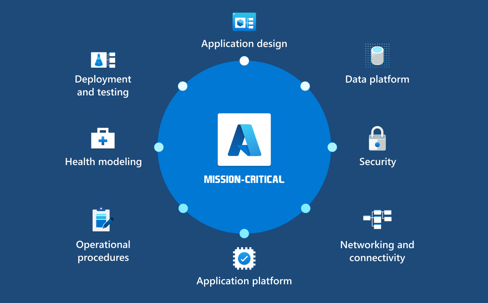

# Mission-critical workloads

This section strives to address the challenges of designing mission-critical workloads on Azure. The guidance is based on lessons learned from reviewing numerous customer applications and first-party solutions. This section provides actionable and authoritative guidance that applies Well-Architected best practices as the technical foundation for building and operating a highly reliable solution on Azure at-scale.

## What is a mission-critical workload?

The term *workload* refers to a collection of application resources that support a common business goal or the execution of a common business process, with multiple services, such as APIs and data stores, working together to deliver specific end-to-end functionality.

The term *mission-critical* refers to a criticality scale that covers significant financial cost (business-critical) or human cost (safety-critical) associated with unavailability or underperformance.

A *mission-critical workload* therefore describes a collection of application resources, which must be highly reliable on the platform. The workload must always be available, resilient to failures, and operational.

## Video: Mission-critical workloads on Azure

> [!VIDEO https://learn-video.azurefd.net/vod/player?id=b6346dd1-a795-43cf-8c6d-570dd9cc2c6c]

## What are the common challenges?

Microsoft Azure makes it easy to deploy and manage cloud solutions. However, building mission-critical workloads that are highly reliable on the platform remains a challenge for these main reasons:

- Designing a reliable application at scale is complex. It requires extensive platform knowledge to select the right technologies *and* optimally configure them to deliver end-to-end functionality.

- Failure is inevitable in any complex distributed system, and the solution must therefore be architected to handle failures with correlated or cascading impact. This is a change in mindset for many developers and architects entering the cloud from an on-premises environment; reliability engineering is no longer an infrastructure subject, but should be a first-class concern within the application development process.

- Operationalizing mission-critical workloads requires a high degree of engineering rigor and maturity throughout the end-to-end engineering lifecycle as well as the ability to learn from failure.

## Is mission-critical only about reliability?

While the primary focus of mission-critical workloads is [Reliability](/azure/well-architected/#reliability), other pillars of the Well-Architected Framework are equally important when building and operating a mission-critical workload on Azure.  

- [Security](/azure/well-architected/security/): how a workload mitigates security threats, such as Distributed Denial of Service (DDoS) attacks, will have a significant bearing on overall reliability.

- [Operational Excellence](/azure/well-architected/devops/): how a workload is able to effectively respond to operational issues will have a direct impact on application availability. 

- [Performance Efficiency](/azure/well-architected/scalability/): availability is more than simple uptime, but rather a consistent level of application service and performance relative to a known healthy state.

Achieving high reliability imposes significant cost tradeoffs, which may not be justifiable for every workload scenario. It is therefore recommended that design decisions be driven by business requirements.

## How to use this guidance?

✔ Start with [Design Methodology](./mission-critical-design-methodology.md), which outlines the rationale and recurring themes across technical and operational areas. This systematic approach helps define requirements and design strategies. Revisit this methodology when facing uncertain choices to stay aligned with the workload's overall goals. 

✔ Proceed to [Design Principles](./mission-critical-design-principles.md) to see how the mission critical design methodology aligns with the core Well-Architected Framework pillars, considering growth evolution. Evaluate the underlying principles for all pillars collectively, including the tradeoffs.

✔ Focus on the design areas that have the biggest impact on your solution. Mission-critical guidance within this series is composed of architectural considerations and recommendations orientated around these key design areas.

#### Mission-critical design areas

|Design area|Summary|
|---|---|
|[**Application design**](mission-critical-application-design.md)|The use of a scale-unit architecture in the context of building a highly reliable application. Also explores the cloud application design patterns that allow for scaling, and error handling.|
|[**Application platform**](mission-critical-application-platform.md)| Decision factors and recommendations related to the selection, design, and configuration of an appropriate application hosting platform, application dependencies, frameworks, and libraries.|
|[**Data platform**](mission-critical-data-platform.md)|Choices in data store technologies, informed by evaluating the required&mdash;volume, velocity, variety, veracity. |
|[**Networking and connectivity**](mission-critical-networking-connectivity.md)|Network topology concepts at an application level, considering requisite connectivity and redundant traffic management. Critical recommendations intended to inform the design of a secure and scalable global network topology.|
|[**Health modeling and observability**](mission-critical-health-modeling.md)|Processes to define a robust health model, mapping quantified application health states through observability and operational constructs to achieve operational maturity.|
|[**Deployment and testing**](mission-critical-deployment-testing.md)| Eradicate downtime and maintain application health for deployment operations, providing key considerations and recommendations intended to inform the design of optimal CI/CD pipelines for a mission-critical application.|
|[**Security**](mission-critical-security.md)|Protect the application against threats intended to directly or indirectly compromise its reliability.|
|[**Operational procedures**](mission-critical-operational-procedures.md)|Adoption of DevOps and related deployment methods is used to drive effective and consistent operational procedures.|

 

> [!VIDEO 9e05a6bd-7d10-4a83-9436-370a75dc1919]

## Next step

Start by reviewing the design methodology for mission-critical application scenarios.

> [!div class="nextstepaction"]
> [Design methodology](mission-critical-design-methodology.md)
