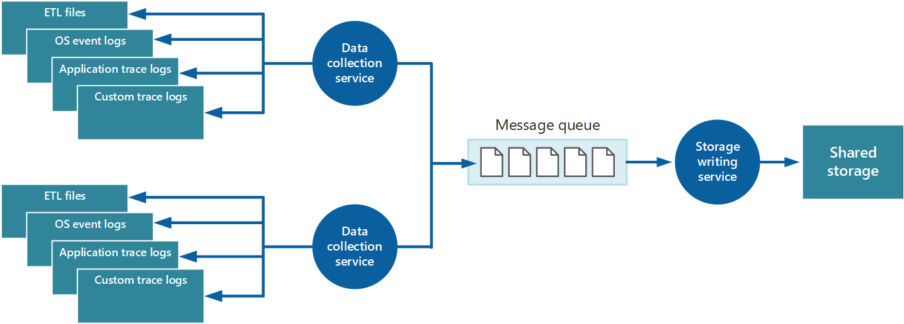

# Recommendations for designing and building an observability framework

**Applies to: OE 07**

This guide describes the recommendations for designing and building an observability framework. In order to effectively monitor your workload for security, performance and reliability, you need a comprehensive framework that provides the foundation for all monitoring, detection and alerting functions. 

**Definitions**

| Term | Definition |
|---|---|
| Logs | Logs are recorded system events. Logs can contain different types of data, be structured or free-form text, and they contain a timestamp. |
| Metrics | Metrics are numerical values that describe an aspect of a system at a particular point in time. |

## Key design strategies

A comprehensive monitoring framework design for your workload should follow these core tenets:

- Logs and metrics should be collected from the entire workload stack. All infrastructure resources and application functions should be configured to produce standardized, meaningful data and that data needs to be collected.
- The collected data needs to be stored in a standardized, reliable and secure storage solution.
- Stored data needs to be processed so that it can be handled by analysis and visualization solutions.
- Processed data needs to be analyzed to accurately determine the state of the workload.
- The state of the workload should be visualized through meaningful dashboards or reports for workload teams and other stakeholders.
- Actionable alerts and other automatic responses to intelligently defined thresholds should be configured to notify workload teams when issues arise.
- The monitoring and alerting systems should be included in your overall workload testing practices.
- The monitoring and alerting systems are areas in scope for continuous improvement. Application and infrastructure behavior in production will provide continuous learning opportunities, and those learnings should be incorporated into the monitoring and alerting designs.

All of the functions of the monitoring framework should be automated to the extent possible, and they should all run continuously 24/7/365. 

The monitoring framework can be thought of and visualized as a workflow pipeline as shown below. 

:::image type="content" source="media/observability/monitor-pipeline.png" alt-text="Diagram showing the stages of a comprehensive monitoring framework as a pipeline.":::

### Collection

> [!Note]
> For your application running on top of the infrastructure, you will need to instrument the application to enable logging. See the instrumentation guide (link to Instrument an application guide) for detailed guidance on this topic.

All workload components, whether they are infrastructure resources or application functions, should be configured to capture telemetry and/or events as logs and metrics.

Logs are primarily useful when detecting and investigating anomalies. Typically, logs are produced by the workload component and then sent to the monitoring platform or pulled by the monitoring platform via automation.

Metrics are primarily useful for building a health model (link to reliability/metrics.md/building a health model anchor) and identifying trends in workload performance and reliability. Metrics are also useful for helping to identify trends in the usage behaviors of your customers, which can help guide decisions about improvements from the end-user perspective. Typically, metrics are defined in the monitoring platform and the monitoring platform and other tools poll the workload to capture metrics. 

#### Application data

For applications, the collecting service can be an Application Performance Management (APM) tool that can run autonomously from the application that generates the instrumentation data. After APM is enabled, you'll have clear visibility of important metrics both in real time and historically. Consider an appropriate level of logging. Verbose logging can incur significant costs. Log levels should be set according to the environment; lower environments do not need the same level of verbosity as production for example.

Application logs support the end-to-end application lifecycle. Logging is essential in understanding how the application operates in various environments and what events occur and under which conditions.

Collecting application logs and events across all major environments is recommended. Separate the data between environments as much as possible by using different data stores for each environment, if practical. Have filters to ensure non-critical environments do not convolute production log interpretation. Furthermore, corresponding log entries across the application should capture a correlation ID for their respective transactions.

Application events should be captured as a structured data type with machine-readable data points rather than unstructured string types. A structured format, following well-known schema can help in parsing and analyzing logs. Also, structured data can easily be indexed and searched, and reporting can be greatly simplified.

Also the data should be an agnostic format that's independent of the machine, operating system, or network protocol. For example, emit information in a self-describing format such as JSON, MessagePack, or Protobuf rather than ETL/ETW. Using a standard format enables the system to construct processing pipelines; components that read, transform, and send data in the agreed format can be easily integrated.

#### Infrastructure data

For infrastructure resources in your workload, ensure you are collecting both logs and metrics. Capture OS, application-layer and diagnostic logs for infrastructure-as-a-service (IaaS) systems as well as metrics related to workload health. For platform-as-a-service (PaaS) resources, you may be limited in your ability to capture logs related to underlying infrastructure, but ensure that you are able to capture diagnostic logs as well as metrics related to workload health. 

To the extent that you are able to, collect logs from your cloud platform. You may be able to collect activity logs for your subscription and diagnostic logs for the management plane. 

#### Collection strategies

Avoid retrieving telemetry data manually from every component. Have a way of moving the data to a central location and be consolidated there. For a multi-region solution, it's recommended that you first collect, consolidate, and store data on a region-by-region basis, and then aggregate the regional data into a single central system. 

>  **Tradeoff**: Be aware that there are cost implications of having regional data stores and centralized data stores.

To optimize the use of bandwidth, prioritize based on the importance of data. You can transfer less urgent data in batches. However, the data must not be delayed indefinitely, especially if it contains time-sensitive information.

The collection service can collect instrumentation data in mainly two models:

- **Pull model:** Actively retrieves data from the various logs and other sources for each instance of the application.
- **Push model:** Passively waits for the data to be sent from the components that constitute each instance of the application.

**Monitoring agents**

Monitoring agents can be used in the pull model. Agents run locally in a separate process with each instance of the application and periodically pull data and write this information directly to common storage shared by all instances of the application. 

> [!NOTE]
> Using a monitoring agent is ideally suited to capturing instrumentation data that's naturally pulled from a data source. It's appropriate for a small-scale application running on a limited number of nodes in a single location. An example is information from SQL Server Dynamic Management Views or the length of an Azure Service Bus queue.

**Performance considerations**

A complex, highly scalable, application might generate huge volumes of data. The amount of data can easily overwhelm the I/O bandwidth available with a single, central location. The telemetry solution must not act as bottleneck and must be scalable as the system expands. Ideally, the solution should incorporate a degree of redundancy to reduce the risks of losing important monitoring information (such as auditing or billing data) if part of the system fails.

One approach is through queuing.

In this architecture, the data-collection service posts data to a queue. A message queue is suitable because it provides "at least once" semantics that help ensure that queued data will not be lost after it's posted. You can implement the storage writing service by using a separate worker role. You can implement this with the [Priority Queue pattern](/azure/architecture/patterns/priority-queue).

For scalability, you can run multiple instances of the storage writing service. If there is a high volume of events or a high number of data points being monitored, you can use Event Hubs to dispatch the data to a different compute for processing and storage.

**Consolidation strategies**

The data collected from a single instance of an application gives a localized view of the health and performance of that instance. To assess the overall health of the system, it's necessary to consolidate some aspects of the data in the local views. You can perform this after the data has been stored, but in some cases, you can also achieve it as the data is collected.

:::image type="content" source="media/observability/service-instrumentation-data.png" alt-text="Diagram that shows an example of using a service to consolidate instrumentation data." lightbox="media/observability/service-instrumentation-data.png":::

The instrumentation data can pass through a separate data consolidation service that combines data and acts as a filter and cleanup process. For example, instrumentation data that includes the same correlation information such as an activity ID can be amalgamated. (It's possible that a user starts performing a business operation on one node and then gets transferred to another node if a node fails, or depending on how load balancing is configured.) This process can also detect and remove any duplicated data (always a possibility if the telemetry service uses message queues to push instrumentation data out to storage).

### Storage

When deciding on a storage solution, consider the type of data, how it's used, and how urgently the data is required. 

> [!NOTE]
> Use separate storage solutions for non-production and production environments to ensure that data from each environment is easily identifiable and manageable.

#### Storage technologies

Consider a polyglot persistence approach where different types of information are stored by using technologies that are most appropriate to the way in which each type is likely to be used.

For example, Azure blob and table storage have some similarities in the way in which they're accessed. But they have differences in the operations you can perform for each, and the granularity of the data that they hold. If you need to perform more analytical operations or require full-text search capabilities on the data, it might be more appropriate to use data storage that provides capabilities that are optimized for specific types of queries and data access. For example:

- Performance counter data can be stored in a SQL database to enable ad hoc analysis.
- Trace logs might be better stored in Azure Monitor Logs or Azure Data Explorer.
- Security information may be stored in an HDFS solution.

The same instrumentation data might be required for more than one purpose. For example, performance counters can be used to provide a historical view of system performance over time. This information might be combined with other usage data to generate customer billing information. In these situations, the same data might be sent to more than one destination, such as a document database that can act as a long-term store for holding billing information, and a multidimensional store for handling complex performance analytics.

Ensure that you are enabling functionality to protect the data from accidental deletion, like resource locks and soft delete. 

Also, ensure that you are securing access to the storage through role-based access control to ensure that only those individuals who require access can access the data.

#### Consolidation service

You can implement another service that periodically retrieves the data from shared storage, partitions and filters the data according to its purpose, and then writes it to an appropriate set of data stores.

An alternative approach is to include this functionality in the consolidation and cleanup process and write the data directly to these stores as it's retrieved rather than saving it in an intermediate shared storage area.

Each approach has its advantages and disadvantages. Implementing a separate partitioning service lessens the load on the consolidation and cleanup service, and it enables at least some of the partitioned data to be regenerated if necessary (depending on how much data is retained in shared storage). However, it consumes additional resources. Also, there might be a delay between the receipt of instrumentation data from each application instance and the conversion of this data into actionable information.

#### Querying considerations

Consider how urgently the data is required. Data that generates alerts must be accessed quickly, so it should be held in fast data storage and indexed or structured to optimize the queries that the alerting system performs. In some cases, it might be necessary for the collection service to format and save data locally so that a local instance of the alerting system can send notifications quickly. The same data can be dispatched to the storage writing service shown in the previous images and stored centrally if it's also required for other purposes.

#### Data retention considerations

In some cases, after the data has been processed and transferred, the original raw source data that was stored locally can be removed. In other cases, it might be necessary or useful to save the raw information. For example, data that's generated for debugging purposes might be best left available in its raw form but can then be discarded quickly after any bugs have been rectified.

Performance data often has a longer life so that it can be used for spotting performance trends and for capacity planning. The consolidated view of this data is usually kept online for a finite period to enable fast access. After that, it can be archived or discarded.

It's useful to store historical data so you can spot long-term trends. Rather than saving old data in its entirety, it might be possible to down-sample the data to reduce its resolution and save storage costs. As an example, rather than saving minute-by-minute performance indicators, you can consolidate data that's more than a month old to form an hour-by-hour view.

Data gathered for metering and billing customers might need to be saved indefinitely. Additionally, regulatory requirements might dictate that information collected for auditing and security purposes also needs to be archived and saved. This data is also sensitive and might need to be encrypted or otherwise protected to prevent tampering. You should never record users' passwords or other information that might be used to commit identity fraud. Such details should be scrubbed from the data before it's stored.

To ensure that you comply with laws like GDPR, minimize the storage of any identifiable information. If you do need to store identifiable information data, ensure that you take into account requirements that allow individuals to request that their information is deleted when designing your solution.

### Analysis

After you've collected data from various data sources, analyze the data to assess the overall well-being of the system. For analysis, have a clear understanding of:

- How to structure data based on KPIs and performance metrics you've defined.
- How to correlate the data captured in different metrics and log files. This is important when tracking a sequence of events and help diagnose problems.

In most cases, data for each part component of the architecture is captured locally and then accurately combined with data generated by other components.

For example, a three-tier application has:

- Presentation tier that allows a user to connect to a website
- Middle tier that hosts a set of microservices that processes business logic
- Database tier that stores data associated with the operation

The usage data for a single business operation might span across all three tiers. This information needs to be correlated to provide an overall view of the resource and processing usage for the operation. The correlation might involve some preprocessing and filtering of data on the database tier. On the middle tier, common tasks are aggregation and formatting.

#### Recommendations

- **Correlate application and resource level logs:** Evaluate data at both levels to optimize the detection of issues and troubleshooting of detected issues. You can aggregate the data in a single data sink or have ways to query events across both levels. Using a unified solution, such as Azure Log Analytics, is recommended to aggregate and query application and resource level logs.
- **Define clear retention times on storage for cold analysis**: This practice is recommended to allow historic analysis over a specific period. Another benefit is control on control storage costs. Have processes that make sure data gets archived to cheaper storage and aggregate data for long-term trend analysis.
- **Analyze long-term trends analyzed to predict operational issues:** Evaluate across long-term data to form operational strategies and also to predict what operational issues are likely to occur and when. For instance, if the average response times have been slowly increasing over time and getting closer to the maximum target.

For detailed guidance on these recommendations, see the Analysis guide (link to Analyze monitoring data for cloud applications guide)

### Visualization

#### Dashboards

The most common way to visualize data is to use dashboards that can display information as a series of charts, graphs, or some other illustration. These items can be parameterized, and an analyst can select the important parameters, such as the time period, for any specific situation.

Align your dashboards with your health model to indicate when the workload or components of the workload are healthy, degraded or unhealthy (link to reliability/metrics.md/building a health model anchor). 

For a dashboard system to work effectively, it must be meaningful to the workload team. Ensure that you are visualizing information that not only relates to the workload health, but also is actionable. When the workload or a component becomes degraded or unhealthy, the workload team should be able to easily identify where in the workload the issue is originating from and begin their corrective actions or investigations. Conversely, displaying information that isn’t actionable or not related to the workload health can make the dashboard needlessly complex and frustrating when trying to discern background noise from actionable data.

A good dashboard doesn't only display information, it also enables an analyst to pose improvised questions about that information. Some systems provide management tools that an operator can use to complete these tasks and explore the underlying data. Instead, depending on the repository that's used to hold this information, it may be possible to query this data directly, or import it into tools such as Microsoft Excel for further analysis and reporting.

> [!NOTE]
> You should restrict access to dashboards to authorized personnel, because this information may be commercially sensitive. You should also protect the underlying data for dashboards to prevent users from changing it.

#### Reporting

Reporting is used to generate an overall view of the system. It may incorporate historical data and current information. Reporting requirements fall into two broad categories: operational reporting and security reporting.

Operational reporting typically includes the following aspects:

- Aggregating statistics that you can use to understand resource utilization of the overall system or specified subsystems during a specified time window.
- Identifying trends in resource usage for the overall system or specified subsystems during a specified period.
- Monitoring exceptions that have occurred throughout the system or in specified subsystems during a specified period.
- Determining the efficiency of the application for the deployed resources, and understanding whether the volume of resources, and their associated cost, can be reduced without affecting performance unnecessarily.

Security reporting tracks customers' use of the system. It can include:

- Auditing user operations: This method requires recording the individual requests that each user completes, together with dates and times. The data should be structured to enable an administrator to quickly reconstruct the sequence of operations that a user completes over a specified period.
- Tracking resource use by user: This method requires recording how each request for a user accesses the various resources that compose the system, and for how long. An administrator can use this data to generate a utilization report, by user, over a specified period, possibly for billing purposes.

In many cases, batch processes can generate reports according to a defined schedule. Latency isn't normally an issue. Batch processes should also be available for generation on a spontaneous basis, if needed. As an example, if you are storing data in a relational database, such as Azure SQL Database, you can use a tool such as SQL Server Reporting Services to extract and format data, and present it as a set of reports.

### Alerts

To ensure that the system remains healthy, responsive, and secure, set alerts so that operators can respond to them in a timely manner. An alert can contain enough contextual information to help you quickly get started on diagnostic activities. Alerting can be used to invoke remediation functions such as autoscaling or other self-healing mechanisms (link to reliability/self-preservation guide). Alerts can also enable cost-awareness by watching budgets and limits.

**Recommendations**

- Define a process for alert response that identifies the accountable owners and actions.
- Configure alerts for a well-defined scope (resource types and resource groups) and adjust the verbosity to minimize noise.
- Use an automated alerting solution, such as Splunk or Azure Monitor, instead of having people actively look for issues.
- Take advantage of alerts to operationalize remediation processes. For example, automatically create tickets to track issues and resolutions.
- Track the health of your cloud platform services in regions, communication about outages, planned maintenance activities, and other health advisories.

**Thresholds**

Alerts are generated when thresholds are crossed as detected by your monitoring system. Ensure that the thresholds that you set will generally give you enough time to implement the necessary change to your workload to avoid degradation or outages. For example, set your automatic scaling threshold to initiate scaling out before any of the running systems become overwhelmed to the point of a degraded user experience. Base the values that you assign as thresholds on your past experience in managing infrastructure and validate them through the testing that you perform as part of your testing practices.

See the alerting guide (link to Alerting for operations) for detailed guidance on alerting use cases and other alerting considerations.

## Azure facilitation

- [Azure Monitor](/azure/azure-monitor/overview) is a comprehensive monitoring solution for collecting, analyzing, and responding to monitoring data from your cloud and on-premises environments. 
- [Log Analytics](/azure/azure-monitor/logs/log-analytics-overview) is a tool in the Azure portal that's used to edit and run log queries against data in the Log Analytics workspace.
- Refer to the Log Analytics workspace [architecture guide](/azure/azure-monitor/logs/workspace-design) for best practices when using multiple workspaces.
- [Application Insights](/azure/azure-monitor/app/app-insights-overview?tabs=net) is an extension of Azure Monitor and provides application performance monitoring (APM) features.
- [Azure Monitor Insights](/azure/azure-monitor/insights/insights-overview) are advanced analytics tools focused on specific Azure technologies (like VMs, App Services, Containers, and more) built on top of Azure Monitor and Log Analytics
- [Azure Monitor for SAP solutions](/azure/sap/monitor/about-azure-monitor-sap-solutions) is an Azure-native monitoring product for SAP landscapes that run on Azure
- [Azure Policy](/azure/governance/policy/overview) helps to enforce organizational standards and to assess compliance at-scale.

## Tradeoffs

Storage of logs and telemetry data, running queries against that data, and other factors like replication all have cost implications that need to be considered when planning your strategy. Consider options like archive storage and selective replication where practical.

## Example

_Placeholder for IaaS baseline architecture_

## Related links

Instrumentation guide (to be moved to new TOC and refactored)

Reliability monitoring guide

Security monitoring guide

Performance monitoring guide

