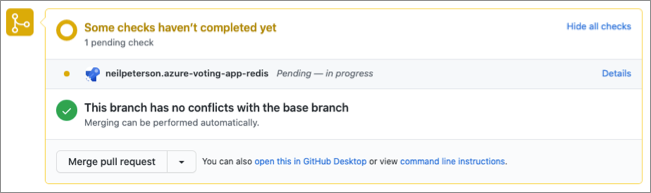

# Recommendations for using continuous integration

**Applies to this Azure Well-Architected Framework Operational Excellence checklist recommendation:**

|[OE:04](checklist.md)| Optimize software development and quality assurance processes by following industry-proven practices for development and testing. For clear role designation, standardize practices across components such as tooling, source control, application design patterns, documentation, and style guides. |
|---|---|

**Related guide**: [Improve build velocity](release-engineering-performance.md) | [Standardize tools and processes](tools-processes.md)

As code is developed, updated, or even removed, having an intuitive and safe method to integrate these changes into the main code branch enables developers to provide value.

As a developer, you can make small code changes, push these changes to a code repository, and get almost instantaneous feedback on the quality, test coverage, and introduced bugs. This process lets you work faster and with more confidence and less risk.

Continuous integration (CI) is a practice where source control systems and software deployment pipelines are integrated to provide automated build, test, and feedback mechanisms for software development teams.

## Key design strategies

Continuous integration is a software development practice that developers use to integrate software updates into a source control system on a regular cadence.

The continuous integration process starts when an engineer creates a GitHub pull request to signal to the CI system that code changes are ready to be integrated. Ideally, the integration process validates the code against several baselines and tests. It then provides feedback to the requesting engineer on the status of these tests.

If baseline checks and testing go well, the integration process produces and stages assets that will deploy the updated software. These assets include compiled code and container images.

Continuous integration can help you deliver high-quality software more quickly by performing the following actions:

- Run automated tests against the code to provide early detection of breaking changes.
- Run code analysis to ensure code standards, quality, and configuration.
- Run compliance and security checks to ensure that the software has no known vulnerabilities.
- Run acceptance or functional tests to ensure that the software operates as expected.
- Provide quick feedback on detected problems.
- Where applicable, produce deployable assets or packages that include the updated code.

### Continuous integration pipelines

To achieve continuous integration, use software solutions to manage, integrate, and automate the process. A common practice is to use a continuous integration pipeline.

A continuous integration pipeline involves a piece of software (often cloud hosted) that provides:

- A platform for running automated tests.
- Compliance scans.
- Reporting.
- All other components that make up the continuous integration process.

In most cases, the pipeline software is attached to source control such that when pull requests are created or software is merged into a specific branch, the continuous integration pipeline is run. Source control integration also provides the opportunity to give CI feedback directly on pull requests.

Many solutions, like Azure Pipelines or GitHub Actions, provide the capabilities of continuous integration pipelines.

### Source control integration

The integration of your continuous integration pipeline with your source control system is key to enabling fast, self-service code contributions.

The CI pipeline runs on a newly created pull request. The pipeline includes all tests, security assessments, and other checks. CI test results appear directly in the pull request to allow for almost real-time feedback on quality.

Another popular practice is building small reports or badges that can be presented in source control to make the current build states visible.

The following image shows the integration between GitHub and an Azure DevOps pipeline. In this example, the creation of a pull request triggers an Azure DevOps pipeline. The pipeline status appears in the pull request.



#### Test integration

A key element of continuous integration is the continual building and testing of code as developers make code contributions. Testing pull requests as they're created gives quick feedback that the commit hasn't introduced breaking changes. The advantage is that the tests in the continuous integration pipeline can be the same tests that run during test-driven development.

The following code snippet shows a test step from an Azure DevOps pipeline. The step has two tasks:

- The first task uses a popular Python testing framework to run CI tests. These tests reside in source control alongside the Python code. The test results go to a file named _test-results.xml_.
- The second task consumes the test results and publishes them to the Azure DevOps pipeline as an integrated report.

```yaml
- script: |
    pip3 install pytest
    pytest azure-vote/azure-vote/tests/ --junitxml=junit/test-results.xml
    continueOnError: true

- task: PublishTestResults@2
    displayName: 'Publish Test Results'
    inputs:
    testResultsFormat: 'JUnit'
    testResultsFiles: '**/test-results.xml'
    failTaskOnFailedTests: true
    testRunTitle: 'Python $(python.version)'
```

The following image shows test results that appear in the Azure DevOps portal.


#### Failed tests

Failed tests should temporarily block a deployment and lead to a deeper analysis of what happened. Failed tests should also lead to either a refinement of the tests or an improvement in the change that caused the tests to fail.

#### CI result badges

Many developers show that their code quality is high by displaying a status badge in their repository. The following image shows an Azure Pipelines badge displayed on the readme file for an open-source project in GitHub.


## Azure facilitation

[Azure DevOps](/azure/devops/user-guide/what-is-azure-devops) is a collection of services that help you build a collaborative, efficient, and consistent development practice.

[Azure Pipelines](https://azure.microsoft.com/services/devops/pipelines/) provides build and release services to support continuous integration and continuous delivery (CI/CD) of your applications.

[GitHub for Actions for Azure](https://azure.github.io/actions/) enables the automation of CI/CD processes. It integrates directly with Azure to simplify deployments. You can create workflows that build and test every pull request in your repository, or that deploy merged pull requests to production.

## Related links

Learn how to create a continuous integration pipeline by using either GitHub or Azure DevOps:

- [Create your first pipeline](/azure/devops/pipelines/create-first-pipeline?preserve-view=true&view=azure-devops)
- [Use starter workflows](https://docs.github.com/free-pro-team@latest/actions/guides/setting-up-continuous-integration-using-workflow-templates)

Learn how to display badges in your repositories:

- [Add an Azure Pipelines status badge to your repository](/azure/devops/pipelines/create-first-pipeline?preserve-view=true&tabs=java%2ctfs-2018-2%2cbrowser&view=azure-devops#add-a-status-badge-to-your-repository)
- [Add a GitHub workflow status badge to your repository](https://docs.github.com/free-pro-team@latest/actions/managing-workflow-runs/adding-a-workflow-status-badge)

## Operational Excellence checklist

> [!div class="nextstepaction"]
> [Design review checklist for Operational Excellence](checklist.md)
