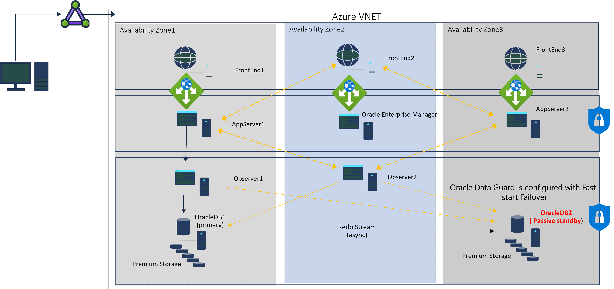

# Business Continuity and Disaster Recovery

The most effective resiliency KPIs are defined based on business requirements. RPO and RTO requirements will provide you a baseline KPI to decide on your best suited architecture. 
    - Recovery Time Objective (RTO): The maximum time an application is unavailable after an incident.
    - Recovery Point Objective (RPO): The maximum amount of data loss exposed during a disaster.
Also availability set configuration provides near real-time data replication with potentially fast failover capabilities but does not provide protection for Azure data center level or region level failures. 

## Create a Fail-Over For Business Critical Oracle Applications in a multiple availability zone deployment and second region deployment for disaster recovery

Business-critical Oracle Applications require failure prevention and therefore holistic architecture. One of these business-critical applications can be Oracle E-Business Suite.

As a given Tier 1 example for Oracle E-Business Suite in a multiple availability zone deployment and second region deployments for disaster recovery.

    - First establish a multiple availability zone deployment with separated VNet with subnets. The Application tier uses Azure Site Recovery with a passive secondary virtual machine in availability zone three from the availability zone 1 primary.
    - Use two Oracle Observers as a primary in availability zone one and a secondary in availability zone two. The observers monitor and direct the whole traffic to the primary database. Whereas the primary database is deployed in availability zone one. Oracle Data Guard performs the redo sync to availability zone two and can be configured for maximum availability. Data Guard can be established as synchronous or asynchronous. Within one region a synchronous configuration can be used for reaching a lower latency as in async mode.

A second Data Guard standby configuration in the secondary region is established for disaster recovery purposes and is configured for maximum protection. Thereby backups of the database are performed by Azure Backup Volume Snapshot on Premium Files to the secondary region.

If a primary goes down, Observer(s) will reroute the traffic to the secondary DB2 as it comes out of standby, becomes primary and takes over all functionality for environment and sequence to fail over to secondary region standby if regional outage in first region.

## Create a Fail-Over For Business Critical Oracle Applications in a Two Availability Zone Deployment With Manual Failover

The web server tier, application tier and database tier reside in its own virtual network subnet.

Azure Site Recovery or the manual clone utility can be established to duplicate the passive secondary in AZ2. The primary will be set up in availability zone one whereas the database uses Data Guard to replicate it to an active Standby in AZ2.

A failover would require manual intervention from the customer to fail over if there is a failure of availability zone one. Backups use Active Data Guard standby in AZ2 and backup to Azure Premium files in AZ2 to remove any additional IO pressure to the primary database.

## Next Steps

Please prepare yourself for the security setup in next phase. 

Further reads can be found in the following:
- [Implement Oracle Data Guard](https://learn.microsoft.com/en-us/azure/virtual-machines/workloads/oracle/configure-oracle-dataguard)
- [Implement Oracle Goldengate](https://learn.microsoft.com/en-us/azure/virtual-machines/workloads/oracle/configure-oracle-golden-gate)
- [Oracle Database Backup](https://learn.microsoft.com/en-us/azure/virtual-machines/workloads/oracle/oracle-database-backup-azure-backup?tabs=azure-portal)