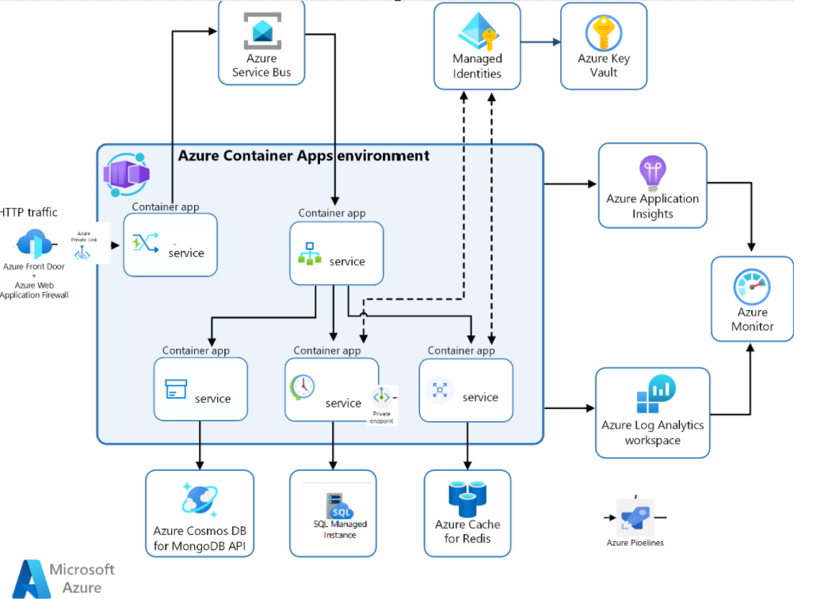

# Recommendations for defining reliability targets

**Applies to this Azure Well-Architected Framework Reliability checklist recommendation:**

|[RE:04](checklist.md)| Define reliability and recovery targets for the components, the flows, and the overall solution. Visualize the targets to negotiate, gain consensus, set expectations, and drive actions to achieve the ideal state. Use the defined targets to build the health model. The health model defines what healthy, degraded, and unhealthy states look like. |
|---|---|

This guide describes the recommendations for defining availability and recovery target metrics for critical workloads and flows. Reliability targets are derived through workshop exercises with business stakeholders. The targets are refined through monitoring and testing. 

With your internal stakeholders, set realistic expectations for workload reliability so that stakeholders can communicate those expectations to customers through contractual agreements. Realistic expectations also help stakeholders understand and support your architectural design decisions and know that you're designing to optimally meet the targets you agreed on.

Consider using the following metrics to quantify the business requirements.

|Term  |Definition  |
|---------|---------|
|Service-level objective (SLO)    | A measure of the performance and reliability of a workload or application. An SLO is a specific, measurable target that is set for particular customer interactions. It's a target that you set for your workload on application based on the quality of service your users should expect to receive.        |
|Service-level indicator (SLI)     | A metric emitted by a service. SLI metrics are aggregated to quantify an SLO value.        |
|Service-level agreement (SLA)     | A contractual agreement between the service provider and the service customer. Failure to meet the agreement might have financial consequences for the service provider.        |
|Mean time to recover (MTTR)     | The time taken to restore a component after a failure is detected.        |
|Mean time between failure (MTBF)     |The duration for which the workload can perform the expected function without interruption, until it fails.         |
|Recovery time objective (RTO)     | The maximum acceptable time that an application can be unavailable after an incident.        |
|Recovery point objective (RPO)     | The maximum acceptable duration of data loss during an incident.        |

## Key design strategies

**Reliability targets represent the desired quality goal of a workload**, as promised to its users and the business stakeholders. That goal includes both availability and recoverability of the workload. Keep in mind that reliability targets differ from performance targets but performance targets should be included in reliability targets. 

- **Availability targets**. Measurement targets for availability define the quality expectations of a workload for it to remain accessible and operational, below which the workload would be considered unreliable to its users. Service Level Objectives (SLOs) are a standard way to evaluate whether targets for the end-to-end user experience and business processes were achieved. SLOs are defined by business stakeholders with help from technical stakeholders to keep the objectives realistic within the given constraints.

- **Correctness targets**. Correctness targets ensure that the workload performs its functions as-designed and with consistent quality. Measurement of correctness involves quantifying the expected behavior in similar units as other targets so that they can be rolled up to a unified objective score.

- **Recovery targets**. Recovery targets correspond to RTO, RPO, MTTR, and MTBF metrics, which quantify the effectiveness of your plans and testing for business continuity and disaster recovery. 

To set reliability targets, broad requirements must be defined first. Business stakeholders should drive those targets basing it on the desired end user experience. Technical experts help the stakeholders **assign realistic numerical values** that correlate to those requirements. As they share knowledge, technical experts allow for negotiation and mutual consensus about realistic targets.

Based on the business requirements, it's important to [identify and score user and system flows](identify-flows.md) by how critical they're to the requirements. Use the values to drive the design of your workload in terms of architecture, review, testing, and incident management operations. Reliability targets must be defined for those flows. Failure to meet the targets affects the business beyond the tolerance level.

> :::image type="icon" source="../_images/trade-off.svg"::: **Tradeoff**: A conceptual gap might exist between the technical limitations of your workload's components and what that means for the business, for example, throughput in megabits per second versus transactions per second. Creating a model between these two views might be challenging. Rather than overengineering the solution, try to approach it in an economical but meaningful way.

### SLO targets

The overall SLO of a workload is a **collective quality indication** of all its logical boundaries, all of which should be considered as dependencies. Some of those dependencies might be individual SLOs of software services (and the responsible team), to be improved over time. A mature declaration of the overall SLO should still indicate the business target for that workload, not just a composite of those dependencies. For example, if users expect that the workload to have 99.99% availability, and one of dependencies only achieves 99.8% availability, the overall SLO is still 99.99% as a target.

Stakeholders **set estimates for user experience**, which can comprise several flows. They take into consideration, for example, how an hour of downtime for a flow during regular business hours can result in a loss of $X in monthly revenue. This dollar amount is compared to the estimated cost of designing and operating that flow. Decision makers must discuss the tolerance of external budgetary influences to decide if the extra costs and management burden for reliability is worth the risk of losing revenue. Or is the SLO too low to maintain the reputation.

For the workload owner, **objective setting exercises are driven by financial goals** where business requirements are mapped to measurable metrics. The goal is to identify a set of factors that influence the user experience and quality of experience.

For the workload architect, **SLOs should be considered as the main driver for many technical decisions**. SLOs can,

- Serve as a critical input into architectural decisions when you consider additional dependencies.
- Provide a near real-time view and shared understanding of the health of a workload to enable objective discussions. Also help the workload team prioritize efforts on improving reliability and new feature development.
- Act as a primary signal for deployment operations, driving automated rollback if issues occur, and providing validation that changes achieved the expected user experience improvement.
- Speed up remediation and recovery by focusing on objectives, drive automated notification of issues to users, and build trust between teams of the organization, who are responsible for the SLO.
    
> [!CAUTION]
>
> It's important to distinguish between Service Level Agreements (SLAs) and Service Level Objectives (SLOs). Although SLAs and SLOs might use or even present similar data, their intent is different. An SLA is a formal contract, between an organization and its customers, which has direct financial and legal implications if the organization fails to deliver on the promise. SLOs are used to evaluate whether the potential downtime is within the tolerable limits. 
>
> SLOs and SLAs share a business relationship and should be independently controlled. If the SLA serves as a business tactic, it may be intentionally set to a higher value based on the goals identified by the business owners. Conversely, SLOs can be higher. Consider mission-critical workloads as an example. This class of workload can't afford longer downtimes because the consequent impact is significant, which could be financial loss and even loss of human safety. So, the SLOs typically target 99.999% uptime (commonly referred to as '5 9s'). If those targets aren't met, organizations must react quickly to mitigate failures and prevent the outcomes of the failed SLA.
>
> The [example](#example) shown in this article, sets a higher SLA to support business goals. 
>
> Cloud platform and technology providers publish SLAs on their offerings. The SLAs should considered as part of the SLO calculation but shouldn't be used as-is without understanding the scope of coverage for the SLA. For more information, see [Assess the impact of Microsoft SLAs](#assess-the-impact-of-microsoft-slas).

#### Common SLOs and influencing factors

Every SLO targets a specific quality criteria. Consider these common SLOs for reliability. This list isn't exhaustive. Add SLOs based on your business requirements. 

- **Success rate** measures success of requests and processes relative to those that return an error or fail in their task.
- **Latency** measures the time elapsed between when a request for an operation is initiated and the result is available or the process is complete.
- **Capacity** measures measures concurrent usage, for example by using the number of throttling-based responses.
- **Availability** measures uptime from the perspective of users. 
- **Throughput** measures a minimum data transfer rate over a time window, as a data-rate unit (such as kbit/s or Mbit/s) or units of work for a time period (such as, 100 documents per minute).

Have a good understanding of the scenarios and tolerances for your workload on Azure. Both Azure services and application components have a significant impact on the workload SLO. The overall SLO should be derived by combining the responses from this table. These questions are meant to serve as examples for evaluating the utility of the workload component:

|Component characteristics|User interaction|Nuanced factors|
|---|---|---|
| ▪ Does it expose **request/response API?** ▪ Does it have **query APIs**? ▪ Is it a **compute** component? ▪ Is it a job processing component?| ▪ **Control/management plane access** for public-facing Azure services. ▪ **Data plane access** for instance, CRUD (create, read, update, delete) operations.| ▪ Does your **release process** involve downtime? ▪ What's the likelihood of **introducing bugs**? If the workload integrates with other systems, there may be integration bugs that you need to consider. ▪ How do **routine operations**, for instance, patching, impact the availability target? Have you factored in third-party dependencies? ▪ Is your **staffing** sufficient to support 24/7 emergency and emergency backup on call rotation? ▪ Does the application have **noisy neighbors** (outside your scope of control) that could potentially cause disruptions?|

#### SLO scope

SLOs can be defined at different levels within your system. They might be set per application, per workload, or even specific flows within a workload. This granularity allows you to tailor SLOs based on the criticality of each component.

In SaaS solutions, measuring SLOs per customer is valuable because each customer's experience matters. Suppose customers receive different infrastructure resources that are provided in their own segments. For such cases, a system-wide SLO that aggregates all resources across customer segments might not make sense. Instead, measure SLOs that align with each customer's specific context. For more information see, [Tenancy models for a multitenant solution](/azure/architecture/guide/multitenant/considerations/tenancy-models).

#### Define composite SLO targets

SLOs must be **measurable** and **measured within a observability window**. 

If an SLO can be measured in metrics collected from the system, the calculation should be automated. However, if the contributing factors are nuanced, it may be harder to rely on automation. 

SLOs are commonly expressed as percentage values, such as 99.9, 99.95, or 99.995. However, SLOs can also be a statement. Combine both approaches to arrive at a numerical value that can be calculated through metrics emitted by the system and also cover other nuanced factors.

**SLO is a correlation or composite of measurable indicators** to determine what's acceptable, and otherwise. The team should be clear on what is measured, how it's measured, and from what perspective it's measured. Using **Service Level Indicators (SLIs)** is a common way to standardize targets from a set of metrics. 

SLIs represent a quantitative measurement of an aspect of a workload component that rolls up to the SLO target. It's typically a metric that can be collected from the component whether that's part of the platform or application. **Different types of components** emit SLIs that are relevant to them. When deciding on which SLIs to include, reflect on the factors that influence SLO.

For instance, if you want to calculate the SLO of a flow that requires the user to interact with a component through response/request API, the SLIs would require measuring server latency and time to process requests. On the other hand, throughput and error rates aren't applicable to continuous compute environments such as VMs, scale sets, or Azure Batch.

**Type of interaction** is a significant contributing factor. Control plane access should take into consideration the error rate and latency indicators for synchronous API responses and for long-running operations, such as resource creation, deletion, and so on. Data plane access depends the set of data plane APIs for interacting with your service, each with SLO targets. 

An indicator isn't useful unless you **set a threshold**. A good SLI helps you identify when an SLO is at risk of being breached. They're also represented in percentiles. To calculate the percentage, start by estimating the potential downtime. Then, convert the allowable downtime to a percentage of the total time period, weekly, monthly, quarterly, yearly. Subtract that result from 100%.

Here are some commonly used percentiles and the estimated time of non-compliance to the expected availability. 

|Objective  |Non-compliance per week  |Non-compliance per month  |Non-compliance per year |
|---------|---------|---------|---------|
|99%      | 1.68 hours        |  7.2 hours       | 3.65 days        |
|99.9%      |  10.1 minutes       | 43.2 minutes         | 8.76 hours        |
|99.95%     | 5 minutes         | 21.6 minutes        | 4.38 hours        |
|99.99%      | 1.01 minutes        |  4.32 minutes       |  52.56 minutes       |
|99.999%     |  6 seconds        | 25.9 seconds         |  5.26 minutes       |

> [!IMPORTANT]
>
> Composite SLO value is a product distribution of the contributing factors. For example, 
> Composite SLO  = 99.95 % × 99.99999 % = \~99.95 %
>
> When creating composite SLOs for different flows, consider their varying criticality and, or relevancy. Flows may have components that are deemed as noncritical and omitted from calculations. The justification is based on whether their brief unavailability impacts the customer experience. In some cases, a component may not be relevant to the use case considered for the SLO. These can also be omitted from the calculation.
>The same principle applies to operations. Certain critical operations might impact the SLO while others are insignificant. The decision should be explicit and built on consensus.
>
> For an illustrative example about how to define and measure SLO and SLIs, see the [**Example**](#example) section.

### Assess the impact of Microsoft SLAs

Microsoft Service Level Agreement (SLA) provides insight into availability of areas that Microsoft commits to. **SLAs don't guarantee an offering as a whole**. When evaluating SLAs, have a good understanding of the coverage provided around the published percentile.

For instance, consider Azure App Service Web Apps. It's considered available when it returns a 200 OK status in a given use case. Within that specific context and timeframe, it doesn't cover financially-backed guarantee on the availability of features such as Easy Auth or slot switching. Areas that aren't mentioned explicitly in the agreement should be considered as best-effort by the platform.

So, if your workload relies on deployment slots, you can't derive your SLO solely from the Azure App Services SLA. As a workload team, it becomes necessary to hedge and predict the uptime availability. However, this prediction can be uncertain, which is why closely tying your SLO to the platform SLA can be problematic.

Let's study another example. What does it mean for Azure Front Door to be available 99.99%? Your design must adhere to specific criteria published in the agreement. Your backend must include storage, A GET operation should retrieve a file of at least 50KB in size, and you need agents deployed across multiple spots and at least five geographically diverse locations. This narrow use case of Front Door doesn't guarantee features like caching, routing rules, or web application firewall. These aspects fall outside the scope of the SLA.

### Multi-region targets

From a reliability perspective, multi-region deployment is an implementation of the principle of redundancy. The goal is to mitigate the risk of regional outage or degraded performance in a region. This strategy, when properly designed, can improve SLOs in terms of adding a secondary region for failover purposes.

There are two main use cases: 

- High availability, where load is distributed across regions for additional capacity. The workload users aren't pinned to a region and the entire system's performance contributes to the SLO.

- Bulkhead pattern, where the users are segmented by pinning them to specific regions. In such cases, treat multi-region deployments equal to having separate deployments in each region and measure SLOs per-region. 

> :::image type="icon" source="../_images/trade-off.svg"::: **Tradeoff**: Is the risk reduction worth the added complexity? Multi-region also introduces operational complexities, such as coordinating deployments, ensuring data consistency, handling latency, and others. Those operations are significant during recovery. Teams should weigh these complexities against the gains in resilience.

Pay attention to how much redundancy you need to meet high SLOs. For example, Microsoft guarantees higher SLAs for multi-region deployments of Azure Cosmos DB than it guarantees for single-region deployments.

### Recovery metrics

Definitions for realistic recovery targets, RTO, RPO, MTTR, and MTBF metrics, rely on your [failure mode analysis](failure-mode-analysis.md) and your plans and testing for business continuity and [disaster recovery](disaster-recovery.md). In defining these targets, factor in the platform-provided recovery guarantees. Microsoft publishes RTO and RPO guarantees only for some products, like [SQL Database](/azure/azure-sql/database/business-continuity-high-availability-disaster-recover-hadr-overview).

Before you finish this work, discuss aspirational targets with stakeholders and ensure that your architecture design supports the recovery targets to the best of your understanding. Clearly communicate to stakeholders that any flows or entire workloads that aren't thoroughly tested for recovery metrics shouldn't have guaranteed SLAs. Make sure that stakeholders understand that recovery targets can change over time as workloads are updated. The workload can become more complex as customers are added or as you adopt new technologies to improve the customer experience. These changes can increase or decrease your recovery metrics.

> [!NOTE]
> MTBF can be challenging to define and guarantee. Platforms as a service (PaaS) or software as a service (SaaS) can fail and recover without any notification from the cloud provider, and the process can be completely transparent to you or your customers. If you define targets for this metric, cover only components that are under your control.

As you define recovery targets, define thresholds for initiating a recovery. For example, if a web node is unavailable for more than 5 minutes, a new node is automatically added to the pool. Define thresholds for all components, considering what recovery for a specific component involves, including the effect on other components and dependencies. Your thresholds should also account for [transient faults](handle-transient-faults.md) to ensure that you don't start recovery actions too quickly. Document and share with the stakeholders the potential risks of recovery operations, like data loss or session interruptions for customers.

### Monitor and visualize the targets

Use the data you gathered for your reliability targets to build your health model for each workload and associated critical flows. A health model defines *healthy*, *degraded*, and *unhealthy* states for the flows and workloads. When state changes, the model should alert the responsible parties. For detailed design considerations and recommendations, see [Health modeling guidance](../cross-cutting-guides/health-modeling.md).

To keep your operations teams and workload stakeholders informed, create visualization that reflects the real-time status and overall trends of the workload health model. Discuss visualization solutions with the stakeholders to ensure that you deliver the information that they value and that's easy to consume. They might also want to see generated reports weekly, monthly, or quarterly.

## Azure facilitation

Azure SLAs provide the Microsoft commitments for uptime and connectivity. Different services have different SLAs, and sometimes SKUs within a service have different SLAs. For more information, see [Service-level agreements for online services](https://www.microsoft.com/licensing/docs/view/Service-Level-Agreements-SLA-for-Online-Services).

The Azure SLA includes procedures for obtaining a service credit if the SLA isn't met, along with definitions of availability for each service. That aspect of the SLA acts as an enforcement policy.

Explore the [dashboards](/azure/azure-monitor/visualize/tutorial-logs-dashboards) provided by Azure Monitor for your visualization system.

## Example

Contoso Ticketing is designing a new mobile experience for their event ticketing system. Here's the high-level architecture:

//TODO: fix the actual image

### Components

Here are some components that have been chosen to illustrate the concept of SLO definition. Notice, there are other components in this architecture that aren't included. For example, even though Key Vault is part of the critical request flow, it isn't part of the response use case. If Key Vault is unavailable, the application will continue to function using secrets that were loaded during startup. However, if the application needs to scale, Key Vault availability becomes critical because new nodes need to be loaded with secrets. In this example, scaling operations aren't considered. Other components have been omitted for brevity. 

- **Azure Front Door** is the single point of entry that exposes an API that's used by end users to send requests.
- **Azure Container Apps** environment is owned by the workload team and runs business logic for the  application. 
- **SQL Managed Instance** is owned and managed by another team and is a critical dependency of the workload. 
-  **Azure Private Link** provides private connectivity between Azure Front Door and the Azure Container Apps deployments. The SQL Managed Instance is also exposed to the application through a private endpoint.

The API team has defined an initial service-level objective (SLO) target for critical flows in the application. They have adopted the strategy described in [Factors that influence SLOs](#common-slos-and-influencing-factors), they aim to define objectives that cover the core functionality without overly emphasizing ancillary features. They decide to measure the health of three critical user flows, which involve all core cloud functionality and execute code across deployments. However, these flows don't cover 100% of the code or data access. Here are the influencing factors.

### Composite SLO calculation

- **Azure availability SLO**: Azure's financial commitment SLA serves as a proxy to assess platform reliability.

    |Azure component|Applicable SLA coverage |Not covered by SLA|Adjusted SLO|
    |--|--|--|--|
    |Azure Front Door| 99.99% for successful HTTP GET operations. |Caching, rules engine.|99.98%|
    |Azure Container App| 99.95% based on deployed apps that are reachable by the built-in ingress.| Auto scaling, token store capabilities. |99.95%|
    |SQL Managed Instance|99.99% based on connection to the SQL Server instance| Performance, data retention.|99.8%| 
    |Azure Private Link|99.99% based on whole minutes when network traffic wasn't accepted by the private endpoint or didn't flow between that endpoint and the Private Link service.|Individual failures lasting less than one minute.| 99.99%|

    The adjustment is based on several factors that are dependent on the workload team's promise to their objectives. A factor could be confidence in platform's capability based on prior experience. For example, for Container App and Private Link, the team felt comfortable in taking the SLA value as-is. 

    But there are nuanced factors. For example, the team lowered the SLO for SQL Managed Instance value to 99.8% to account for potential failures in their data operations, such as schema changes, taking back ups, and so on. 

    The team sets the composite SLO by calculating the impact of individual adjusted SLO values. This value is at 99.72%.

    But, there are other contributing factors. The architecture relies on Azure networking components like virtual networks, Network Security Group (NSG), that don't have a published SLA. The workload team decides to consider those factors with 99.99% availability of each.

    > Composite SLO based on predicted platform availability: 99.68% per month.

- **Application code SLO**. The team acknowledge that bugs in their application code or stored procedures can affect system availability, and they allocate one hour of monthly downtime to account for code-related errors. 

    They use common downtime percentiles, given in the [Measure targets](#define-composite-slo-targets) section, to estimate SLO for individual factors: code defects, scale issues, and other code-related considerations.

    > Composite SLO based on code and data availability: 99.86% per month.

- **Resource and application configuration SLO**. The team recognizes that cloud resources and application code must be properly configured. This target includes setting up auto scaling rules, deploying NSG rules, and selecting the correct size SKUs. To account for configuration errors, they budget 10 minutes of monthly downtime, which is about 99.98%.

    > Composite SLO based on configuration availability: 99.95% per month.

- **Operations SLO**. The workload team has developed good DevOps culture by following Well-Architected Framework principles for Operational Excellence. They deploy cloud resources, configuration, and code every sprint. 

    Deployments are considered a risk because of they can cause a running system to be unstable. There might be errors as a result of TLS certificate updates, DNS changes, tool errors. They also consider potential downtime caused because of emergency fixes. They budget a total of 20 minutes of monthly downtime, which is approximately 99.95% availability.

    Maintenance windows are designated time periods during which system maintenance or updates occur. The API is mostly unused for approximately four hours each day.
To reduce the risk of unavailability, the team can schedule maintenance tasks during those less active hours.  This approach would lead to a higher SLO, but they've decided not to include the maintenance window as part of their SLO. 

    > Composite SLO based on operations availability: 99.95% per month. 

- **External dependencies SLO**. The team has already considered SQL Managed Instance as the primary dependency, which already has a 99.8% availability factored into the overall platform availability. No other external dependencies are considered.

    > Composite SLO based on external dependency: Not applicable.

### Overall composite SLO result

|The overall composite SLO target is set at 99.45%, equivalent to approximately 4 hours of downtime per month. |
|---|

To meet the SLO target of allowing only 4 hours of unavailability per month, the workload team establishes an on-call rotation. Both customer support and synthetic transaction monitoring can invoke on-call SRE support to promptly start on recovery steps to address SLO issues.

### Workload SLA

|SLA for the workload at 99.9% availability per month. |
|---|

The workload team's legal and finance departments decided to set the SLA for the workload at 99.9% availability per month, exceeding the SLO target of 99.45%. They made this decision after analyzing financial payouts versus projected customer growth based on an attractive SLA. The SLA covers two core user flows and includes performance considerations, not just availability. It's a calculated risk taken by the business team to benefit the business, with the engineering team aware of the commitment.

#### Correctness SLO

The application's core user flows must not only be available but also usably (or even competitively) responsive. The team sets a response time SLO specifically for the API, excluding client processing time and internet network traversal. This SLO is evaluated only during periods of availability. They choose the 75th percentile as both the SLO target and the performance measurement, capturing the typical user experience while excluding worst-case scenarios. 

## Related links

-Mission-critical workloads: [Health modeling and observability of mission-critical workloads on Azure](/azure/well-architected/mission-critical/mission-critical-health-modeling)

## Reliability checklist  

Refer to the complete set of recommendations.

> [!div class="nextstepaction"]
> [Reliability checklist](checklist.md)
