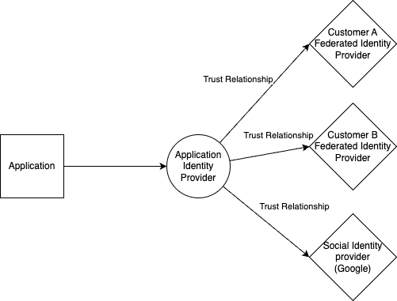

# Identity and access management for SaaS workloads for ISVs

[!INCLUDE [header_file](includes/temporary-warning.md)]

This article describes the considerations for application identity that an Independent Software Vendor (ISV) might consider while designing their SaaS application. Application identity is one of the most important pieces of a SaaS workload. It is the first line of defense when it comes to protecting your customer's data, but it is often overlooked or not thought of until the end of a project. Do not make that mistake, as a lot of decisions you may make in other areas of your application will likely be based on your identity strategy.

It is important to note that identity as it relates to SaaS includes two distinct types:

- **Application identity**, describes the identity solution you use to enable your end users to authenticate to and use your SaaS application. This is also sometimes referred to as *Customer Identity and Access Management* (CIAM). Signing users into an application identity provider is typically facilitated in one of two ways:
    - **Federated identities**: Allows the user to sign in with a pre-existing account with credentials maintained by another identity provider. A federated identity provider could be a social identity provider such as Google, Facebook, or LinkedIn, or it could be an enterprise identity provider used by one of your customers such as Microsoft Entra or Okta.
    - **Local identities**: A user account that is unique to your application identity provider. The account could be secured via a username and password combination, a passkey, or another authentication method. Unlike a federated identity provider, the user will only be able to use these credentials to sign into your application.

- **Enterprise identity**, describes the identity solution you use for your internal users and [workloads](/entra/workload-id/workload-identities-overview) to authenticate them to business productivity tools, internal tools or services, and Azure services.

These two types of identity serve different purposes and may use completely different identity providers to solve their needs. This article focuses exclusively on implementing *application* identity into your SaaS solution, but it is likely you will have both in your environment. For a holistic view of *enterprise* identity, review [SE:05 Identity and access management](/azure/well-architected/security/identity-access).

## Identity in a multitenant application

A good identity strategy is critical in any multitenant application. The ability to keep a tenant's data separate from other tenants relies on you being able to authenticate and authorize the users of your application. Many decisions regarding multitenancy, such as the [tenancy model](/azure/architecture/guide/multitenant/considerations/tenancy-models) and [deployment model](/azure/cloud-adoption-framework/ready/landing-zone/isv-landing-zone) of your application will have major implications on the decisions you make regarding your identity provider.

For more information on identity in multitenant solutions, review [Architectural considerations for identity in a multitenant solution](/azure/architecture/guide/multitenant/considerations/identity) and [Architectural approaches for identity in multitenant soutions](/azure/architecture/guide/multitenant/approaches/identity).

### Design considerations

- **Tenancy and deployment model**: You should have a good understanding of the tenancy and deployment models you want to design your application for, and how that might affect your identity strategy.

  A common misconception is to assume that, if you use the [Deployment Stamp Pattern](/azure/architecture/patterns/deployment-stamp), you need to include an identity provider as part of the stamp. That's not necessarily true, and for most identity providers, you can often use another isolation model instead.
  
  A key thing to remember as you are deciding this is that your identity provider is a major part of your architecture and, if misconfigured, has the potential to bring down your entire application for all of your tenants. You should weigh the cost of overhead against the risk of the potential radius of impact when choosing your identity provider and how to configure it for multitenancy.

  If you deploy your entire solution into the customer's Azure environment and manage it on their behalf, you might need to integrate with their enterprise identity provider directly instead of integrating it with your own.
- **User personas**: You should know the types of users that need to sign into your application, and how they intend to interact with your application tenants. For example: User A might only need access to sign into tenant 1, but user B might need access to sign into both tenant 1 and tenant 2.
- **Data residency**: In some cases, data stored in an identity provider may fall within the scope of being protected by data residency regulations. Consider whether this scenario might apply to you and whether or not you need to take steps to ensure compliance.

### Design recommendations

| Recommendation | Benefit |
|---|---|
| Follow your identity provider's best practices and guidance around partitioning the solution for multiple tenants. | Tenant isolation helps you to achieve your security and compliance goals. Many identity providers provide specific guidance and capabilities for this scenario. |
| Avoid having multiple accounts for the same user. If you need to have users sign into multiple tenants, a user should have one account, with one set of credentials, and access granted to each tenant as necessary. | Creating multiple accounts for the same user increases the surface area of attack for a potential bad actor, and can cause confusion for the user if they need to remember multiple usernames and passwords for the same software.|
| If you must consider data residency, carefully consider how you implement storing user data in a separate location. If you have separate deployment stamps per region, you may also need separate identity providers per region.  Make sure you have a way to identify which users are stored in which locations so that you can direct them to the appropriate region for sign-in, if required. | You'll be able to support your compliance requirements and enhance the user experience by routing users to the sign-in experience that's appropriate for their location.|

## Identity provider selection

The selection of an identity provider is a very important choice in your identity architecture. Every identity provider will have different feature sets, limitations, pricing models, and patterns of implementation into your architecture. There are many identity providers to choose from, including Microsoft identity as a service (IDaaS) providers such as Microsoft Entra, open source identity providers such as [Keycloak](https://github.com/keycloak/keycloak) or [Authentik](https://github.com/goauthentik/authentik), and non-Microsoft IDaaS providers.

### Design considerations

- **Feature comparison**: Start your identity provider selection process by making a list of identity related features you envision your application needing, both now and in the future. This list is non-exhaustive, but common ones include: 
    - Federated identity provider support, which enables you to integrate with your customers' own identity solutions and avoids them creating new identities just for your solution.
    - The ability to customize the look and feel into the user sign-in & sign-up flow, which helps to maintain your branding across your whole solution.
    - Functionality to inject custom business logic into the sign-in & sign-up flow, which enables you to customize the behavior of your identity solution.
    - A method to logically group users into separate tenants/silos, which helps you to maintain tenant isolation.
    - Support for audit scenarios where you might need audit logs for sign-ins retained for a certain period of time or exported to a tool for security information and event management (SIEM), like Microsoft Sentinel.
- **Management overhead**: Different identity providers will have different levels of management overhead required for upkeep. IDaaS identity providers typically have less overhead than open source solutions, because they host and maintain the components and take responsibility for keeping your data secure. Additional overhead may be worth it, however, if the solution is the best fit for your needs.
- **Cost**: Make sure you take your planned user growth into account when evaluating the cost of the solution. It's possible you might still choose a solution even knowing it won't remain cost-effective or scale beyond a certain point, but make sure you have a plan for how you'll migrate away if the need arises.

  For example: the solution you choose could be very affordable at 500 users, but unsustainable at 5 million. However, if the solution requires very little initial setup, is easy to use, and easy to migrate away from, that may still be the correct pick until the cost justifies moving to a different solution.

### Design recommendations

| Recommendation | Benefit |
|---|---|
| Do **not** build your own identity solution. Identity is a highly specialized area, and building an identity solution is complex, expensive, and difficult to build securely. Identity providers are also typically mission critical for your application, and must be extremely reliable. In the overwhelming majority of cases, an IDaaS or open source identity provider will suit your needs. Building your own identity provider is considered an **antipattern**.|You'll enhance the security, reliability, and operational efficiency of your solution.|
| Research your choices thoroughly to ensure your identity solution matches your list of required features.  Even if your application does not need to support more complex scenarios such as federated identity, you should consider if you might need to at any point in the future and choose an identity provider accordingly. If you're building a B2B SaaS solution, you will almost certainly need federated identity at some point.|You'll ensure your ability to evolve without being constrained by a limited set of features from your identity provider.|
| Only use an open source solution when you need to solve a specific need or concern that you can't solve in a hosted identity provider. The operational overhead and security risks involved in hosting an open source solution yourself is significant, so you should [prefer an IDaaS identity provider](/azure/architecture/guide/design-principles/identity) in most scenarios. For example, you may choose to deploy an open source solution to meet a specific requirement for compliance, data residency, or reliability that a IDaaS identity provider is not able to meet. | By using an IDaaS identity provider, you'll avoid unnecessary complexity and can focus your efforts on your core business.|

## Federated Identity

Federated identity, which is sometimes referred to as *single sign-on (SSO)*, is the concept of allowing your users to sign in with credentials they already use elsewhere. This is achieved by forming a trust relationship between your *application* identity provider and a pre-existing identity provider already used by your customer(s). This ability is one of the most common requirements for a SaaS solution, especially in B2B SaaS, as your customers typically want their employees to be able to sign in with their corporate credentials.

Federated identity has many benefits for B2B solutions, such as giving the customer the ability to manage their identities in a central location, and automatically dealing with lifecycle management like when a customer's employee leaves their company.

In B2C SaaS products, the requirement for federated identity may not come directly from your customers, but integrating with social identity providers to allow your users to sign in with pre-existing credentials is still a common pattern to be implemented.

Initially, the complexity of implementing a federated identity solution is low, but it increases with the number of identity providers you need to support. For that reason, you need to carefully plan your implementation ahead of time, especially if every one of your customers has a unique identity provider you need to add to your solution. 

You should also keep in mind that even if you have more than one customer using the same identity provider, you will often have to set up a unique trust relationship for each customer as the configuration details will customer specific.

The following diagram depicts the relationship between your application, your application identity provider, and the downstream identity providers you may choose to implement with identity federation.  

### Design considerations

- **Type and number of identity providers**: You should have a good understanding of which identity providers you may need to support. You may only need to support a static number of social identity providers. Or, you may need to be able to support a unique federated identity provider for each one of your customers.

   From a technical perspective, you should also understand whether your customers plan to integrate their federated identity providers via the Open ID Connect (OIDC) protocol, the security assertion markup language (SAML) protocol, or both.
- **Sign in experience**: You should map out how your users should flow through the sign-up and sign-in experience. Be sure to note any special requirements that may alter your user flow design, for example:

    - Custom branding per customer, also known as whitelabeling, or custom sign-in domains per customer.
    - Needing to collect custom information from the user on sign-up or sign-in. For example, if a single user has access to multiple tenants, you might need to prompt them to select the tenant they want to work with.
    - If you use a single application identity provider with many federated identity providers trusting it, you will need to select an identity provider to sign the user in with at some point in the sign-in user flow. This can be done manually, using something like a button the user selects, or automatically on their behalf based on some information you know about a user. As the number of federated identity providers you support grows, the ability for a user to manually select their federated identity provider gets more difficult and you will need to select it for them. This process is known as [home realm discovery](/entra/identity/enterprise-apps/home-realm-discovery-policy) or identity provider selection.

### Design recommendations

| Recommendation | Benefit |
|---|---|
| Ensure the identity provider you pick can scale to meet the number of federated identity providers you need to add. Managing a solution with 3 federated identity providers is very different than a solution with 3,000. Some identity providers might have hard limits that you can't exceed.|You'll ensure your identity solution can scale as you grow.|
| Plan how you'll onboard each federated identity provider. Automate the process as much as possible.  This will typically be a collaborative process between your company and your customers, as it will require you to exchange information required to establish a trust relationship, which typically occurs by using the OpenID Connect or SAML protocols. | Identity integration can take time and effort for both you and your customers. By planning the process, you'll improve your operational efficiency. |
| Reflect the complexity and cost of federated identity in your pricing and business model.  Allowing customers to bring their own identity provider increases the overall cost and operational complexity of your application due to the overhead required for maintaining a large number of federated identity trust relationships. It's common in SaaS solutions for enterprises to pay for a higher tier that enables federated sign-in.|Federating with a customer's identity provider can be a hidden cost in SaaS solutions. By planning for it, you'll avoid unexpected costs during implementation.|
| Plan for how a user's identity provider will be selected during the sign-in flow. This might require performing home realm discovery. | You'll streamline your customer experience and ensure users are directed to the right sign-in process for them. |

## Authorization

User authorization is a critical piece of any application, but especially so for SaaS applications. This is because SaaS applications typically house data belonging to multiple tenants at once. You should be clear about how you will authorize your users to access the data they need to without accidentally giving them access to data to other tenants. In addition, many systems need to provide more granular authorization within a tenant. For example, a user might be able to read or access some information, but be restricted from updating or accessing other information.

### Design Considerations
- **Authorization models**: There are typically 2 distinct authorization models you can use in your solution: 
    - **Role-based authorization**: Users are assigned to roles or groups and some features of an application are restricted to specific roles. For example, a user in the administrator role can perform any action, while a user in a lower role might have a subset of permissions throughout the system.
    - **Resource-based authorization**: Your solution provides a set of distinct resources, each of which has its own set of permissions. A specific user might be an administrator of one resource and have no access to another resource.
- **Authorization data storage**: Authorization data for your application can be stored in several places, including the following:
    - **In your identity provider**: You can typically take advantage of built in groups or roles in your identity provider and then surface the permissions as claims in the token that gets issued to your application. Your application can then use the associated token claims to enforce your authorization rules.
    - **In your application**: You can build your own authorization logic, and then store information about what each user can do in a database or similar storage system. You can then design fine-grained controls for role-based or resource-level authorization.
- **Delegated managment**: For most SaaS applications, especially B2B SaaS, the management of roles and permissions are typically delegated to the customer to do for their users. Without this functionality, you may be unknowingly increasing your management overhead if your customers would like to frequently change permissions for their users.
- **Multi-tenant access**: In some systems, a single user might need to access data from multiple tenants. For example, a consultant might work for several of your customers at the same time. Consider how customers grant access to users who are already using your solution, and how your sign-in flow supports selecting and switching the tenant a user is working with.

### Design Recommendations

| Recommendation | Benefit |
|---|---|
| Take care to ensure your authorization strategy will not allow a user to access data across tenant boundaries, unless they are specifically allowed to do so. | If a customer is able to access data they shouldn't be able to from another tenant, even by accident, it will likely be seen as a major security incident and will erode your customer's trust in your platform. |
| Decide where to store your authorization data. If your authorization data is fairly static and does not change frequently, it may make more sense to store it in the identity provider. If you need to make frequent changes to the authorization data as a user is using the software, you should store the authorization data in your application. | By selecting the best data store for your authorization data, you'll enhance your operational efficiency and can meet your scalability needs. |
| If you are going to delegate permission management to your customers, ensure you have a defined way for them to do that. For example, you may choose to build a web portal that only a tenant administrator can sign into to change permissions on behalf of their users. | You'll give more control to your customers, and avoid unnecessary operational burden on your support team. |