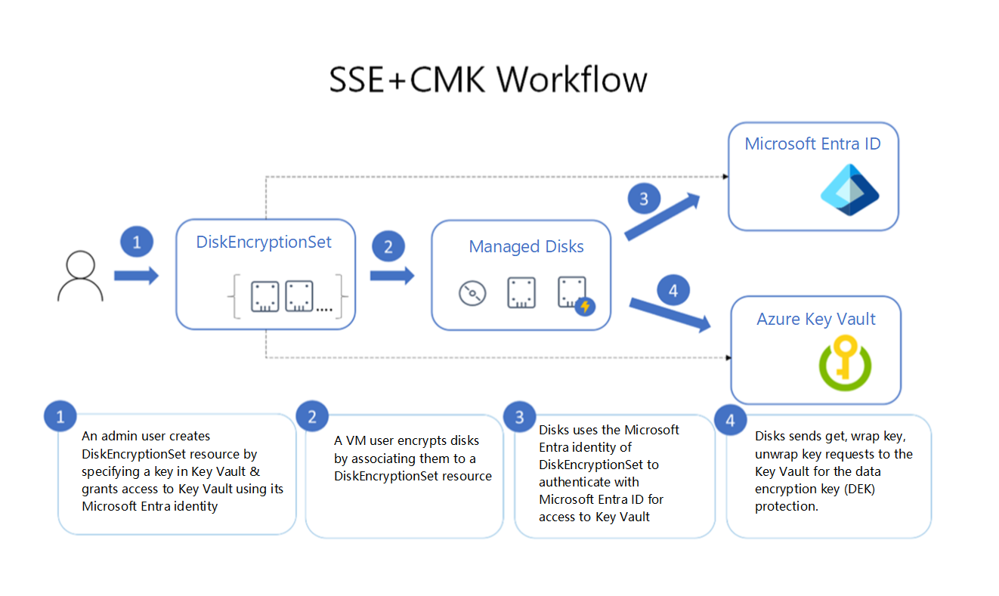

# SAP workload security

Azure provides all the tools needed to secure your SAP workload. SAP applications can contain sensitive data about your organization. You must protect your SAP architecture with secure authentication methods, hardened networking, and encryption.

## Configure identity management

Identity management is a framework to enforce the policies that control access to critical resources. Identity management controls access your SAP workload within or outside its virtual network. There are three identity management use cases to consider for your SAP workload, and the identity management solution differs for each.

### Use Microsoft Entra ID

Organizations can improve the security of Windows and Linux virtual machines in Azure by integrating with Microsoft Entra ID, a fully managed identity and access management service. Microsoft Entra ID can authenticate and authorize end user’s access to the SAP operating system. You can use Microsoft Entra ID to create domains that exist on Azure, or use it integrate with your on-premises Active Directory identities. Microsoft Entra ID also integrates with Microsoft 365, Dynamics CRM Online, and many Software-as-a-Service (SaaS) applications from partners. We recommend using System for Cross-Domain Identity Management (SCIM) for identity propagation. This pattern enables optimal user life cycle.

For more information, see:

- [SCIM synchronization with Microsoft Entra ID](/azure/active-directory/fundamentals/sync-scim)
- [Configure SAP Cloud Platform Identity Authentication for automatic user provisioning](/azure/active-directory/saas-apps/sap-cloud-platform-identity-authentication-provisioning-tutorial)
- [Microsoft Entra single sign-on (SSO) integration with SAP NetWeaver](/azure/active-directory/saas-apps/sap-netweaver-tutorial)
- [Sign in to a Linux virtual machine in Azure by using Microsoft Entra ID and OpenSSH]( /azure/active-directory/devices/howto-vm-sign-in-azure-ad-linux)
- [Sign in to a Windows virtual machine in Azure by using Microsoft Entra ID]( /azure/active-directory/devices/howto-vm-sign-in-azure-ad-windows)

### Configure single sign-on

You can access the SAP application with the SAP frontend software (SAP GUI) or a browser with HTTP/S. We recommend configuring single sign-on (SSO) using Microsoft Entra ID or Active Directory Federation Services (AD FS). SSO allows end users to connect to SAP applications via browser where possible.

For more information, see:

- [SAP HANA SSO](/azure/active-directory/saas-apps/saphana-tutorial)
- [SAP NetWeaver SSO](/azure/active-directory/saas-apps/sap-netweaver-tutorial)
- [SAP Fiori SSO](/azure/active-directory/saas-apps/sap-fiori-tutorial)
- [SAP Cloud Platform SSO](/azure/active-directory/saas-apps/sap-hana-cloud-platform-tutorial)
- [SuccessFactors SSO](/azure/active-directory/saas-apps/successfactors-tutorial)
- [Microsoft Entra overview](/azure/active-directory/)

### Use application-specific guidance

We recommend consulting the SAP Identity Authentication Service for SAP Analytics Cloud, SuccessFactors, and SAP Business Technology Platform. You can also integrate services from the SAP Business Technology Platform with Microsoft Graph using Microsoft Entra ID and the SAP Identity Authentication Service.

For more information, see:

- [Using Microsoft Entra ID to secure access to SAP platforms and applications](/azure/active-directory/fundamentals/scenario-azure-first-sap-identity-integration).
- [SAP Identity Authentication Service](https://help.sap.com/docs/IDENTITY_AUTHENTICATION)
- [SAP Identity Provisioning Service](https://help.sap.com/docs/IDENTITY_PROVISIONING)

A common customer scenario is deploying SAP application into Microsoft Teams. This solution requires SSO with Microsoft Entra ID. We recommend browsing the Microsoft commercial marketplace to see which SAP apps are available in Microsoft Teams. For more information, see [the Microsoft commercial marketplace](https://appsource.microsoft.com/marketplace/apps?page=1&search=sap).

*Table 1 - Summary of the recommended SSO methods*

| SAP solution | SSO method |
| --- | --- |
|SAP NetWeaver based-web applications such as Fiori, WebGui|Security Assertion Markup Language (SAML)|
|SAP GUI|Kerberos with windows active directory or Microsoft Entra Domain Services or third party solution|
|SAP PaaS and SaaS applications such as SAP Business Technology Platform (BTP), Analytics Cloud, [Cloud Identity Services](https://help.sap.com/docs/IDENTITY_AUTHENTICATION), [SuccessFactors]( /azure/active-directory/app-provisioning/sap-successfactors-integration-reference), [Cloud for Customer]( /azure/active-directory/saas-apps/sap-customer-cloud-tutorial), [Ariba](/azure/active-directory/saas-apps/ariba-tutorial)|SAML / OAuth / JSON Web Tokens (JWT) and pre-configured authentication flows with Microsoft Entra ID directly or by proxy with the SAP Identity Authentication Service|

## Use role-based access control (RBAC)

It’s important to control access to the SAP workload resources you deploy. Every Azure subscription has a trust relationship with a Microsoft Entra tenant. We recommend you use Azure role-based access control (Azure RBAC) to grant users within your organization access the SAP application. Grant access by assigning Azure roles to users or groups at a certain scope. The scope can be a subscription, a resource group, or a single resource. The scope depends on the user and how you’ve grouped your SAP workload resources.

For more information, see:

- [Microsoft Entra ID trust relationship](/azure/active-directory/fundamentals/active-directory-how-subscriptions-associated-directory)
- [Azure RBAC](/azure/role-based-access-control/overview)

## Enforce network and application security

Network and application security controls are baseline security measures for every SAP workload. Their importance bears repeating to enforce the idea that the SAP network and application requires rigorous security review and baseline controls.  

**Use hub-spoke architecture.** It’s critical to differentiate between shared services and SAP application services. A hub-spoke architecture is a good approach to security. You should keep workload specific resources in its own virtual network separate from the shared services in hub such as management services and DNS.  

For SAP-native setups, you should use SAP Cloud Connector and SAP Private Link for Azure as part of the hub-spoke setup. These technologies support the SAP extension and innovation architecture for the SAP Business Technology Platform (BTP). Azure native integrations fully integrated with Azure virtual networks and APIs and don’t require these components.

**Use network security groups.** Network security groups (NSGs) allow you to filter network traffic to and from your SAP workload. You can define NSG rules to allow or deny access to your SAP application. You can allow access to the SAP application ports from on-premises IP addresses ranges and denying public internet access. For more information, see [network security groups](/azure/virtual-network/network-security-groups-overview)

**Use application security groups.** In general, the security best practices for application development also apply in the cloud. These include things like protecting against cross-site request forgery, thwarting cross-site scripting (XSS) attacks, and preventing SQL injection attacks.

Application security groups (ASGs) make it easier to configure the network security of a workload. The ASG can be used in security rules instead of explicit IPs for VMs. The VMs are then assigned to ASG. This configuration supports the reuse of the same policy over different application landscapes, because of this abstraction layer. Cloud applications often use managed services that have access keys. Never check access keys into source control. Instead, store application secrets in Azure Key Vault. For more information, see [application security groups](/azure/virtual-network/application-security-groups).

**Filter web traffic.** An internet facing workload must be protected using services like Azure Firewall, Web Application Firewall, Application Gateway to create separation between endpoints. For more information, see [inbound and outbound internet connections for SAP on Azure](/azure/architecture/guide/sap/sap-internet-inbound-outbound).

## Encrypt data

Azure includes tools to safeguard data according to your organization's security and compliance needs. It's essential that you encrypt SAP workload data at rest and in transit.

### Encrypt data at rest

Encrypting data at rest is a common security requirement. Azure Storage service-side encryption is enabled by default for all managed disks, snapshots, and images. Service-side encryption uses service-managed keys by default, and these keys are transparent to the application.

We recommend you review and understand service/server-side encryption (SSE) with customer-managed keys (CMKs). The combination of server-side encryption and a customer-managed key allows you to encrypt data at rest in the operating system (OS) and data disks for available SAP OS combinations.  Azure Disk Encryption doesn’t support all SAP operating systems. The customer-managed key should be stored in Key Vault to help ensure the integrity of the operating system. We also recommend encrypting your SAP databases. Azure Key Vault supports database encryption for SQL Server from the database management system (DBMS) and other storage needs. The following image shows the encryption process.

When you use client-side encryption, you encrypt the data and upload the data as an encrypted blob. Key management is done by the customer. For more information, see:

- [Server-side encryption for managed disks]( /azure/virtual-machines/disk-encryption)
- [Azure Storage service-side encryption](/azure/storage/common/storage-service-encryption)
- [Service-side encryption using customer-managed key in Azure Key Vault](/azure/storage/common/customer-managed-keys-configure-existing-account)
- [Client-side encryption](/azure/storage/blobs/client-side-encryption)

### Encrypt data in transit

Encryption in transit applies to the state of data moving from one location to another. Data in transit can be encrypted in several ways, depending on the nature of the connection. For more information, see [encryption of data in transit]( /azure/security/fundamentals/encryption-overview#encryption-of-data-in-transit).

## Collect and analyze SAP application logs

Application log monitoring is essential for detecting security threats at the application level. We recommend using the Microsoft Sentinel Solution for SAP. It’s a cloud-native security information and event management (SIEM) solution built for your SAP workload running on a VM. For more information, see [Microsoft Sentinel Solution for SAP](/Azure/sentinel/sap/deployment-overview).

For general security information, see:

- [Azure security documentation]( /azure/security/)
- [Trusted Cloud eBook](https://azure.microsoft.com/explore/trusted-cloud/)

## Next steps

> [!div class="nextstepaction"]
> [Application design](./application-design.md)

> [!div class="nextstepaction"]
> [Application platform](./application-platform.md)

> [!div class="nextstepaction"]
> [Data platform](./data-platform.md)

> [!div class="nextstepaction"]
> [Networking and connectivity](./networking-and-connectivity.md)

> [!div class="nextstepaction"]
> [Operational procedures](./operational-procedures.md)
