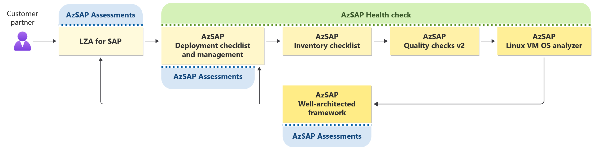
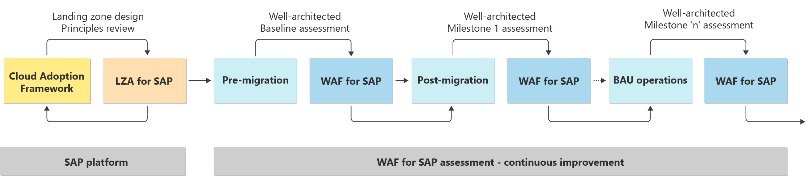

# SAP workload operational excellence

Operational excellence about creating efficient processes that support an SAP workload. Operations will be the longest phase of the SAP workload lifecycle, and teams must be equipped with operational best practices to manage the day-today changes. A failure in operations will impact the success of an organization. It’s critical to tailor your operations to support an SAP workload in operations.

## Use WAF assessments

Standard operating procedures (SOPs) are documented processes for managing a workload. Each SAP workload should have SOPs to govern operations and drive consistency. Without these procedures, operations teams can drift from management best practices. We recommend using our SAP assessments to develop SOPs for your SAP workload.

We have three SAP assessments: landing zone accelerator (LZA), deployment, and well-architected framework assessment. They are designed for different stages in the SAP workload lifecycle. For operational excellence, focus on the Azure SAP (AzSAP) Well-architected framework assessment.

*Figure 1: The assessment and health check cycle throughout the customer journey.*

The AzSAP Well-architected framework assessment compares your SAP operations against industry best practices. It encourages continuous improvement by building on each previous assessment. The initial assessment creates a baseline, and the next iteration of assessment uses the previous assessment. You don’t have to start from scratch each time. Because the assessment builds on itself, you can track improvements overtime. It will maintain the selections from the last assessment to track and review the design principle while creating roadmap. The assessment is designed for an existing SAP workload in Azure and can assess one or more of the WAF pillars. The goal of the assessment is to reduce technical throughout the lifecycle of the SAP workload.

*Figure 2: How the Well-architected assessment creates milestones and builds on these milestones over time.*

With the results of the assessment, you can create and update SOPs for each SAP workload. The assessment identifies areas of strength and weakness that all you to build a better SOP. An SAP workload SOP should be tailored, documented, and reviewed to drive operational excellence.

For more information, see [Azure Well-Architected Review](/assessments/).

## Monitor the workload

Monitoring is the process to collect, analyze, and act on telemetry gathered from an SAP workload. Monitoring provides insights of the health of SAP systems to compare with an expected baseline. Without monitoring, the health, security, and reliability of an SAP workload is unknown. Monitoring and diagnostics give insight into a system so that you know when and where failures occur.

A best practice is to use a common and consistent logging schema that lets you correlate events across systems. The monitoring and diagnostics process has several distinct phases:

- *Instrumentation* - Generating the raw data from application logs, web server logs, the diagnostics built into the Azure platform, and other sources.
- *Collection and storage* - Consolidating the data into one place.
- *Analysis and diagnosis* - Troubleshooting issues and seeing the overall health.
- *Visualization and alerts* - Using telemetry data to spot trends or alert your operations team.

We recommend Azure Monitor for SAP solutions to drive these processes. Azure Monitor for SAP is an Azure-native monitoring product for SAP landscapes that run on Azure. Azure Monitor for SAP solutions uses specific parts of the Azure Monitor infrastructure to provide insights into the monitoring of SAP Netweaver, SAP HANA, SQL Server & Pacemaker High-Availability deployments on Azure.

## Automate workload infrastructure

You can use infrastructure as code (IaC) to automate SAP workload deployments with minimal human intervention and build a scalable and consistent SAP Estate on Azure. The manual process of creating the required SAP-workload resources is slow and allows for errors.

| Benefit domain | Automate deployment benefits | Manual deployment disadvantages |
| --- | --- | --- |
| Knowledge | Works immediately after some initial preparation time. Requires little domain knowledge.| Requires specialized knowledge in many domains outside of SAP.|
| Time | Consumes predictable time from 30 minutes to a couple of hours.| Can take much more time depending on the size of the SAP landscape, depending on the size of the SAP landscape.|
| Cost | Makes automated deployments cheap due to less time spent.| Expensive due to more time spent.|
| Testing | Provides templates that include test instrumentation during deployment and migration.| Allows for limited testing. Requires more work to inject tests in the process. |
| Scaling | Allows you to easily scale up, down, and out. Provides new deployment templates.| Takes more time to scale and customize the environment.|
| Standardization | Applies your defined standards with each deployment.| Sometimes leads to unwanted variations in design.|

Microsoft has a repository of SAP deployment templates that you should use. It’s called the SAP on Azure Deployment Automate Framework. The templates support SAP HANA and NetWeaver with any database on any SAP-supported operating systems.

For more information, see:

- [SAP deployment automation framework](/azure/virtual-machines/workloads/sap/automation-deployment-framework)
- [SAP automate repository](https://github.com/Azure/sap-automation)
- [Azure Monitor for SAP solutions](/azure/virtual-machines/workloads/sap/monitor-sap-on-azure)

## Next Step

>[!div class="nextstepaction"]
>[Overview](./overview.md)

>[!div class="nextstepaction"]
>[Reliability](./reliability.md)

>[!div class="nextstepaction"]
>[Security](./security.md)

>[!div class="nextstepaction"]
>[Cost Optimization](./cost-optimization.md)

>[!div class="nextstepaction"]
>[Performance Efficiency](./performance-efficiency.md)
