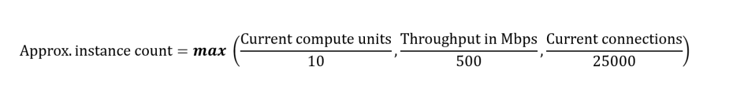

# Architecture best practices for Azure Application Gateway v2

Azure Application Gateway v2 is a web traffic load balancer that operates at the application layer. Application Gateway manages traffic to your web applications based on the attributes of an HTTP request. Use Application Gateway for scenarios that have advanced routing capabilities and require enhanced security and scalability. 

This article assumes that as an architect, you've reviewed the [networking options](/azure/architecture/networking/) and chose Application Gateway as the web traffic load balancer for your workload. The guidance in this article provides architectural recommendations that are mapped to the principles of the [Well-Architected Framework pillars](/azure/well-architected/pillars).

**Technology scope**

This review focuses on the interrelated decisions for the following Azure resources:  

- Application Gateway v2
- Web Application Firewall (WAF) on Application Gateway

## Reliability

The purpose of the Reliability pillar is to provide continued functionality by **building enough resilience and the ability to recover fast from failures**.

[Reliability design principles](/azure/well-architected/resiliency/principles) provide a high-level design strategy applied for individual components, system flows, and the system as a whole.

### Workload design checklist

Start your design strategy based on the [design review checklist for Reliability](../reliability/checklist.md). Determine its relevance to your business requirements while keeping in mind the features of Application Gateway and its dependencies. Extend the strategy to include more approaches as needed.

> [!div class="checklist"]
>
> - **Use Application Gateway v2** in new deployments unless your workload specifically requires Application Gateway v1.
>
> - **Build redundancy in your design.** Spread Application Gateway instances across availability zones to improve fault tolerance and build redundancy. Traffic goes to other zones if one zone fails. For more information, see [Recommendations for using availability zones and regions](/azure/well-architected/reliability/regions-availability-zones).
> - **Plan extra time for rule updates** and other configuration changes before you access Application Gateway or make further changes. For example, you might need extra time to remove servers from a back-end pool because they have to drain existing connections.
> - **Implement the Health Endpoint Monitoring pattern.** Your application should expose health endpoints, which aggregate the state of the critical services and dependencies that your application needs to serve requests. Application Gateway health probes use the endpoint to detect the health of servers in the back-end pool. For more information, see [Health Endpoint Monitoring pattern](/azure/architecture/patterns/health-endpoint-monitoring).
> - **Evaluate the impact of interval and threshold settings on a health probe.** The health probe sends requests to the configured endpoint at a set interval. And the back end tolerates a limited number of failed requests before it's marked as unhealthy. These settings can conflict, which presents a tradeoff.
>   - A higher interval puts a higher load on your service. Each Application Gateway instance sends its own health probe, so 100 instances every 30 seconds equals 100 requests every 30 seconds.
>
>   - A lower interval increases the amount of time before the health probe detects an outage.
>   - A low, unhealthy threshold increases the chance of short, transient failures shutting down a back end.
>   - A high threshold increases the amount of time that it takes a back end to go out of rotation.
> - **Verify downstream dependencies through health endpoints.** To isolate failures, each of your back ends might have its own dependencies. For example, an application that you host behind Application Gateway might have multiple back ends, and each back end connects to a different database, or replica. When such a dependency fails, the application might work but doesn't return valid results. For that reason, the health endpoint should ideally validate all dependencies.
>
>   If each call to the health endpoint has a direct dependency call, that database receives 100 queries every 30 seconds instead of one query. To avoid excessive queries, the health endpoint should cache the state of the dependencies for a short period of time.
> - **Consider Application Gateway limitations and known issues that might affect reliability.** Review the [Application Gateway FAQ](/azure/application-gateway/application-gateway-faq) for important information about by-design behavior, fixes under construction, platform limitations, and possible workarounds or mitigation strategies. Don't use UDRs in the Application Gateway dedicated subnet.
> - **Consider Source Network Address Translation (SNAT) port limitations in your design** that can affect back-end connections on Application Gateway. Some factors affect how Application Gateway reaches the SNAT port limit. For example, if the back end is a public IP address, it requires its own SNAT port. To avoid SNAT port limitations, you can do one of the following options:
>
>   - Increase the number of instances for each Application Gateway.
>   - Scale out the back ends to have more IP addresses.
>   - Move your back ends into the same virtual network, and use private IP addresses for the back ends.
>
>     If Application Gateway reaches the SNAT port limit, it affects the requests per second (RPS). For example, Application Gateway can't open a new connection to the back end, and the request fails.
>
>   Where possible, consider CNI Overlay integration. For example, when using AKS, take advantage of Application Gateway for Containers support for overlay pod networking. This feature enables scaling multiple AKS clusters sharing ingress while conserving IP space, removing subnet exhaustion as a reliability and scaling blocker. For more information, see [Container networking with Application Gateway for Containers](/azure/application-gateway/for-containers/container-networking).

### Configuration recommendations

| Recommendation | Benefit |
|--------|----|
| Deploy Application Gateway instances in a [zone-aware configuration](/azure/application-gateway/application-gateway-autoscaling-zone-redundant).    Check regional support for zone redundancy because not all regions offer this feature. | When you spread multiple instances across zones, your workload can withstand failures in a single zone. If you have an unavailable zone, traffic automatically shifts to healthy instances in other zones, which maintains application reliability. |
| Use [Application Gateway health probes](/azure/application-gateway/application-gateway-probe-overview) to detect back-end unavailability. | Health probes ensure that traffic only routes to back ends that can handle the traffic. Application Gateway monitors the health of all the servers in its back-end pool and automatically stops sending traffic to any server that it considers unhealthy.  |
| Configure [rate-limiting rules](/azure/web-application-firewall/ag/rate-limiting-configure) for Azure WAF so that clients can't send too much traffic to your application. | Use rate limiting to avoid problems like retry storms. |
| Don't use UDRs on Application Gateway so that the [back-end health report](/azure/application-gateway/application-gateway-backend-health) functions properly and generates the correct logs and metrics.    If you must use a UDR in the Application Gateway subnet, see [Supported UDRs](/azure/application-gateway/configuration-infrastructure#supported-user-defined-routes). | UDRs on the Application Gateway subnet can cause some problems. Don't use UDRs on the Application Gateway subnet so that you can view the back-end health, logs, and metrics. |
| Configure the *IdleTimeout* settings to match the listener and traffic characteristics of the back-end application. The default value is four minutes. You can configure it to a maximum of 30 minutes.    For more information, see [Load balancer Transmission Control Protocol (TCP) reset and idle timeout](/azure/load-balancer/load-balancer-tcp-reset). | Set the *IdleTimeout* to match the back end. This setting ensures that the connection between Application Gateway and the client stays open if the back end takes more than four minutes to respond to the request. If you don't configure this setting, the connection closes, and the client doesn't see the back-end response. |

## Security

The purpose of the Security pillar is to provide **confidentiality, integrity, and availability** guarantees to the workload.

The [Security design principles](/azure/well-architected/security/security-principles) provide a high-level design strategy for achieving those goals by applying approaches to the technical design of Application Gateway.

### Workload design checklist

Start your design strategy based on the [design review checklist for Security](../security/checklist.md) and identify vulnerabilities and controls to improve the security posture.

> [!div class="checklist"]
> - **Review the [security baseline for Application Gateway](/security/benchmark/azure/baselines/azure-web-application-firewall-security-baseline).**
>
> - **Block common threats at the edge.** WAF integrates with Application Gateway. Enable WAF rules on the front ends to protect applications from common exploits and vulnerabilities at the network edge, which is close to the attack source. For more information, see [WAF on Application Gateway](/azure/web-application-firewall/ag/ag-overview).
>
>     Understand how WAF affects Application Gateway capacity changes. When you enable WAF, Application Gateway:
>   - Buffers every request until it fully arrives.
>
>   - Checks if the request matches with any rule violation in its core rule set.
>   - Forwards the packet to the back-end instances.
>
>   Large file uploads that are 30 MB or more can introduce significant latency. Application Gateway capacity requirements change when you enable WAF, so we recommend that you properly test and validate this method first.
>
>     When you use Azure Front Door and Application Gateway to protect HTTP or HTTPS applications, use WAF policies in Azure Front Door and lock down Application Gateway to receive traffic only from Azure Front Door. Certain scenarios can force you to implement rules specifically on Application Gateway. 
> - **Allow only authorized access to the control plane.** Use Application Gateway [role-based access control (RBAC)](/azure/role-based-access-control/overview) to restrict access to only the identities that need it.
> - **Protect data in transit.** Enable end-to-end Transport Layer Security (TLS), TLS termination, and end-to-end TLS encryption. When you re-encrypt back-end traffic, ensure that the back-end server certificate contains both the root and intermediate certificate authorities (CAs).
>
>     Use a well-known CA to issue a TLS certificate of the back-end server. If you don't use a trusted CA to issue the certificate, Application Gateway checks until it finds a trusted CA certificate. It establishes a secure connection only when it finds a trusted CA. Otherwise, Application Gateway marks the back end as unhealthy.
> - **Protect application secrets.** Use Azure Key Vault to store TLS certificates for increased security and an easier certificate renewal and rotation process.
> - **Reduce the attack surface and harden the configuration.** Remove default configurations that you don't need, and harden your Application Gateway configuration to tighten security controls. Comply with all network security group (NSG) restrictions for Application Gateway.
>
>     Use an appropriate Domain Name System (DNS) server for back-end pool resources. When the back-end pool contains a resolvable fully qualified domain name (FQDN), the DNS resolution is based on a private DNS zone or custom DNS server (if configured on the virtual network), or it uses the default Azure-provided DNS.
> - **Monitor anomalous activity.** Regularly review logs to check for attacks and false positives. Send [WAF logs from Application Gateway](/azure/web-application-firewall/ag/application-gateway-waf-metrics) to your organization's centralized security information and event management (SIEM), such as Microsoft Sentinel, to detect threat patterns and incorporate preventative measures in the workload design. Where possible, use capabilities that perform threat analysis with AI-powered security capabilities. For example, [Azure Web Application Firewall integration with Microsoft Security Copilot](/azure/web-application-firewall/waf-copilot) can expedite threat identification by summarizing contextual insights and threat mitigation suggestions.

### Configuration recommendations

| Recommendation | Benefit |
|--------|----|
| Set up a [TLS policy](/azure/application-gateway/application-gateway-ssl-policy-overview#predefined-tls-policy) for enhanced security. Ensure that you use the latest TLS policy version.| Use the latest TLS policy to enforce the use of TLS 1.2 and stronger ciphers. The TLS policy includes control of the TLS protocol version and the cipher suites and also the order in which a TLS handshake uses ciphers. |
| Use Application Gateway for [TLS termination](/azure/application-gateway/ssl-overview). | Performance improves because requests that go to different back ends don't have to reauthenticate to each back end.   The gateway can access the request content and make intelligent routing decisions.   You only need to install the certificate on Application Gateway, which simplifies certificate management. |
|Integrate [Application Gateway with Key Vault](/azure/application-gateway/key-vault-certs) to store TLS certificates.| This approach provides stronger security, easier separation of roles and responsibilities, support for managed certificates, and an easier certificate renewal and rotation process.|
|Comply with all [NSG](/azure/application-gateway/configuration-infrastructure#network-security-groups) restrictions for Application Gateway. |The Application Gateway subnet supports NSGs, but there are some restrictions. For instance, some communication with certain port ranges is prohibited. Make sure you understand the implications of those restrictions.|

## Cost Optimization

Cost Optimization focuses on **detecting spend patterns, prioritizing investments in critical areas, and optimizing in others** to meet the organization's budget while meeting business requirements.

The [Cost Optimization design principles](/azure/well-architected/cost-optimization/principles) provide a high-level design strategy for achieving those goals and making tradeoffs as necessary in the technical design related to Application Gateway and its environment.

### Workload design checklist

Start your design strategy based on the [design review checklist for Cost Optimization](../cost-optimization/checklist.md) for investments. Fine-tune the design so that the workload is aligned with the budget that's allocated for the workload. Your design should use the right Azure capabilities, monitor investments, and find opportunities to optimize over time.

> [!div class="checklist"]
> - **Familiarize yourself with [Application Gateway and WAF pricing](https://azure.microsoft.com/pricing/details/application-gateway/).** Choose appropriately sized options to meet your workload capacity demand and deliver expected performance without wasting resources. To estimate costs, use the [pricing calculator](https://azure.microsoft.com/pricing/calculator/).
>
> - **Remove unused Application Gateway instances, and optimize underused instances.** To avoid unnecessary costs, identify and delete Application Gateway instances that have empty back-end pools. Stop Application Gateway instances when they're not in use.
> - **Optimize the scaling cost of your Application Gateway instance.** To optimize your scaling strategy and reduce your wokload's demands, see [Recommendations for optimizing scaling cost](/azure/well-architected/cost-optimization/optimize-scaling-costs).
>
>     To scale the service in or out based on application traffic requirements, use [autoscaling in Application Gateway v2](/azure/application-gateway/application-gateway-autoscaling-zone-redundant).
> - **Monitor Application Gateway consumption metrics**, and understand their cost impact. Azure charges for metered instances of Application Gateway based on tracked metrics. Evaluate the various metrics and capacity units, and determine the cost drivers. For more information, see [Microsoft Cost Management](https://azure.microsoft.com/services/cost-management/#overview).

### Configuration recommendations

| Recommendation | Benefit |
|--------|----|
| Stop Application Gateway instances when they're not in use. For more information, see [Stop-AzApplicationGateway](/powershell/module/az.network/stop-azapplicationgateway) and [Start-AzApplicationGateway](/powershell/module/az.network/start-azapplicationgateway). | A stopped Application Gateway instance doesn't incur costs. Application Gateway instances that continuously run can incur unnecessary costs. Evaluate usage patterns, and stop instances when you don't need them. For example, expect low usage after business hours in dev/test environments.|
| Monitor key cost driver [Application Gateway metrics](/azure/application-gateway/application-gateway-metrics#application-gateway-metrics), like:   - Estimated billed capacity units.   - Fixed billable capacity units.  - Current capacity units.    Make sure you account for bandwidth costs. | Use these metrics to validate whether the provisioned instance count matches the amount of incoming traffic, and ensure that you fully utilize the allocated resources.|

## Operational Excellence

Operational Excellence primarily focuses on procedures for **development practices, observability, and release management**.

The [Operational Excellence design principles](/azure/well-architected/operational-excellence/principles) provide a high-level design strategy for achieving those goals for the operational requirements of the workload.

### Workload design checklist

Start your design strategy based on the [design review checklist for Operational Excellence](../operational-excellence/checklist.md) for defining processes for observability, testing, and deployment related to Application Gateway.

> [!div class="checklist"]
> - **Enable diagnostics on Application Gateway and WAF.** Collect logs and metrics so you can monitor the health of the workload, identify trends in the workload performance and reliability, and troubleshoot problems. To design your overall monitoring approach, see [Recommendations for designing and creating a monitoring system](../operational-excellence/observability.md).
>
>    Use capacity metrics to monitor the use of the provisioned Application Gateway capacity. Set alerts on metrics to notify you of capacity problems or other problems either at Application Gateway or the back end. Use diagnostic logs to manage and troubleshoot problems with Application Gateway instances.
> - **Use [Azure Monitor Network Insights](/azure/azure-monitor/insights/network-insights-overview)** to get a comprehensive view of health and metrics for network resources, including Application Gateway. Use centralized monitoring to quickly identify and resolve problems, optimize performance, and ensure the reliability of your applications.
> - **Monitor Application Gateway recommendations in Azure Advisor.** Configure alerts to notify your team when you have new, critical recommendations for your Application Gateway instance. Advisor generates recommendations based on properties, such as the category, impact level, and recommendation type.
> - **Plan for routine maintenance updates.** Take advantage of Application Gateway v2 [instance maintenance capability](/azure/application-gateway/application-gateway-faq#maintenance) that allows the production gateway to upgrade without dropping connections and avoiding transient performance degradation during these rolling updates. However, you need to allocate additional IP space, which is used for provisioning temporary instances.

### Configuration recommendations

| Recommendation | Benefit |
|--------|----|
| Configure alerts to notify your team when capacity metrics, like CPU usage and compute unit usage, cross recommended thresholds.    To configure a comprehensive set of alerts based on capacity metrics, see [Application Gateway high-traffic support](/azure/application-gateway/high-traffic-support#alerts-for-application-gateway-v2-sku-standard_v2waf_v2). | Set alerts when metrics cross thresholds so that you know when your usage increases. This approach ensures that you have enough time to implement necessary changes to your workload and prevents degradation or outages. |
| Configure alerts to notify your team about metrics that indicate problems either at Application Gateway or the back end. We recommend that you evaluate the following alerts:  - Unhealthy host count - Response status, such as 4xx and 5xx errors  - Back-end response status, such as 4xx and 5xx errors  - Back-end last byte response time - Application Gateway total time  For more information, see [Metrics for Application Gateway](/azure/application-gateway/application-gateway-metrics).| Use alerts to help ensure that your team can respond to problems in a timely manner and facilitate troubleshooting.|
| Enable [diagnostic logs](/azure/application-gateway/application-gateway-diagnostics) on Application Gateway and WAF to collect firewall logs, performance logs, and access logs.| Use logs to help detect, investigate, and troubleshoot problems with Application Gateway instances and your workload. |
|Use Advisor to monitor [Key Vault configuration problems](/azure/application-gateway/key-vault-certs#investigating-and-resolving-key-vault-errors). Set an alert to notify your team when you get the recommendation that states **Resolve Azure Key Vault issue for your Application Gateway**. | Use Advisor alerts to stay up to date and fix problems immediately. Prevent any control plane or data plane-related problems.    Application Gateway checks for the renewed certificate version in the linked Key Vault instance every 4 hours. If the certificate version is inaccessible because of an incorrect Key Vault configuration, it logs that error and pushes a corresponding Advisor recommendation. |

## Performance Efficiency

Performance Efficiency is about **maintaining user experience even when there's an increase in load** by managing capacity. The strategy includes scaling resources, identifying and optimizing potential bottlenecks, and optimizing for peak performance.

The [Performance Efficiency design principles](/azure/well-architected/performance-efficiency/principles) provide a high-level design strategy for achieving those capacity goals against the expected usage.

### Workload design checklist

Start your design strategy based on the [design review checklist for Performance Efficiency](../performance-efficiency/checklist.md). Define a baseline that's based on key performance indicators for Application Gateway.

> [!div class="checklist"]
> - **Estimate capacity requirements for Application Gateway to support your workload requirements.** Take advantage of the autoscaling functionality in Application Gateway v2. Set appropriate values for the minimum and maximum number of instances. Appropriately size the dedicated subnet that Application Gateway requires. For more information, see [Recommendations for capacity planning](/azure/well-architected/performance-efficiency/capacity-planning).
>
>    Application Gateway v2 scales out based on many aspects, such as CPU, network throughput, and current connections. To determine the approximate instance count, factor in these metrics:
>   - *Current compute units:* This metric indicates the CPU usage. One Application Gateway instance equals approximately 10 compute units.
>
>    - *Throughput:* An Application Gateway instance can serve approximately 500 Mbps of throughput. This data depends on the type of payload.
>
>    Consider this equation when you calculate instance counts.
>    
>
>   After you estimate the instance count, compare that value to the maximum instance count. Use this comparison to determine how close you are to the maximum available capacity.
>
> - **Take advantage of features for autoscaling and performance benefits.** The v2 SKU offers autoscaling, which scales up Application Gateway as traffic increases. Compared to the v1 SKU, the v2 SKU has capabilities that enhance the performance of the workload. For example, the v2 SKU has better TLS offload performance, quicker deployment and update times, and zone-redundancy support. For more information, see [Scaling Application Gateway v2 and WAF v2](/azure/application-gateway/application-gateway-autoscaling-zone-redundant).
>
>    If you use Application Gateway v1, consider migrating to Application Gateway v2. For more information, see [Migrate Application Gateway and WAF from v1 to v2](/azure/application-gateway/migrate-v1-v2).

### Configuration recommendations

| Recommendation | Benefit |
|--------|----|
| Set the [minimum instance count to an optimal level](/azure/application-gateway/high-traffic-support#set-your-minimum-instance-count-based-on-your-average-compute-unit-usage) based on you estimated instance count, actual Application Gateway autoscaling trends, and your application patterns.    Check the current compute units for the past month. This metric represents the gateway's CPU usage. To define the minimum instance count, divide the peak usage by 10. For example, if your average current compute units in the past month is 50, set the minimum instance count to five. | For Application Gateway v2, autoscaling takes approximately three to five minutes before the extra set of instances are ready to serve traffic. During that time, if Application Gateway has short spikes in traffic, expect transient latency or loss of traffic. |
| Set the [maximum autoscale instance count](/azure/application-gateway/high-traffic-support#set-maximum-instance-count-to-the-maximum-possible-125) to the maximum possible, which is 125 instances. Make sure that the Application Gateway dedicated subnet has sufficient available IP addresses to support the increased set of instances.   If your traffic requirement needs more than 125 instances, you can use Azure Traffic Manager or Azure Front Door in front of your Application Gateway. For more information, see [Connect Azure Front Door Premium to an Azure Application Gateway with Private Link](/azure/frontdoor/how-to-enable-private-link-application-gateway) and [Use Azure App Gateway with Azure Traffic Manager](/azure/traffic-manager/traffic-manager-use-with-application-gateway). | Application Gateway can scale out as needed to handle increased traffic to your applications. This setting doesn't increase cost because you only pay for the consumed capacity.|
| Appropriately size the Application Gateway dedicated subnet. We highly recommend a /24 subnet for an Application Gateway v2 deployment.    If you want to deploy other Application Gateway resources in the same subnet, consider the extra IP addresses that you require for the maximum instance count.    For more considerations about sizing the subnet, see [Application Gateway infrastructure configuration](/azure/application-gateway/configuration-infrastructure#size-of-the-subnet).  | Use a /24 subnet to provide support for all IP addresses that your Application Gateway v2 deployment needs.    Application Gateway uses one private IP address for each instance and another private IP address if you configure a private front-end IP. The Standard_v2 or WAF_v2 SKU can support up to 125 instances.   Azure reserves five IP addresses in each subnet for internal use. |

## Azure policies

Azure provides an extensive set of built-in policies related to Application Gateway and its dependencies. Some of the preceding recommendations can be audited through Azure Policy. For example, you can check whether:

- [You should enable WAF for Application Gateway](https://ms.portal.azure.com/#blade/Microsoft_Azure_Policy/PolicyDetailBlade/definitionId/%2Fproviders%2FMicrosoft.Authorization%2FpolicyDefinitions%2F564feb30-bf6a-4854-b4bb-0d2d2d1e6c66). Deploy WAF in front of public-facing web applications to add another inspection layer for incoming traffic. WAF provides centralized protection for your web applications. It helps prevent common exploits and vulnerabilities, such as SQL injections, cross-site scripting, and local and remote file executions. You can also use custom rules to restrict access to your web applications based on countries or regions, IP address ranges, and other HTTP or HTTPS parameters.
- [WAF should use the specified mode for Application Gateway](https://ms.portal.azure.com/#blade/Microsoft_Azure_Policy/PolicyDetailBlade/definitionId/%2Fproviders%2FMicrosoft.Authorization%2FpolicyDefinitions%2F12430be1-6cc8-4527-a9a8-e3d38f250096). Ensure that all WAF policies for Application Gateway use *Detection* or *Prevention* mode.
- [You should enable Azure DDoS Protection](https://ms.portal.azure.com/#blade/Microsoft_Azure_Policy/PolicyDetailBlade/definitionId/%2Fproviders%2FMicrosoft.Authorization%2FpolicyDefinitions%2Fa7aca53f-2ed4-4466-a25e-0b45ade68efd). Enable DDoS Protection for all virtual networks that have a subnet that contains Application Gateway with a public IP.

For comprehensive governance, review the [Azure Policy built-in definitions for Application Gateway](/azure/governance/policy/samples/built-in-policies#network) and other policies that might affect the security of the networking infrastructure.
 
## Azure Advisor recommendations

Azure Advisor is a personalized cloud consultant that helps you follow best practices to optimize your Azure deployments.

For more information, see [Azure Advisor](/azure/advisor).

## Example architecture

Foundational architecture that demonstrates the key recommendations: [Baseline highly available, zone-redundant web application architecture](/azure/architecture/web-apps/app-service/architectures/baseline-zone-redundant).

## Next steps

- [Use API gateways in microservices](/azure/architecture/microservices/design/gateway)
- [Azure Firewall and Application Gateway for virtual networks](/azure/architecture/example-scenario/gateway/firewall-application-gateway)
- [Protect APIs with Application Gateway and Azure API Management](/azure/architecture/reference-architectures/apis/protect-apis)
- [Securely managed web applications](/azure/architecture/example-scenario/apps/fully-managed-secure-apps)
- [Zero Trust network for web applications with Azure Firewall and Application Gateway](/azure/architecture/example-scenario/gateway/application-gateway-before-azure-firewall)
- [Quickstart: Direct web traffic with Application Gateway via the Azure portal](/azure/application-gateway/quick-create-portal)

<!-- Updated: August 17, 2025 for Azure Update 497160, 497428, 493296, 498568, 496536, -->
<!-- Updated: September 22, 2025 for Azure Update 501017, 500991 -->
