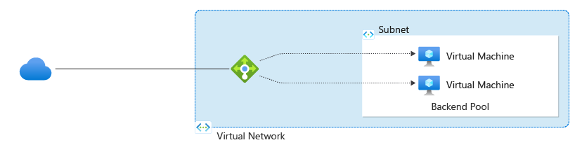

# Well-Architected Framework perspective on Azure Load Balancer

Load balancing is the process of distributing network traffic to a group of two or more backend servers. Azure Load Balancer is an Azure native service that does Layer 4 load-balancing for all UDP and TCP protocols. It ensures low latency and high availability, supporting both regional and global deployments.

This article assumes that as an architect, you've reviewed the [load-balancing options](/azure/architecture/guide/technology-choices/load-balancing-overview) in Azure and chose Azure Load Balancer Manager for your workload, which is designed to support multiple regions. The guidance in this article provides architectural recommendations that are mapped to the principles of the [Well-Architected Framework pillars](../pillars.md).

> [!IMPORTANT]
>
> **How to use this guide**
>
> Each section has a *design checklist* that presents architectural areas of concern and design strategies that are localized to the technology scope. 
>
> This article also includes *recommendations* on the technology capabilities that help materialize those strategies. The recommendations don't represent an exhaustive list of all configurations available for Azure Load Balancer and its dependencies. Instead, they list the key recommendations mapped to the design perspectives. Use the recommendations to build your proof-of-concept or optimize your existing environments. 
>
> Foundational architecture that demonstrates the key recommendations: [**Virtual Machines baseline architecture**](/azure/architecture/virtual-machines/baseline).

**Technology scope**

- Azure Load Balancer

The guidance is focused the Standard Load Balancer SKU. Basic Load Balancer and Gateway Load Balancer SKUs are out of scope for this article. 

> [!NOTE]
>
> For HTTP applications, Application Gateway or Front Door might be a natural choice. These services handle load balancing and also provide features like Web Application Firewall (WAF) and TLS termination.
>
> For more information, see:
>
> - [Well-Architected Framework perspective on Azure Front Door](./azure-front-door.md)
> - [Well-Architected Framework perspective on Azure Application Gateway Door](./azure-application-gateway.md)

## Reliability

The purpose of the Reliability pillar is to provide continued functionality by **building enough resilience and the ability
to recover fast from failures**.

[Reliability design principles](/azure/well-architected/resiliency/principles) provide a high-level design strategy applied for individual components, system flows, and the system as a whole.

### Design checklist

Start your design strategy based on the [**design review checklist for Reliability**](../reliability/checklist.md). Determine the relevance of the Azure Load Balancer to your business requirements, keeping in mind its offered tiers and features of VMs. Extend the strategy to include more approaches as needed.

> [!div class="checklist"]
>
> - **Understand the impact Microsoft-backed guarantees**. Similar to other components in the architecture, Service Level Agreements (SLA) should be factored into the reliability target of the workload. However, there are some caveats.
>   
>    A minute is considered unavailable if all healthy backend servers have no connectivity through the load-balanced endpoint for the entire minute. If one or more requests fail but a subsequent request succeeds within the same minute, that minute is not counted as downtime.  
> 
>   Also, downtime does not include minutes caused by SNAT port exhaustion. Ensure your workload is configured to handle the expected number of connections and open ports accordingly.
> - **Support zone redundancy in your workload architecture**. Standard Load Balancer is the recommended SKU. It has reliability features, such as support availability zones, ability to distribute traffic across multiple regions, and handles more instances in the backend pool. These feature help withstand failures at zonal, regional, or individual VM instance level. However, be aware of the limitations, such as maximum back end pool size.
>
>   >[!NOTE]
>   >For Load Balancer, you manage the number of VMs being load balanced, but not the number of instances of Load Balancer itself. A Load Balancer can be configured to be zone-redundant. Or, it can be pinned to a zone if the workload needs to collocate VMs in a single zone. The front-end IP configuration (zonal or multi-zone) dictates the load balancing redundancy.
>
> - **Support regional redundancy in your workload architecture**. Azure Load Balancer can be configured to be a global load balancer. In this setup, Load Balancer has a static anycast public IP address that's broadcasted multiple regions. When clients request this IP address, their requests are routed to the closest server instance. Load Balancer connects to regional load balancers to distribute traffic efficiently.
>
> - **Evaluate changes in your networking stack to support reliable scaling**. Consider scaling out the backend pool using autoscale rules. Be aware of potential SNAT port exhaustion for outbound traffic. To address this, use NAT Gateway for easier configuration, though it lacks availability zone redundancy. Alternatively, use Azure Load Balancer for added zone redundancy. For more information, see [Outbound connections](/azure/load-balancer/load-balancer-outbound-connections). 
>
> - **Mitigate potential failures**. Do failure mode analysis and identify mitigations.
>
>   |Failure|Mitigation|
>   |---|---|
>   |Traffic gets routed to unhealthy application instances.|Monitor workload instance health. Implement HTTP health probes that include checks for workload dependencies.|
>   |Traffic is routed to a region experiencing outage.|Deploy additional instances in another region and introduce a global load balancer to redirect traffic to the new region.|
>   |The workload's user base was expanded to support users in a new region, and they are seeing high latency. Application starts experiencing high number of timeouts and failures.|Deploy additional instances in a new region and add them in the service configuration. As a global load balancer, Azure Load Balancer will route traffic closer to the users.|
>
> - **Route traffic to healthy instances**. You can use HTTP or TCP for health probes. Consider creating an HTTP endpoint for health checks, even for non-HTTP apps, provides richer status responses. This is especially useful for checking dependencies and databases. Without HTTP probes, the load balancer relies on TCP connections, which might not always accurately reflect VM health. 
>   
>   The health probe can be configured on the service, for more information, see [Design guidance on health probes](/azure/load-balancer/load-balancer-custom-probe-overview#design-guidance).

#### Recommendations

| Recommendation | Benefit |
| ----- | ----- |
|**Select Standard Load Balancer** as the service SKU.   For more information, see [SKU comparison](/azure/load-balancer/skus).|The recommended SKU supports reliability features such as availability zones and multi-region load balancing. |
| [**Configure rules**](/azure/load-balancer/components#load-balancer-rules) to map the frontend IP address to the backend servers' IP addresses to enable load balancing.   The backend address pool should have at least two backend endpoints to load balance for redundancy.|Rules are the core of load balancing algorithm. Without this configuration, the distribution modes are disabled.|
| **Configure [health probes](/azure/load-balancer/load-balancer-custom-probe-overview#probe-configuration)**.    - Set the probing interval and threshold values. Consider the tradeoff between how fast you can detect failures and the number of requests to the endpoint.  - Evaluate if you want to send traffic to the instances, when all instances are reported as unhealthy. This configuration may be useful in implementing a graceful degradation experience. For details, see [AllProbedUp](/rest/api/load-balancer/load-balancer-probes/list#probenohealthybackendsbehavior). | Only healthy backend pool instances receive new connections. This helps maintain high availability and reliability by automatically routing traffic away from unhealthy instances.|
| Configure IP address to be [zone redundant](/azure/reliability/reliability-load-balancer#availability-zone-support), whether it's a private or public IP. The IP address determines the zone redundancy of Azure Load Balancer balancer. | Zone redundancy allows the workload to withstand zonal failures; When one zone fails, services can fail over to one of the remaining zones. |

## Security

The purpose of the Security pillar is to provide **confidentiality, integrity, and availability** guarantees to the workload.

The [Security design principles](../security/principles.md) provide a high-level design strategy for achieving those goals by applying approaches to the technical design of Azure Load Balancer.

### Design checklist

Start your design strategy based on the [**design review checklist for Security**](../security/checklist.md) and identify vulnerabilities and controls to improve the security posture. Extend the strategy to include more approaches as needed.

> [!div class="checklist"]
>
> - **Review security baselines**. To enhance the security posture of your application that's loaded balanced by Azure Load Balancer, review the [**security baseline for Azure Load Balancer**](/security/benchmark/azure/baselines/azure-load-balancer-security-baseline).
>
> - **Protect the backend servers**. Deploy resources in a VNet without direct internet exposure. Front the VNet with a load balancer. It's preferred that the load balancer has firewall capabilities. For HTTP applications, Azure Application Gateway or Front Door are frequently used. For non-HTTP applications, consider Azure Load Balancer with a private IP (internal load balancer) and route traffic through Azure Firewall for added security. For more information, see [Integrate Azure Firewall with Azure Standard Load Balancer: Internal load balancer](/azure/firewall/integrate-lb#internal-load-balancer).  
>
>   Azure Load Balancer can also be used as a reverse proxy. In this case, the load balancer has a public IP with Source Network Address Translation (SNAT) that exposes resources while masking the their IP addresses.
>
>   >[!NOTE]
>   > To filter traffic to backend servers, use Network Security Groups (NSGs) on the subnets that contain the frontend and backend, not the Load Balancer. The source and destination ports and address ranges applied when enforcing the NSG are from the originating and destination computers, not the load balancer. 
>
> - **Design for private connectivity**. Azure Load Balancer works with the Private Link service. If you have application resources spread across VNets, you can connect resources in different VNets by either peering the VNets or using Private Link in front of the internal load balancer. The Private Link option provides secure access without needing a public IP and restricts access from non-peered networks. 
>
>   Private Links can be authorized using [role-based access control](/azure/private-link/rbac-permissions) to restrict access to only the identities that need it.
>
> - **Protect from threats at the network edge**. For designs that use Azure Load Balancer as the point of entry, implement traffic inspection at the endpoint level. Because there are no built-in security features like a Web Application Firewall (WAF), securing HTTP applications requires additional measures. or more information, see [Integrate Azure Firewall with Azure Standard Load Balancer: Public load balancer](/azure/firewall/integrate-lb#public-load-balancer).
>
>     Protect the load balancer endpoints from DDoS attacks. 
> 
> - **Encrypt network traffic**. Azure Load Balancer works at Layer 4 and fully supports load balancing TCP and UDP traffic.  Azure Load Balancer doesn't support SSL/TLS termination. For HTTPS load balancing at the application layer, use Azure Application Gateway.

#### Recommendations

| Recommendation | Benefit |
| ----- | ----- |
| [**Configure the FrontEnd IP address to a private IP address in a VNet**.](/azure/load-balancer/components#frontend-ip-configurations) | This approach is a security measure ensuring the frontend IP address and virtual network remain isolated from direct internet exposure. So, the internal load balancer is safeguarded from accepting any incoming traffic from the internet, reducing potential attack vectors. |
|[**Protect public Load Balancer with DDoS protection**](/azure/load-balancer/tutorial-protect-load-balancer-ddos).| With DDoS Protection plan, you can use its advanced protection and detection capabilities that monitor the endpoint for threats and signs of abuse.|

## Cost Optimization

Cost Optimization focuses on **detecting spend patterns, prioritizing investments in critical areas, and optimizing in others** to meet the organization's budget while meeting business requirements.

The [Cost Optimization design principles](../cost-optimization/principles.md) provide a high-level design strategy for achieving those goals and making tradeoffs as necessary in the technical design related to Azure Load Balancer and its environment.

#### Design checklist

Start your design strategy based on the [design review checklist for Cost Optimization](../cost-optimization/checklist.md) for investments and fine tune the design so that the workload is aligned with the budget allocated for the workload. Your design should use the right Azure capabilities, monitor investments, and find opportunities to optimize over time.

> [!div class="checklist"]
>
> - **Factor in load balancing expenses in your cost model**. Consider the primary factors: the amount of data processed by Azure Load Balancer, and the number of load balancing rules (both inbound and outbound) in place. For more accurate cost estimation, use traffic logs to gauge your traffic needs, both inbound and outbound. 
> 
> - **Set controls on spend**. Log and analyze cost from Azure Load Balancer (ALB). Use [Azure Cost Management and Billing](/azure/cost-management-billing/costs/overview-cost-management) to [create budgets](/azure/cost-management-billing/costs/tutorial-acm-create-budgets) and configure alerts to manage costs effectively. Be aware that costs can accumulate based on the amount of data logged and storage duration, affecting both bandwidth and storage expenses.
>
> - **Remove unused resources**. Identify and eliminate unused load balancer instances. Analyze logs to evaluate usage. Delete load balancer instances that aren't associated with backend VMs. Also, evaluate underutilized resources by examining traffic logs.
>
> - **Optimize flow costs**. Use efficient protocols and data compression to lower the load on the traffic flow and accrue costs. 
>
>   You can optimize costs by reducing the number of rules. Instead having rules that use individual IP addresses and ports for each endpoint, define a rule for a range of ports in the frontend that connects to a backend pool.
>
>   There are also optimization opportunities in the backend flows. For example, multiple database queries intercepted by a load balancer, will have added cost per query. Instead, consider implementing a stored procedure to consolidate the sequence. 
>
> - **Evaluate the cost of operations**. Consider not just resource expenses but also operational costs like maintenance, scaling, and compliance. Managing load balancer rules is a significant factor, and reducing the number of rules can optimize both financial and management costs.

#### Recommendations

| Recommendation | Benefit |
| ----- | ----- |
|Estimate costs by using [Azure pricing calculator](https://azure.microsoft.com/pricing/details/load-balancer/).|It helps you turn anticipated traffic usage into cost estimates, making it easier to plan and budget.|
|Evaluate the number of rules and reduce them, if possible.   Explore use cases where you can use a range of ports summarized by one rule instead of defining rules for individual IP address.  For example, [inbound NAT rules v2](/azure/load-balancer/inbound-nat-rules) enables you to map IP addresses and ports to a backend pool rather than to individual VMs. | Consolidating rules not only optimizes costs but also simplifies operations.   When scaling up or down, add or remove IPs from the backend pool without needing to change any rules. The rules remain unchanged.|

## Operational Excellence

Operational Excellence primarily focuses on procedures for **development practices, observability, and release management**.

The [Operational Excellence design principles](../operational-excellence/principles.md)
provide a high-level design strategy for achieving those goals for the operational requirements of the workload.

#### Design checklist

Start your design strategy based on the [design review checklist for Operational Excellence](../operational-excellence/checklist.md) for defining processes for observability, testing, and deployment related to Azure Load Balancer.

> [!div class="checklist"]
>
> - **Use Infrastructure-as-code (IaC)**. Deploy and configure Azure Load Balancer along with other networking components like virtual networks, network peerings, private endpoints, and Network Security Groups (NSGs). Familiarize yourself with [Microsoft.Network loadbalancers](/azure/templates/microsoft.network/loadbalancers?pivots=deployment-language-bicep).
>
> - **Use layered deployment for hub and spoke architectures**. Deploy the hub first, as it changes less frequently than the workload deployed in the spoke network. Deploy the load balancer with the workload. If reusing a single load balancer across multiple workloads, consider placing it in the hub.
>
> - **Implement a comprehensive networking monitoring system**. Include diagnostic capabilities like multi-dimensional metrics for real-time insights and alerts, resource logs based on the Health Event Schema, and the Azure Monitor Insight dashboard for comprehensive load balancer monitoring.

#### Recommendations

| Recommendation | Benefit |
| ----- | ----- |
| Use [Multi-dimensional metrics](/azure/load-balancer/load-balancer-standard-diagnostics#multi-dimensional-metrics).   To minimize noisy alerts, configure them with the Aggregation type set to `Average`, using a five-minute data window and a 95% threshold. For details, see [Configure alerts for multi-dimensional metrics](/azure/load-balancer/load-balancer-standard-diagnostics#configure-alerts-for-multi-dimensional-metrics). Review the examples for Inbound and Outbound Availability.| Comprehensive real-time insights and alert configuration gives you the ability to detect and respond to issues promptly. |
| Capture resource logs. Load Balancer entries depend on the [Health Event Schema](/azure/azure-monitor/reference/tables/albhealthevent). | Logs provide detailed records of events, helping to quickly identify and resolve issues|
| Use the built-in [Azure Monitor Insight dashboard for Load Balancer](/azure/load-balancer/load-balancer-insights). | Visualization enables you to make well-informed design choices and quickly identify, diagnose, and fix any issues.|
| During maintenance operations, when you need to take a backend instance out of rotation without disrupting existing connections, set the [Admin state](/azure/load-balancer/admin-state-overview) to Down to ensure that no new connections are forwarded to the backend instance, while existing connections are gracefully terminated.| Admin State helps reduce the overhead and complexity needed to take a VM out of the load balancing rotation for usual maintenance, or patching. Otherwise, to take a backend instance out of rotation, a Network Security Groups (NSGs) could be applied to block traffic from Azure Load Balancer’s health probe or the client’s IPs and ports, which is more complex|

## Performance Efficiency

Performance Efficiency is about **maintaining user experience even when there's an increase in load** by managing capacity. The strategy includes scaling resources, identifying and optimizing potential bottlenecks, and optimizing for peak performance.

The [Performance Efficiency design principles](../performance-efficiency/principles.md) provide a high-level design strategy for achieving those capacity goals against the expected usage.

#### Design checklist

Start your design strategy based on the [design review checklist for Performance Efficiency](../performance-efficiency/checklist.md) for defining a baseline based on key performance indicators for Azure Load Balancer.

> [!div class="checklist"]
>
> - **Determine the network performance targets**. The load balancer has no limit on the traffic it can support. However, when defining performance targets and capacity planning, it's important to test network performance. 
>
>   Stress testing is a common practice to understand the workload's bandwidth requirements. Include the load balancer in those tests. If a single virtual machine scale set with multiple VMs isn't sufficient, you might add another scale set with the same load balancer. If the VMs aren't receiving requests quickly enough, you may need to adjust the networking components, such as adding more load balancers. Also, consider making design changes and optimizing your workload rather than changing the load balancer itself.
>   
> - **Understand the limits when designing your scaling strategy**. To meet performance requirements, you can scale your workload by adding or removing VMs from the backend pool. A single backend pool in a Standard Load Balancer can handle up to 5,000 VMs.
>
>   Load Balancer doesn't apply any throughput limits. However, throughput limits for virtual machines and virtual networks still apply. For more information, see[ Virtual machine network bandwidth](/azure/virtual-network/virtual-machine-network-throughput).
>  
> - **Serve requests quicker**. Standard Load Balancer has a tier that routes traffic to backend endpoints based on their geographic proximity to the user.
> 
>   Load Balancer also supports load distribution based on session persistence. When enabled, requests from the same client are directed to the backend server, persisted in previous sessions.
>
> - **Collect data to analyze performance**. Azure Load Balancer offers [multidimensional metrics](/azure/load-balancer/load-balancer-standard-diagnostics#multi-dimensional-metrics) that help analyze the service's performance. You can configure alerts to detect performance changes and visualize status using tools like the [Azure Monitor Insight dashboard](/azure/load-balancer/load-balancer-insights). Additionally, ensure the health status of standard published through Resource Health and stay up to date about performance issues and outages.
>
> - **Optimize network traffic**. Avoid processing the same data multiple times in separate steps. Instead, perform all necessary calculations in a batch, and then persist the data. This approach reduces latency and minimizes network traffic, improving overall performance.

#### Recommendations

| Recommendation | Benefit |
| ----- | ----- |
| Select the [Global Tier in Standard Load Balancer](/azure/load-balancer/cross-region-overview), when users are global.| This tier's geo-proximity distribution mode improves performance by serving user requests from endpoints in the nearest region. |
|Evaluate whether you should enable [session persistence](/azure/load-balancer/distribution-mode-concepts#session-persistence) when requests from the same user should be directed to the same back-end server.    From a reliability perspective, we don't recommend this approach. If you use this option, the application should gracefully recover without disrupting user sessions.    There's also a tradeoff on load balancing because it restricts the flexibility of distributing traffic across multiple backends evenly.| Optimize performance and maintain continuity for user sessions, especially when applications rely on maintaining state information locally.
|During scale-out, send a [probe down signal](/azure/load-balancer/load-balancer-custom-probe-overview#probe-down-behavior) until the application is fully initialized and ready to handle requests. Conversely, during scale-in, send probe down signal on new connections on the endpoint, which is being scaled back. Pending requests on existing connections continue to be processed.|Health probes can help in scaling operations. During scale-out, you're able to ensure that the application is ready to  handle the incoming load. Before a scale-in operation, the number of instances can be gracefully reduced without disrupting ongoing operations.|

## Azure policies

Azure provides an extensive set of built-in policies related to Azure Load Balancer and its dependencies. Some of the preceding recommendations can be audited through Azure Policies. For example, you can check whether:

- Load balancers (other than Basic SKU) have resiliency features from public IP addresses used their frontend. 
- Resource logs are enabled to track activities and events, which  take place on your resources and give you visibility and insights into any changes that occur. 

For comprehensive governance, review the [built-in definitions](/azure/governance/policy/samples/built-in-policies).

## Azure Advisor recommendations

Azure Advisor is a personalized cloud consultant that helps you follow best practices to optimize your Azure deployments. Advisor recommendations are aligned with Well-Architected Framework pillars. 

For more information, see the recommendations in [Azure Advisor](/azure/advisor/).

## Related resources

Consider these articles as supplementary resources that describe the recommendations highlighted in this article.

- Use the following reference architectures as examples of how you can apply this article's guidance to a workload:
   - [Virtual Machines baseline architecture](/azure/architecture/virtual-machines/baseline)
- Build implementation expertise by using the following product documentation:
   - [Azure Load Balancer documentation](/azure/load-balancer/)
