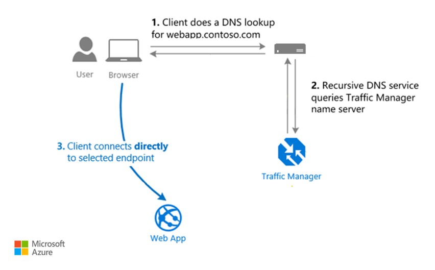

# Architecture best practices for Azure Traffic Manager

Azure Traffic Manager is a global load balancer that can distribute traffic across multiple Azure regions, zones within a region, or datacenters within those zones. It uses the Domain Name System (DNS) protocol to establish a communication path between a client and your workload's endpoints. After the connection is established, clients can connect directly to the endpoint without the help of Traffic Manager. 

This article assumes that as an architect, you've reviewed the [load-balancing options in Azure](/azure/architecture/guide/technology-choices/load-balancing-overview) and chose Azure Traffic Manager for your workload, which is deployed across multiple regions in either an active-active or active-passive model. The guidance in this article provides architectural recommendations that are mapped to the principles of the [Well-Architected Framework pillars](../pillars.md).

**Technology scope**

This review focuses on the interrelated decisions for the following Azure resource:  

- Traffic Manager

> [!NOTE]
>
> For workloads that host HTTP applications, Azure Front Door is a natural choice because of its features, such as a content delivery network, Transport Layer Security (TLS) termination, and an integrated firewall. 
>
> Compared to Azure Front Door, Traffic Manager is easier to set up, configure, and maintain. Traffic Manager doesn't have an endpoint that you can control directly. Unlike Front Door, which handles client requests, Traffic Manager only connects clients to a workload's endpoint.
>
> But this simplicity comes with tradeoffs that can introduce complexities in an architecture. For instance, you might need to implement extra security measures to block Open Worldwide Application Security Project (OWASP) attack types. A Web Application Firewall (WAF) in Azure Front Door or Azure Application Gateway provides this capability. Or you might add a cache, which can speed up content delivery but adds complexity because you must manage a data store.
>
> For more information, see [Well-Architected Framework perspective on Azure Front Door](./azure-front-door.md).

## Reliability

The purpose of the Reliability pillar is to provide continued functionality by **building enough resilience and the ability to recover fast from failures.**

[Reliability design principles](../reliability/principles.md) provide a high-level design strategy applied for individual components, system flows, and the system as a whole.

### Workload design checklist

Start your design strategy based on the [design review checklist for Reliability](../reliability/checklist.md). Determine its relevance to your business requirements while keeping in mind the nature of your application and the criticality of its components. Extend the strategy to include more approaches as needed.

> [!div class="checklist"]
>
> - **Account for potential failures.** Traffic Manager is designed to be resilient. But it can still be a single point of failure for your workload. To mitigate this risk, define a secondary path to an alternate service that becomes active if Traffic Manager is unavailable. To avoid routing problems, don't use Traffic Manager and the alternate service together.
>
> - **Have a good understanding of service-level agreement (SLA) coverage.** When you evaluate [Traffic Manager SLAs](https://www.azure.cn/en-us/support/sla/traffic-manager/), understand the coverage related to the published percentile. For example, SLA ensures all DNS queries consistently resolve to healthy endpoints with zero tolerance for DNS failures. However, your DNS lookups might fail multiple times. Those failures aren't considered downtime until a full minute of continuous DNS lookup failures occur.
>
> - **Incorporate redundancy in your workload architecture.** If your service is exposed through a public IP address, use Traffic Manager to implement redundancy across Azure regions, on-premises, and other clouds. For example, you might have an on-premises application that has a secondary instance in the cloud. If the on-premises system fails, the cloud instance can become active, which helps ensure continuity.
>
> - **Use a reliable deployment architecture to support redundancy.** As a load balancer, Traffic Manager distributes traffic across workload endpoints based on how you configure its routing method. You define this configuration in a Traffic Manager profile. The profile is a core component of your deployment strategy. You can use the appropriate profile configuration to implement an active-active model or an active-passive model that has a warm spare.
>
>   Each profile specifies a single traffic-routing method. Some scenarios require more sophisticated traffic routing. You can combine Traffic Manager profiles to take advantage of more than one traffic-routing method. 
>
>   For more information, see [Traffic Manager routing methods](/azure/traffic-manager/traffic-manager-routing-methods).
>
> - **Evaluate the caching duration of DNS responses.** The time-to-live (TTL) setting for DNS lookups in Traffic Manager determines how long downstream DNS resolvers cache DNS responses. The default TTL might result in longer caching times than necessary, potentially causing downtime if an endpoint fails. Reduce the TTL to increase the frequency of cache updates. This method can help mitigate downtime but increases the frequency of DNS lookups.
>
> - **Avoid sending traffic to unhealthy or compromised instances.** Review the built-in health probing features in Traffic Manager.
>
>   For HTTPS and HTTP applications, implement the Health Endpoint Monitoring pattern to provide a custom page within your application. Based on specific checks, the page returns an appropriate HTTPS status code. In addition to the availability of the endpoint, your health check should monitor all dependencies of your application. Don't report errors for services where your workload performs graceful degradation or recovery automatically. Otherwise, the health probe might trigger failover when it's not needed.
>
>   For other applications, Traffic Manager uses the Transmission Control Protocol (TCP) to determine the availability of the endpoint.
>
>   After a Traffic Manager failover, have a process where you verify that all workload subsystems are healthy before manually failing back. Otherwise, you might create a situation where the application flips back and forth between back ends.
>
>   For more information, see [Health Endpoint Monitoring pattern](/azure/architecture/patterns/health-endpoint-monitoring) and [Understand Traffic Manager probes](/azure/traffic-manager/traffic-manager-troubleshooting-degraded#understanding-traffic-manager-probes).
>
> - **Determine your outage tolerance.** If a back end becomes unavailable, some time can pass before Traffic Manager recognizes the failure and stops directing traffic to the unavailable endpoint. There's a period of time when client requests can't be served. Use this tolerance to configure probe settings, which determine how quickly you want to start your business-continuity operations.
>
> - **Include the endpoints as part of your resiliency testing.** Simulate unavailable endpoints to see how Traffic Manager handles failures. Suppose your workload uses a load balancer like Application Gateway in a private virtual network. You can use network security group (NSG) rules in Azure Chaos Studio to simulate failures of the endpoint. You can block access to the subnet where Application Gateway resides.

### Configuration recommendations

| Recommendation | Benefit |
| ----- | ----- |
| [Deploy multiple endpoints](/azure/traffic-manager/traffic-manager-endpoint-types) in the Traffic Manager profiles, and enable them. If an endpoint isn't enabled, it's not probed for health checks or included in the traffic-routing rotation. Place these endpoints in different regions. | Redundant instances help ensure availability if one endpoint fails.|
| Evaluate the various [traffic-routing methods](/azure/traffic-manager/traffic-manager-routing-methods). Configure one or a combination of methods to align with your deployment strategy. Traffic Manager applies the chosen method to each DNS query and uses the method to determine which endpoint is returned in the DNS response.    - The [weighted method](/azure/traffic-manager/traffic-manager-routing-methods#weighted-traffic-routing-method) distributes traffic based on the configured weight coefficient. This method supports active-active models.   - The [priority-based method](/azure/traffic-manager/traffic-manager-routing-methods#priority-traffic-routing-method) configures the primary region to receive traffic and send it to the secondary region as a backup. This method supports active-passive models.  - The [geographic method](/azure/traffic-manager/traffic-manager-routing-methods#geographic-traffic-routing-method) routes traffic based on the geographic origin of the DNS query. To cover all regions, configure at least one endpoint with the [All (World)](/azure/advisor/advisor-reference-reliability-recommendations#add-an-endpoint-configured-to-all-world) property.| An optimized routing method helps ensure that you distribute traffic efficiently across your endpoints.    You can support your active-active or active-passive deployment model goals. An efficient routing method helps ensure that secondary regions can handle traffic or act as a backup.    Geographical routing helps direct users to the nearest endpoint based on their location. It helps ensure that traffic is efficiently managed and not lost.|
|Set the [DNS TTL interval](/azure/traffic-manager/traffic-manager-faqs#what-is-dns-ttl-and-how-does-it-impact-my-users) duration to a low value, preferably less than 60 seconds. To optimize performance, adjust the health probe timing and the DNS record TTL. | A low TTL duration helps ensure more frequent downstream DNS resolver cache updates and quicker failover. It also minimizes downtime and improves the overall responsiveness of your application. |
|Set up health probes to [monitor the endpoint](/azure/traffic-manager/traffic-manager-monitoring).    - Don't enable `AlwaysServe`, which disables endpoint monitoring and sends requests to the endpoint, regardless of its health state.  - Set the `probing interval` value. Consider the tradeoff between how fast you can detect failures and the number of requests to the endpoint. The number of requests can be substantial because Traffic Manager is a global service that pings simultaneously from various locations.  - Set the `probe timeout` value. Consider how long to wait before declaring the endpoint unhealthy. Include false positives in the number of failures.|Health probes make sure that only healthy instances serve user requests. They also help determine whether failures are nontransient and how quickly failover operations should take place.|

## Security

The purpose of the Security pillar is to provide **confidentiality, integrity, and availability** guarantees to the workload.

The [Security design principles](../security/principles.md) provide a high-level design strategy for achieving those goals by applying approaches to the technical design of Traffic Manager.

### Workload design checklist

> [!div class="checklist"]
>
> - **Review security baselines.** To enhance your security posture, review the [security baseline for Traffic Manager](/security/benchmark/azure/baselines/traffic-manager-security-baseline).
>
> - **Prevent unauthorized modification of traffic routing.** Treat Traffic Manager profiles as critical workload resources because they contain the configuration settings for routing traffic. Only authorized identities should have access to these profiles. Implement [role-based access control (RBAC)](/azure/role-based-access-control/overview) on the control plane to restrict tasks like creating, deleting, or modifying resources. Only authorized identities should have the authority to enable or disable endpoints. Unauthorized access can result in configuration changes and potentially reroute traffic to malicious implementations.
>
> - **Protect applications from threats at the network edge.** Traffic Manager doesn't provide built-in security features, like a WAF. To help secure HTTP applications, you should implement traffic inspection at the endpoint level. 
>
>   A typical architecture might include Traffic Manager and multiple endpoints. For each endpoint, an application gateway that handles TLS termination and other security functions provides protection. For a reference architecture that demonstrates that pattern, see [Multiregion load balancing with Traffic Manager, Azure Firewall, and Application Gateway](/azure/architecture/high-availability/reference-architecture-traffic-manager-application-gateway).
>
> - **Harden DNS entries.** Traffic Manager can be susceptible to attacks that manipulate DNS data, which can redirect traffic to malicious sites and cause security problems. A common threat is a subdomain takeover, in which a DNS record points to a deprovisioned Azure resource. To prevent subdomain takeovers, use Azure DNS alias records and couple the lifecycle of a DNS record with an Azure resource. 
>
>   For more information, see [Prevent dangling DNS entries](/azure/security/fundamentals/subdomain-takeover#prevent-dangling-dns-entries).

### Configuration recommendations

| Recommendation | Benefit |
| ----- | ----- |
|[Add application gateways to the workload endpoints](/azure/traffic-manager/traffic-manager-load-balancing-azure#step-3-add-application-gateways-to-the-traffic-manager-endpoints).   To implement security inspection with a firewall for HTTP applications, add application gateways to the workload endpoints.| You can inspect inbound HTTP traffic to help protect the application from common attacks.|
[Create an alias record](/azure/dns/tutorial-alias-tm) in Azure DNS for your workload's apex domain name to reference a Traffic Manager profile. | Alias records tightly couple the lifecycle of a DNS record with an Azure resource. This configuration helps prevent dangling references if the workload is decommissioned. If the Traffic Manager profile is deleted, the DNS alias record becomes an empty record set. It no longer references the deleted resource.|

## Cost Optimization

Cost Optimization focuses on **detecting spend patterns, prioritizing investments in critical areas, and optimizing in others** to meet the organization's budget while meeting business requirements.

The [Cost Optimization design principles](../cost-optimization/principles.md) provide a high-level design strategy for achieving those goals and making tradeoffs as necessary in the technical design related to Traffic Manager and its environment.

### Workload design checklist

Start your design strategy based on the [design review checklist for Cost Optimization](../cost-optimization/checklist.md) for investments. Fine-tune the design so that the workload is aligned with the budget that's allocated for the workload. Your design should use the right Azure capabilities, monitor investments, and find opportunities to optimize over time.

> [!div class="checklist"]
>
> - **Evaluate the cost of features.** The traffic view dashboard feature shows where your clients connect from and the associated latency. This information helps optimize performance and refine your design, which contributes to operational excellence and system efficiency. However, it incurs extra costs. For more information, see [Traffic view billing](/azure/traffic-manager/traffic-manager-faqs#how-does-traffic-view-billing-work).
>
>   Also consider the cost associated with health probes. Traffic Manager pings your defined endpoints from various locations to check their availability. You can choose slow pings and fast pings. Fast pings detect failures quicker but incur higher costs. They also add more load on the workload because health checks are more frequent.
>
> - **Evaluate the cost of your routing strategy.** For example, if most clients access your endpoint from a high-latency region, you could create another endpoint closer to those users and adjust the routing method in Traffic Manager. This practice reduces latency so that you can process more requests with less capacity, which leads to cost savings.
  
### Configuration recommendations

| Recommendation | Benefit |
| ----- | ----- |
|Use the [pricing calculator](https://azure.microsoft.com/pricing/details/traffic-manager/) to estimate costs of Traffic Manager features.| You can have a more accurate cost model and set governance around resources, if necessary.|
|Enable the [traffic view dashboard](/azure/traffic-manager/traffic-manager-traffic-view-overview) during your optimization efforts. |The feature helps you better understand usage patterns. Use this data for performance tuning to help meet your workload targets.    Enable features at the right time, and apply the right tier to avoid underusing resources.
|Choose between fast or slow pings for [health probes](/azure/traffic-manager/traffic-manager-monitoring), depending on your recovery metrics.   Fast pings detect failures quicker but cost more. Slow pings are slower but cost less.   Don't disable pings.| Ping less frequently to optimize cost and reduce the load on workload endpoints.| 

## Operational Excellence

Operational Excellence primarily focuses on procedures for **development practices, observability, and release management.**

The [Operational Excellence design principles](../operational-excellence/principles.md) provide a high-level design strategy for achieving those goals for the operational requirements of the workload.

### Workload design checklist

> [!div class="checklist"]
>
> - **Collect and analyze operational data as part of your workload monitoring.** Capture relevant Traffic Manager logs and metrics. Use this data to troubleshoot, understand traffic behaviors, and fine-tune routing logic. 
>
> - **View traffic data for profiles.** This data helps pinpoint areas for improvement, like expanding your Azure presence in high-latency regions. It also highlights traffic patterns across different regions to help you determine where to increase or decrease investment.
>
> - **Implement disaster recovery operations**. Your disaster recovery implementation can be designed to reroute network/web traffic from the main site to a backup site. This disaster recovery method can be implemented using Azure DNS and Azure Traffic Manager (DNS). In the event of a disaster, if the primary endpoint becomes degraded, Traffic Manager redirects traffic to a healthy secondary endpoint. By default, Traffic Manager gives priority to the primary endpoint, but it can also be set up with extra failover endpoints or load balancers to distribute the traffic load. For more information, see [Set up disaster recovery and outage detection](/azure/reliability/reliability-traffic-manager#set-up-disaster-recovery-and-outage-detection).
>
> - **Avoid automatic-failback operations.** When you do a failback, don't use automatic failback, which immediately switches back to the original endpoint in the primary when it's available. Instead, disable the original endpoint, and use the secondary endpoint until you want to switch. This approach provides time for stabilization. Immediate failback can create extra load and delays.
>
>   For more information, see [Multiregion load balancing reference architecture](/azure/architecture/reference-architectures/n-tier/multi-region-sql-server).
>
> - **Test configuration settings.** Misconfigurations can affect all aspects of the workload, especially reliability. Test the configurations with multiple clients at various locations. For more information, see [Verify Traffic Manager settings](/azure/traffic-manager/traffic-manager-testing-settings).

### Configuration recommendations

| Recommendation | Benefit |
| ----- | ----- |
|[Enable diagnostic logs](/azure/traffic-manager/traffic-manager-diagnostic-logs) for a Traffic Manager profile.    Use [tools](/azure/traffic-manager/traffic-manager-troubleshooting-degraded#troubleshooting) to replay logs and analyze the health check data.| Diagnostic logs provide insights about the behavior of the Traffic Manager profile. For example, you can identify the reasons for individual probe time-outs against an endpoint.|
|Enable the [traffic view dashboard](/azure/traffic-manager/traffic-manager-traffic-view-overview). Get insights about where your clients connect from and the associated latency.|This information helps optimize performance and cost because you can refine your design.|
|Take advantage of the [Heat Map REST API](/rest/api/trafficmanager/heat-map), which provides data about client locations and latency.|This approach offers flexibility, such as setting a specific time period. You can add data to custom tooling or dashboards. You can also use this API to integrate with external tools.|
|[Disable the endpoints for operational activities](/azure/traffic-manager/traffic-manager-endpoint-types#enabling-and-disabling-endpoints). For example, you might disable failback after a failover to do maintenance or testing.|Disabling the endpoint from the load balancer is beneficial for operational tasks because you can't stop live traffic. During maintenance, instances don't receive traffic if you disable the endpoint. This approach prevents automatic failback. |

## Performance Efficiency

Performance Efficiency is about **maintaining user experience even when there's an increase in load** by managing capacity. The strategy includes scaling resources, identifying and optimizing potential bottlenecks, and optimizing for peak performance.

The [Performance Efficiency design principles](../performance-efficiency/principles.md) provide a high-level design strategy for achieving those capacity goals against the expected usage.

### Workload design checklist

Start your design strategy based on the [design review checklist for Performance Efficiency](../performance-efficiency/checklist.md). Define a baseline that's based on key performance indicators for Traffic Manager.

> [!div class="checklist"]
>
> - **Measure the performance impact of your configuration.** Traffic Manager doesn't interfere with the direct connection between the client and your endpoint. The main performance impact is the initial DNS lookup. The TTL setting affects how often this lookup occurs. A lower TTL means more frequent DNS resolutions, which can slightly affect performance. If you set the TTL to zero, every request requires a DNS lookup, which adds a small delay before accessing the endpoint.
>
>   Because Traffic Manager operates at the DNS level, it doesn't support session affinity. Traffic Manager might direct users to different endpoints for each call. If you need session affinity, you must persist state to a separate data store.
>
>   For more information, see [Performance considerations for Traffic Manager](/azure/traffic-manager/traffic-manager-performance-considerations).
>
> - **Adjust traffic-routing behavior to optimize performance.** A single profile can have multiple endpoints, but you can apply only one routing method at a time. 
>
>   For more complex scenarios, consider creating a hierarchy of profiles to combine different routing methods. For example, you might prioritize regions and then use performance-based routing within regions.

### Configuration recommendations

| Recommendation | Benefit |
| ----- | ----- |
|Use the [performance routing method](/azure/traffic-manager/traffic-manager-routing-methods#performance-traffic-routing-method) when you have endpoints in different geographic locations.|This method prioritizes sending traffic to the endpoint that has the lowest latency. This method helps ensure fast service for users.|
|Use specialized tools to optimize performance. Measure the performance of your [DNS lookups](/azure/traffic-manager/traffic-manager-performance-considerations#sample-tools-to-measure-dns-performance). To analyze the performance of traffic, use the [traffic view dashboard](/azure/traffic-manager/traffic-manager-traffic-view-overview) or the [Heat Map REST API](/rest/api/trafficmanager/heat-map). |DNS latency measurement tools perform a full DNS lookup and provide performance data. You can use this data to set the TTL duration and optimize performance. |
|Combine traffic methods with [nested profiles](/azure/traffic-manager/traffic-manager-nested-profiles) for optimal performance, as determined by your workload requirements.| An optimized routing method helps ensure that traffic is directed to the most responsive and closest endpoints. This approach helps improve application performance and user experience. |
|[Use the real user measurements feature](/azure/traffic-manager/traffic-manager-rum-overview) to view network latency measurements to Azure regions. This feature is available at no extra cost.| You can make data-driven routing decisions to direct queries to the Azure region that provides the lowest latency.  |
|Set the [DNS TTL interval](/azure/traffic-manager/traffic-manager-faqs#what-is-dns-ttl-and-how-does-it-impact-my-users) to a higher value.| Clients can cache the results for a longer period of time, which reduces the need to resolve DNS each time.

## Azure policies

Azure provides an extensive set of built-in policies related to Traffic Manager and its dependencies. Some of the preceding recommendations can be audited through Azure Policy. For example, you can check whether:

- Resource logs are enabled to track activities.
- Logs for Traffic Manager profiles are sent to Azure Event Hubs.

For comprehensive governance, review the [Azure Policy built-in definitions for Azure networking services](/azure/governance/policy/samples/built-in-policies#network).

## Azure Advisor recommendations

Azure Advisor is a personalized cloud consultant that helps you follow best practices to optimize your Azure deployments.

For more information, see [Azure Advisor](/azure/advisor).

## Tradeoffs

You might have to make design tradeoffs if you use the approaches in the pillar checklists. Here are some examples of advantages and drawbacks.

:::image type="icon" source="../_images/trade-off.svg"::: **Reliability and Performance Efficiency**

- **The TTL setting for DNS lookups.** The default TTL setting can result in longer caching times. Long caching times can cause downtime if an endpoint fails because the application continues to attempt a connection to the failed endpoint for the TTL duration.

    Reduce the TTL to help mitigate this problem. A lower TTL has more frequent updates and quicker failover, but it increases the frequency of DNS lookups. This approach can affect performance and increase the load on DNS servers.

:::image type="icon" source="../_images/trade-off.svg"::: **Reliability and Cost Optimization**

- **Health probes.** Traffic Manager uses health probes to ping your endpoints from various locations to check their availability. You can choose slow pings or fast pings. Fast pings detect failures quicker but add cost. Slow pings take longer to detect failures but cost less. Balance the speed of failure detection and recovery with the associated costs.

## Example architecture

Foundational architecture that demonstrates the key recommendations: [Multiregion load balancing with Traffic Manager, Azure Firewall, and Application Gateway](/azure/architecture/high-availability/reference-architecture-traffic-manager-application-gateway).

## Next step 

Consider the following resources that demonstrate the recommendations in this article.

- Use the following reference architecture as an example of how you can apply this article's guidance to a workload:
  - [Multiregion load balancing with Traffic Manager, Azure Firewall, and Application Gateway](/azure/architecture/high-availability/reference-architecture-traffic-manager-application-gateway)

- Use the following product documentation to improve your implementation expertise:
  - [Traffic Manager](/azure/traffic-manager/)

<!-- Updated: August 17, 2025 for Azure Update 493002 -->
