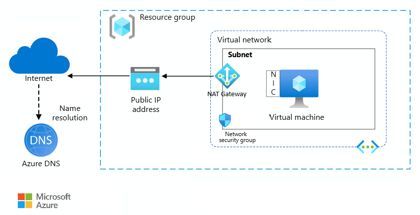

# Architecture best practices for Azure Virtual Network

Azure Virtual Network is a fundamental building block for establishing a private network on Azure. You can use it to enable communication between Azure resources and provide internet connectivity. Virtual Network also integrates with on-premises systems. It includes built-in filtering capabilities to ensure that only expected, allowed, and safe traffic reaches the components within the network boundaries.

This article assumes that as an architect, you'are familiar with the networking constructs on Azure. The guidance is focused on architectural recommendations that are mapped to the principles of the [Well-Architected Framework pillars](../pillars.md).

**Technology scope**

This review focuses on the interrelated decisions for the following Azure resources:

- Virtual Network and its subnets
- Network interface cards (NICs)
- Private endpoints
- Network security groups (NSGs)
- IP addresses and IP address allocations
- Route tables
- Network managers

There are other services associated with Virtual Network, such as load balancers. Those services are covered in their respective guides.

## Reliability

The purpose of the Reliability pillar is to provide continued functionality by **building enough resilience and the ability to recover fast from failures**.

[Reliability design principles](/azure/well-architected/resiliency/principles) provide a high-level design strategy applied for individual components, system flows, and the system as a whole.

### Workload design checklist

Start your design strategy based on the [design review checklist for Reliability](../reliability/checklist.md). Determine its relevance to your business requirements while keeping in mind the nature of your application and the criticality of its components. Extend the strategy to include more approaches as needed.

> [!div class="checklist"]
>
> - **Set your reliability targets**. Virtual Network and most of its subservices don't have Microsoft-backed service-level agreement (SLA) guarantees. However, specific services like load balancers, NICs, and public IP addresses do have SLAs. You should have a good understanding of the coverage provided around the published percentile by Azure. Keep in mind that your central IT services organization typically owns the virtual network and central services. Make sure that your objective calculations include this dependency.
>
> - **Mitigate points of failure**. Do failure mode analysis and identify single points of failure in network connections.
>
>   The following examples show single points of failure in network connections:
>
>     |Failure|Mitigation|
>     |---|---|
>     | Public IP address failure in a single availability zone. | Deploy IP address resources across zones or use a secondary IP address with a load balancer.|
>     | Network virtual appliance (NVA) failure in a single zone. | Deploy a secondary NVA in another zone and use a load balancer to direct traffic to the NVA. |
>     | Latency in workloads that are spread across regions or zones, which lowers throughput and causes time-outs.|Co-locate resources in one region or zone. Redesign the architecture to use reliability patterns, such as deployment stamps with load balancers, so that each stamp can handle the load and work together with nearby resources.|
>     | Single-region workload failure with a cold failover site.| Pre-configure network settings in the failover region. This approach ensures that no IP addresses overlap.|
>     | Single-region application failure in a virtual network that communicates with a database via Azure Private Link by using a cold failover site.| Replicate connections in the secondary region and peer virtual networks for communication.|
>
> - **Overprovision IP address spaces**. To help ensure reliable scaling, a common strategy is to overprovision capacity to prevent IP-address exhaustion. However, this approach has a trade-off between reliability and operational efficiency. Subnets should only use a portion of the virtual network's address space. The goal should be to have only enough extra address space in your virtual network and subnets to balance reliability with operational efficiency.
>
> - **Be aware of the networking limits**. Azure imposes limits on the number of resources that you can deploy. While most Azure networking limits are set to their maximum values, you can increase some limits. For more information, see [Azure Resource Manager networking limits](/azure/azure-resource-manager/management/azure-subscription-service-limits#networking-limits).
>
> - **Create network diagrams that focus on user flows**. These diagrams can help you visualize network segmentation, identify potential points of failure, and pinpoint key transitions like internet ingress and egress points. They're also important tools for audits and incident response.
>
>   Highlight high-priority traffic flows between the user and workload resources. For example, if you prioritize Azure ExpressRoute for enterprise network flows or secure user requests in a perimeter network design, you can gain insights into capacity planning for firewalls and other services.
>
> - **Add redundancy**. Consider deploying NAT gateways and virtual networks across multiple regions if needed. Ensure that public IP addresses and other availability zone-aware services have zone redundancy enabled, and make shared resources like firewalls region redundant.
>
>   For more information, see [Virtual Network business continuity](/azure/virtual-network/virtual-network-disaster-recovery-guidance).
>
> - **Avoid complexity**. Pay close attention to virtual networks, subnets, IP addresses, routes, application security groups (ASGs), and tags. Simple configurations decrease the likelihood of misconfigurations and error. Misconfigurations and errors contribute to reliability problems and add to operational and maintenance costs. Some examples of simplification include:
>   - Use private DNS when possible and minimize the number of DNS zones.
>   - Simplify routing configurations. Consider routing all traffic through the firewall, if it's used in the architecture.
>
> - **Test the resiliency of the network**. Use Azure Chaos Studio to simulate network connectivity disruptions. This approach ensures that your workloads remain redundant and helps you assesses the effect of potential failures.
>
> - **Monitor network traffic for reliability effects**. Traffic flow monitoring is a crucial operation for reliability. For example, you want to identify high-volume communicators in your network to determine whether they can cause disruptions. Azure provides flow logging capabilities. For more information, see [Operational Excellence](#operational-excellence).

### Configuration recommendations

| Recommendation|Benefit|
|-----------|-------- |
|Size virtual networks and subnets according to your scaling strategy. Choose fewer, larger virtual networks to accommodate redundancy as a mitigation strategy for failures.    Ensure that there isn't overlapping address space with other virtual networks that you need to communicate with, and plan the address space in advance.    For more information, see [Create, change, or delete a virtual network](/azure/virtual-network/manage-virtual-network).| By overprovisioning, you can ensure that the network scales efficiently without experiencing address-space limitations.    Plan the address space in advance to help prevent conflicts and ensure a smooth, scalable network architecture. |
|Use the [Standard IP SKU](/azure/virtual-network/ip-services/public-ip-addresses#sku) for better reliability support through availability zones. By default, public IP addresses are deployed across multiple zones unless restricted to one zone.|This SKU helps ensure that communication within a public IP address remains operational during zonal failures.|

## Security

The purpose of the Security pillar is to provide **confidentiality, integrity, and availability** guarantees to the workload.

The [Security design principles](/azure/well-architected/security/security-principles) provide a high-level design strategy for achieving those goals by applying approaches to the technical design of virtual network.

### Workload design checklist

Start your design strategy based on the [design review checklist for Security](../security/checklist.md) and identify vulnerabilities and controls to improve the security posture.

> [!div class="checklist"]
>
> - **Establish a security baseline**. Review the [security baseline for Virtual Network](/security/benchmark/azure/baselines/virtual-network-security-baseline) and incorporate applicable measures in your baseline.
>
> - **Keep your network perimeter up to date**. Security settings, such as NSGs, ASGs, and IP address ranges must be updated regularly. Outdated rules might not align with current network architecture or traffic patterns. This security gap can leave your network exposed to potential attacks by lowering restrictions on ingress and egress traffic.
>
> - **Use segmentation to enhance security**. Use NSGs as L4 firewalls at the subnet level. Route all external traffic through an network virtual appliance, such as a firewall, by using user-defined routes for monitoring and management. Use fully qualified domain names (FQDN) to filter internet access.
>
>    Secure platform as a service connectivity with private endpoints while blocking outbound connections.
>
> - **Apply the principle of least privilege**. Configure role-based access control (RBAC) with a no-access mindset for network-related roles. Make sure that users are only able to modify settings as required by their job function.
>
> - **Limit public IP addresses**. Use shared public IP addresses from services like Azure Front Door for better security and initial request checks. Managing a dedicated public IP address requires you to oversee its security, including port management and request validation. When possible, use private connectivity.

### Configuration recommendations

| Recommendation|Benefit|
|-----------|-------- |
|[Use Virtual Network encryption](/azure/virtual-network/virtual-network-encryption-overview).| By enforcing encrypted traffic, you can protect data in transit between Azure Virtual Machines and Azure Virtual Machine Scale Sets within the same virtual network. It also encrypts traffic between regionally and globally peered virtual networks. |
|[Enable Virtual Network Verifier](/azure/virtual-network-manager/concept-virtual-network-verifier) in Azure Virtual Network Manager.    Use this feature in your preproduction environment to test connectivity between resources. This feature isn't recommended in production. |Make sure that the Azure resources within the network are reachable and not blocked by policies.|
|Enable [Azure DDoS Protection](/azure/ddos-protection/manage-ddos-protection) for the virtual network. Alternatively, you can protect individual public IP addresses through [Azure DDoS IP Protection](/azure/ddos-protection/manage-ddos-ip-protection-portal).     [Review the security features](/azure/ddos-protection/ddos-protection-sku-comparison) provided in DDoS IP Protection and DDoS Network Protection and choose one that fits your requirements. For example, the DDoS Network Protection tier provides support from the Rapid Response Team when attacks occur. The DDoS IP Protection tier doesn't provide this support. |You're able to safeguard against distributed denial-of-service attacks.|
|Safeguard segments within a virtual network by using [NSGs](/azure/virtual-network/network-security-groups-overview).    When possible, use ASGs to define the rules. |Traffic that enters and leaves the network can be filtered based on IP address and port ranges.   ASGs simplify management by abstracting the underlying IP address ranges. |
|Use [private endpoints](/azure/private-link/private-endpoint-overview) to access Azure services over a private IP address within the virtual network.    Another way to implement private networking is through [service endpoints](/azure/virtual-network/virtual-network-service-endpoints-overview). These endpoints route traffic to a service over the Azure network backbone. If available for the service, choose private endpoints over service endpoints.| Private endpoints remove the need for public IP addresses, which reduces the attack surface.|
|Consider the use of [Network Security Perimeter](/azure/private-link/network-security-perimeter-concepts) for logical isolation of PaaS services that exist outside virtual network boundaries.    Group related PaaS services under unified access policies without requiring individual private endpoints for each service.|Provides simplified management for complex multi-service scenarios while maintaining security. Enables hybrid connectivity and consistent access policies across related PaaS services.|

## Cost Optimization

Cost Optimization focuses on **detecting spend patterns, prioritizing investments in critical areas, and optimizing in others** to meet the organization's budget while meeting business requirements.  

The [Cost Optimization design principles](../cost-optimization/principles.md) provide a high-level design strategy for achieving those goals and making tradeoffs as necessary in the technical design related to your networking environment.

### Workload design checklist

Start your design strategy based on the [design review checklist for Cost Optimization](../cost-optimization/checklist.md) for investments. Fine-tune the design so that the workload is aligned with the budget that's allocated for the workload. Your design should use the right Azure capabilities, monitor investments, and find opportunities to optimize over time.

> [!div class="checklist"]
>
> - **Optimize high-volume data transfers between endpoints**. Use virtual network peering to efficiently move data between virtual networks. Even though peering has inbound and outbound costs, this approach can be cost-effective because it reduces bandwidth consumption and network performance problems. Avoid routing through a hub to minimize inefficiencies and costs.
>
>   To optimize data transfer between regions, it's important to consider both the frequency and the method of transfer. For example, when you deal with backups, the location where you save your backups can significantly affect costs. Storing backup data in a different region incurs bandwidth. To mitigate these costs, ensure that data is compressed before you transfer it across regions. You can further optimize costs and efficiency by adjusting the frequency of data transfers.
>
> - **Include networking components in your cost model**. Account for hidden costs when you create or adjust your budget. For example, in multiregion architectures, it costs extra to transfer data between regions.
>
>   Azure cost reports might not include the expenses that are associated with non-Microsoft NVAs, which have separate licensing costs. They might also have different billing models for fixed-price and consumption-based options. Make sure to include these factors in your budget considerations.
>
>   Some networking resources can be expensive, like Azure Firewall and ExpressRoute. You can provision these resources in centralized hub models, and allocate charges to teams for the incurred cost. Include that charge in your cost model.
>
> - **Don't pay for unused capabilities**. Review component costs regularly and remove legacy features or default configurations. Limit the number of public IP addresses to save costs. This approach also enhances security by reducing the attack surface.
>
> - **Optimize private endpoints**. Determine whether you can reuse a private link to a resource from other virtual networks. When you use a private endpoint across a regional virtual network peering, you're not charged peering fees for traffic to and from the private endpoint. You only pay for the private link access itself, not for the traffic between virtual networks. For more information, see [Private Link in a hub-and-spoke network](/azure/architecture/networking/guide/private-link-hub-spoke-network).
>
> - **Align the network traffic inspection functions with the priority and security requirements of the flow**. For large bandwidth requirements, consider routing traffic to lower-cost paths. ExpressRoute is suitable for large traffic, but it can be expensive. Consider alternatives like public endpoints for cost savings. However, there's a trade-off on security. Use network peering for network-to-network traffic, to bypass the firewall, and to avoid unnecessary inspections.
>
>   Only allow necessary traffic between components and block unexpected traffic. If traffic is expected and the flow is aligned with your security requirements, you can omit those checkpoints. For example, evaluate whether you need to route traffic through a firewall if the remote resource is within the trust boundary.
>
>   Evaluate the number of subnets and their associated NSGs, even within a virtual network. The more NSGs you have, the higher the operational costs for managing the rule sets. When possible, use ASGs to streamline management and reduce costs.
>  
> - **Optimize code costs**. When you develop your application, choose more efficient protocols and apply data compression to optimize performance. For example, you can enhance efficiency in a web app by configuring components to compress data. These optimizations also affect performance.
>
> - **Take advantage of resources in the centralized virtual network**. Use centralized resources to reduce duplication and overhead. Also, offloading responsibilities to existing teams can further help optimize costs and allow for delegation of expertise for specific functions.

### Configuration recommendations

| Recommendation|Benefit|
|-----------|-------- |
|[Use virtual network peering](/azure/virtual-network/virtual-network-peering-overview) to make network flow more efficient by bypassing controls.    Avoid excessive peering.| Transfers data directly between peered virtual networks to bypass the firewall, which reduces bandwidth consumption and network performance problems.    Avoid putting all your resources in a single virtual network. You might incur peering cost, but it's not practical to put all resources in a single virtual network only to save costs. It can hinder growth. The virtual network can eventually reach a point where new resources don't fit anymore.|
|[Minimize public IP address resources](/azure/virtual-network/ip-services/virtual-network-public-ip-address#view-modify-settings-for-or-delete-a-public-ip-address) if you don't need them.    Before deletion, make sure that IP address isn't linked with any IP address configuration or virtual machine network interface. |Unnecessary public IPs can increase costs because of resource charges and operational overhead.|

## Operational Excellence

Operational Excellence primarily focuses on procedures for **development practices, observability, and release management**.

The [Operational Excellence design principles](../operational-excellence/principles.md) provide a high-level design strategy for achieving those goals towards the operational requirements of the workload.

### Workload design checklist

Start your design strategy based on the [design review checklist for Operational Excellence](../operational-excellence/checklist.md) for defining processes for observability, testing, and deployment related to Virtual Network.

> [!div class="checklist"]
>
> - **Learn new Azure networking constructs**. When you onboard to Azure, networking teams often assume that their existing knowledge is enough. However, Azure has many different aspects. Make sure that the team understands the fundamental Azure networking concepts, DNS complexities, routing, and security capabilities. Build a taxonomy of networking services so that the team can share knowledge and have a common understanding.
>
> - **Formalize your network design and strive for simplicity**. Document the design and any changes, including configuration details like route tables, NSGs, and firewall rules. Include the governance policies that are in place, such as blocking ports. Clear documentation makes collaboration with other teams and stakeholders effective.
>
>   Simplified networks are easier to monitor, troubleshoot, and maintain. For example, if you have a hub-and-spoke topology, minimize direct peerings between spokes to reduce operational burden and strengthen security. Always document the design, and provide justifications for each design decision.
>
>   Reduce complexity by using aliases instead of direct IP address ranges. This method lowers operational burden.
>
> - **Use design patterns that optimize network traffic**. To optimize network use and configuration, implement known design patterns that minimize or optimize network traffic. Validate the network configuration during builds by using security scanners to ensure that everything is set up correctly.
>
> - **Do consistent network deployments**. Use infrastructure as code (IaC) for all components, including network peerings and private endpoints. Understand that core networking components are likely to change less frequently than other components. Implement a layered deployment approach for your stack so that you can deploy each layer independently. Avoid combining IaC with scripting to prevent complexity.
>
> - **Monitor the networking stack**. Monitor the traffic patterns continuously to identify anomalies and problems, such as connection drops, before they cause cascading failures. When possible, set alerts to get notified about these disruptions.
>
>   Similar to other components in this architecture, capture all relevant metrics and logs from various networking components, such as the virtual network, subnets, NSGs, firewalls, and load balancers. Aggregate, visualize, and analyze them in your dashboards. Create alerts for important events.
>
> - **Include networking in your failure mitigation strategy**. Virtual networks and subnets are deployed initially and typically remain unchanged, which makes rollbacks difficult. However, you can optimize your recovery by following a few strategies:
>  
> - **Duplicate networking infrastructure in advance, especially for hybrid setups**. Ensure that separate routes in different regions are ready to communicate with each other beforehand. Replicate and maintain consistent NSGs and Azure Firewall rules across both primary and disaster recovery (DR) sites. This process can be time consuming and requires approval, but doing it in advance helps prevent problems and failures. Make sure that you test the networking stack in the DR site.
>
> - **Avoid overlapping IP address ranges between your production and DR networks**. By maintaining distinct IP address ranges, you can simplify network management and expedite the transition during a failover event.
>
>   Consider the trade-offs between cost and reliability. For more information, see [Trade-offs](#trade-offs).
>
> - **Offload network operations to central teams**. Centralize management and governance of networking infrastructure, when possible. For example, in a hub-spoke topology, services like Azure Firewall and ExpressRoute, DNS that are intended for shared use are placed in the hub network. That networking stack should be centrally managed, which takes the burden off the workload team.
>
>   Offload the administration of the virtual network to the central team, even in the spoke network. Minimize network operations to what is pertinent to the workload, such as the management of NSGs.
>
>   Keep the central teams informed of any necessary changes in the workload that might affect the configuration of shared resources. Aliases abstract the underlying IP addresses, which simplifies operations.
>
>
> - **Rightsize your virtual network and subnets**. Choose fewer, larger virtual networks to reduce management overhead and avoid making subnets excessively large. The management of subnets and their NSGs can add to operational burden. For environments that have limited private IP addresses (RFC 1918) availability, consider using IPv6.

| Recommendation|Benefit|
|-----------|-------- |
| Deploy [Virtual Network Manager](/azure/virtual-network-manager/overview). |Instead of configuring each virtual network individually, Virtual Network Manager centrally manages connectivity based on rules. This approach streamlines networking operations.|
| Use networking monitoring tools.    Regularly use [virtual network flow logs](/azure/network-watcher/vnet-flow-logs-overview) and [traffic analytics](/azure/network-watcher/traffic-analytics) to identify changes in demand and patterns.   Use the [connection monitor feature](/azure/network-watcher/connection-monitor-overview) to analyze and identify problems like connection drops before they affect applications.|You're able to understand how data flows through your network, identify bottlenecks, and identify unusual or unauthorized access attempts. |
|When you define routes, use [service tags](/azure/virtual-network/service-tags-overview) instead of specific IP addresses.    Similarly, use ASGs when you define traffic rules for NSGs.| This approach ensures reliability because IP addresses can change but the configuration doesn't need to. Also, it helps overcome limits on the number of routes or rules that you can set by using more generic names.|
|Use [Azure Virtual Network Manager IP address management](/azure/virtual-network-manager/concept-ip-address-management) for centralized IP planning across complex virtual network environments.    Implement centralized visibility and control over IP allocation to prevent conflicts and simplify network planning across multiple subscriptions.|Prevents IP address conflicts in large enterprise environments with hundreds of virtual networks. Reduces operational overhead through centralized IP management and conflict detection.|
|Leverage [Network Watcher VM Network Troubleshooter](/azure/network-watcher/network-watcher-monitoring-overview) for integrated network diagnostics in Azure portal.    Use built-in troubleshooting tools to quickly identify connectivity issues and blocked ports without requiring external diagnostic tools.|Enhances operational efficiency through immediate network diagnostics. Reduces time to resolution for VM connectivity issues and simplifies troubleshooting workflows.|

## Performance Efficiency

Performance Efficiency is about **maintaining user experience even when there's an increase in load** by managing capacity. The strategy includes scaling resources, identifying and optimizing potential bottlenecks, and optimizing for peak performance.

The [Performance Efficiency design principles](../performance-efficiency/principles.md) provide a high-level design strategy for achieving those capacity goals against the expected usage.

### Workload design checklist

Start your design strategy based on the [design review checklist for Performance Efficiency](../performance-efficiency/checklist.md). Define a baseline that's based on key performance indicators for Virtual Network.

> [!div class="checklist"]
>
> - **Define performance targets**. To define performance targets, rely on monitoring metrics, specifically for latency and bandwidth. Use connection monitor data, such as latency and the number of hops, to set targets and thresholds for acceptable performance. Application Insights provides a detailed view of the time that workload requests spend in the network, which helps to refine these targets.
>
> - **Rightsize your subnets**. When you allocate subnets, it's important to balance size and scalability. You want subnets to be large enough to accommodate projected growth without operational burden.
>
>   To manage capacity effectively, a common strategy is to overprovision capacity because of uncertainty, but the goal should be to optimize over time. Continuously analyze data so that your network can handle the load but you don't pay extra for unused resources.
>
> - **Conduct performance testing**. Use a combination of synthetic and production data to test latency and bandwidth. This approach helps assess how these factors might affect workload performance. For example, it can detect resources that cause noisy neighbor problems and consume more bandwidth than expected. Also, it identifies traffic that makes multiple hops and causes high latency.
>
>   We recommend that you test in production or capture and replay production data as test data. This approach ensures that tests reflect actual usage, which helps you set realistic performance targets.
>
> - **Monitor traffic across regions**. It's important to consider that workload resources might be located in different regions. Communication across regions can add significant latency. Traffic across availability zones in the same region has low latency, but it might not be fast enough for some specialized workloads.

### Configuration recommendations

| Recommendation|Benefit|
|-----------|-------- |
|[Enable the Azure Network Watcher connection monitor](/azure/network-watcher/connection-monitor-overview).    Use the connection monitor during testing, which can generate synthetic traffic.|You're able to collect metrics that indicate loss and latency across networks. Also, you can trace the entire traffic path, which is important for detecting network bottlenecks.|
|Keep the virtual network address space large enough to support scaling.|You’re able to accommodate projected growth without operational burden.|

## Trade-offs

You might have to make design trade-offs if you use the approaches in the pillar checklists. The following examples highlight the advantages and drawbacks.

:::image type="icon" source="../_images/trade-off.svg"::: **Redundant networking stack**

When you choose to implement a redundant networking stack, including its NSGs, routes, and other configurations, there's added cost of the infrastructure and thorough testing.

This upfront investment enhances reliability. You can be sure that everything works as expected and speed up recovery during disruptions.

:::image type="icon" source="../_images/trade-off.svg"::: **Virtual network peering**

Direct virtual network peering enhances performance by reducing latency because it avoids the need to route traffic through a hub where a firewall decrypts, inspects, and re-encrypts the payload.

That performance gain comes at the cost of decreased security. Without the firewall inspections that hub routing provides, the workload is more vulnerable to potential threats.

:::image type="icon" source="../_images/trade-off.svg"::: **Large subnets**

Large subnets provide ample address space, which allows workloads to scale out seamlessly. A large address space can safeguard against unexpected spikes in demand. However, it might lead to inefficient use of IP addresses. Over time, this inefficiency can potentially cause IP address exhaustion as the workload evolves. Also, this strategy comes with higher operational costs. From an Operational Excellence perspective, it's ideal to keep your subnets as small as possible.

## Azure policies

Azure provides an extensive set of built-in policies related to Virtual Network and its dependencies. Define and assign policies to help ensure that resources comply with organizational standards. Create an [Azure Policy Compliance Dashboard](/azure/governance/policy/how-to/get-compliance-data) to identify noncompliant resources and take corrective actions.

A set of Azure policies can audit some of the preceding recommendations. For example, you can set policies that automatically:

- Protect the virtual network against volumetric and protocol attacks.
- Deny the creation of network interfaces that have public IP addresses.
- Deploy Network Watcher for virtual networks.
- Enable traffic analytics and flow logs to monitor traffic patterns.

For comprehensive governance, review the [Azure Policy built-in definitions](/azure/governance/policy/samples/built-in-policies#network) and other policies that might affect the security of the network layer.

## Azure Advisor recommendations

Azure Advisor is a personalized cloud consultant that helps you follow best practices to optimize your Azure deployments.

For more information, see [Azure Advisor](/azure/advisor).

## Example architecture

Foundational architecture that demonstrates the key recommendations: [Hub-spoke network topology in Azure](/azure/architecture/networking/architecture/hub-spoke).

## Next steps

The following articles demonstrate the recommendations that are discussed in this article.

- For a hub-spoke topology, use the [hub-spoke network topology reference architecture](/azure/architecture/networking/architecture/hub-spoke) to set up your initial stamp.
  
- Use the following product documentation to enhance your implementation expertise:

  - [Virtual Network](/azure/virtual-network/virtual-networks-overview)
  - [Virtual Network IP Services documentation](/azure/virtual-network/ip-services/)
  
<!-- Azure Update: 496002 - 2025-01-25 -->
<!-- Azure Update: 484347 - 2025-07-23 -->
<!-- Azure Update: 491437 - 2025-05-21 -->
